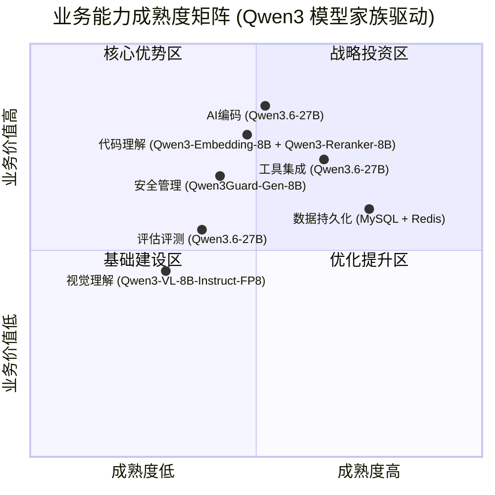
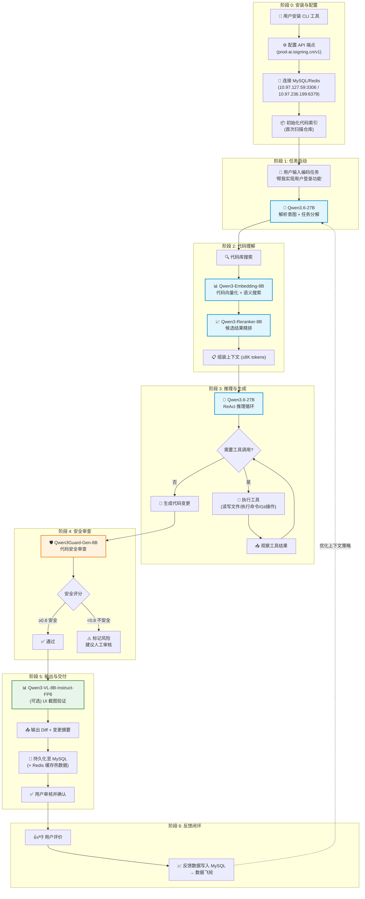
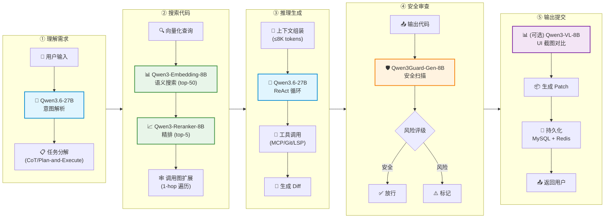
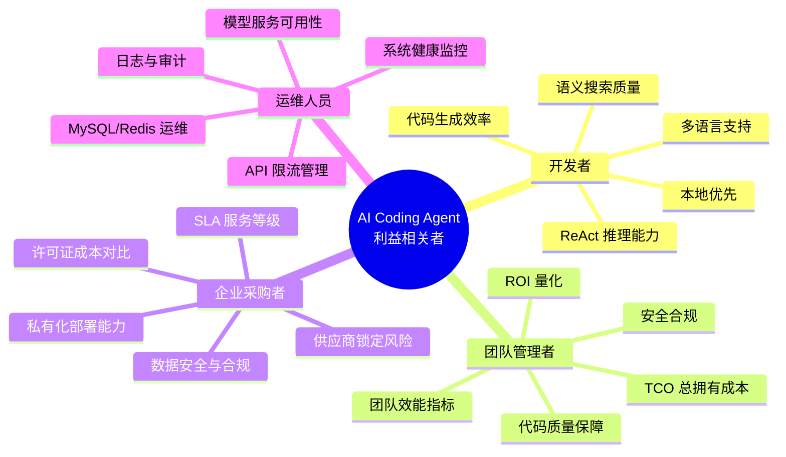
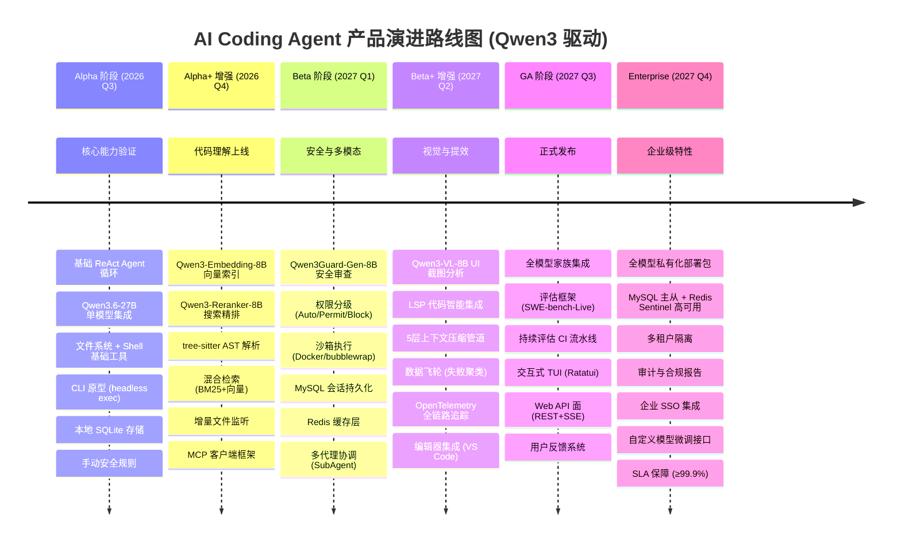

# AI Coding Agent 业务架构图

> **基于 Qwen3 模型家族的智能编码代理系统**
>
> **编制日期**: 2026-07-09
> **模型供应商**: `https://prod-ai.isigning.cn/v1/` (OpenAI 兼容 API)
> **数据基础设施**: MySQL 10.97.127.59:3306 | Redis 10.97.236.199:6379
> **核心 LLM**: Qwen3.6-27B-AEON-Ultimate-Uncensored-NVFP4

---

## 1. 业务能力地图

> 矩阵格式：6 大能力域 × 5 阶段成熟度，标注每个能力域依赖的 Qwen3 模型。



### 1.1 能力域详细定义

| 能力域 | 核心模型 | 能力描述 | 当前成熟度 | 目标成熟度 |
|--------|----------|----------|------------|------------|
| **AI 编码** | Qwen3.6-27B | ReAct 智能体循环、代码生成、推理规划、多文件编辑 | L3 - 已定义 | L5 - 优化中 |
| **代码理解** | Qwen3-Embedding-8B + Qwen3-Reranker-8B | AST 解析、调用图构建、混合检索 (BM25+向量+图)、语义搜索 | L2 - 可重复 | L4 - 可度量 |
| **工具集成** | Qwen3.6-27B (调度) | MCP 协议、沙箱执行、LSP 集成、Git 操作、浏览器自动化 | L3 - 已定义 | L4 - 可度量 |
| **评估评测** | Qwen3.6-27B (分析) | SWE-bench-Live、HumanEval、持续评估流水线、指标计算 | L2 - 可重复 | L3 - 已定义 |
| **安全管理** | Qwen3Guard-Gen-8B | 提示注入防御、内容安全审查、权限控制、沙箱隔离 | L2 - 可重复 | L4 - 可度量 |
| **数据持久化** | N/A (MySQL + Redis) | 会话状态持久化、代码索引存储、评估结果归档、用户反馈 | L4 - 可度量 | L5 - 优化中 |
| **视觉理解** | Qwen3-VL-8B-Instruct-FP8 | UI 截图分析、图表理解、PDF 解析、视觉回归测试 | L1 - 初始 | L2 - 可重复 |

### 1.2 Qwen3 模型角色矩阵

| 模型 | 参数量 | 在系统中的角色 | 调用频率 | 延迟要求 |
|------|--------|---------------|----------|----------|
| **Qwen3.6-27B-AEON-Ultimate-Uncensored-NVFP4** | 27B | 核心推理引擎：ReAct 循环、代码生成、规划、工具调度 | 极高 (每轮必调) | <3s |
| **Qwen3-Embedding-8B** | 8B | 代码向量化：语义搜索、代码聚类、相似度计算 | 高 (每次搜索) | <500ms |
| **Qwen3-Reranker-8B** | 8B | 搜索结果重排序：精排候选代码片段、提升检索精度 | 中 (搜索后) | <200ms |
| **Qwen3-VL-8B-Instruct-FP8** | 8B (视觉) | 多模态理解：UI 截图分析、架构图解析、PDF/OFD 处理 | 低 (按需) | <1s |
| **Qwen3Guard-Gen-8B** | 8B | 安全守卫：代码安全审查、内容过滤、合规检查 | 中 (输出后) | <500ms |

---

## 2. 用户旅程图

> 从用户安装到完成任务的完整业务流，标注每个步骤调用的 Qwen3 模型。



---

## 3. 价值流图

> 5 环节端到端价值流，展示每个环节的时间、成本和模型依赖。



### 3.1 价值流指标

| 环节 | 主要模型 | 平均耗时 | Token 消耗 | 关键优化策略 |
|------|----------|----------|------------|-------------|
| ① 理解需求 | Qwen3.6-27B | ~1.5s | ~3K | 缓存常见任务模式 |
| ② 搜索代码 | Qwen3-Embedding-8B + Reranker-8B | ~800ms | ~2K | 增量索引 + LRU 缓存 |
| ③ 推理生成 | Qwen3.6-27B | 3-15s/轮 | ~8K/轮 | 上下文压缩 + 子代理隔离 |
| ④ 安全审查 | Qwen3Guard-Gen-8B | ~400ms | ~1K | 流式审查 + 白名单缓存 |
| ⑤ 输出提交 | (MySQL/Redis) | ~200ms | ~500 | 批量写入 + 管道 |

---

## 4. 利益相关者地图



### 4.1 角色关注点与价值量化

| 角色 | 核心关注点 | 价值主张 | 成功指标 |
|------|-----------|----------|----------|
| **开发者** | 编码速度、代码质量、学习曲线 | 将 80% 重复编码工作自动化，聚焦创造性问题 | 任务完成时间减少 60%+ |
| **团队管理者** | 团队效能、代码一致性、最佳实践落地 | 统一编码标准，可量化的效能提升数据 | 团队 Velocity 提升 40%+ |
| **企业采购者** | 总拥有成本 (TCO)、供应商独立性、安全合规 | 基于 Qwen3 开源模型的私有化方案，避免 API 供应商锁定 | TCO 较 OpenAI API 降低 70%+ |
| **运维人员** | 系统稳定性、可观测性、灾难恢复 | 全链路 OpenTelemetry 追踪，MySQL 主从 + Redis Sentinel 高可用 | 系统可用性 ≥99.9% |

---

## 5. 业务模块依赖关系

> 展示各业务模块之间的依赖，标注 AI 模型依赖。

```mermaid
graph TD
    subgraph 用户界面层 ["界面层 (Presentation)"]
        CLI["🖥️ CLI / TUI\n(Ratatui)"]
        IDE["🔌 VS Code 扩展\n(JSON-RPC)"]
        Web["🌐 Web API\n(REST + SSE)"]
    end

    subgraph 核心引擎层 ["核心引擎层 (Core Engine)"]
        Agent["🧠 Agent 引擎\n(ReAct Loop)"]
        Session["📋 会话管理\n(SessionManager)"]
        Context["🗜️ 上下文压缩\n(5-Layer Pipeline)"]
        Planner["📐 任务规划器\n(CoT / MCTS)"]
        MultiAgent["👥 多代理协调\n(SubAgentManager)"]
    end

    subgraph AI模型层 ["AI 模型层 (Qwen3 Model Family)"]
        Qwen27B["🧠 Qwen3.6-27B\n核心推理引擎"]
        QwenEmb["📊 Qwen3-Embedding-8B\n代码向量化"]
        QwenRerank["📈 Qwen3-Reranker-8B\n搜索重排序"]
        QwenGuard["🛡️ Qwen3Guard-Gen-8B\n安全守卫"]
        QwenVL["👁️ Qwen3-VL-8B\n视觉理解"]
    end

    subgraph 工具集成层 ["工具集成层 (Tool Chain)"]
        MCP["🔗 MCP 客户端/服务器"]
        Sandbox["🏖️ 沙箱执行\n(bubblewrap/Docker)"]
        LSP["🔍 LSP 集成\n(代码智能)"]
        Git["📦 Git 集成\n(git2 + CLI)"]
        Browser["🌐 浏览器自动化\n(Playwright MCP)"]
    end

    subgraph 代码理解层 ["代码理解层 (Code Understanding)"]
        Indexer["📇 AST 索引器\n(tree-sitter)"]
        Graph["🕸️ 调用图/依赖图"]
        Retriever["🔍 混合检索\n(BM25+向量+图)"]
        Watcher["👀 增量文件监听"]
    end

    subgraph 数据持久化层 ["数据持久化层 (Data Infrastructure)"]
        MySQL[("🐬 MySQL\n会话/索引/评估")]
        Redis[("⚡ Redis\n缓存/队列/限流")]
        SQLite[("📦 SQLite\n(Session Store)"]
    end

    subgraph 评估评测层 ["评估评测层 (Evaluation)"]
        EvalRunner["🏃 评估执行器\n(Docker Sandbox)"]
        SWEBench["📊 SWE-bench-Live\n适配器"]
        HumanEval["🧪 HumanEval\n适配器"]
        Metrics["📐 指标计算\n(pass@k, 解决率)"]
    end

    subgraph 安全与可观测 ["安全与可观测层 (Cross-Cutting)"]
        Safety["🛡️ 提示注入防御"]
        Telemetry["📡 OpenTelemetry\n追踪"]
        Flywheel["🔄 数据飞轮\n(失败聚类)"]
    end

    subgraph 驾驭工程层 ["驾驭工程层 (Engineering Governance)"]
        GovStd["📐 治理标准管理\n(编码规范/架构规则/安全策略)"]
        AIReview["👁️ AI Code Review Engine\n(逻辑审查/设计审查)"]
        QualityGate["🚧 质量门禁引擎\n(Pre-commit/MR/Release)"]
        TechDebt["📉 技术债务管理\n(量化/排序/自动修复)"]
        GovMetrics["📊 工程度量看板\n(DORA指标/质量趋势)"]
    end

    GovStd --> AIReview
    AIReview --> QualityGate
    QualityGate --> TechDebt
    QualityGate --> GovMetrics
    TechDebt --> GovMetrics

    AIReview --> Qwen27B
    AIReview --> QwenGuard
    GovStd --> Qwen27B

    Agent --> AIReview
    Agent --> QualityGate
    Agent --> TechDebt
    Git --> AIReview
    CLI --> GovMetrics
    Web --> GovMetrics

    CLI --> Agent
    IDE --> Agent
    Web --> Agent

    Agent --> Planner
    Agent --> Session
    Agent --> Context
    Agent --> MultiAgent

    Agent --> Qwen27B
    Retriever --> QwenEmb
    Retriever --> QwenRerank
    Safety --> QwenGuard
    Browser --> QwenVL

    Agent --> MCP
    Agent --> Sandbox
    Agent --> LSP
    Agent --> Git
    Agent --> Browser

    Agent --> Retriever
    Retriever --> Indexer
    Retriever --> Graph
    Indexer --> Watcher

    Session --> MySQL
    Session --> Redis
    Session --> SQLite
    Indexer --> MySQL
    Indexer --> SQLite
    Metrics --> MySQL

    Agent --> EvalRunner
    EvalRunner --> SWEBench
    EvalRunner --> HumanEval
    EvalRunner --> Metrics

    Agent -.-> Safety
    Agent -.-> Telemetry
    Agent -.-> Flywheel

    style Qwen27B fill:#e1f5fe,stroke:#0288d1,stroke-width:3px
    style QwenEmb fill:#e8f5e9,stroke:#388e3c,stroke-width:3px
    style QwenRerank fill:#e8f5e9,stroke:#388e3c,stroke-width:3px
    style QwenGuard fill:#fff3e0,stroke:#f57c00,stroke-width:3px
    style QwenVL fill:#f3e5f5,stroke:#7b1fa2,stroke-width:3px
    style MySQL fill:#fff8e1,stroke:#ff8f00,stroke-width:2px
    style Redis fill:#ffebee,stroke:#d32f2f,stroke-width:2px
```

---

## 6. 基于 Qwen3 的 AI 能力价值链

### 6.1 五模型协同架构

```
                        ┌──────────────────────────────────────────────┐
                        │           Qwen3.6-27B (核心推理引擎)            │
                        │  ┌─────────┐  ┌─────────┐  ┌─────────────┐  │
                        │  │ 意图解析 │  │ 任务规划 │  │ 代码生成     │  │
                        │  └────┬─────┘  └────┬─────┘  └──────┬──────┘  │
                        └───────┼──────────────┼───────────────┼────────┘
                                │              │               │
              ┌─────────────────┼──────┐       │       ┌───────┼──────────────┐
              │                 │      │       │       │       │              │
              ▼                 ▼      │       │       │       ▼              ▼
    ┌─────────────────┐  ┌─────────────────┐  │  ┌─────────────────┐  ┌─────────────────┐
    │ Qwen3-Embedding │  │ Qwen3-Reranker  │  │  │  Qwen3Guard-Gen │  │  Qwen3-VL-8B    │
    │      -8B        │  │      -8B        │  │  │      -8B        │  │   -Instruct-FP8 │
    ├─────────────────┤  ├─────────────────┤  │  ├─────────────────┤  ├─────────────────┤
    │ 代码语义向量化  │  │ 搜索结果精排    │  │  │ 代码安全审查    │  │ UI 截图分析     │
    │ 相似代码检索    │──▶│ 相关性打分      │  │  │ 提示注入检测    │  │ 架构图解析      │
    │ 代码聚类        │  │ 候选片段优选    │  │  │ 内容合规过滤    │  │ OFD/PDF 理解    │
    │ BM25 混合检索   │  │ RRF 融合排序    │  │  │ 风险评分        │  │ 视觉回归测试    │
    └────────┬────────┘  └────────┬────────┘  │  └────────┬────────┘  └────────┬────────┘
             │                    │           │           │                    │
             ▼                    ▼           │           ▼                    ▼
    ┌─────────────────────────────────────┐  │  ┌─────────────────────────────────────┐
    │        代码理解能力域               │  │  │         安全与质量能力域              │
    │  • AST 符号搜索 (tree-sitter)       │  │  │  • 安全代码生成 (>0.8 安全分)        │
    │  • 调用图依赖分析                   │  │  │  • 漏洞模式扫描                       │
    │  • 混合检索 (BM25+向量+图 RRF)      │  │  │  • 敏感信息泄露检测                   │
    │  • 增量文件监听与热更新             │  │  │  • 审计日志记录                       │
    └─────────────────────────────────────┘  │  └─────────────────────────────────────┘
                                             │
    ┌────────────────────────────────────────┘
    │
    ▼
    ┌─────────────────────────────────────────────────────────────────┐
    │                    数据基础设施层                                 │
    │  ┌──────────────────────┐    ┌──────────────────────────────┐   │
    │  │   MySQL              │    │   Redis                      │   │
    │  │   • 会话状态持久化   │    │   • 热数据缓存 (LRU)         │   │
    │  │   • 代码索引存储     │    │   • 任务队列                  │   │
    │  │   • 评估结果归档     │    │   • 限流计数器                │   │
    │  │   • 用户反馈记录     │    │   • Session Token 存储        │   │
    │  └──────────────────────┘    └──────────────────────────────┘   │
    └─────────────────────────────────────────────────────────────────┘
```

### 6.2 模型协作时序

| 阶段 | Qwen3.6-27B | Qwen3-Embedding-8B | Qwen3-Reranker-8B | Qwen3Guard-Gen-8B | Qwen3-VL-8B |
|------|:-----------:|:-------------------:|:-----------------:|:-----------------:|:-----------:|
| 意图解析 | **● 主责** | | | | |
| 代码搜索 | **● 生成查询** | **● 向量化 + 检索** | **● 精排 top-K** | | |
| ReAct 循环 | **● 主责** | | | | |
| 工具调用 | **● 决策** | | | | |
| 安全审查 | | | | **● 扫描** | |
| UI 验证 | | | | | **● 截图分析** |
| 输出持久化 | | | | | |

### 6.3 与传统 LLM API 的成本对比分析

> 基于 2026 年 7 月市场价格估算，以每月 10 万次编码任务为基准。

| 方案 | 推理模型 | 嵌入模型 | 重排序 | 安全审查 | 视觉模型 | **月估算成本** |
|------|----------|----------|--------|----------|----------|---------------|
| **Qwen3 私有化部署** | Qwen3.6-27B | Qwen3-Embedding-8B | Qwen3-Reranker-8B | Qwen3Guard-Gen-8B | Qwen3-VL-8B | **~$800-1,200** (GPU 租赁) |
| **OpenAI API** | GPT-4o | text-embedding-3-large | N/A (需自建) | GPT-4o (审查) | GPT-4o Vision | **~$5,000-8,000** (API 按量) |
| **Anthropic API** | Claude Sonnet 4.5 | Voyage-code-2 | N/A (需自建) | Claude (审查) | Claude Vision | **~$4,500-7,000** (API 按量) |
| **混合方案** | Qwen3.6-27B (自建) | OpenAI Embedding | Cohere Rerank | Qwen3Guard (自建) | GPT-4o Vision | **~$2,500-3,500** (混合) |

**成本优势分析**:
- **纯 Qwen3 方案较 OpenAI API 节省 75-85%**
- **纯 Qwen3 方案较 Anthropic API 节省 73-83%**
- 关键驱动因素：Qwen3 全模型家族私有化部署，无 API 调用费用
- 一次性 GPU 投入 (RTX 4090 × 4 或 A100 × 2) 约 $3,000-8,000，6-8 个月回本

---

## 7. 产品演进路线图



### 7.1 各阶段关键指标

| 阶段 | 模型依赖 | 核心指标 | 目标值 |
|------|----------|----------|--------|
| **Alpha** | Qwen3.6-27B | HumanEval pass@1 | >55% |
| **Alpha+** | + Qwen3-Embedding + Reranker | 代码搜索精度 (MRR) | >0.75 |
| **Beta** | + Qwen3Guard | 安全审查准确率 | >95% |
| **Beta+** | + Qwen3-VL | SWE-bench-Lite 解决率 | >20% |
| **GA** | 全模型家族 + MySQL/Redis | SWE-bench-Live 解决率 | >28% |
| **Enterprise** | 全模型私有化 | 系统可用性 | ≥99.9% |

---

## 附录 A: 环境配置总览

| 组件 | 地址/版本 | 用途 |
|------|----------|------|
| **API 端点** | `https://prod-ai.isigning.cn/v1/` | 统一模型推理入口 (OpenAI 兼容) |
| **MySQL** | `10.97.127.59:3306` | 会话持久化、代码索引、评估数据、用户反馈 |
| **Redis** | `10.97.236.199:6379` | 热数据缓存、任务队列、限流、Session Token |
| **Qwen3.6-27B** | NVFP4 量化版 | 核心推理引擎 (27B 参数) |
| **Qwen3-Embedding-8B** | 标准版 | 代码向量化 (8B 参数) |
| **Qwen3-Reranker-8B** | 标准版 | 搜索重排序 (8B 参数) |
| **Qwen3-VL-8B** | FP8 量化版 | 视觉理解 (8B 参数) |
| **Qwen3Guard-Gen-8B** | 标准版 | 安全审查 (8B 参数) |

## 附录 B: Mermaid 图表索引

| 序号 | 图表 | 类型 | 所在章节 |
|------|------|------|----------|
| 1 | 业务能力成熟度矩阵 | `quadrantChart` | §1 |
| 2 | 用户旅程图 | `flowchart TD` | §2 |
| 3 | 价值流图 | `flowchart LR` | §3 |
| 4 | 利益相关者地图 | `mindmap` | §4 |
| 5 | 业务模块依赖关系 | `graph TD` | §5 |
| 6 | 产品演进路线图 | `timeline` | §7 |

---

*本文档为 AI Coding Agent 项目的业务架构蓝图，基于 Qwen3 全模型家族构建。所有架构决策均对齐项目工作计划 (.omo/plans/ai-coding-agent.md) 中定义的 8 波执行策略。*
