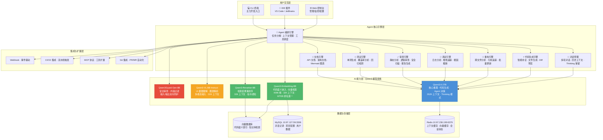
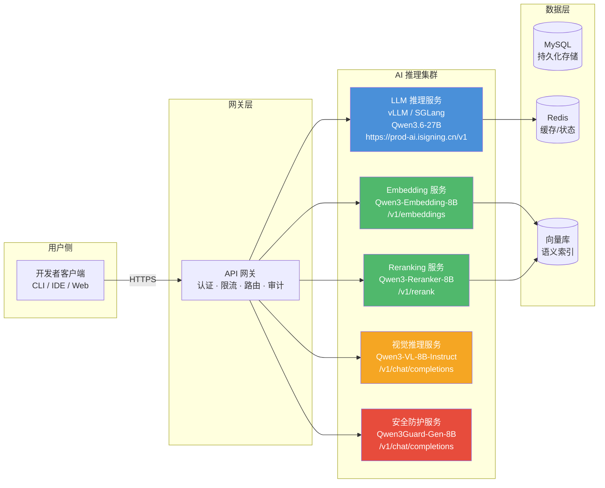
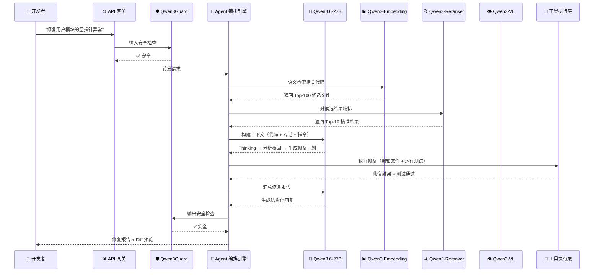
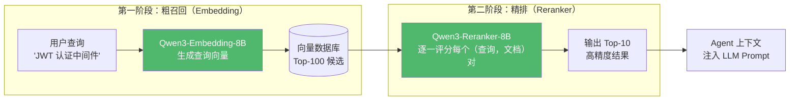
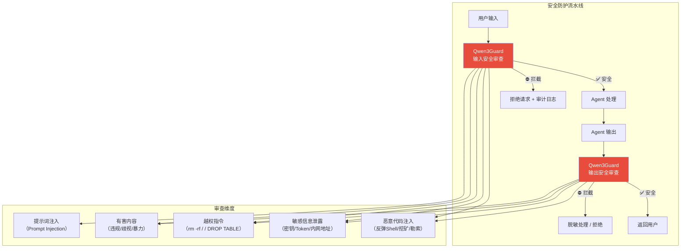
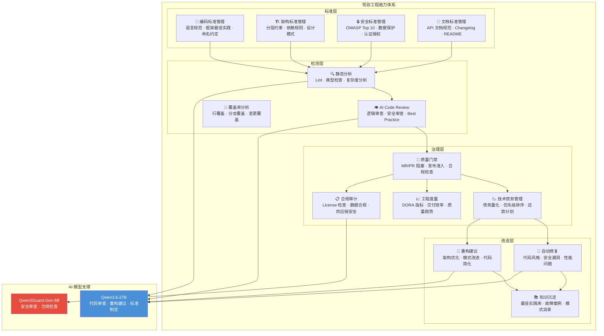
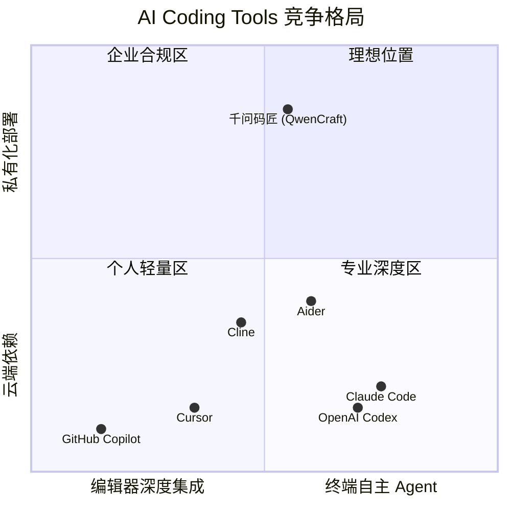
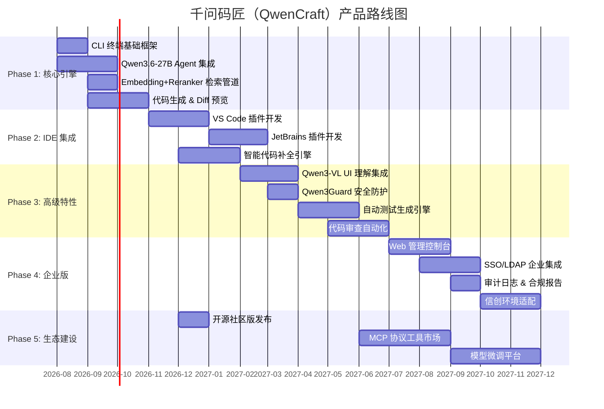

# AI Coding Agent 产品设计报告

> **版本**: v1.0
> **日期**: 2026-07-09
> **状态**: 草案
> **核心模型栈**: Qwen3.6-27B-AEON-Ultimate + Qwen3-Embedding-8B + Qwen3-Reranker-8B + Qwen3-VL-8B-Instruct + Qwen3Guard-Gen-8B

---

## 目录

1. [产品愿景与定位](#1-产品愿景与定位)
2. [用户画像与场景分析](#2-用户画像与场景分析)
3. [功能架构](#3-功能架构)
4. [基于 Qwen3 的 AI 能力设计](#4-基于-qwen3-的-ai-能力设计)
5. [用户体验设计](#5-用户体验设计)
6. [用户交互边界定义](#6-用户交互边界定义)
7. [商业模式建议](#7-商业模式建议)
8. [竞品差异化分析](#8-竞品差异化分析)
9. [产品路线图](#9-产品路线图)

---

## 1. 产品愿景与定位

### 1.1 愿景

打造**面向中国开发者的下一代 AI 编程智能体**——基于 Qwen3 开源模型家族，实现完全私有化部署、自主可控的智能研发工具。让每一行代码都有 AI 深度参与，让每一个研发团队都能拥有属于自己的 AI 编程伙伴。

### 1.2 核心定位

| 维度 | 定位描述 |
|------|----------|
| **目标市场** | 中国开发者、企业研发团队、信创环境（党政军、国企、金融） |
| **技术路线** | 基于 Qwen3 开源模型家族，100% 私有化部署，零数据外泄 |
| **产品形态** | CLI 终端智能体 + IDE 插件（VS Code / JetBrains）+ Web 管理控制台 |
| **对标竞品** | Cursor、Claude Code、GitHub Copilot、OpenAI Codex |
| **核心差异化** | 完全本地化部署、自主可控、国产模型适配、信创合规 |

### 1.3 战略意义

1. **数据主权**：企业核心代码不离开内网，满足《数据安全法》《个人信息保护法》合规要求。
2. **供应链安全**：基于 Apache 2.0 开源的 Qwen3 模型，无闭源模型依赖风险。
3. **成本可控**：一次部署，按需扩容，无按 Token 计费的持续成本。
4. **定制化能力**：支持基于企业私有代码库进行模型微调，深度适配业务领域。

### 1.4 产品名称建议

- **中文名**：千问码匠（取 Qwen 系列"通义千问"之"千问"，寓意代码领域的能工巧匠）
- **英文代号**：QwenCraft
- **备选名**：星码（StarCode）、码策（CodeStrategy）

---

## 2. 用户画像与场景分析

### 2.1 核心用户画像

#### 画像 A：一线开发者（占比 ~60%）

| 属性 | 描述 |
|------|------|
| **角色** | 前端/后端/全栈/移动端开发工程师 |
| **技术栈** | Java/Spring Boot、Python/Django、Go/Gin、Vue/React、TypeScript |
| **核心痛点** | 重复性编码耗时、跨文件重构困难、遗留代码理解成本高 |
| **AI 使用习惯** | 日常使用 Copilot/Cursor 辅助编码，期望更深度的自动化 |
| **决策权** | 低——工具选择通常由技术 Leader 或公司统一规定 |

#### 画像 B：技术 Leader / 架构师（占比 ~20%）

| 属性 | 描述 |
|------|------|
| **角色** | 技术总监、架构师、Tech Lead |
| **技术栈** | 多技术栈管理，关注架构设计、代码审查、技术债务 |
| **核心痛点** | 代码审查耗时、架构决策缺乏全局视角、技术债务量化困难 |
| **AI 使用习惯** | 使用 Claude Code 处理复杂任务，关注代码质量多于生成速度 |
| **决策权** | 高——团队 AI 工具采购的最终决策者 |

#### 画像 C：企业 IT / 运维管理者（占比 ~15%）

| 属性 | 描述 |
|------|------|
| **角色** | CTO、IT 总监、信息安全负责人 |
| **技术栈** | 关注基础设施、安全合规、成本控制 |
| **核心痛点** | 海外 AI 工具数据出境风险、模型 API 成本不可控、合规审计困难 |
| **AI 使用习惯** | 限制团队使用海外 AI 工具，正在寻找本地化替代方案 |
| **决策权** | 最高——拥有采购审批权，是"可私有化部署"的核心决策推动者 |

#### 画像 D：信创环境开发者（占比 ~5%，高增长）

| 属性 | 描述 |
|------|------|
| **角色** | 政府/军工/国企 IT 部门开发人员 |
| **技术栈** | 国产操作系统（统信 UOS/麒麟）+ 国产数据库 + 国产中间件 |
| **核心痛点** | 封闭网络环境无法使用云端 AI 工具，合规要求极为严格 |
| **AI 使用习惯** | 几乎无 AI 编程工具可用，处于空白地带 |
| **决策权** | 无——由上级单位统一采购，但需求极度刚性 |

### 2.2 典型使用场景

#### 场景 1：智能代码生成（高频场景）

```
开发者: "帮我写一个 JWT 认证中间件，支持 Redis 缓存 Token 黑名单"
Agent: [分析项目结构] → [查找现有认证逻辑] → [生成中间件代码] → [自动生成单元测试]
结果: 生成符合项目规范的完整中间件代码，包含错误处理、日志、测试用例
```

#### 场景 2：跨文件重构（中频高价值场景）

```
开发者: "把 UserService 中的缓存逻辑抽取为独立的 CacheService，所有调用方同步更新"
Agent: [扫描所有引用] → [抽取逻辑] → [更新 12 个调用方] → [运行全量测试确保无回归]
结果: 自动完成跨文件重构，零遗漏、零回归
```

#### 场景 3：Bug 排查与修复（中频高价值场景）

```
开发者: "生产环境订单接口偶发 500 错误，日志显示 NullPointerException"
Agent: [分析堆栈] → [追踪代码路径] → [定位空值来源] → [提出修复方案+测试] → [创建 PR]
结果: 从日志到 PR 全流程自动化
```

#### 场景 4：代码审查辅助（日常场景）

```
Agent: [监听 Git PR] → [静态分析] → [逻辑审查] → [安全扫描] → [生成审查报告]
结果: 自动生成结构化的代码审查报告，标注风险等级和建议
```

#### 场景 5：遗留系统文档生成（低频高价值场景）

```
开发者: "为整个 payment 模块生成架构文档和 API 文档"
Agent: [解析模块代码] → [推断架构模式] → [生成 Mermaid 架构图] → [生成 API 文档]
结果: 一次性生成完整的模块文档
```

#### 场景 6：UI 截图转代码（创新场景）

```
开发者: [上传设计稿截图]
Agent: [Qwen3-VL 理解 UI 布局] → [识别组件层级] → [生成前端代码] → [预览渲染效果]
结果: 从截图到可运行代码的端到端转换
```

---

## 3. 功能架构

### 3.1 整体功能架构图



### 3.2 模块职责详述

#### 3.2.1 Agent 核心引擎层

| 模块 | 核心功能 | 依赖模型 |
|------|----------|----------|
| **Agent 编排引擎** | 任务理解与分解、工具调用决策、子任务并行调度、上下文窗口管理 | Qwen3.6-27B |
| **对话管理** | 多轮对话状态维护、历史 Reasoning Trace 保留（Thinking Preservation）、Token 预算管理 | Qwen3.6-27B |
| **代码生成引擎** | 智能代码补全、文件级代码生成、Diff 预览与逐行确认 | Qwen3.6-27B |
| **重构引擎** | LSP 协议集成、跨文件引用追踪、批量重构计划生成与安全执行 | Qwen3.6-27B |
| **调试引擎** | 运行时错误捕获、堆栈分析、日志模式匹配、根因推断与修复方案生成 | Qwen3.6-27B |
| **审查引擎** | ESLint/Sonar 集成、代码规范检查、安全漏洞扫描、审查报告生成 | Qwen3.6-27B |
| **测试引擎** | 测试用例自动生成、覆盖率缺口分析、Mock 数据生成 | Qwen3.6-27B |
| **文档引擎** | 代码注释生成、API 文档生成、Mermaid 架构图自动绘制 | Qwen3.6-27B |

### 3.3 核心技术架构（部署视角）



### 3.4 Agent 工作流（典型请求处理流程）



---

## 4. 基于 Qwen3 的 AI 能力设计

### 4.1 Qwen3.6-27B —— 核心推理与代码生成引擎

**模型概况**：
- 参数量：270 亿（Dense 架构，非 MoE，部署简单）
- 架构：Hybrid Gated DeltaNet（64 层，16 个重复块，每块 3 个线性注意力 + 1 个全注意力层）
- 上下文窗口：262,144 Tokens（原生支持）
- 最大输出：32,768 Tokens（可扩展至 81,920）
- 许可证：Apache 2.0（完全开源，可商用）
- 关键能力：Agentic Coding、Thinking 模式、Thinking Preservation、多模态（文本+图像+视频）、Function Calling

**核心基准测试成绩**（对标竞品）：

| 基准测试 | Qwen3.6-27B | Claude 4.5 Opus | Qwen3.5-397B-A17B |
|----------|-------------|-----------------|-------------------|
| SWE-bench Verified | **77.2%** | 80.9% | 76.2% |
| SWE-bench Pro | **53.5%** | 57.1% | 50.9% |
| SWE-bench Multilingual | **71.3%** | 77.5% | 69.3% |
| Terminal-Bench 2.0 | **59.3%** | 59.3% | 52.5% |
| SkillsBench Avg5 | **48.2%** | 45.3% | 30.0% |
| LiveCodeBench v6 | **83.9%** | 84.8% | 80.7% |
| GPQA Diamond | **87.8%** | 87.0% | 85.5% |
| AIME26 | **94.1%** | 95.1% | 92.6% |
| MMLU-Pro | **86.2%** | 89.5% | 86.1% |
| C-Eval（中文知识） | **91.4%** | 92.2% | 90.5% |

**关键设计要点**：

1. **Thinking 模式（思维链推理）**：
   - Qwen3.6 默认以 Thinking 模式运行，生成 `\n<think>\n...\n</think>\n\n` 结构化的推理过程。
   - 推理 Token 预算可配置（512~8,192），平衡深度与延迟。
   - 编码场景推荐参数：`temperature=0.6, top_p=0.95, top_k=20`（精确模式）。
   - 通用 Agent 场景推荐参数：`temperature=1.0, top_p=0.95, top_k=20`（探索模式）。

2. **Thinking Preservation（推理上下文保留）**：
   - Qwen3.6 独有的 `preserve_thinking` 特性：在多轮 Agent 对话中保留历史推理 Trace。
   - 对 Agent 场景极为关键——维持跨轮次决策一致性，减少冗余推理，降低 Token 消耗。
   - 启用方式：API 请求中设置 `preserve_thinking=true`。

3. **Agentic Coding 专项能力**：
   - 原生支持 Function Calling / Tool Use，可直接集成 MCP 协议工具。
   - 兼容 OpenClaw、Claude Code、Qwen Code 等主流 Coding Agent 框架。
   - 在 SWE-bench 系列基准测试中，27B Dense 模型超越 397B MoE 模型（Qwen3.5-397B-A17B）。

4. **超长上下文处理**：
   - 原生 262K Token 上下文，支撑大型代码库的全局理解。
   - 支持 YaRN（RoPE 扩展）技术，可进一步扩展上下文长度。
   - 推荐推理框架：vLLM ≥ 0.19.0、SGLang、KTransformers。

5. **Multi-Token Prediction (MTP)**：
   - 训练阶段引入多 Token 预测，推理阶段提升吞吐量。
   - 在批量代码生成场景下，吞吐量提升显著。

### 4.2 Qwen3-Embedding-8B —— 代码语义检索

**模型概况**：
- 参数量：80 亿
- 上下文长度：32K Tokens
- 嵌入维度：最高 4,096 维，支持 MRL（Matryoshka Representation Learning，可自定义输出维度 32~4,096）
- 覆盖语言：100+ 种自然语言 + 多种编程语言
- MTEB 多语言排行榜：**排名第一**（70.58 分）
- MTEB Code 基准：**80.89 分**
- 许可证：Apache 2.0

**在 AI Coding Agent 中的应用**：

```
┌─────────────────────────────────────────────────────────┐
│                    代码语义检索引擎                        │
├─────────────────────────────────────────────────────────┤
│  1. 代码库索引                                            │
│     - 对项目所有源文件进行分块（按函数/类/文件级别）         │
│     - 通过 Qwen3-Embedding-8B 生成 4096 维语义向量         │
│     - 存储至向量数据库（Milvus / Qdrant / pgvector）       │
│                                                         │
│  2. 查询理解                                              │
│     - 用户自然语言查询 → Qwen3-Embedding-8B → 查询向量      │
│     - 支持指令感知（Instruction Aware）：                   │
│       instruct="为以下代码查询找到语义相关的代码片段"        │
│                                                         │
│  3. 语义检索                                              │
│     - 余弦相似度计算 → Top-K 候选（默认 K=100）            │
│     - 支持多语言交叉检索（中文查询 → 英文代码）              │
│                                                         │
│  4. 增量更新                                              │
│     - Git Hook 触发文件变更时自动更新对应向量               │
│     - 支持文件级和函数级粒度的增量索引                      │
└─────────────────────────────────────────────────────────┘
```

**关键设计要点**：

1. **MRL 灵活维度**：
   - 可根据场景在 32~4,096 维之间灵活选择，平衡检索精度与存储成本。
   - 推荐配置：代码检索使用 2,048 维（精度损失 <1%，存储减半）。

2. **Instruction Aware（指令感知）**：
   - 检索时传入针对性指令，显著提升检索精度（+1%~5%）。
   - 代码检索推荐指令：`"Given a coding query, retrieve relevant code snippets that implement similar functionality"`

3. **多语言代码检索**：
   - 原生支持 100+ 语言，特别优化了中英文和主流编程语言的交叉检索。
   - 在 MTEB Code 基准上得分 80.89，代码检索能力业界领先。

### 4.3 Qwen3-Reranker-8B —— 检索结果精排

**模型概况**：
- 参数量：80 亿
- 上下文长度：32K Tokens
- 功能：接收（查询，文档）对，输出精确相关性分数
- MTEB Code 基准（重排序）：**81.22 分**
- 指令感知：支持自定义指令优化特定场景
- 许可证：Apache 2.0

**两阶段检索引擎架构**：



**关键设计要点**：

1. **Pipeline 组合策略**：
   - 第一阶段：Embedding 粗召回（Top-100），速度快、覆盖面广。
   - 第二阶段：Reranker 精排（Top-100 → Top-10），精度高、控制上下文大小。
   - 最终注入 LLM 的上下文控制在 10 个文档以内，平衡质量与 Token 消耗。

2. **代码场景特别优化**：
   - Qwen3-Reranker-8B 在 MTEB-Code 上得分 81.22，超越 Jina、BGE 等专用 Reranker。
   - 特别适合代码检索场景：理解代码语义相似性而非字面匹配。

3. **指令定制**：
   - 可根据检索目标定制指令，例如：
     - `"Identify code snippets that implement the exact same interface pattern"`
     - `"Find test files that cover the queried function"`
   - 指令感知能力使 Reranker 可针对不同检索意图做差异化排序。

### 4.4 Qwen3-VL-8B-Instruct —— UI 理解与多模态交互

**模型概况**：
- 参数量：80 亿
- 精度：FP8 量化
- 输入模态：文本 + 图像 + 视频（多模态统一 Checkpoint）
- 上下文长度：32K Tokens
- 能力：UI 截图理解、图表解析、文档 OCR、视觉问答
- API 协议：OpenAI 兼容

**在 AI Coding Agent 中的应用**：

| 场景 | 输入 | 输出 | 技术链路 |
|------|------|------|----------|
| **UI 截图转代码** | 设计稿截图 / Figma 导出 | HTML + CSS + 组件代码 | Qwen3-VL 理解布局 → LLM 生成代码 |
| **错误截图诊断** | 浏览器报错截图 | 错误原因 + 修复建议 | Qwen3-VL 识别错误信息 → LLM 分析 |
| **架构图解析** | 手绘架构草图 | PlantUML / Mermaid 代码 | Qwen3-VL 识别组件 → 生成图表代码 |
| **遗留文档数字化** | 扫描的 API 文档 PDF | 结构化 API 规范（OpenAPI） | Qwen3-VL OCR → LLM 结构化 |
| **代码执行可视化** | 运行时截图 | 异常检测 + 回归对比 | Qwen3-VL 对比预期 vs 实际渲染 |

**关键设计要点**：

1. **多模态 Thinking 模式**：
   - Qwen3-VL 原生支持 Thinking 模式，对复杂 UI 截图可逐步推理组件层级。
   - 从视觉理解到代码生成的端到端链路：截图 → Vision Thinking → 结构化布局描述 → LLM 代码生成。

2. **前端组件识别**：
   - 训练数据覆盖主流 UI 组件库（Ant Design、Element Plus、Material UI）。
   - 可识别组件类型、布局关系、样式属性。

3. **与 LLM 的协同工作流**：
   - Qwen3-VL 负责视觉理解（"看到了什么"）。
   - Qwen3.6-27B 负责代码生成（"如何实现"）。
   - 两者通过结构化中间格式（JSON 布局描述）对接。

### 4.5 Qwen3Guard-Gen-8B —— 安全防护

**模型概况**：
- 参数量：80 亿
- 功能：输入/输出双向安全审查
- 检测范围：恶意代码注入、敏感信息泄露、越权指令、有害内容
- API 协议：OpenAI 兼容

**安全防护架构**：



**关键设计要点**：

1. **双向防护**：
   - 输入侧：防止用户通过 Prompt Injection 诱导 Agent 执行危险操作。
   - 输出侧：防止 Agent 在代码生成中无意泄露敏感信息或生成恶意代码。

2. **企业级安全策略**：
   - 可配置的安全策略模板（金融/政务/互联网）。
   - 敏感信息自动脱敏（API Key → `***MASKED***`）。
   - 完整的审计日志链路。

3. **性能考量**：
   - Guard 模型作为独立微服务部署，与主推理流水线解耦。
   - 对高频操作（代码补全）可配置采样审查策略以降低延迟。
   - 对敏感操作（Shell 命令执行、文件删除）强制执行全量审查。

---

## 5. 用户体验设计

### 5.1 三种交互形态设计原则

| 形态 | 目标用户 | 核心定位 | 设计原则 |
|------|----------|----------|----------|
| **CLI 终端** | 资深开发者、后端工程师 | 主力开发入口，高效、灵活 | 命令式交互、管道可组合、支持 CI/CD 集成 |
| **IDE 插件** | 全栈开发者、前端工程师 | 日常编码伴侣，无缝、直观 | 内联补全、Diff 预览、右键菜单、侧边栏对话 |
| **Web 控制台** | 技术 Leader、管理员 | 管理监控中心，全局、可控 | 仪表盘、配置管理、使用统计、审计日志 |

### 5.2 CLI 终端设计（主力形态）

**交互模式**：

```bash
# 交互式对话模式
$ qwencraft chat
🤖 QwenCraft > 你好！我是千问码匠，基于 Qwen3.6-27B 的 AI 编程助手。
             当前项目：user-service（Java / Spring Boot）
             已索引文件：247 个

💬 > 帮我分析 UserController 的潜在性能问题

[Thinking] 正在分析 UserController.java...
- 扫描到 12 个接口方法
- L239: 在循环内执行数据库查询，建议批量查询
- L156: 未使用缓存，Redis 集成建议
[生成修复方案...]

# 管道模式（非交互式）
$ qwencraft review --pr 42 --format markdown > review-report.md
$ qwencraft refactor --pattern "extract-method" --target UserService.java --dry-run
$ qwencraft test --coverage --target src/main/java/com/example/user/

# Agent 模式（自主任务执行）
$ qwencraft agent "在 user 模块中实现基于 Redis 的接口限流功能"
[Agent] 任务分解:
  1. ✅ 分析现有 Redis 配置
  2. ✅ 创建 RateLimiter 注解
  3. ✅ 实现 RateLimiterAspect 切面
  4. ✅ 为 3 个高频接口添加注解
  5. ⏳ 编写单元测试...
```

**设计原则**：
- **上下文感知**：自动检测项目技术栈（Maven/Gradle/npm/pip），加载项目级配置。
- **渐进式披露**：默认简洁输出，通过 `--verbose` 查看详细推理过程。
- **可组合性**：输出支持 JSON/Markdown 格式，可通过 Unix 管道与其他工具组合。
- **安全确认**：文件操作前展示 Diff，执行危险命令前要求二次确认。

### 5.3 IDE 插件设计

**VS Code / JetBrains 插件功能矩阵**：

| 功能 | 交互方式 | 触发条件 |
|------|----------|----------|
| **智能代码补全** | 内联幽灵文本，Tab 接受 | 输入时自动触发 |
| **Agent 对话** | 侧边栏面板 | 快捷键 / 右键菜单 |
| **内联编辑** | 选中代码 → 自然语言指令 → Diff 预览 | 选中代码后 Cmd+K |
| **代码审查** | 文件保存时自动触发 / 手动触发 | Git 暂存区变更 |
| **Bug 修复** | 选中错误 → "Explain & Fix" | 终端错误输出 |
| **文档生成** | 右键菜单 → "Generate Docs" | 光标在函数/类上 |
| **测试生成** | 右键菜单 → "Generate Tests" | 光标在函数上 |

**设计原则**：
- **非侵入式**：作为辅助工具存在，不改变开发者核心工作流。
- **即时反馈**：补全延迟 < 500ms，Diff 预览实时渲染。
- **上下文丰富**：自动感知当前文件、打开的相关文件、Git 变更、终端输出。
- **可撤销**：所有 AI 生成内容支持一键撤销（Cmd+Z）。

### 5.4 Web 控制台设计

**核心页面**：

1. **仪表盘**：
   - 团队使用统计（Token 消耗、任务完成数、采纳率）
   - 模型性能监控（延迟、吞吐量、错误率）
   - 热力图（代码库热点区域）

2. **项目管理**：
   - 项目配置（技术栈、编码规范、Prompt 模板）
   - 知识库管理（自定义规则、最佳实践文档）
   - 模型选择（按项目/任务类型绑定不同模型）

3. **审计日志**：
   - 所有 Agent 操作的完整记录
   - 安全事件告警
   - 代码变更追溯

4. **管理后台**：
   - 用户/团队权限管理
   - API Key 管理
   - 私有化部署配置

---

## 6. 用户交互边界定义

### 6.1 职责划分模型

```
┌─────────────────────────────────────────────────────────────┐
│                        用户职责域                              │
├─────────────────────────────────────────────────────────────┤
│  • 定义需求目标（What）                                        │
│  • 做出架构决策（技术选型、设计模式）                            │
│  • 审查 AI 产出（代码审查、测试验证）                            │
│  • 批准危险操作（删除文件、修改数据库、部署到生产）               │
│  • 维护项目知识库（编码规范、架构文档、最佳实践）                 │
└─────────────────────────────────────────────────────────────┘
                              │
                    ┌─────────┴─────────┐
                    │   协作交互区域     │
                    │  • 代码重构方案    │
                    │  • Bug 修复确认    │
                    │  • Diff 预览与选择 │
                    │  • 测试用例审查    │
                    └─────────┬─────────┘
                              │
┌─────────────────────────────────────────────────────────────┐
│                        Agent 职责域                            │
├─────────────────────────────────────────────────────────────┤
│  • 理解需求并拆解任务（How）                                    │
│  • 搜索和理解代码库上下文                                       │
│  • 生成代码、测试、文档                                         │
│  • 执行低风险操作（代码编辑、测试运行、代码分析）                  │
│  • 提供多方案对比和建议                                         │
│  • 自动修复低风险问题（Lint 错误、格式化、导入排序）              │
└─────────────────────────────────────────────────────────────┘
```

### 6.2 操作风险分级与授权策略

| 风险等级 | 操作类型 | 授权策略 | 示例 |
|----------|----------|----------|------|
| **🟢 低风险** | 只读操作、代码分析 | 自动执行，无需确认 | 语义搜索、代码审查、测试运行、静态分析 |
| **🟡 中风险** | 文件编辑、代码生成 | 展示 Diff，用户一键确认 | 代码生成、重构、补全、文档生成 |
| **🟠 高风险** | 批量文件操作、依赖变更 | 用户逐一审查确认 | 批量重命名、依赖升级、配置修改 |
| **🔴 极高风险** | 系统级操作、数据修改 | 二次确认 + 审计记录 | 删除文件、执行 Shell 命令、修改数据库、Git Push |

### 6.3 交互反模式（应避免的设计）

| 反模式 | 问题 | 正确设计 |
|--------|------|----------|
| **过度自动化** | Agent 在用户不知情的情况下修改大量文件 | 所有编辑操作必须有 Diff 预览和确认步骤 |
| **黑盒决策** | Agent 做出架构决策但不解释原因 | 强制 Thinking 模式输出推理过程 |
| **上下文污染** | Agent 在多轮对话中混乱理解上下文 | 明确上下文边界和重置机制 |
| **权限越界** | Agent 执行超出授权范围的操作 | 基于角色和风险等级的细粒度授权 |

---

## 7. 驾驭工程（Engineering Governance）体系

### 7.1 驾驭工程概述

驾驭工程（Engineering Governance）是 AI Coding Agent 的核心能力之一，旨在通过 AI 驱动的方式，帮助研发团队建立和维护工程标准、质量门禁、技术债务管理体系。与传统的工程治理工具（SonarQube、Gerrit、ESLint 等）不同，驾驭工程体系不仅提供**检测能力**，更提供**自动修复能力**和**持续改进能力**。

驾驭工程的核心价值主张：
- **从"发现问题"到"自动修复"**：AI 不仅指出代码问题，还能生成修复方案并提交 PR
- **从"人工审查"到"AI 预审+人工确认"**：将 Code Review 效率提升 5-10 倍
- **从"被动合规"到"主动治理"**：编码阶段即嵌入规范和标准，而非事后检查

### 7.2 驾驭工程能力架构



### 7.3 AI Code Review 体系（核心驾驭能力）

#### 7.3.1 与传统静态分析的区别

| 维度 | 传统静态分析（ESLint/SonarQube） | AI Code Review（Qwen3.6-27B） |
|------|----------------------------------|--------------------------------|
| **检测原理** | 预定义规则模式匹配 | 理解代码语义和业务意图 |
| **检测范围** | 语法级、模式级错误 | 逻辑错误、设计缺陷、语义问题 |
| **误报率** | 低（规则精确） | 中（需持续调优） |
| **漏报率** | 高（规则无法覆盖设计层面的问题） | 低（理解上下文后可发现深层问题） |
| **修复能力** | 无修复建议或模板化修复 | 上下文感知的精准修复方案 |
| **学习进化** | 需人工编写新规则 | 从 Review 反馈和代码库模式中持续学习 |

#### 7.3.2 AI Code Review 流程

```
PR/MR 提交 → 🚀 触发自动审查
  ├── [1s] 增量静态分析（TS/ESLint/Rust Analyzer/Go Vet）
  ├── [30s] Qwen3.6-27B 深度代码审查
  │   ├── 逻辑正确性检查
  │   ├── 架构一致性检查
  │   ├── 最佳实践符合度检查
  │   └── 潜在缺陷预测
  ├── [10s] Qwen3Guard-Gen-8B 安全审查
  │   ├── 漏洞模式匹配
  │   ├── 敏感信息泄露检测
  │   └── 供应链风险分析
  └── [2s] 生成结构化审查报告
      ├── 🔴 BLOCKER — 必须修复
      ├── 🟠 CRITICAL — 建议修复
      ├── 🟡 MINOR — 值得关注
      └── 🔵 SUGGESTION — 优化建议
```

#### 7.3.3 Review 报告格式

每一条 Review 评论包含：
```
📍 位置: src/auth/login.ts:42-58
🔍 类型: BLOCKER
📋 问题: 密码错误未区分"用户不存在"和"密码错误"，存在用户枚举漏洞
💡 修复建议: 使用统一的模糊错误消息 "用户名或密码错误"
🔧 自动修复: [一键应用修复]（生成修复 PR）
📚 参考: OWASP Authentication Cheat Sheet #3.1
```

### 7.4 质量门禁体系

| 门禁阶段 | 检查项 | 阻断标准 | AI 增强 |
|----------|--------|----------|---------|
| **Pre-commit** | 增量 Lint、格式检查 | 任何语法错误 | AI 自动修复格式问题 |
| **MR/PR 门禁** | 全量检查 + AI Review + 安全扫描 | BLOCKER 级别 > 0 | AI 生成修复 PR |
| **合并门禁** | 测试覆盖 > 80%、无新引入漏洞 | 覆盖率下降 > 5% | AI 补充缺失测试 |
| **发布门禁** | 性能基准、安全审计、合规检查 | 性能回退 > 5% | AI 生成发布说明 |

### 7.5 技术债务管理体系

| 阶段 | 能力 | AI 实现方式 |
|------|------|-------------|
| **债务识别** | 自动发现代码中的设计债务、架构违规 | Qwen3.6-27B 分析代码结构语义 |
| **债务量化** | 修复成本（人天）× 影响范围（依赖方数量） | AI 评估调用链影响面 |
| **债务排序** | 优先级 = 风险系数 × 影响范围 × 修复成本 | AI 多维评分 + 自动排期 |
| **债务修复** | 自动生成修复方案 + 提交修复 PR | AI 一键修复 + 人工确认 |

### 7.6 驾驭工程与 CI/CD 集成

```
开发者提交代码
  → Git Hooks 触发 Pre-commit 检查（<1s）
  → CI 触发全量 AI Code Review（<3min）
  → 质量门禁评估（BLOCKER => 阻断）
  → 通过后自动合并 + 自动部署
  → 生产环境监控 + 异常检测（持续）
  → 周报自动生成：质量趋势 + 债务变化 + DORA 指标
```

### 7.7 驾驭工程成熟度演进

| 等级 | 名称 | AI 参与度 | 团队效能提升 |
|------|------|-----------|-------------|
| L1 | 初始级 — 人工审查为主 | 0% | 基准线 |
| L2 | 可重复级 — AI 辅助检测 | 20% | Review 效率 +50% |
| L3 | 已定义级 — AI + 人工协作 | 50% | Review 效率 +200%，缺陷率 -30% |
| L4 | 可度量级 — AI 主导治理 | 70% | 自动化修复率 60%，债务积累放缓 |
| L5 | 优化级 — 全自动治理闭环 | 90% | 全流程自动化，团队专注架构和业务 |

## 8. 商业模式建议

### 8.1 三层定价策略

| 版本 | 目标客户 | 部署方式 | 核心功能 | 参考定价 |
|------|----------|----------|----------|----------|
| **社区版（Community）** | 个人开发者、小型团队（≤5人） | 自托管（Docker Compose） | CLI + VS Code 插件、基础代码生成/补全、1 个项目 | **免费开源**（Apache 2.0） |
| **专业版（Pro）** | 中型企业（5~100 人） | 私有化部署 + 云端可选 | 全部功能、JetBrains 插件、高级重构、代码审查、CI/CD 集成 | **¥99/人/月** 或 **¥99,000/年（100人）** |
| **企业版（Enterprise）** | 大型企业、信创单位（100+人） | 完全私有化 + 信创适配 | Pro 全部 + SSO/LDAP、审计日志、模型微调服务、专属 SLA、信创环境适配 | **按需定制**（¥500,000+/年） |

### 7.2 收入模型

```
总收入 = 软件许可费 + 增值服务费 + 定制开发费

├── 软件许可费（70%）
│   ├── Pro 年费订阅（主力收入）
│   └── Enterprise 年费合同（大客户）
│
├── 增值服务费（20%）
│   ├── 模型微调服务（基于客户私有代码库）
│   ├── 信创环境适配服务
│   └── 高级技术支持（SLA 99.9%）
│
└── 定制开发费（10%）
    ├── 私有化部署方案设计
    ├── 第三方系统集成（Jira/飞书/钉钉）
    └── 定制功能开发
```

### 7.3 竞争优势定价分析

| 竞品 | 入门价格 | 年度成本（100人团队） | 数据是否出境 | 模型是否可控 |
|------|----------|----------------------|-------------|-------------|
| GitHub Copilot | $10/人/月 | $12,000/年 | 是（海外） | 否 |
| Cursor | $20/人/月 | $24,000/年 | 是（海外） | 否 |
| Claude Code | $20/人/月 | $24,000/年 | 是（海外） | 否 |
| **千问码匠 Pro** | **¥99/人/月** | **¥99,000/年** | **否** | **是** |

> **定价策略**：虽然年费高于海外竞品，但核心价值在于数据主权和私有化部署。对于金融、政务、军工类客户，数据安全的溢价远超许可费差异。

### 7.4 Go-to-Market 策略

1. **社区驱动增长**：通过开源社区版建立开发者口碑，GitHub Star 目标 10K+。
2. **信创目录准入**：推动产品进入工信部信创产品目录，成为政府采购推荐工具。
3. **行业标杆案例**：在金融（银行/保险）、政务、军工三个行业各打造 1~2 个标杆客户。
4. **生态合作**：与统信 UOS、麒麟 OS、达梦数据库等国产基础软件厂商联合推广。

---

## 8. 竞品差异化分析

### 8.1 竞品矩阵



### 8.2 竞品功能对比矩阵

| 能力维度 | Cursor | Claude Code | GitHub Copilot | OpenAI Codex | **千问码匠** |
|----------|--------|-------------|----------------|--------------|-------------|
| **代码补全** | ★★★★★ | ★★☆☆☆ | ★★★★★ | ★★☆☆☆ | ★★★★☆ |
| **Agent 自主编程** | ★★★★☆ | ★★★★★ | ★★★☆☆ | ★★★★☆ | ★★★★☆ |
| **多文件重构** | ★★★☆☆ | ★★★★★ | ★★★☆☆ | ★★★★☆ | ★★★★☆ |
| **上下文窗口** | 200K~1M | 1M | 模型依赖 | 400K~1M | **262K** |
| **中文支持** | ★★★☆☆ | ★★★☆☆ | ★★★☆☆ | ★★★☆☆ | ★★★★★ |
| **私有化部署** | ❌ | ❌ | ❌ | ❌ | ✅ |
| **数据不出境** | ❌ | ❌ | ❌ | ❌ | ✅ |
| **信创环境适配** | ❌ | ❌ | ❌ | ❌ | ✅ |
| **模型可替换** | ✅（多模型切换） | ❌（仅 Claude） | ✅（多模型） | ❌（仅 GPT） | ✅（Qwen3 全家族） |
| **开源程度** | 闭源 | 闭源 | 闭源 | CLI 开源 | **全部开源** |
| **定价（月费）** | $20~$200 | $20~$200 | $10~$39 | $20~$200 | ¥99（Pro） |
| **IDE 支持** | VS Code/JetBrains | CLI only | VS Code/JetBrains/Vim | CLI/Desktop | VS Code/JetBrains/CLI |
| **多模态（图像理解）** | 部分支持 | 部分支持 | 部分支持 | 部分支持 | ✅ Qwen3-VL |
| **代码安全审查** | 基础 | 基础 | 基础 | 基础 | ✅ Qwen3Guard |

### 8.3 核心差异化优势

#### 差异化 1：完全私有化部署（最大差异化）

> **竞品现状**：Cursor、Claude Code、Copilot、Codex 全部依赖云端 API，代码数据必须离开本地环境。
> **千问码匠**：基于 Qwen3 开源模型家族，支持在企业内网或私有云中完全部署，代码数据零外泄。
> **价值**：满足金融、政务、军工等强合规行业的刚性需求，这是海外竞品无法触及的市场。

#### 差异化 2：Qwen3 模型家族的协同效应

> **竞品现状**：各竞品通常依赖单一模型（Claude Code 仅用 Claude，Codex 仅用 GPT），或支持多模型切换但无深度协同。
> **千问码匠**：Qwen3.6-27B（推理）+ Qwen3-Embedding-8B（检索）+ Qwen3-Reranker-8B（精排）+ Qwen3-VL-8B（视觉）+ Qwen3Guard-Gen-8B（安全），五个模型协同一体，共享统一的 Tokenizer 和表示空间，检索精度和推理一致性远超混合模型方案。

#### 差异化 3：中文与国产技术栈深度优化

> **竞品现状**：海外竞品的中文支持有限，国产框架（Spring Boot/MyBatis/Vue/React 中文社区）理解不足。
> **千问码匠**：Qwen3 系列模型在 C-Eval（91.4%）和中文编程场景上经过专门优化，对国内主流技术栈（达梦数据库、统信 UOS、东方通中间件等）有更好的理解能力。

#### 差异化 4：Thinking Preservation 带来的 Agent 能力突破

> **竞品现状**：竞品在多轮 Agent 对话中，每轮需要重新推理，存在上下文丢失和重复推理问题。
> **千问码匠**：Qwen3.6-27B 独有的 `preserve_thinking` 特性，在跨轮次 Agent 交互中保留推理 Trace，显著提升长任务执行的一致性和效率。

#### 差异化 5：信创合规就绪

> **竞品现状**：无一竞品适配中国信创环境（国产 CPU + 国产 OS + 国产数据库 + 断网环境）。
> **千问码匠**：从设计之初即面向信创环境，支持飞腾/鲲鹏 CPU、统信 UOS/麒麟 OS，满足等保 2.0 和信创目录准入要求。

### 8.4 SWOT 分析

|  | 优势（Strengths） | 劣势（Weaknesses） |
|------|-------------------|---------------------|
| **内部** | • 完全私有化部署，数据安全<br>• Qwen3 全家族模型协同<br>• 中文和国产技术栈深度优化<br>• Apache 2.0 开源，社区可参与<br>• 信创合规就绪，政策壁垒 | • SWE-bench 绝对分数略低于 Claude Opus 4.6<br>• 品牌认知度远低于 Cursor/Copilot<br>• 生态（插件/教程/社区）尚需建设<br>• 262K 上下文窗口小于 Claude 的 1M |
| **外部** | **机会（Opportunities）** | **威胁（Threats）** |
| | • 中国信创市场规模万亿级，AI 工具空白<br>• 数据安全法规趋严，倒逼本地化替代<br>• Qwen 模型持续迭代，能力快速追赶<br>• 国产 GPU（华为昇腾/寒武纪）生态成熟 | • 海外竞品可能推出中国特供版<br>• 其他国产大模型厂商（DeepSeek/智谱）进入赛道<br>• 开源社区可能涌现自建方案<br>• 企业对 AI 编程工具 ROI 的质疑 |

---

## 9. 产品路线图

### 9.1 版本规划总览



### 9.2 Phase 1：核心引擎（2026 Q3~Q4）—— MVP

**目标**：CLI 终端可用的 AI Coding Agent，完成核心编程闭环。

| 里程碑 | 交付物 | 验收标准 |
|--------|--------|----------|
| M1.1 CLI 框架 | 终端交互框架、项目检测、配置管理 | 可在任意项目目录启动 CLI |
| M1.2 LLM 集成 | Qwen3.6-27B API 集成、对话管理、Thinking 模式 | Agent 对话可正常进行 |
| M1.3 检索管道 | Embedding 索引 + Reranker 精排管道 | 语义检索精度 > 80% |
| M1.4 代码编辑 | 代码生成、Diff 预览、文件操作 | 可完成单文件代码生成和修改 |

**关键指标**：
- 代码生成采纳率：≥ 60%
- 检索延迟（Embedding + Reranker）：< 2s
- 代码补全延迟：< 3s

### 9.3 Phase 2：IDE 集成（2026 Q4~2027 Q1）

**目标**：VS Code 和 JetBrains 插件可用，覆盖主流 IDE。

| 里程碑 | 交付物 | 验收标准 |
|--------|--------|----------|
| M2.1 VS Code 插件 | 侧边栏对话、内联补全、右键菜单 | 通过 VS Code Marketplace 审核 |
| M2.2 智能补全 | 上下文感知的代码补全引擎 | 补全延迟 < 500ms |
| M2.3 JetBrains 插件 | IntelliJ IDEA / PyCharm / GoLand 支持 | 通过 JetBrains Marketplace 审核 |

**关键指标**：
- 补全采纳率：≥ 50%
- IDE 插件日活用户：≥ 500
- 补全触发到展示延迟：< 500ms

### 9.4 Phase 3：高级特性（2027 Q1~Q3）

**目标**：多模态理解、安全防护、全流程自动化。

| 里程碑 | 交付物 | 验收标准 |
|--------|--------|----------|
| M3.1 Vision 集成 | Qwen3-VL 驱动的 UI 截图转代码 | 截图到代码准确率 > 70% |
| M3.2 安全防护 | Qwen3Guard 输入输出双向审查 | 恶意注入拦截率 > 99% |
| M3.3 自动测试 | 基于代码变更自动生成和运行测试 | 测试覆盖率提升 > 20% |
| M3.4 代码审查 | PR 自动审查 + 结构化报告生成 | 审查效率提升 > 50% |

### 9.5 Phase 4：企业版（2027 Q3~Q4）

**目标**：完整的企业级功能，信创环境适配就绪。

| 里程碑 | 交付物 | 验收标准 |
|--------|--------|----------|
| M4.1 Web 控制台 | 仪表盘、项目管理、用户管理 | 管理员可完成所有配置操作 |
| M4.2 企业集成 | SSO/LDAP/审计日志 | 支持 Active Directory 和 OpenLDAP |
| M4.3 信创适配 | 飞腾/鲲鹏 CPU、统信/麒麟 OS 适配 | 通过信创目录兼容性测试 |

### 9.6 Phase 5：生态建设（并行持续）

**目标**：构建开发者社区和第三方工具生态。

| 里程碑 | 交付物 | 验收标准 |
|--------|--------|----------|
| M5.1 开源社区版 | GitHub 仓库、文档站、社区论坛 | GitHub Star ≥ 1,000 |
| M5.2 MCP 市场 | 第三方 MCP 工具的发布和发现平台 | 上架工具 ≥ 50 个 |
| M5.3 模型微调 | 基于客户私有代码库的模型微调服务 | 微调后采纳率提升 ≥ 10% |

### 9.7 长期愿景（2028+）

1. **多 Agent 协作**：支持多个 Agent 并行处理不同子任务，自动协调和合并结果。
2. **全生命周期覆盖**：从需求分析 → 架构设计 → 编码 → 测试 → 部署 → 监控的完整研发链路。
3. **自进化能力**：基于用户反馈和代码采纳数据，持续在线优化 Agent 行为策略。
4. **跨项目知识迁移**：在保护数据隐私的前提下，实现不同项目间的知识共享和最佳实践迁移。

---

## 附录

### A. 技术栈总览

| 层级 | 技术选型 | 说明 |
|------|----------|------|
| **AI 推理** | Qwen3.6-27B-AEON-Ultimate-NVFP4 | 核心推理模型，NVFP4 量化 |
| **嵌入模型** | Qwen3-Embedding-8B | 代码语义向量化 |
| **重排序模型** | Qwen3-Reranker-8B | 检索结果精排 |
| **视觉模型** | Qwen3-VL-8B-Instruct-FP8 | UI 理解、多模态 |
| **安全模型** | Qwen3Guard-Gen-8B | 双向内容安全 |
| **推理框架** | vLLM ≥ 0.19.0 / SGLang | 高性能推理服务 |
| **数据库** | MySQL 10.97.127.59:3306 | 持久化数据存储 |
| **缓存** | Redis 10.97.236.199:6379 | 上下文缓存、会话状态 |
| **向量数据库** | Milvus / Qdrant / pgvector | 代码语义索引 |
| **后端框架** | Go (Gin) / Python (FastAPI) | API 服务 |
| **前端框架** | React / Vue 3 | Web 控制台 |
| **IDE 插件** | VS Code Extension API / IntelliJ Platform SDK | IDE 集成 |

### B. 环境配置摘要

```
LLM Endpoint:        https://prod-ai.isigning.cn/v1/chat/completions
Embedding Endpoint:  https://prod-ai.isigning.cn/v1/embeddings
Reranker Endpoint:   https://prod-ai.isigning.cn/v1/rerank
Vision Endpoint:     https://prod-ai.isigning.cn/v1/chat/completions (Qwen3-VL)
Guard Endpoint:      https://prod-ai.isigning.cn/v1/chat/completions (Qwen3Guard)
MySQL:               10.97.127.59:3306
Redis:               10.97.236.199:6379
```

### C. 参考资源

- Qwen3.6-27B 技术博客：https://qwen.ai/blog?id=qwen3.6-27b
- Qwen3.6-27B Hugging Face：https://huggingface.co/Qwen/Qwen3.6-27B
- Qwen3-Embedding GitHub：https://github.com/QwenLM/Qwen3-Embedding
- Qwen3-Embedding 论文：https://arxiv.org/abs/2506.05176
- Qwen Code（开源终端 Agent）：https://github.com/QwenLM/Qwen-Code
- Qwen-Agent 框架：https://github.com/QwenLM/Qwen-Agent

---

> **文档状态**: 草案 v1.0 | **作者**: AI-OS 系统自动生成 | **下一步**: 进入技术架构详细设计阶段
