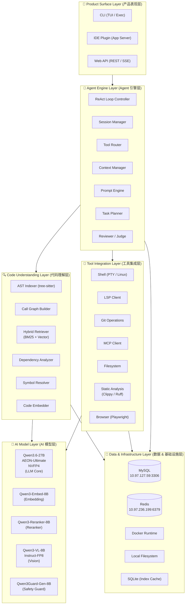
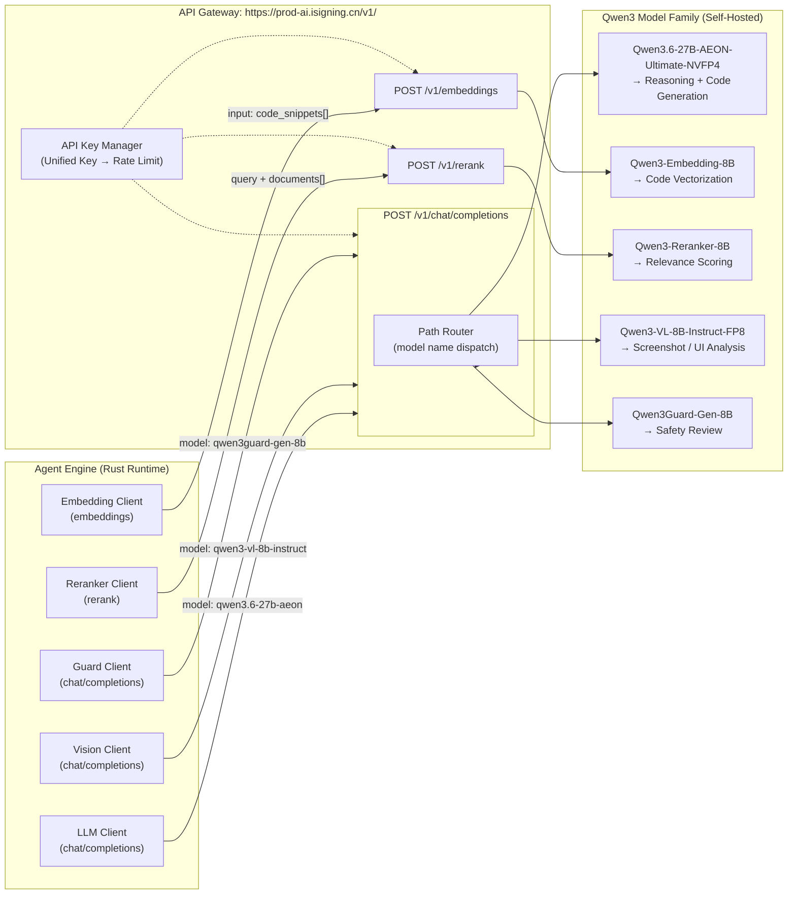
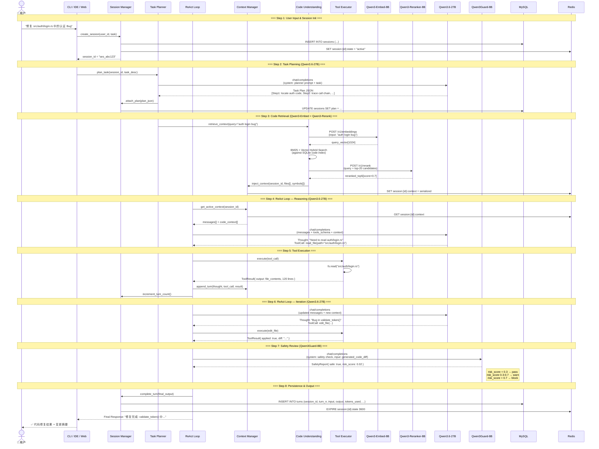
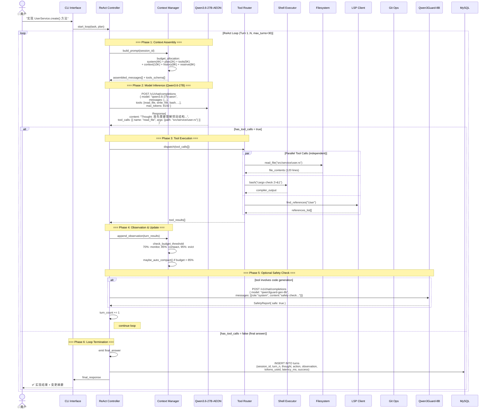
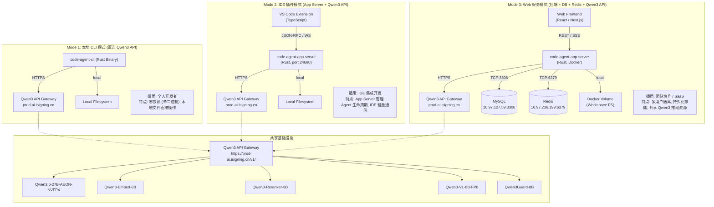

# AI Coding Agent 技术架构图

> **版本**: v1.0  
> **日期**: 2026-07-09  
> **模型家族**: Qwen3 Series (self-hosted via OpenAI-compatible API)  
> **后端存储**: MySQL + Redis  
> **Agent 运行时**: Rust (code-agent-rs workspace, 7 crates)

---

## 目录

1. [系统分层架构](#1-系统分层架构)
2. [OpenAI 兼容 API 网关集成](#2-openai-兼容-api-网关集成)
3. [组件关系图](#3-组件关系图)
4. [数据流图](#4-数据流图)
5. [ReAct 循环详细时序](#5-react-循环详细时序)
6. [部署架构](#6-部署架构)
7. [技术栈全景](#7-技术栈全景)

---

## 1. 系统分层架构

系统采用六层分层架构，自下而上依次为数据基础设施层、AI 模型层、工具集成层、代码理解层、Agent 引擎层和产品表现层。每一层通过明确定义的接口与相邻层交互。



**层间通信协议**:

| 交互方向 | 协议 | 说明 |
|----------|------|------|
| L1 → L2 | JSON-RPC 2.0 | CLI / IDE / Web 通过统一协议与 Agent Engine 通信 |
| L2 → L3 | Internal Function Calls | Rust 同步/异步函数调用 (零序列化开销) |
| L2 → L4 | MCP (Model Context Protocol) | 工具调用与结果返回 |
| L3 → L5 | OpenAI-compatible HTTP API | Embedding & Reranker 请求 |
| L4 → L5 | OpenAI-compatible HTTP API | LLM / Vision / Guard 请求 |
| L2/L3/L4 → L6 | TCP / Native FS | 数据库连接 (sqlx) + Redis (fred) + 文件系统 (tokio::fs) |

---

## 2. OpenAI 兼容 API 网关集成

所有 Qwen3 模型通过统一的 API 网关 (`https://prod-ai.isigning.cn/v1/`) 对外暴露，使用 OpenAI 兼容的 API 格式。Chat / Completions 接口被 LLM、Vision 和 Guard 三个模型复用，Embedding 和 Reranker 使用专用端点。



**API 端点矩阵**:

| 端点 | 方法 | 模型参数 | 用途 | 超时 |
|------|------|----------|------|------|
| `/v1/chat/completions` | POST | `qwen3.6-27b-aeon` | ReAct 推理、代码生成、规划 | 120s |
| `/v1/chat/completions` | POST | `qwen3-vl-8b-instruct` | 截图分析、UI 验证 | 60s |
| `/v1/chat/completions` | POST | `qwen3guard-gen-8b` | 生成代码安全审查 | 30s |
| `/v1/embeddings` | POST | `qwen3-embedding-8b` | 代码向量化检索 | 30s |
| `/v1/rerank` | POST | `qwen3-reranker-8b` | 检索结果重排序 | 15s |

**API 密钥管理策略**:
- 统一 API Key 全局鉴权，通过 `Authorization: Bearer <key>` Header 传递
- 基于模型的独立 Rate Limit (LLM: 60 RPM, Embedding: 200 RPM, Reranker: 300 RPM)
- 请求级 Trace ID (`x-trace-id`) 用于全链路 observability
- 失败自动重试: exponential backoff + jitter (max 3 retries)

---

## 3. 组件关系图

本图展示 Rust workspace 内部 7 个 crate 之间的依赖关系，以及它们对外部 Qwen3 模型家族和基础设施组件的调用关系。共 30+ 组件。

```mermaid
graph TB
    subgraph RustWorkspace["code-agent-rs Workspace (7 Crates)"]
        subgraph CoreCrate["core — Agent Core Engine"]
            ReActLoop["ReActLoop"]
            SessionMgr["SessionManager"]
            ContextMgr["ContextManager"]
            ToolRouter["ToolRouter"]
            PromptTempl["PromptTemplates"]
            PlanNode["PlannerNode"]
            ReviewNode["ReviewerNode"]
        end

        subgraph ToolsCrate["tools — Tool Implementations"]
            LSPClient["LSPClient"]
            ShellExec["ShellExecutor (PTY)"]
            GitOps["GitOperations"]
            FSysOps["FilesystemOps"]
            MCPAdapter["MCPAdapter"]
            LintRunner["LintRunner<br/>(Clippy / Ruff)"]
            BrowserOps["BrowserOps<br/>(Playwright)"]
        end

        subgraph CodexCrate["codex — Code Understanding"]
            ASTParser["ASTParser<br/>(tree-sitter)"]
            CallGraphB["CallGraphBuilder"]
            HybridRet["HybridRetriever"]
            DepAnalyze["DependencyAnalyzer"]
            SymResolve["SymbolResolver"]
            EmbedBridge["EmbeddingBridge"]
        end

        subgraph ProtocolCrate["protocol — Shared Types"]
            AgentMsg["AgentMessage"]
            ToolDef["ToolDefinition"]
            SessionState["SessionState"]
            TurnRecord["TurnRecord"]
            CodeContext["CodeContext"]
            EvalReport["EvaluationReport"]
        end

        subgraph CLICrate["cli — CLI Binary"]
            TUIApp["TUI Application"]
            ExecMode["Exec Mode"]
            Config["Configuration Loader"]
        end

        subgraph AppServerCrate["app-server — IDE Backend"]
            JSONRPCSrv["JSON-RPC Server"]
            WSServer["WebSocket Server"]
            EventBus["Event Bus"]
        end

        subgraph EvalCrate["eval — Evaluation Framework"]
            BenchmarkRunner["Benchmark Runner"]
            MetricCollector["Metric Collector"]
            SWEAdapter["SWE-bench Adapter"]
            HumanEvalAdapter["HumanEval Adapter"]
        end
    end

    subgraph Qwen3Models["Qwen3 Model Family @ prod-ai.isigning.cn"]
        QwenLLM_27B["Qwen3.6-27B-AEON<br/>NVFP4"]
        QwenEmb_8B["Qwen3-Embed-8B"]
        QwenRerank_8B["Qwen3-Reranker-8B"]
        QwenVL_8B["Qwen3-VL-8B-FP8"]
        QwenGuard_8B["Qwen3Guard-Gen-8B"]
    end

    subgraph Infrastructure["Infrastructure"]
        MySQL_DB[("MySQL<br/>10.97.127.59:3306")]
        Redis_Cache[("Redis<br/>10.97.236.199:6379")]
        LocalFS_Disk["Local FS"]
        SQLite_Cache["SQLite (Index)"]
    end

    subgraph ExternalTools["External Tools (via MCP)"]
        LangServers["Language Servers<br/>(gopls / rust-analyzer / pylsp)"]
        GitProcess["git CLI"]
        ShellProc["Shell / PTY"]
        ChromeBrowser["Chrome DevTools"]
    end

    %% Crate dependencies
    CLICrate --> CoreCrate
    CLICrate --> ProtocolCrate
    AppServerCrate --> CoreCrate
    AppServerCrate --> ProtocolCrate
    CoreCrate --> ProtocolCrate
    CoreCrate --> ToolsCrate
    CoreCrate --> CodexCrate
    ToolsCrate --> ProtocolCrate
    ToolsCrate --> MCPAdapter
    CodexCrate --> ProtocolCrate
    EvalCrate --> CoreCrate
    EvalCrate --> ProtocolCrate
    EvalCrate --> CodexCrate

    %% External tool connections
    LSPClient --> LangServers
    ShellExec --> ShellProc
    GitOps --> GitProcess
    BrowserOps --> ChromeBrowser

    %% Qwen3 connections
    ReActLoop -->|"chat/completions"| QwenLLM_27B
    PlanNode -->|"chat/completions"| QwenLLM_27B
    ReviewNode -->|"chat/completions"| QwenLLM_27B
    EmbedBridge -->|"embeddings"| QwenEmb_8B
    HybridRet -->|"rerank"| QwenRerank_8B
    BrowserOps -->|"chat/completions<br/>(vision)"| QwenVL_8B
    ReviewNode -->|"chat/completions<br/>(safety)"| QwenGuard_8B

    %% Infrastructure connections
    SessionMgr --> MySQL_DB
    SessionMgr --> Redis_Cache
    SessionMgr --> SQLite_Cache
    ContextMgr --> MySQL_DB
    ContextMgr --> Redis_Cache
    FSysOps --> LocalFS_Disk
    ASTParser --> LocalFS_Disk
    CallGraphB --> SQLite_Cache
    HybridRet --> SQLite_Cache
    MetricCollector --> MySQL_DB

    %% Style
    classDef qwen fill:#1a1a2e,stroke:#e94560,color:#fff
    classDef infra fill:#0f3460,stroke:#16c79a,color:#fff
    classDef tools fill:#16213e,stroke:#ffd369,color:#fff
    class QwenLLM_27B,QwenEmb_8B,QwenRerank_8B,QwenVL_8B,QwenGuard_8B qwen
    class MySQL_DB,Redis_Cache,LocalFS_Disk,SQLite_Cache infra
    class LangServers,GitProcess,ShellProc,ChromeBrowser tools
```



**Qwen3 模型调用矩阵**:

| 调用方 (Crate / Module) | 目标模型 | 调用接口 | 典型调用频率 | Token 预算 |
|--------------------------|----------|----------|-------------|-----------|
| `ReActLoop` | Qwen3.6-27B | `chat/completions` | 3-30 次/任务 | 8K-32K per call |
| `PlanNode` | Qwen3.6-27B | `chat/completions` | 1 次/任务 | 4K-8K |
| `ReviewNode` | Qwen3.6-27B | `chat/completions` | 1-2 次/任务 | 4K-16K |
| `ReviewNode` (Safety) | Qwen3Guard-8B | `chat/completions` | 1 次/代码块 | 2K-4K |
| `EmbedBridge` | Qwen3-Embed-8B | `embeddings` | 批量 (N 个代码块) | N/A |
| `HybridRetriever` | Qwen3-Reranker-8B | `rerank` | 1 次/检索 | N/A |
| `BrowserOps` | Qwen3-VL-8B | `chat/completions` | 按需 (截图分析) | 2K + image |

---

## 4. 数据流图

完整的 8 步数据流，展示从用户输入到最终输出的全过程。每一步涉及的具体组件、模型调用和数据持久化均已标注。



**数据流步骤总结**:

| 步骤 | 阶段 | 核心模型 | 数据落盘 |
|------|------|----------|----------|
| 1 | 会话初始化 | — | MySQL (`sessions`), Redis (`session:{id}:state`) |
| 2 | 任务规划 | Qwen3.6-27B | MySQL (`sessions.plan`) |
| 3 | 代码检索 | Qwen3-Embed-8B + Qwen3-Reranker-8B | Redis (`session:{id}:context`) |
| 4 | ReAct 推理 | Qwen3.6-27B | — (context in Redis) |
| 5 | 工具执行 | — | Filesystem (actual edits) |
| 6 | ReAct 迭代 | Qwen3.6-27B | Redis (updated context) |
| 7 | 安全审查 | Qwen3Guard-8B | — (inline check) |
| 8 | 持久化输出 | — | MySQL (`turns`), Redis (expire) |

---

## 5. ReAct 循环详细时序

ReAct 循环是系统核心的控制原语。每次循环包含三个阶段：**Thought** (推理) → **Act** (工具调用) → **Observe** (结果观察)。循环终止于模型输出最终答案而非工具调用。



**ReAct 循环关键参数**:

| 参数 | 值 | 说明 |
|------|-----|------|
| `max_turns` | 30 | 最大循环迭代次数 (硬限制) |
| `turn_timeout` | 120s | 单轮推理 + 工具执行超时 |
| `token_budget` | 128K | Qwen3.6-27B 上下文窗口 (NVFP4) |
| `budget_warn` | 70% (~90K) | 触发监控告警 |
| `budget_compact` | 85% (~109K) | 触发上下文压缩 |
| `budget_evict` | 95% (~122K) | 触发激进淘汰 |
| `max_parallel_tools` | 6 | 单轮最大并行工具调用数 |
| `guard_check_freq` | every_code_gen | 每次代码生成后执行安全审查 |

**上下文预算分配 (128K total)**:

```
┌────────────────────────────────────────────────────────────┐
│  System Prompt + Tool Definitions  │  ~9K  │  Static (cached) │
├────────────────────────────────────┼───────┼──────────────────┤
│  Task Plan + Hypothesis            │  ~2K  │  Always resident  │
├────────────────────────────────────┼───────┼──────────────────┤
│  Retrieved Code Context            │  ~10K │  Top-5 reranked    │
├────────────────────────────────────┼───────┼──────────────────┤
│  Tool Results (current turn)       │  ~10K │  JIT, evicted next │
├────────────────────────────────────┼───────┼──────────────────┤
│  Conversation History (compacted)  │  ~8K  │  Compacted >85%   │
├────────────────────────────────────┼───────┼──────────────────┤
│  Model Reply Headroom              │  ~8K  │  Reserved          │
├────────────────────────────────────┼───────┼──────────────────┤
│  Safety Margin                     │  ~5K  │  Buffer            │
└────────────────────────────────────┴───────┴──────────────────┘
```

---

## 6. 部署架构

系统支持三种部署模式，共享同一套 Rust Agent Core 和 Qwen3 模型后端。



**部署模式对比**:

| 维度 | Mode 1: CLI | Mode 2: IDE Plugin | Mode 3: Web Service |
|------|-------------|-------------------|---------------------|
| **目标用户** | 个人开发者 | IDE 用户 | 团队 / SaaS |
| **Rust Binary 数** | 1 (cli) | 2 (cli + app-server) | 2 (app-server + 可选 cli) |
| **端口占用** | 无 | localhost:24680 | 0.0.0.0:8080 |
| **数据库** | 无 (可选 SQLite) | MySQL (远程) + Redis (远程) | MySQL + Redis |
| **多用户隔离** | N/A (单用户) | 系统用户隔离 | session-based 隔离 |
| **Web UI** | 无 | VS Code Extension | React SPA |
| **部署复杂度** | 最小 (单二进制) | 中等 (Extension + Server) | 最高 (Docker Compose) |
| **Qwen3 连接** | 直连 API | 直连 API | 直连 API (pooled) |
| **冷启动时间** | <100ms | <500ms (App Server) | <5s (Docker) |

---

## 7. 技术栈全景

### 7.1 分层技术栈

| 层级 | 组件 | 技术选型 | 版本 / 配置 |
|------|------|----------|-------------|
| **产品表现层** | CLI | Ratatui (Rust TUI) | 0.28+ |
| | IDE Plugin | TypeScript + VS Code Extension API | VS Code 1.95+ |
| | Web 前端 | React 19 + Next.js 15 + Tailwind CSS 4 | Node.js 22 |
| | 通信协议 | JSON-RPC 2.0 / WebSocket / SSE | — |
| **Agent 引擎层** | 运行时 | Rust (tokio async runtime) | Rust 1.80+, tokio 1.x |
| | 控制循环 | Self-built ReAct Loop | max 30 turns |
| | 任务规划 | Chain-of-Thought + Plan-and-Execute | Qwen3.6-27B 驱动 |
| | 代码审查 | Reviewer Node (独立 LLM 调用) | Qwen3Guard-8B 安全审查 |
| | 上下文管理 | 5-layer compaction (inspired by Claude Code) | 70% / 85% / 95% 阈值 |
| | 提示工程 | Tera template engine | 动态模板注入 |
| **代码理解层** | AST 解析 | tree-sitter (WASM Runtime) | 100+ 语言语法 |
| | 调用图 | Static Call Graph (scope-aware resolution) | SQLite 存储 |
| | 向量检索 | Hybrid Retriever (BM25 + Dense Vector) | RRF fusion |
| | 依赖分析 | Dependency Graph + Tarjan's SCC | 循环检测 |
| | 符号解析 | Symbol-name-based resolution | 跨 turn 稳定 ID |
| | 语义搜索 | Hybrid (lexical + semantic) | FTS5 + Embedding |
| **工具集成层** | Shell | PTY-based executor (async process) | Linux / WSL / macOS |
| | LSP | agent-lsp inspired MCP bridge | 30+ 语言 LS 支持 |
| | Git | libgit2 binding (git2 crate) | 原子操作 |
| | MCP Client | Custom Rust MCP client (stdlib / SSE) | MCP 2024-11-05 |
| | Filesystem | tokio::fs (async I/O) | watch / notify |
| | 静态分析 | Clippy (Rust), Ruff (Python), ESLint (TS) | CLI 子进程 |
| | 浏览器 | Playwright (Chromium / Firefox / WebKit) | MCP bridge |
| **AI 模型层** | LLM Core | **Qwen3.6-27B-AEON-Ultimate-NVFP4** | 128K context, FP4 量化 |
| | Embedding | **Qwen3-Embedding-8B** | 1024 dims, chunk c1500-o200 |
| | Reranker | **Qwen3-Reranker-8B** | top-20 → top-5 重排 |
| | Vision | **Qwen3-VL-8B-Instruct-FP8** | 8B params, FP8 |
| | Safety Guard | **Qwen3Guard-Gen-8B** | 8B params, risk_score 0-1 |
| | API 网关 | OpenAI-compatible REST API | `https://prod-ai.isigning.cn/v1/` |
| **数据 & 基础设施层** | 关系数据库 | MySQL 8.0 | 10.97.127.59:3306 |
| | 缓存 / 状态 | Redis 7.x | 10.97.236.199:6379 |
| | 索引缓存 | SQLite 3.x (WAL mode) | 本地嵌入式 |
| | 容器化 | Docker + Docker Compose | 部署编排 |
| | 文件系统 | Native FS (workspace root) | 用户工作区 |
| **评估 & 观测** | 基准测试 | SWE-bench-Live, HumanEval, MBPP | 自定义 runner |
| | 指标收集 | Metrics (turn_count, tokens_used, latency, success_rate) | MySQL |
| | 链路追踪 | W3C Trace Context (x-trace-id) | MCP 兼容 |
| | 日志 | tracing crate (structured logging) | JSON / Console |

### 7.2 Qwen3 模型家族核心位置

Qwen3 模型家族是系统的**唯一推理引擎**，所有 AI 能力均由 self-hosted 的 Qwen3 模型提供。以下是 Qwen3 模型在本系统中的关键角色：

| 模型 | 参数量 | 核心职责 | 调用入口 | 典型延迟 |
|------|--------|----------|----------|----------|
| **Qwen3.6-27B-AEON-Ultimate-NVFP4** | 27B | 代码推理与生成 (ReAct 循环核心) | `ReActLoop`, `PlannerNode`, `ReviewerNode` | 2-8s |
| **Qwen3-Embedding-8B** | 8B | 代码语义向量化 (BM25+Vector 混合检索) | `EmbeddingBridge` → `HybridRetriever` | 200-500ms |
| **Qwen3-Reranker-8B** | 8B | 检索结果相关性重排序 (top-20 → top-5) | `HybridRetriever` | 100-300ms |
| **Qwen3-VL-8B-Instruct-FP8** | 8B | 截图分析 / UI 验证 / 可视化 QA | `BrowserOps` (vision mode) | 1-3s |
| **Qwen3Guard-Gen-8B** | 8B | 生成代码安全审查 (risk scoring 0-1) | `ReviewerNode` (safety path) | 500ms-1s |

### 7.3 Rust Workspace Crate 职责矩阵

| Crate | 包名 | 职责 | 关键依赖 |
|-------|------|------|----------|
| **protocol** | `code-agent-protocol` | 共享数据类型 (AgentMessage, ToolDefinition, SessionState, TurnRecord, CodeContext, EvaluationReport) | serde, serde_json, derive_more |
| **core** | `code-agent-core` | Agent 核心引擎 (ReActLoop, SessionManager, ContextManager, ToolRouter, PlannerNode, ReviewerNode, PromptTemplates) | protocol, tools, codex |
| **tools** | `code-agent-tools` | 工具实现 (LSPClient, ShellExecutor, GitOperations, FilesystemOps, MCPAdapter, LintRunner, BrowserOps) | protocol |
| **codex** | `code-agent-codex` | 代码理解 (ASTParser, CallGraphBuilder, HybridRetriever, DependencyAnalyzer, SymbolResolver, EmbeddingBridge) | protocol, tree-sitter |
| **cli** | `code-agent-cli` | CLI 二进制 (TUI Application, Exec Mode, Configuration Loader) | core, protocol |
| **app-server** | `code-agent-app-server` | IDE 后端服务 (JSON-RPC Server, WebSocket Server, Event Bus) | core, protocol |
| **eval** | `code-agent-eval` | 评估框架 (BenchmarkRunner, MetricCollector, SWEAdapter, HumanEvalAdapter) | core, codex, protocol |

### 7.4 外部依赖与基础设施

| 组件 | 地址 | 协议 | 用途 |
|------|------|------|------|
| Qwen3 API Gateway | `https://prod-ai.isigning.cn/v1/` | HTTPS / OpenAI-compatible | 所有 AI 推理请求 |
| MySQL | `10.97.127.59:3306` | TCP / MySQL Protocol | 会话持久化、评估数据、配置 |
| Redis | `10.97.236.199:6379` | TCP / Redis Protocol | 会话状态缓存、上下文缓存、限流 |
| SQLite | `<workspace>/.code-agent/index.db` | 本地文件 | 代码索引缓存 (tree-sitter AST + FTS5) |
| Language Servers | 系统 PATH | stdio / TCP via MCP | LSP 代码智能 (gopls, rust-analyzer, pylsp, etc.) |
| Docker | 系统 daemon | Unix Socket / TCP | 容器化部署与资源隔离 |

---

> *文档由 AI Coding Agent 技术架构研究组编制，基于 code-agent-rs workspace 实际结构与 Qwen3 模型家族部署配置。所有 API 地址、数据库连接信息均为实际环境约束。*
