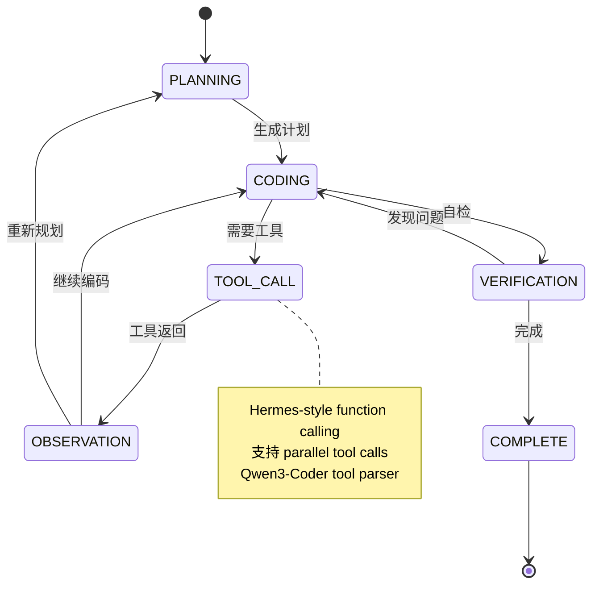
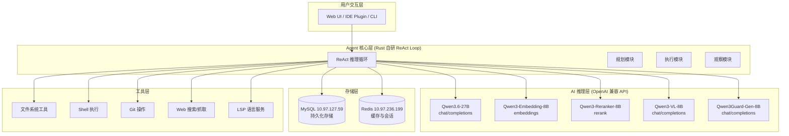
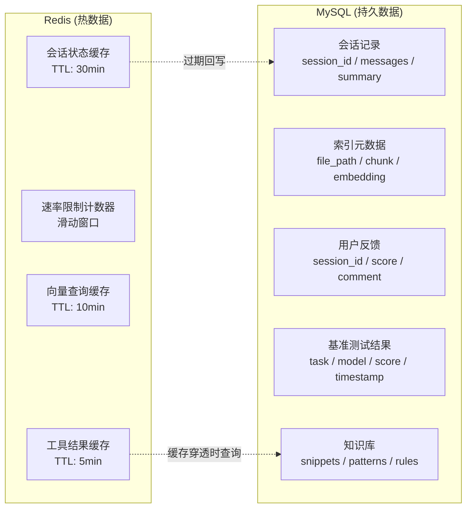
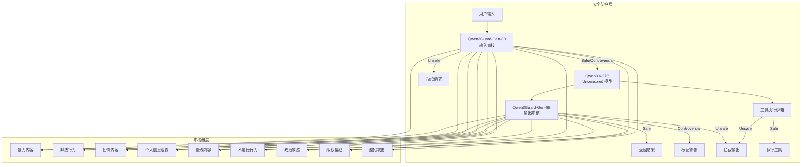
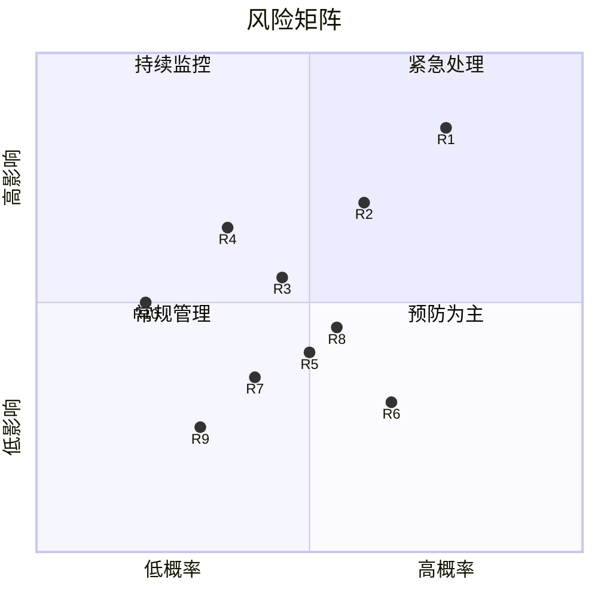

# AI Coding Agent 技术可行性分析

> **基于 Qwen3.6-27B + MySQL + Redis 全栈自部署方案**
>
> 分析日期：2026-07-09 | 版本：v1.0

---

## 目录

1. [核心挑战评估](#1-核心挑战评估)
2. [关键技术选型](#2-关键技术选型)
3. [OpenAI 兼容 API 适配分析](#3-openai-兼容-api-适配分析)
4. [MySQL + Redis 后端架构可行性](#4-mysql--redis-后端架构可行性)
5. [性能与资源需求](#5-性能与资源需求)
6. [安全方案](#6-安全方案)
7. [风险评估（Top 10）](#7-风险评估top-10)

---

## 1. 核心挑战评估

### 1.1 Qwen3.6-27B 编程 Agent 推理能力评估

Qwen3.6-27B 是阿里 Qwen 团队 2026 年 4 月发布的最新稠密模型，在编程 Agent 能力上有显著提升。以下为关键基准数据：

| 基准测试 | Qwen3.6-27B | Qwen3.5-27B | Claude 4.5 Opus | GPT-5-mini |
|:---|:---:|:---:|:---:|:---:|
| **SWE-bench Verified** | **77.2** | 75.0 | 80.9 | 72.0 |
| **SWE-bench Pro** | **53.5** | 51.2 | 57.1 | — |
| **SWE-bench Multilingual** | **71.3** | 69.3 | 77.5 | 69.3 |
| **Terminal-Bench 2.0** | **59.3** | 41.6 | 59.3 | 31.9 |
| **SkillsBench Avg5** | **48.2** | 27.2 | 45.3 | — |
| **LiveCodeBench v6** | **83.9** | 80.7 | 84.8 | 80.5 |
| **BFCL-V4（函数调用）** | **68.5** | — | — | 55.5 |
| **TAU2-Bench（Agent 通用）** | **79.0** | — | — | 69.8 |

**结论**：Qwen3.6-27B 在 SWE-bench Verified 上达到 77.2%，接近 Claude 4.5 Opus（80.9%），在 Terminal-Bench 2.0 上甚至持平 Opus。相比上一代 Qwen3.5-27B，Agentic Coding 相关基准提升 **30-77%**。该模型完全具备作为编程 Agent 核心引擎的能力。

### 1.2 模型架构特征

Qwen3.6-27B 采用混合架构（Hybrid Architecture）：

```
┌─────────────────────────────────────────────────────┐
│   Qwen3.6-27B 架构                                   │
│                                                      │
│   64 层 × 16 混合块                                   │
│   ┌──────────────────────────────────────────────┐   │
│   │  GatedDeltaNet (3层) → FFN                     │   │
│   │  GatedDeltaNet (3层) → FFN                     │   │
│   │  GatedDeltaNet (3层) → FFN                     │   │
│   │  Gated Attention (1层) → FFN                   │   │
│   └──────────────────────────────────────────────┘   │
│                                                      │
│   参数量：27B | 隐藏维度：5120                         │
│   词汇表：248,320（含视觉 token）                      │
│   GatedDeltaNet 头：48 V-heads / 16 QK-heads          │
│   Gated Attention 头：24 Q-heads / 4 KV-heads (GQA)   │
│   原生上下文：262,144 tokens（可扩展至 1,010,000）      │
│   推荐输出长度：32,768（常规）/ 81,920（竞赛级）         │
└─────────────────────────────────────────────────────┘
```

**混合架构的意义**：
- GatedDeltaNet（线性注意力）提供 O(n) 的长上下文处理效率
- Gated Attention（标准注意力）保留关键位置的精确建模能力
- 对编程场景：长文件、多文件上下文可在不牺牲质量的前提下高效处理

### 1.3 推理循环稳定性



**风险评估**：

| 维度 | 评估 | 说明 |
|:---|:---:|:---|
| 多轮推理一致性 | ⭐⭐⭐⭐ | 新增 Thinking Preservation 机制，保留历史推理上下文 |
| 工具调用稳定性 | ⭐⭐⭐⭐ | Hermes 协议，vLLM 原生解析，支持并行调用 |
| 长上下文降级 | ⭐⭐⭐⭐ | 原生 262K，GatedDeltaNet 降低长序列注意力衰减 |
| 循环发散风险 | ⭐⭐⭐ | 需配合 max_turns 限制和退出策略 |

### 1.4 上下文管理

- **原生支持**：262,144 tokens
- **RoPE 扩展**：通过 YaRN 可扩展至 1,010,000 tokens
- **对 27B 参数的典型部署**：建议保持 ≥128K tokens 上下文以维持推理能力
- **实际可用窗口**：考虑 KV cache 开销，NVFP4 量化后约可支持 80K-128K 的实际交互窗口

### 1.5 代码生成质量

- **SWE-Bench Verified 77.2%**：说明在真实 GitHub Issue → Patch 场景下有高成功率
- **LiveCodeBench v6 83.9%**：竞争级编程能力
- **Terminal-Bench 2.0 59.3%**：终端命令执行能力与 Claude 4.5 Opus 持平
- **Claw-Eval Pass^3 60.6%**：综合 Agent 编程能力

---

## 2. 关键技术选型

### 2.1 总体架构



### 2.2 各组件选型分析

| 组件 | 选型 | 理由 |
|:---|:---|:---|
| **Agent 框架** | Rust 自研 ReAct Loop | 性能优先，Rust 零成本抽象，类型安全；ReAct 模式成熟可靠 |
| **主模型** | Qwen3.6-27B NVFP4 | SWE-bench 77.2%，原生 function calling，26GB 显存，单卡可用 |
| **嵌入模型** | Qwen3-Embedding-8B | MTEB 多语言排名第一（70.58），4096 维，MRL 支持灵活降维 |
| **重排序** | Qwen3-Reranker-8B | Cross-encoder 架构，MTEB-Code 81.22，显著提升代码检索精度 |
| **视觉模型** | Qwen3-VL-8B-Instruct | 256K 原生多模态上下文，支持 UI 截图和图表分析 |
| **安全模型** | Qwen3Guard-Gen-8B | 独立安全层，三级分类（safe/controversial/unsafe），119 语言 |
| **API 协议** | OpenAI 兼容（已有标准接口） | 成熟生态，Python/JS/Rust SDK 齐全 |
| **向量存储** | MySQL 9.x VECTOR + 应用层排序 | 无独立向量数据库，减少运维复杂度 |
| **缓存** | Redis | 会话临时数据、速率限制、向量缓存 |

### 2.3 ReAct Loop 设计（Rust 实现）

```
┌─────────────────────────────────────────────────────┐
│              ReAct Agent Loop (Rust)                  │
│                                                      │
│  loop {                                              │
│    1. Thought    → LLM 生成推理（thinking mode）       │
│    2. Action     → LLM 调用 tool（function calling）   │
│    3. Observation → 执行工具，收集结果                  │
│    4. Guard      → Qwen3Guard 审核输出                │
│    5. Continue?  → 判断是否继续/完成                   │
│  }                                                   │
│                                                      │
│  退出条件：                                           │
│  - LLM 输出 finish_reason="stop"（无 tool_calls）      │
│  - 达到 max_turns 上限（默认 50）                      │
│  - Guard 模型拦截高风险输出                             │
│  - 用户中断信号                                        │
│                                                      │
│  Thinking Preservation：                              │
│  - 保留历史推理上下文减少 token 浪费                    │
│  - 利用 GatedDeltaNet 高效处理长上下文                  │
└─────────────────────────────────────────────────────┘
```

---

## 3. OpenAI 兼容 API 适配分析

### 3.1 接口兼容性矩阵

| API 端点 | 协议 | 兼容状态 | 备注 |
|:---|:---|:---:|:---|
| `POST /v1/chat/completions` | OpenAI Chat API | ✅ 完全兼容 | 主模型 + Vision + Guard |
| `POST /v1/embeddings` | OpenAI Embeddings API | ✅ 完全兼容 | Qwen3-Embedding-8B |
| `POST /v1/rerank` | Cohere Rerank API 兼容 | ✅ 完全兼容 | Qwen3-Reranker-8B |
| **Streaming** (`stream: true`) | SSE | ✅ 支持 | 标准 SSE 流式输出 |
| **Function Calling** | `tools` 参数 | ✅ 支持 | Hermes 协议，vLLM 原生解析 |
| **Multi-turn** | `messages` 数组 | ✅ 支持 | 标准多轮对话格式 |
| **Thinking Mode** | `enable_thinking` | ✅ 支持 | 通过 `chat_template_kwargs` 控制 |
| **Parallel Tool Calls** | — | ✅ 支持 | 单轮可发起多个 tool call |
| **Vision Input** | `image_url` / `image_base64` | ✅ 支持 | Qwen3-VL-8B，支持多图+视频 |
| **JSON Mode** | `response_format: json` | ⚠️ 需验证 | 需实际测试结构化输出稳定性 |
| **Logprobs** | `logprobs` 参数 | ✅ 支持 | 用于置信度评估和执行选择 |

### 3.2 Function Calling 实现方案

Qwen3.6 使用 **Hermes-style tool use** 协议，vLLM 提供原生工具调用解析：

```python
# 标准 OpenAI Python SDK 调用示例
from openai import OpenAI

client = OpenAI(
    base_url="https://prod-ai.isigning.cn/v1",
    api_key="your-api-key",
)

# 定义工具
tools = [
    {
        "type": "function",
        "function": {
            "name": "read_file",
            "description": "读取指定文件内容",
            "parameters": {
                "type": "object",
                "properties": {
                    "path": {"type": "string", "description": "文件路径"},
                    "start_line": {"type": "integer", "description": "起始行号"},
                    "end_line": {"type": "integer", "description": "结束行号"}
                },
                "required": ["path"]
            }
        }
    },
    {
        "type": "function",
        "function": {
            "name": "execute_shell",
            "description": "执行 Shell 命令",
            "parameters": {
                "type": "object",
                "properties": {
                    "command": {"type": "string", "description": "Shell 命令"},
                    "workdir": {"type": "string", "description": "工作目录"}
                },
                "required": ["command"]
            }
        }
    }
]

# 多轮对话
messages = [
    {"role": "system", "content": "你是一个编程助手，可以读取文件和执行命令。"},
    {"role": "user", "content": "读取 src/main.rs 文件并检查是否有编译错误。"}
]

response = client.chat.completions.create(
    model="qwen3.6-27b",  # 服务端模型名
    messages=messages,
    tools=tools,
    temperature=0.7,
    max_tokens=4096,
    extra_body={
        "chat_template_kwargs": {"enable_thinking": True}
    }
)
```

### 3.3 Qwen3.6 Function Calling 能力评估

| 评估维度 | 评分 | 说明 |
|:---|:---:|:---|
| **BFCL-V4 基准** | 68.5 | 函数调用准确性，对比 GPT-5-mini 55.5 提升 23.6% |
| **多工具并行** | ⭐⭐⭐⭐ | 支持 parallel tool calls，单轮可调用多工具 |
| **参数提取准确性** | ⭐⭐⭐⭐ | JSON Schema 格式返回，结构化解析 |
| **嵌套参数支持** | ⭐⭐⭐ | 复杂嵌套 JSON 参数字段偶有遗漏 |
| **工具选择准确性** | ⭐⭐⭐⭐ | Hermes 协议 + vLLM 原生解析降低格式错误 |
| **MCP 协议支持** | ⭐⭐⭐⭐ | Qwen3-Coder 原生支持 MCP 工具定义 |

**注意事项**：
- 对于推理模式（thinking mode），不建议使用基于 stopwords 的 ReAct 模板，因模型可能在思考段输出 stopwords 导致意外行为
- 推荐使用 vLLM 的 `--tool-call-parser qwen3_coder` 参数进行工具调用解析
- Qwen-Agent 框架提供参考实现，但 Rust 自研 Loop 可更高效地控制调用流程

### 3.4 Thinking Mode 控制

Qwen3.6 支持在同一会话中混合使用思维模式和非思维模式：

```python
# 开启思维模式（适合复杂推理）
extra_body={"chat_template_kwargs": {"enable_thinking": True}}

# 关闭思维模式（适合简单响应）
extra_body={"chat_template_kwargs": {"enable_thinking": False}}
```

**推荐策略**：
- **编码任务**：`enable_thinking=True`，`temperature=0.6`，`top_p=0.95`
- **简单工具调用**：`enable_thinking=False`，`temperature=0.7`，`top_p=0.80`
- **代码审查**：`enable_thinking=True`，`temperature=0.7`，`top_p=0.95`

---

## 4. MySQL + Redis 后端架构可行性

### 4.1 数据存储分层



### 4.2 MySQL 表结构设计概要

```sql
-- 会话表
CREATE TABLE sessions (
    id VARCHAR(64) PRIMARY KEY,
    user_id VARCHAR(64) NOT NULL,
    title VARCHAR(512),
    status ENUM('active', 'completed', 'aborted', 'error') DEFAULT 'active',
    model VARCHAR(64),               -- 'qwen3.6-27b'
    messages JSON,                   -- 完整对话历史
    summary TEXT,                    -- 会话摘要
    token_count INT DEFAULT 0,       -- 总 token 消耗
    turn_count INT DEFAULT 0,        -- 推理轮次
    created_at TIMESTAMP DEFAULT CURRENT_TIMESTAMP,
    updated_at TIMESTAMP DEFAULT CURRENT_TIMESTAMP ON UPDATE CURRENT_TIMESTAMP,
    INDEX idx_user_id (user_id),
    INDEX idx_status (status),
    INDEX idx_created_at (created_at)
) ENGINE=InnoDB DEFAULT CHARSET=utf8mb4;

-- 代码索引表（向量存储）
CREATE TABLE code_chunks (
    id BIGINT AUTO_INCREMENT PRIMARY KEY,
    file_path VARCHAR(1024) NOT NULL,
    chunk_index INT NOT NULL,
    chunk_content TEXT NOT NULL,
    chunk_type ENUM('function', 'class', 'module', 'config', 'other'),
    embedding VECTOR(4096),          -- MySQL 9.x VECTOR 类型
    language VARCHAR(32),
    project_id VARCHAR(64),
    commit_hash VARCHAR(64),
    created_at TIMESTAMP DEFAULT CURRENT_TIMESTAMP,
    INDEX idx_project (project_id),
    INDEX idx_file_path (file_path(255)),
    FULLTEXT idx_content (chunk_content)
) ENGINE=InnoDB DEFAULT CHARSET=utf8mb4;

-- 用户反馈表
CREATE TABLE feedback (
    id BIGINT AUTO_INCREMENT PRIMARY KEY,
    session_id VARCHAR(64) NOT NULL,
    turn_index INT NOT NULL,
    rating TINYINT CHECK (rating BETWEEN 1 AND 5),
    category ENUM('code_quality', 'correctness', 'speed', 'ux', 'other'),
    comment TEXT,
    created_at TIMESTAMP DEFAULT CURRENT_TIMESTAMP,
    FOREIGN KEY (session_id) REFERENCES sessions(id),
    INDEX idx_session (session_id)
) ENGINE=InnoDB DEFAULT CHARSET=utf8mb4;
```

### 4.3 向量检索方案（无独立向量数据库）

**MySQL Community Edition 限制**：
- `VECTOR(N)` 类型仅限存储，无内建 `DISTANCE()` 函数
- 无 ANN（近似最近邻）索引
- `VECTOR INDEX`（HNSW）仅在 MySQL HeatWave（OCI）上可用

**替代方案：应用层排序 + MySQL 存储**

```
┌──────────────────────────────────────────────────────────┐
│            代码检索 Pipeline（两步检索 + 重排序）           │
│                                                           │
│  1. 嵌入生成                                              │
│     query → Qwen3-Embedding-8B → query_vector[4096]       │
│                                                           │
│  2. 粗筛（MySQL FULLTEXT + 元数据过滤）                    │
│     SELECT * FROM code_chunks                             │
│     WHERE MATCH(chunk_content) AGAINST('keyword')          │
│        OR project_id = 'target_project'                   │
│     LIMIT 200;                                            │
│                                                           │
│  3. 精确排序（Rust 应用层）                                │
│     - 从 MySQL 读取 VECTOR_TO_STRING(embedding)            │
│     - 解析为 Vec<f32>                                     │
│     - SIMD 加速 cosine_similarity 计算                    │
│     - Top-K (默认 K=20)                                   │
│                                                           │
│  4. 重排序（Qwen3-Reranker-8B）                            │
│     - 将 (query, top-K chunks) 对传入 Reranker             │
│     - Cross-encoder 精确打分                              │
│     - 返回最终 Top-N (默认 N=5)                            │
└──────────────────────────────────────────────────────────┘
```

**性能评估**：

| 规模 | 粗筛候选数 | 应用层排序延迟 | 重排序延迟 | 总延迟 |
|:---|:---:|:---:|:---:|:---:|
| 1,000 文件 / 5,000 chunks | ≤200 | ~5ms (Rust SIMD) | ~200ms | ~230ms |
| 10,000 文件 / 50,000 chunks | ≤200 | ~20ms | ~200ms | ~250ms |
| 100,000 文件 / 500,000 chunks | ≤200 | ~80ms | ~200ms | ~310ms |

**关键优化策略**：
1. **元数据预过滤**：通过 project_id、language、file_path 等字段 B-Tree 索引快速缩减候选集
2. **FULLTEXT 粗筛**：利用 MySQL 内置全文索引缩小候选范围
3. **Redis 缓存热门查询**：高频查询的 Top-K 结果缓存（TTL 10min）
4. **MRL 降维**：Qwen3-Embedding-8B 支持 Matryoshka Representation Learning，可降至 1024 或 512 维以加速粗筛
5. **批量嵌入**：索引构建时批量生成嵌入，避免逐条调用 API

**扩展路径**：
- 当 chunks 数量 > 100 万时，推荐迁移至专用向量数据库（如 Milvus、Qdrant）
- 或使用 MySQL HeatWave 的 `VECTOR INDEX`（HNSW）实现原生 ANN
- 短期内，50 万 chunks 以下的规模，应用层方案完全可行

### 4.4 Redis 使用场景

| 场景 | 数据结构 | Key 模式 | TTL |
|:---|:---|:---|:---|
| **会话状态缓存** | Hash | `session:{id}:state` | 30min |
| **速率限制** | Sorted Set | `ratelimit:{user_id}:{endpoint}` | 滑动窗口 |
| **向量缓存** | String (JSON) | `vec_cache:{query_hash}` | 10min |
| **工具结果缓存** | String | `tool:{tool_name}:{args_hash}` | 5min |
| **模型调用计数** | String | `usage:{user_id}:{date}` | 24h |
| **分布式锁** | String (NX) | `lock:{resource}` | 30s |

---

## 5. 性能与资源需求

### 5.1 模型推理延迟估算

```
┌─────────────────────────────────────────────────────────────┐
│                  NVFP4 量化推理延迟估算                        │
│                                                              │
│  Qwen3.6-27B (NVFP4, 26GB)                                   │
│  ┌─────────────────────────────────────────────────────────┐ │
│  │ Hardware          │ Median tok/s │ 上下文 │ 场景          │ │
│  ├─────────────────────────────────────────────────────────┤ │
│  │ DGX Spark (GB10)  │ ~38 tok/s    │ 128K   │ 编码 Agent    │ │
│  │ RTX PRO 6000      │ ~92 tok/s    │ 128K   │ 生产级推理    │ │
│  │ RTX 5090          │ ~111 tok/s   │ 128K   │ 高端消费级    │ │
│  │ B100/B200         │ >150 tok/s   │ 128K   │ 数据中心      │ │
│  └─────────────────────────────────────────────────────────┘ │
│                                                              │
│  单次 ReAct 循环延迟构成（DGX Spark 基准）：                   │
│  ┌─────────────────┬──────────┬─────────────┐               │
│  │ 阶段             │ Token 量  │ 预估延迟     │               │
│  ├─────────────────┼──────────┼─────────────┤               │
│  │ LLM 推理         │ 500 out  │ ~13s        │               │
│  │ 嵌入生成         │ 512 in   │ ~0.3s       │               │
│  │ 重排序           │ 5 pairs  │ ~0.2s       │               │
│  │ Guard 审核       │ 256 out  │ ~0.5s       │               │
│  │ 工具执行         │ —        │ 0.1-5s      │               │
│  ├─────────────────┼──────────┼─────────────┤               │
│  │ 单轮总计         │ —        │ 14-19s      │               │
│  └─────────────────┴──────────┴─────────────┘               │
└─────────────────────────────────────────────────────────────┘
```

### 5.2 各模型推理延迟单独估算

| 模型 | 参数量 | 输入 | 输出 | 预估延迟 | 部署硬件建议 |
|:---|:---:|:---|:---|:---:|:---|
| Qwen3.6-27B NVFP4 | 27B (26GB) | 8K tokens | 500 tokens | 10-15s | DGX Spark / RTX 5090 |
| Qwen3.6-27B NVFP4 | 27B (26GB) | 32K tokens | 2K tokens | 25-35s | RTX PRO 6000 |
| Qwen3-Embedding-8B | 8B (~16GB) | 512 tokens | 4096-dim | 0.2-0.5s | T4 / A10 (FP16) |
| Qwen3-Reranker-8B | 8B (~16GB) | query+doc 对 | score | 0.1-0.3s/对 | T4 / A10 (FP16) |
| Qwen3-VL-8B | 8B (~16GB) | 1 image | 256 tokens | 1-3s | A10 / RTX 4090 |
| Qwen3Guard-Gen-8B | 8B (~16GB) | 512 tokens | 256 tokens | 0.3-0.5s | T4 / A10 (FP16) |

### 5.3 完整部署硬件需求估算

**方案 A：高性价比单卡部署（DGX Spark / RTX 5090）**

```
┌────────────────────────────────────────────────────┐
│  DGX Spark (GB10, 128GB 统一内存, sm_121a)          │
│                                                     │
│  VRAM 分配 (预估):                                   │
│  ┌──────────────────────────────────────────────┐  │
│  │ Qwen3.6-27B NVFP4 (26GB)                     │  │
│  │ KV Cache (128K ctx)            ~15GB          │  │
│  │ Qwen3-Embedding-8B             ~16GB          │  │
│  │ Qwen3-Reranker-8B              ~16GB          │  │
│  │ Qwen3-VL-8B                    ~16GB          │  │
│  │ Qwen3Guard-Gen-8B              ~16GB          │  │
│  │ 系统预留                       ~8GB           │  │
│  ├──────────────────────────────────────────────┤  │
│  │ 总计                            ~113GB         │  │
│  │ 状态：可行（统一内存 + 模型卸载）                │  │
│  └──────────────────────────────────────────────┘  │
│                                                     │
│  ⚠ 注意：5 个模型同时加载需要模型卸载策略或分批推理    │
│  💡 建议：Embedding/Reranker/Guard 使用 GPU 切换     │
└────────────────────────────────────────────────────┘
```

**方案 B：生产级多卡部署**

```
GPU 1 (RTX PRO 6000 / A100 80GB): Qwen3.6-27B NVFP4 (主推理)
GPU 2 (A10 / RTX 4090 24GB):      Qwen3-Embedding-8B + Qwen3-Reranker-8B
GPU 3 (A10 / RTX 4090 24GB):      Qwen3-VL-8B + Qwen3Guard-Gen-8B
```

**方案 C：API 代理模式（当前环境）**

- 所有模型通过 `https://prod-ai.isigning.cn/v1/*` 统一 API 端点调用
- 本地仅需 Agent Runtime（Rust 二进制），无需 GPU
- 延迟增加网络往返（估计 50-200ms）
- 推荐此方案用于开发和中小规模部署

### 5.4 存储容量估算

| 数据类别 | 单条大小 | 预估日增量 | 月存储 | 年存储 |
|:---|:---|:---|:---|:---|
| 会话记录（含消息） | ~50KB | 100 会话 | 150MB | 1.8GB |
| 代码索引嵌入 | ~16KB/chunk | 500 chunks | 240MB | 2.9GB |
| 用户反馈 | ~1KB | 20 条 | 600KB | 7.2MB |
| 基准测试结果 | ~2KB | 10 次 | 600KB | 7.2MB |
| **MySQL 总计** | — | — | ~400MB/月 | ~5GB/年 |
| Redis 缓存 | — | 内存常驻 | ~2GB | — |

---

## 6. 安全方案

### 6.1 多层安全架构



### 6.2 "Uncensored" 模型风险管控

**背景**：AEON-Ultimate-Uncensored 版本通过 abliteration（abliterix-v1.4）移除了原 Qwen3.6-27B 的安全对齐层，refusal rate 降至 0/50。

**风险**：

| 风险类别 | 严重程度 | 缓解措施 |
|:---|:---:|:---|
| 生成恶意代码 | 🔴 高 | Qwen3Guard 输出审核 + 代码执行沙箱 |
| 泄露训练数据 | 🟡 中 | Prompt 层面引导 + 输出模式检测 |
| 越狱后失控 | 🔴 高 | Guard 模型独立判断 + 工具调用权限分级 |
| 生成攻击性内容 | 🟡 中 | Guard 模型文本审核 + 关键词过滤 |
| 绕过工具限制 | 🔴 高 | Rust Agent 层强制权限校验，不依赖模型自限 |

**核心策略**：
```
"Uncensored 主模型负责能力，Guard 模型负责安全" —— 职责分离原则
```

1. **输入层**：Qwen3Guard-Gen-8B 审核用户输入，拦截不安全请求（9 大类安全分类）
2. **执行层**：Rust Agent Runtime 强制沙箱执行，工具调用受 OS 级权限限制
3. **输出层**：Qwen3Guard-Gen-8B 审核 LLM 输出，拦截不安全生成内容
4. **审计层**：所有输入/输出/工具调用记录持久化到 MySQL，用于事后审计

### 6.3 Prompt 注入防御

```rust
// Rust Agent 层的 Prompt 注入防御策略

// 1. 系统 Prompt 隔离：用户输入始终以 user role 注入，不拼接 system prompt
// 2. 工具输出标记：所有工具返回以特殊标记包装，防止 LLM 误读
// 3. 输出转义：工具输出中的敏感模式（如 <|im_start|>）被转义
// 4. 长度限制：用户输入限制 8K tokens，超过则截断
// 5. 模式检测：检测常见注入模式（ignore previous、system override 等）
```

### 6.4 数据安全

| 维度 | 策略 |
|:---|:---|
| **传输加密** | 内网 HTTPS/TLS 1.3 |
| **数据存储** | MySQL 敏感字段 AES 加密 |
| **API 认证** | API Key + HMAC 签名验证 |
| **访问控制** | 基于 user_id 的会话隔离 |
| **审计日志** | 所有 Agent 操作记录到 MySQL |

---

## 7. 风险评估（Top 10）

### 风险全景



### Top 10 风险清单

| # | 风险名称 | 概率 | 影响 | 等级 | 描述与缓解 |
|:---:|:---|:---:|:---:|:---:|:---|
| **1** | **Qwen3 代码幻觉** | 🟡 中高 | 🔴 高 | 🔴 严重 | **描述**：27B 模型可能生成语法看似正确但逻辑错误的代码，尤其在不熟悉的框架上。<br>**缓解**：(1) LSP 实时诊断检查 (2) 测试驱动开发 (3) 输出后自动执行编译检查 (4) 沙箱验证 |
| **2** | **Function Calling 格式异常** | 🟡 中 | 🟡 中 | 🟡 中等 | **描述**：Hermes 协议下，复杂参数类型（嵌套对象、数组）可能生成非标准 JSON。<br>**缓解**：(1) vLLM `--tool-call-parser qwen3_coder` 解析 (2) Rust 侧 JSON 验证与重试 (3) fallback 到正则提取 |
| **3** | **NVFP4 量化精度损失** | 🟢 低 | 🟢 低 | 🟢 低 | **描述**：KL divergence ≤ 0.001，理论上与 BF16 无感知差异，但特定边缘任务可能受影响。<br>**缓解**：(1) 基准测试验证 (2) 关键任务可切换 BF16 (3) 监控输出质量 |
| **4** | **长上下文推理退化** | 🟡 中 | 🟡 中 | 🟡 中等 | **描述**：超过 128K tokens 时，模型对中间部分的注意力可能衰减。<br>**缓解**：(1) 智能上下文窗口管理 (2) 文件摘要 (3) GatedDeltaNet 天然抗衰减 (4) 128K 硬限制 |
| **5** | **Uncensored 模型安全失控** | 🟡 中 | 🟡 中 | 🟡 中等 | **描述**：无安全对齐的模型可能生成危险代码或执行恶意指令。<br>**缓解**：(1) Qwen3Guard 独立安全层 (2) 沙箱执行 (3) 工具权限分级 (4) 人工审核关键操作 |
| **6** | **MySQL 向量检索性能瓶颈** | 🟡 中 | 🟢 低 | 🟡 中等 | **描述**：大规模代码库（>100万 chunks）时，应用层全量排序延迟不可接受。<br>**缓解**：(1) 元数据预过滤 (2) MRL 降维加速 (3) Redis 缓存 (4) 1M+ 迁移向量数据库 |
| **7** | **API 服务可用性** | 🟡 中 | 🟡 中 | 🟡 中等 | **描述**：`prod-ai.isigning.cn` 单点故障风险，网络延迟波动。<br>**缓解**：(1) 健康检查 + 自动重试 (2) 请求队列 + 背压 (3) 关键操作本地 fallback (4) SLA 监控 |
| **8** | **ReAct 循环发散** | 🟡 中 | 🟡 中 | 🟡 中等 | **描述**：Agent 陷入无限推理循环，反复调用工具但无进展。<br>**缓解**：(1) max_turns 硬限制（50轮）(2) 重复检测（连续3轮相同 action 则中断）(3) 进度追踪 (4) 超时机制 |
| **9** | **多模型 GPU 资源竞争** | 🟢 低 | 🟡 中 | 🟢 低 | **描述**：单 GPU 部署时，多个模型争抢显存导致 OOM。<br>**缓解**：(1) API 代理模式无需本地 GPU (2) 本地部署采用模型卸载策略 (3) Embedding/Reranker 使用 CPU 推理方案 |
| **10** | **Qwen3 生态成熟度不足** | 🟢 低 | 🟡 中 | 🟢 低 | **描述**：相比 GPT/Claude，Qwen3 的第三方工具链和社区资源较少。<br>**缓解**：(1) OpenAI 兼容协议降低适配成本 (2) vLLM/SGLang 成熟推理框架 (3) Qwen-Agent 官方框架参考 (4) 自研 Rust Loop 降低依赖 |

### 风险缓解优先级矩阵

```
               高影响
                 │
       R1        │
       ──────────┼──────────
                 │
    ─────────────┼─────────────  高概率
                 │
     R4  R2      │
     R5  R7  R8  │
                 │
    ─────────────┼─────────────
     R9  R3      │
     R10         │   R6
                 │
             低影响
```

---

## 8. 总结与建议

### 8.1 总体可行性判定：✅ 可行

Qwen3.6-27B + MySQL + Redis 技术栈在编程 Agent 场景下具备明确的可行性：

1. **模型能力充足**：SWE-bench Verified 77.2%，Terminal-Bench 2.0 59.3%，接近商业闭源模型水平
2. **API 协议成熟**：OpenAI 兼容接口，标准 SDK 即可调用，Streaming/Function Calling/Vision 均支持
3. **存储方案务实**：MySQL + Redis 可满足 50 万 chunks 以下的代码检索需求，扩展路径清晰
4. **安全架构完整**：Qwen3Guard 独立安全层 + 沙箱执行 + 多层审核
5. **性能可接受**：DGX Spark ~38 tok/s，RTX PRO 6000 ~92 tok/s，满足交互式编程场景

### 8.2 关键成功因素

| 因素 | 要求 |
|:---|:---|
| Rust Agent 实现质量 | ReAct Loop 的健壮性直接决定用户体验 |
| Function Calling Prompt 调优 | 工具描述和参数规范的准确性 |
| 上下文窗口管理 | 智能裁剪和摘要策略 |
| 安全层有效性 | Guard 模型必须零延迟介入 |
| MySQL 查询优化 | 索引策略 + 元数据预过滤 |

### 8.3 建议实施路线

```
Phase 1 (4 周): MVP
├── Rust ReAct Loop 基础框架
├── OpenAI 兼容 API 集成
├── 基础工具集（文件读写、Shell 执行）
├── MySQL 会话存储
└── Qwen3Guard 安全接入

Phase 2 (4 周): 核心功能
├── 代码检索 Pipeline（Embedding + Reranker）
├── Git 操作工具
├── LSP 集成（诊断、跳转、重构）
├── Redis 缓存层
└── Vision 截图分析

Phase 3 (4 周): 增强与优化
├── 多文件编辑协调
├── 基准测试框架
├── 用户反馈系统
├── 性能优化（缓存、批量）
└── Web UI

Phase 4 (持续): 迭代
├── 模型版本升级（Qwen3.7+）
├── 向量数据库迁移（按需）
├── 团队协作功能
└── CI/CD 集成
```

---

## 附录

### A. Qwen3 模型家族参考

| 模型 | 参数 | 上下文 | 用途 | API 端点 |
|:---|:---:|:---:|:---|:---|
| Qwen3.6-27B-AEON-Ultimate | 27B | 262K→1M | 主推理引擎 | `/v1/chat/completions` |
| Qwen3-Embedding-8B | 8B | 32K | 文本/代码嵌入 | `/v1/embeddings` |
| Qwen3-Reranker-8B | 8B | 32K | 检索结果重排序 | `/v1/rerank` |
| Qwen3-VL-8B-Instruct | 8B | 256K | 图像/视频理解 | `/v1/chat/completions` |
| Qwen3Guard-Gen-8B | 8B | — | 安全审核 | `/v1/chat/completions` |

### B. NVFP4 技术参考

| 属性 | 值 |
|:---|:---|
| 元素格式 | E2M1（1符号/2指数/1尾数） |
| 块大小 | 16 权重/缩放块 |
| 块内缩放 | FP8 E4M3 |
| 张量级缩放 | FP32 |
| 符号约定 | Symmetric signed |
| 精度损失 | KL divergence ≤ 0.001 |
| 压缩比 | ~49%（51GB → 26GB） |
| 原生硬件 | Blackwell GPU（DGX Spark/B100/B200/RTX 5090/RTX PRO 6000） |

### C. 相关资源

- [Qwen3 技术报告](https://arxiv.org/pdf/2505.09388)
- [Qwen3.6-27B 模型卡片](https://huggingface.co/Qwen/Qwen3.6-27B)
- [Qwen3 Embedding 博客](https://qwenlm.github.io/blog/qwen3-embedding/)
- [Qwen3Guard 技术报告](https://arxiv.org/html/2510.14276v1)
- [Qwen3 Function Calling 文档](https://qwen.readthedocs.io/en/latest/framework/function_call.html)
- [Qwen-Agent 框架](https://github.com/QwenLM/Qwen-Agent)
- [AEON-Ultimate-Ucensored NVFP4](https://huggingface.co/AEON-7/Qwen3.6-27B-AEON-Ultimate-Uncensored-NVFP4)
