# CraftCoder v2 重设计提案

> **状态**: v2 架构已全部实现 — 文档同步至代码现状  
> **参考**: 腾讯CodeBuddy、腾讯云AI工具链、百度AI辅助开发全流程指南、Claude Code架构、CodeDelegator、ROMA、ECC、Super Dev、Cline  
> - 新增 §7.4：提案 5 层压缩与现有 Compactor 的对应关系和共存策略  
> - 新增 §11.5：Flywheel/Feedback/Eval 现有基础设施与集成缺口  
> - 重写 §12：修正路线图（新增 Phase A0、缩短 Phase A/C、集成 Phase H）  
> - 修正 §12.3：配置系统从"节式"改为"扁平→节式渐进迁移"  
> - 修正 §8.4 配置示例为实际扁平 TOML 格式  

---

## 目录

1. [问题陈述与差距分析](#1-问题陈述与差距分析)
2. [重设计核心理念](#2-重设计核心理念)
3. [v2 整体架构](#3-v2-整体架构)
4. [Plan 模式：结构化任务分解](#4-plan-模式结构化任务分解)
5. [Delegator + Coder 池架构](#5-delegator--coder-池架构)
6. [Spec-Driven 开发流水线](#6-spec-driven-开发流水线)
7. [上下文管理体系](#7-上下文管理体系)
8. [知识注入系统](#8-知识注入系统)
9. [工具生态框架](#9-工具生态框架)
10. [质量门禁体系](#10-质量门禁体系)
11. [数据飞轮](#11-数据飞轮)
12. [实施路线图](#12-实施路线图)
13. [附录：参考来源映射](#13-附录参考来源映射)

---

## 1. 问题陈述与差距分析

### 1.1 当前 CraftCoder 定位

当前项目是一个 **AI 增强的代码编辑器/CLI 工具**，核心是一个 ReAct Loop 驱动的单 Agent 系统，具备代码理解、工具调用、评估框架等能力。

### 1.2 v1 vs 行业参考的六大差距

| # | 维度 | 行业水平（参考文章） | CraftCoder v1 | 严重程度 |
|---|------|---------------------|---------------|----------|
| 1 | **任务分解** | Plan 模式：三级分解（业务→功能→文件），DAG 依赖图，运行时分支+选择性重试 | 简单 ReAct Loop，无结构化分解 | ✅ 已实现 — Plan Engine (TaskPlan, Decomposer, Kahn DAG, PlanExecutor, 8 files) |
| 2 | **Agent 架构** | Delegator/Coder 分离，持久规划器+临时执行器，EPSS 上下文隔离 | 单 Agent 架构，无角色分离 | ✅ 已实现 — SubAgentManager + Delegator (core/src/agent/sub_agent/) |
| 3 | **开发流水线** | Spec-Driven：PRD→架构→Spec→红队→质量门禁→编码→审查→部署 | 仅有编码 Agent，无前置流水线 | ✅ 已实现 — QualityGate + SpecGate (core/src/agent/plan/quality.rs) |
| 4 | **上下文管理** | 5 层压缩、自摘要、Token 预算控制、滑动窗口 | 无上下文管理机制 | ✅ 已实现 — 5-layer Compaction + LLM Summarizer (core/src/context/) |
| 5 | **知识注入** | Project Rules、Skills 技能库、企业知识库注入 | 仅有基本配置 | ✅ 已实现 — KnowledgeProvider + Rule system (core/src/agent/plan/knowledge.rs) |
| 6 | **工具生态** | 插件系统、Skills/Commands/Hooks/Rules 四层架构 | 仅有 MCP 协议 | ✅ 已实现 — Hook + Plugin + Command (core/src/tools/hook.rs, plugin.rs, command.rs) |
| 7 | **数据飞轮** | 反馈→评估→优化→部署闭环 | 有 Eval 框架无反馈闭环 | ✅ 已实现 — FlywheelCollector + FailureAnalyzer (core/src/flywheel/) |

### 1.3 本质问题

**从 "AI 代码补全工具" 升级为 "AI 原生开发工作台"** ——这不仅是功能增加，而是架构范式转变：

```
v1 范式:      用户指令 → 单Agent思考 → 工具调用 → 返回结果
              （线性、无状态、无规划）

v2 范式:      用户意图 → 规划器分解 → 多Coder并行 → 质量审查 → 交付
              （结构化、有状态、有治理）
```

### 1.4 现有代码库状态（Phase A0 审查结论）

> ⚠️ **重要说明**：在起草本提案后，对 `code-agent-rs` 现有代码库进行了深度审查（Phase A0）。发现提案中部分被描述为"v2 新增"的功能实际上已在代码库中以独立组件的形式存在。本节如实记录现有状态，为后续路线的修正提供依据。

| 领域 | 现有实现 | 成熟度 | 说明 |
|------|---------|--------|------|
| **SubAgentManager** | `core/src/agent/sub_agent.rs` + `sub_agent_manager.rs` | ✅ 生产代码 | EPSS 上下文隔离已实现（SubAgentRunner 仅接收 task prompt），`max_depth=2`、`max_parallel=6`，channel 通信（mpsc+oneshot），`AtomicBool` 协作式取消 |
| **ContextManager (5 层压缩)** | `core/src/context/mod.rs` + `compactor.rs` | ✅ 生产代码 | 5 层渐进式压缩管道（BudgetReduction→Snip→Microcompact→ContextCollapse→AutoCompact），约 50 个测试，`max_context_tokens=64K` |
| **Flywheel (失败聚类)** | `core/src/flywheel/` | ✅ 生产代码 | `FailureAnalyzer`（BTreeMap 维度分组）+ `ImprovementSuggester`（规则匹配建议）+ `NightlyPipeline` |
| **Feedback 采集** | `core/src/feedback/` | ✅ 生产代码 | `FeedbackCollector`（SQLite 存储，Rating/FeedbackEvent 模型，JSONL 导出） |
| **Eval 框架** | `eval/` crate | ✅ 生产代码 | `EvalRunner` + `HumanEvalAdapter` + `SWEBenchLiveAdapter` + `MetricsCalculator`（pass@k）+ `RegressionDetector` + `ReportGenerator`（HTML/MD/JSON） |

#### 已有代码与 v2 提案的关键偏差

| v2 声称 | 实际状态 |
|---------|---------|
| "无上下文管理机制"（§1.2 第 4 行） | ContextManager 已实现并用于 Session |
| "单 Agent 架构，无角色分离"（§1.2 第 2 行） | SubAgentManager 已提供 EPSS 隔离，但与 Session 未集成（SubAgentRunner 仅有 MockRunner） |
| "Phase A: Delegator/Coder 需 2-3 周" | SubAgentManager 基础设施已就绪，需要的是集成 + 增强（3-5 天） |
| "Phase C: 上下文管理需 1-2 周" | ContextManager 已完全实现，需要的是增强（LLM 摘要、滑动窗口、Token 预算），非从零建设 |
| "数据飞轮需 1-2 周"（§12） | Flywheel + Feedback + Eval 三个系统已存在但互相独立，需要的是集成闭环 |

#### 真正从零新建的部分

| 功能 | 说明 |
|------|------|
| **Delegator 持久角色** | SubAgentManager 是无状态运行时，无跨 Session 持久规划器 |
| **Retry/Replan 策略** | `SubAgentError` 只有 fail + propagate |
| **DAG 依赖图 + Plan 引擎** | 只有 flat spawn，无任务间依赖追踪 |
| **Spec 驱动的执行** | `SpawnTask` 只有 `task_name + message` |
| **质量门禁流水线** | 无 Spec→审查→编码→部署的编排 |
| **EPSS Token 预算分配** | 现有的 EPSS 是结构隔离，无 Token 预算控制 |
| **LLM 语义摘要** | AutoCompact 使用确定性提取（注释注明需 LLM 调用） |
| **自动 trace 捕获** | `tools/` 和 `agent/` 中无代码创建 `ErrorTrace` |
| **反馈→飞轮→评估 闭环集成** | 三个系统相互独立 |

---

## 2. 重设计核心理念

### 2.1 五个设计原则

| 原则 | 说明 | 来源参考 |
|------|------|----------|
| **规划与执行分离** | 持久 Delegator 负责规划/协调/审查，临时 Coder 负责原子任务执行 | CodeDelegator, ROMA |
| **运行时结构化分解** | 任务分解不是静态文本，而是可执行控制流，支持运行时分支+选择性重试 | RSTD 论文 |
| **Spec-First 流水线** | 先写 Spec 再编码，每阶段有质量门禁，不达标不放行 | Super Dev, 百度指南 |
| **上下文即基础设施** | 上下文管理不是优化技巧，而是核心架构组件 | Claude Code 压缩体系 |
| **数据飞轮驱动** | 每一次交互都反哺系统，让系统越用越好 | CodeBuddy, 百度指南 |

### 2.2 产品定位升级

```
v1: "AI 编程助手"           →   v2: "AI 原生开发工作台"
  帮你写代码                      从需求到交付的全流程智能体
  你拆任务 AI 执行                 AI 参与任务分解+规划+执行+审查
  单 Agent 单线程                  多 Agent 并行 + 上下文隔离
  无记忆                          有组织知识库 + 持续学习
```

---

## 3. v2 整体架构

### 3.1 四层架构总览

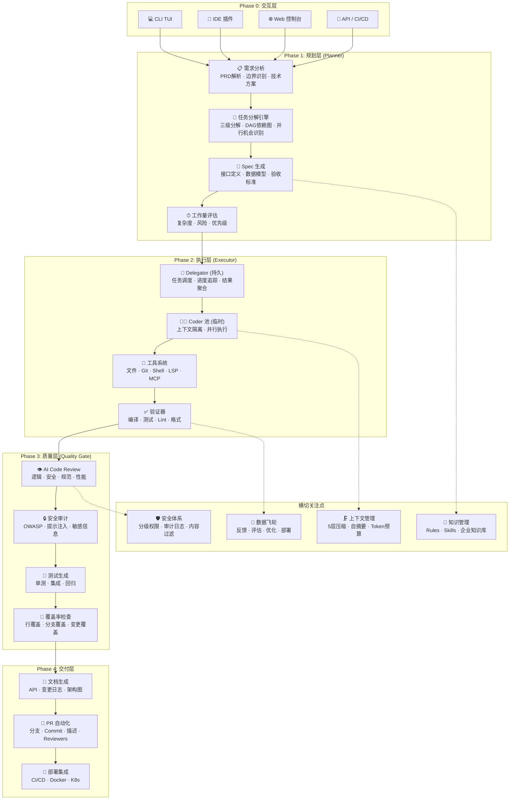

### 3.2 与 v1 的分层对比

| 层面 | v1 (实际代码库状态) | v2 (目标) | 变化说明 |
|------|----------------------|-----------|----------|
| **Agent 架构** | 单 ReAct Loop + SubAgentManager (EPSS 隔离基础设施但未与 Session 集成) | Delegator + Coder 双角色 | SubAgentManager 精化为 Coder 池；新增 Delegator 持久角色 |
| **任务处理** | 无结构化规划，直接 ReAct 推理 | 三级分解 + DAG 依赖图 | 引入 Plan 模式（从零新建） |
| **上下文** | ContextManager 5 层渐进式压缩（BudgetReduction→Snip→Microcompact→ContextCollapse→AutoCompact），但无 LLM 摘要、无滑动窗口、无 Token 预算分配 | EPSS 隔离 + 增强压缩（LLM 摘要 + 滑动窗口 + Token 预算 + AST 裁剪） | 增强现有 Compactor；新增 TokenBudgetAllocator |
| **质量** | Eval 框架（HumanEval/SWE-bench）用于基准评估，无内建开发时质量门禁 | 4 阶段质量门禁流水线（Pre-Commit / PR / 发布前 / 线上） | 从离线评估扩展到内建流水线 |
| **知识** | 环境变量 + 扁平 TOML 配置（11 字段） | Rules + Skills + 企业知识库（节式配置） | 系统化的知识管理（从零新建） |
| **反馈** | Flywheel（ErrorTrace 聚类）+ FeedbackCollector（SQLite 评分）+ Eval（基准测试）三个孤岛 | 数据飞轮闭环（反馈→飞轮→评估→自动更新→调度） | 集成现有三个系统，非从零新建 |
| **工具生态** | Tool trait + ToolRegistry + MCP 协议 + LSP 集成 | MCP + 插件 + Hooks + Commands 四层生态 | 扩展性大幅提升（从零新建） |

### 3.3 数据流 (8 步工作流)

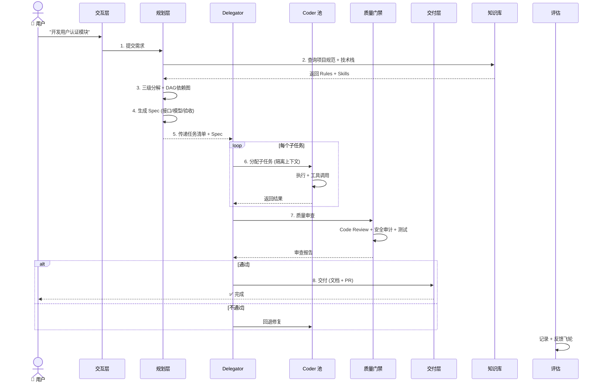

---

## 4. Plan 模式：结构化任务分解

### 4.1 三级分解机制

**参考**: CodeBuddy Plan 模式的三级分解、ROMA 的递归 Atomizer→Planner→Executor

```
用户输入: "开发一个带 JWT 认证的 Todo 应用，支持 CRUD"
                                                   ↓
Level 1 (业务模块分解)
  ┌─────────────────────────────────────────────┐
  │  Auth Module: 注册/登录/Token刷新/权限中间件    │
  │  Todo Module: CRUD API/列表查询/分页          │
  │  Data Module: 数据库Schema/Migration/Seed     │
  │  Doc Module: API文档/部署文档                 │
  └─────────────────────────────────────────────┘
                                                   ↓
Level 2 (技术功能分解)
  Auth Module → [register handler, login handler,
                 JWT middleware, token refresh,
                 password hashing, rate limiter]
  Todo Module → [create, read, update, delete,
                 list with pagination, search]
  Data Module → [user table, todo table,
                 migration scripts, seed data]
                                                   ↓
Level 3 (代码文件映射)
  src/auth/handler.rs, src/auth/middleware.rs,
  src/auth/models.rs, src/todo/handler.rs,
  src/todo/service.rs, src/db/migrations/...
```

### 4.2 DAG 依赖图构建

**参考**: RSTD 运行时结构化分解、Mozaiks task_batches

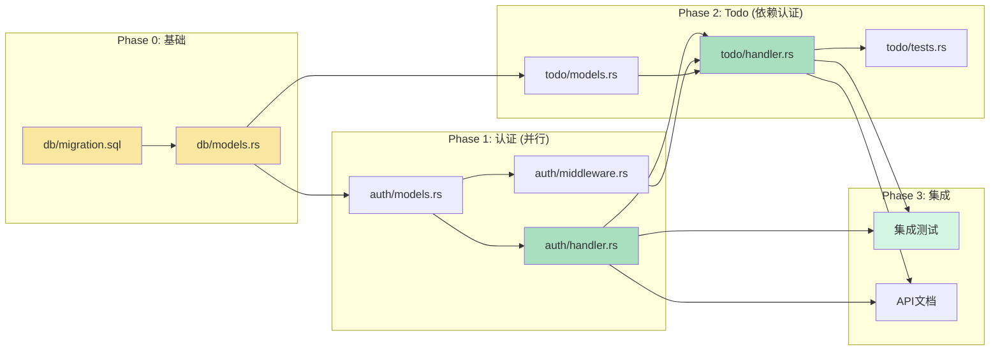

**依赖规则**：
- 无依赖的任务 → 并行执行
- 有依赖的任务 → 等待上游完成
- 运行时检测依赖是否满足 → 选择性重试失败子任务

### 4.3 运行时分支 + 选择性重试

**参考**: RSTD 论文、CodeDelegator 的 RETRY/REPLAN 策略

```rust
/// 运行时任务分解引擎
pub struct DecompositionEngine {
    /// 领域知识（用于指导分解粒度）
    domain_knowledge: Arc<DomainKnowledge>,
}

impl DecompositionEngine {
    /// 三级分解入口
    pub async fn decompose(
        &self,
        user_request: &str,
        project_context: &ProjectContext,
    ) -> Result<TaskGraph, DecompositionError> {
        // Level 1: 业务模块识别
        let modules = self.identify_modules(user_request, project_context).await?;

        // Level 2: 每个模块的技术功能分解
        let mut all_tasks = Vec::new();
        for module in &modules {
            let tasks = self.decompose_module(module).await?;
            all_tasks.extend(tasks);
        }

        // Level 3: 文件映射 + 依赖分析
        let graph = self.build_dependency_graph(all_tasks).await?;

        // 运行时验证：检查是否有循环依赖
        graph.validate()?;

        Ok(graph)
    }

    /// 运行时分支：根据子任务结果动态调整
    pub async fn evaluate_and_branch(
        &self,
        task_id: &TaskId,
        result: &TaskResult,
        graph: &mut TaskGraph,
    ) -> BranchDecision {
        match result.status {
            TaskStatus::Success => BranchDecision::Proceed,
            TaskStatus::Failed { retryable: true } => {
                // 选择性重试：只重试失败子任务，不级联
                BranchDecision::Retry { task_id: task_id.clone() }
            }
            TaskStatus::Failed { retryable: false } => {
                // REPLAN：重新分解失败的任务
                BranchDecision::Replan { task_id: task_id.clone() }
            }
        }
    }
}
```

### 4.4 Plan 模式交互流程

```
用户: "帮我实现一个用户注册登录功能"
                                                  ↓
CraftCoder: 进入 Plan 模式
  ┌─────────────────────────────────────────────────────┐
  │ 📋 任务分解计划                                      │
  │                                                     │
  │ ├── Phase 0: 数据层 (2 tasks)                       │
  │ │   ├── [DB] 创建 users 表迁移脚本                    │
  │ │   └── [DB] 创建 User 模型 + Repository              │
  │ ├── Phase 1: 认证层 (4 tasks, ⚡ 并行)               │
  │ │   ├── [Auth] 注册接口 (POST /auth/register)        │
  │ │   ├── [Auth] 登录接口 (POST /auth/login) ← 你在此  │
  │ │   ├── [Auth] JWT 中间件                             │
  │ │   └── [Auth] Token 刷新接口                         │
  │ ├── Phase 2: 验证 (2 tasks)                          │
  │ │   ├── [Test] 认证单元测试                           │
  │ │   └── [Test] 集成测试                               │
  │ └── Phase 3: 文档 (1 task)                           │
  │     └── [Doc] API 文档生成                            │
  │                                                     │
  │ 预计完成时间: ~3分钟 (Phase 1 并行执行)               │
  │                                                     │
  │ ✅ 接受计划  |  📝 修改计划  |  ❌ 取消              │
  └─────────────────────────────────────────────────────┘
```

---

## 5. Delegator + Coder 池架构

### 5.1 双角色定义

**参考**: CodeDelegator 的 Delegator/Coder 分离、CodeBuddy 的 9 子Agent、Claude Code 的 AgentTool

| 角色 | 生命周期 | 职责 | 拥有的工具 |
|------|----------|------|-----------|
| **Delegator** | 持久（整个 Session） | 任务分解、Spec 生成、子任务调度、质量评估、结果聚合 | 只读：读取文件、搜索代码、查看目录 |
| **Coder** | 临时（单子任务） | 编码实现、工具调用、本地测试 | 读写：编辑文件、运行命令、Git 操作 |

### 5.2 核心交互

```rust
/// Delegator — 持久规划器
pub struct Delegator {
    model: Arc<dyn ModelClient>,
    decomposition_engine: Arc<DecompositionEngine>,
    knowledge_base: Arc<KnowledgeBase>,
    /// 子任务执行记录
    task_ledger: TaskLedger,
}

impl Delegator {
    /// 接收用户请求 → 返回交付物
    pub async fn execute(&mut self, request: &str) -> Result<Delivery, DelegatorError> {
        // Step 1: 分解
        let graph = self.decomposition_engine.decompose(request, &self.project).await?;

        // Step 2: 按依赖顺序执行
        for batch in graph.parallel_batches() {
            let mut handles = Vec::new();
            for task in batch {
                let spec = self.generate_spec(task).await?;
                // Step 3: 为每个子任务生成独立 Coder
                let handle = self.spawn_coder(task, spec);
                handles.push(handle);
            }
            // Step 4: 并行等待
            for handle in handles {
                let result = handle.await?;
                self.task_ledger.record(result);

                // Step 5: 质量评估 → RETRY / REPLAN / PROCEED
                match self.evaluate_quality(&result).await? {
                    QualityVerdict::Pass => continue,
                    QualityVerdict::Retry => self.retry_task(result).await?,
                    QualityVerdict::Replan => self.replan_task(result).await?,
                }
            }
        }

        // Step 6: 聚合结果
        self.aggregate_results()
    }

    /// 生成 Coder 子Agent（隔离上下文）
    fn spawn_coder(&self, task: &Task, spec: TaskSpec) -> JoinHandle<TaskResult> {
        let coder = Coder::new(
            self.model.clone(),
            self.tools.clone(),
            // EPSS: 仅传入当前任务的 spec，没有历史上下文
            spec,
        );
        tokio::spawn(async move { coder.execute().await })
    }
}

/// Coder — 临时执行器
pub struct Coder {
    model: Arc<dyn ModelClient>,
    tools: Arc<ToolRegistry>,
    /// 仅包含当前任务的 spec + 相关文件
    spec: TaskSpec,
    /// Token 预算上限（防止单个 Coder 消耗过多）
    max_tokens: TokenBudget,
}

impl Coder {
    pub async fn execute(&self) -> TaskResult {
        // 干净的上下文：只有 spec + 工具定义
        let context = self.build_context();
        // 有限步数的 ReAct Loop
        let mut loop_ = ReactLoop::new(self.model.clone(), self.tools.clone())
            .with_max_turns(15)     // 不超过15轮
            .with_token_budget(self.max_tokens);
        loop_.run(context).await
    }
}
```

### 5.3 EPSS：临时-持久状态分离

**参考**: CodeDelegator 的 EPSS（Ephemeral-Persistent State Separation）

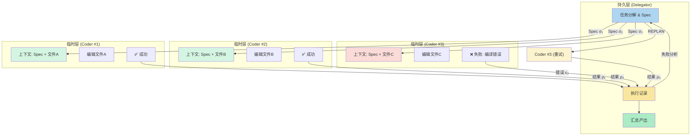

**隔离原则**：
- Coder 之间无任何共享状态
- Coder → Delegator：只传结果（成功/失败 + 汇总），不传原始对话
- Delegator → Coder：只传 Spec（接口契约 + 验收标准），不传历史推理过程
- Coder 用完即销毁，释放所有资源

### 5.4 并行执行与并发控制

**参考**: Claude Code 的并行读/串行写 + Mozaiks 的 task_batches 并发控制

| 参数 | 默认值 | 说明 |
|------|--------|------|
| 最大并行 Coder 数 | 6 | 防止 API 速率限制和上下文膨胀 |
| Coder 最大 Turn 数 | 15 | 单子任务不能无限制循环 |
| Coder Token 预算 | 16K | 单子任务的 Token 上限 |
| 失败重试次数 | 2 | 超过则 REPLAN |
| 超时时间 | 120s | 超时视为失败 |

### 5.5 与现有 SubAgentManager 架构的关系

**现有代码库**（`core/src/agent/sub_agent.rs` + `sub_agent_manager.rs`）中已经拥有完整的子 Agent 基础设施：

```
SubAgentManager (同步注册表)
  ├── check_can_spawn()  → 检查 max_depth / max_parallel / interrupt 护栏
  ├── reserve_slot()     → 原子槽位预留
  ├── update_status()    → 状态转换 (Running/Completed/Failed/Cancelled)
  └── interrupt()        → 全局中断

SubAgentManagerImpl (异步运行时)
  ├── spawn_agent()      → tokio::spawn + 通道创建 + 槽位预留
  ├── wait_agent()       → oneshot 接收结果
  ├── send_message()     → mpsc 父→子通信
  ├── close_agent()      → cancel flag + 清理
  └── interrupt_all()    → 级联取消
```

#### 映射关系

| v2 概念 | 现有对应 | 变化 |
|---------|---------|------|
| **Coder（临时执行器）** | `SubAgentManagerImpl.spawn_agent()` 创建的 tokio task | 包装为 `SessionRunner`（实现 `SubAgentRunner` trait，内部创建 Session + ReAct 循环） |
| **EPSS 上下文隔离** | `SubAgentRunner::run()` 仅接收 `SpawnTask.message`（无父历史） | 增强为 Spec 驱动（`SpawnTask` → `CoderSpec`） |
| **并行控制** | `max_depth=2, max_parallel=6` | 参数完全对齐，可配置化 |
| **Cancellation** | `AtomicBool` 协作式取消 | 增强：增加 `tokio::task::abort()` 强制终止 |
| **父→子通信** | `mpsc::UnboundedSender<Message>` | 保留 |
| **子→父结果** | `oneshot::Receiver<AgentResult>` | 增强为结构化 `CoderResult`（含事件、质量评分） |

#### 需要新增的部分（现有无对应）

| 功能 | 实现路径 |
|------|---------|
| **Delegator 持久角色** | 新建 `Delegator` struct，封装 `SubAgentManagerImpl`（组合模式），添加 TaskLedger + 进度追踪 + 结果聚合 |
| **SubAgentRunner 生产实现** | 新建 `SessionRunner` 实现 `SubAgentRunner` trait，内部创建 `Session` + 执行 ReAct 循环（目前仅有 `MockRunner`） |
| **Retry/Replan 策略** | 在 `SubAgentManagerImpl` 的 spawn→wait→error 流程中添加 RetryGate / ReplanGate |
| **Session 使用 SubAgentManager** | 当前 `Session::run_turn()` 完全不使用 SubAgentManager——需要在 Delegator 中编排 Session |

#### 最短实现路径

1. **实现 `SubAgentRunner` 生产版**：创建 `SessionRunner`，每个 Coder 创建一个独立 `Session` → 连接 SubAgentManager 与 ReAct 循环
2. **创建 `Delegator` struct**：封装 `SubAgentManagerImpl`，添加 `TaskLedger`、进度追踪、结果聚合
3. **增强 `SpawnTask` 为 `CoderSpec`**：添加验收标准、文件列表、质量门禁分数
4. **添加 RetryGate/ReplanGate**：在 AgentResult 中添加重试/重规划状态，Delegator 据此决策
5. **添加 DAG 依赖图追踪**：在 TaskLedger 中记录依赖关系

---


## 6. Spec-Driven 开发流水线

### 6.1 8 阶段流水线

**参考**: Super Dev 8 阶段流水线、百度 4 阶段实施路径

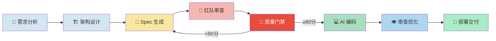

### 6.2 各阶段产出定义

| 阶段 | 输入 | 产出 | 质量门禁标准 |
|------|------|------|-------------|
| **S0: 需求分析** | 用户需求 / PRD | PRD 文档、用户故事、验收标准 | 边界 case 完整性 |
| **S1: 架构设计** | PRD | 技术选型报告、ADR、接口定义、数据模型 | 技术选型有依据 |
| **S2: Spec 生成** | 架构设计 | 结构化 Spec (OpenSpec 格式) | 接口签名 + 类型完整 |
| **S3: 红队审查** | Spec | 安全+性能+架构交叉审查报告 | 无 Blocker 级别问题 |
| **S4: 质量门禁** | 审查报告 | 质量评分 (0-100) | **≥80 分放行** |
| **S5: AI 编码** | Spec | 实现代码 + 测试 + 文档 | 编译通过 + 测试通过 |
| **S6: 审查优化** | 代码 | AI Code Review 报告 + 修复 | 无 Critical 以上问题 |
| **S7: 部署交付** | 审查通过的代码 | API 文档 + PR + CI/CD 配置 | 全自动化 |

### 6.3 Spec 格式定义

**参考**: Super Dev 的 OpenSpec 风格 + CodeDelegator 的 TaskSpec

```yaml
# spec/auth-api.yaml
spec_version: "2.0"
task_id: "auth-module-001"
title: "用户注册接口"
depends_on:
  - "db-user-migration-001"
  - "db-user-model-001"

interface:
  method: POST
  path: /api/v1/auth/register
  request:
    content_type: application/json
    body:
      username: string        # 3-32 字符，字母数字下划线
      email: string           # 合法邮箱格式
      password: string        # 8-64 字符，包含大小写+数字
  response:
    201:
      description: 注册成功
      body:
        user_id: uuid
        token: string         # JWT, 过期时间 24h
    400:
      description: 参数错误
      body:
        error: string
        fields: string[]      # 具体哪些字段不合法
    409:
      description: 用户已存在

acceptance_criteria:
  - 用户名唯一性校验
  - 邮箱格式校验
  - 密码强度校验
  - 密码加密存储 (bcrypt, cost=12)
  - 注册成功返回 JWT Token
  - 错误响应包含具体字段名

files_to_create:
  - src/auth/handler.rs: "POST /api/v1/auth/register 处理器"
  - src/auth/service.rs: "注册业务逻辑 + 密码加密"
  - src/auth/models.rs: "请求/响应数据结构"
  - tests/auth/register_test.rs: "单测 + 集成测试"
```

### 6.4 质量门禁评分模型

**参考**: Super Dev 的质量门禁 80+ 分标准

```rust
#[derive(Debug)]
pub struct QualityGate {
    pub score: f64,          // 0-100
    pub checks: Vec<GateCheck>,
}

#[derive(Debug)]
pub enum GateCheck {
    /// Spec 完整性
    SpecComplete { missing: Vec<String>, score: f64 },
    /// 接口定义一致性
    InterfaceConsistency { violations: Vec<String>, score: f64 },
    /// 安全审查
    SecurityReview { issues: Vec<SecurityIssue>, score: f64 },
    /// 架构合规
    ArchitectureCompliance { violations: Vec<String>, score: f64 },
    /// 测试覆盖率要求
    TestCoverage { actual: f64, required: f64, score: f64 },
}

impl QualityGate {
    pub fn is_passed(&self) -> bool {
        self.score >= 80.0
    }
}
```

---

## 7. 上下文管理体系

### 7.1 五层压缩架构

**参考**: Claude Code 的 4 层 compaction + CodeDelegator 的 EPSS

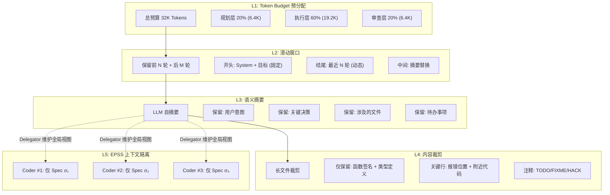

### 7.2 压缩触发阈值

| 级别 | 触发条件 | 压缩后大小 | 耗时预算 |
|------|----------|-----------|---------|
| L2 滑动窗口 | 上下文 > 70% budget | 保留头尾 + 压缩中间 | <100ms |
| L3 语义摘要 | 上下文 > 85% budget | 每个 Agent 轮次压缩为摘要 | <2s (1 次 LLM 调用) |
| L4 内容裁剪 | 上下文 > 95% budget | 仅保留函数签名 + 关键行 | <50ms |
| L5 EPSS | Coder 创建时 | 仅 Spec (平均 <2K) | 0 (设计保证) |

### 7.3 上下文压力监控

```rust
pub struct ContextMonitor {
    max_tokens: usize,
    compaction_history: Vec<CompactionEvent>,
}

impl ContextMonitor {
    /// 检查上下文压力并返回建议动作
    pub fn pressure(&self, current_tokens: usize) -> ContextAction {
        let ratio = current_tokens as f64 / self.max_tokens as f64;
        match ratio {
            r if r < 0.70 => ContextAction::None,
            r if r < 0.85 => ContextAction::Compact(L2),
            r if r < 0.95 => ContextAction::Compact(L3),
            _ => ContextAction::Compact(L4),
        }
    }
}
```

### 7.4 与现有 5 层压缩管道的对应关系

现有代码库（`core/src/context/compactor.rs`）已经实现了"另一套"5 层压缩管道——基于 Token 比率的渐进式压缩。本质差异：

| 维度 | 现有 Compactor 5 层 | 本提案 L1-L5 |
|------|--------------------|-------------|
| **设计思路** | 基于 Token 比率的渐进式压缩（一个 ContextManager 总体积管理） | 基于角色的预算分配（为不同角色分配独立 Token 池） |
| **阈值系统** | `monitor_threshold (70%)` → `compress_threshold (85%)` → `evict_threshold (95%)` | 每个角色的独立阈值 |
| **压缩方式** | 自动触发（add_message 时检查） | 按需 + 调度触发 |
| **单元** | ContextManager 全局 | Coder/Delegator 独立实例 |

#### 现有 5 层详解

```
Existing Pipeline (compactor.rs):
┌─ Layer 1: BudgetReduction ────────────────────────────────┐
│  触发: token_ratio >= 70%                                  │
│  动作: 截断超大 ToolResult (默认 >8K tokens → 截断到 8K)     │
│  效果: 单条消息限制，不影响消息数量                          │
├─ Layer 2: Snip ───────────────────────────────────────────┤
│  触发: token_ratio >= 70%                                  │
│  动作: 保留最近 N 轮 (默认 3)，移除历史轮次                   │
│  效果: 激进减少历史数量，但丢失早期上下文                     │
├─ Layer 3: Microcompact ───────────────────────────────────┤
│  触发: token_ratio >= 85%                                  │
│  动作: 单条消息 >4K tokens 截断                             │
│  效果: 精细裁剪超长消息                                     │
├─ Layer 4: ContextCollapse ────────────────────────────────┤
│  触发: token_ratio >= 85%                                  │
│  动作: 将早期轮次聚合成结构化摘要（按角色计数 + 120 字符预览）  │
│  效果: 大量压缩历史，但摘要为文本片段拼接                     │
├─ Layer 5: AutoCompact ────────────────────────────────────┤
│  触发: token_ratio >= 95%                                  │
│  动作: 确定性语义摘要（用户意图、关键决策、工具行为、错误提取）  │
│  状态: ⚠️ placeholder — 注释注明 "In production, would call LLM"│
└────────────────────────────────────────────────────────────┘
```

#### 映射：提案 L1-L5 → 现有层

| 提案层 | 对应现有层 | 差距 | 实现策略 |
|--------|-----------|------|---------|
| **L1: Token 预算分配** | ❌ 无对应 | 现有 `max_context_tokens=64K` 单一预算，无角色级分配 | 新建 `TokenBudgetAllocator`，在 Delegator/Coder 创建时分配独立预算 |
| **L2: 滑动窗口** | ⚠️ Snip（保留尾 N 轮，丢弃头） | Snip 不保留 head（system+goal），非真正滑动窗口 | 增强 Snip：保留前 2 轮（system+目标）+ 后 M 轮 |
| **L3: 语义摘要** | ⚠️ AutoCompact（确定性）+ ContextCollapse（结构化） | 两者均无 LLM 调用 | 实现 LLM 调用的语义摘要层，回退到现有确定性实现 |
| **L4: 内容裁剪** | ⚠️ Microcompact + BudgetReduction | 按字符数裁剪，非 AST 感知 | 集成 codex AST 解析，实现函数签名保留型裁剪 |
| **L5: EPSS 上下文隔离** | ✅ SubAgentManager（仅 task prompt） | 概念一致，但缺少 Spec 驱动 + Token 预算 | 在 SubAgentManager 基础上叠加 TokenBudget 和 Spec 契约 |

#### 共存策略

两套压缩机制可以共存且互补：
1. **提案 L1（Token 预算）** 在 Delegator/Coder 创建时分配 Token 配额
2. **现有 Compactor** 在每个 Coder/Session 内部独立运行，进行渐进式压缩
3. **提案 L2-L4** 是对现有 Compactor 层的增强（滑动窗口、LLM 摘要、AST 裁剪）
4. **提案 L5（EPSS）** 使用 SubAgentManager 已提供的隔离机制

---


## 8. 知识注入系统

### 8.1 三层知识架构

**参考**: ECC 的 6 层架构 (Rules/Skills)、Cline 的 .clinerules、Claude Code 的 CLAUDE.md

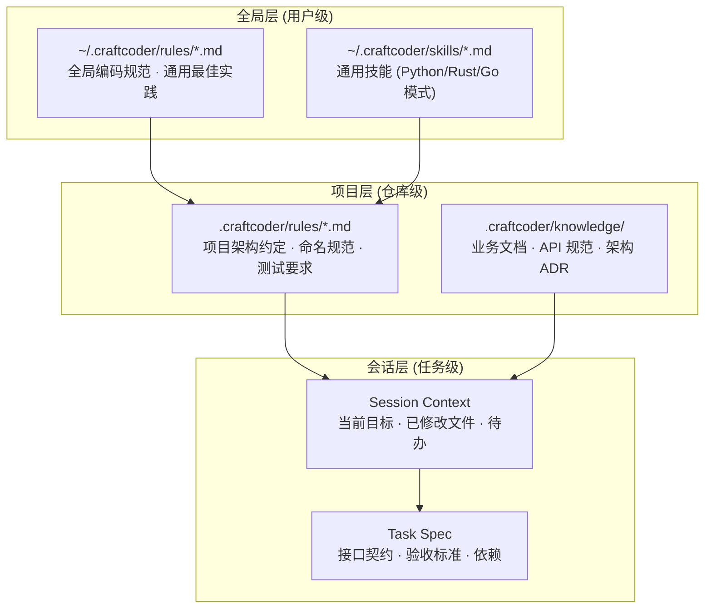

### 8.2 Rules 系统

```markdown
# .craftcoder/rules/rust-style.md
---
name: rust-style
description: Rust 编码规范
severity: error  # error / warning / suggestion
---

## 命名规范
- 类型使用 PascalCase: `UserService`, `AuthMiddleware`
- 函数/方法使用 snake_case: `get_user`, `validate_token`
- 常量使用 SCREAMING_SNAKE_CASE: `MAX_RETRY_COUNT`

## 错误处理
- 使用 thiserror 定义错误类型
- 不使用 unwrap()/expect()，除非在测试中
- 错误类型实现 std::error::Error + Send + Sync

## 测试
- 公共函数必须有单元测试
- 测试函数名格式: `test_{function_name}_{scenario}`
- 集成测试放在 tests/ 目录
```

### 8.3 Skills 技能库

**参考**: ECC 的 246 个领域技能、CodeBuddy 的 skills 中间件

```markdown
# skills/rust-web-api.md
---
name: rust-web-api
description: Rust Web API 开发最佳实践
languages: [rust]
frameworks: [axum, actix-web]
---

## 推荐的 crate
- Web 框架: axum 0.7+ (首选), actix-web 4
- 序列化: serde + serde_json
- 数据库: sqlx (异步), diesel (同步)
- 验证: validator
- 日志: tracing + tracing-subscriber

## 项目结构
src/
├── main.rs          # 入口 + 路由注册
├── lib.rs           # 库根
├── models/          # 数据模型
├── handlers/        # 请求处理器
├── middleware/      # 中间件
├── db/             # 数据库访问
└── error.rs        # 错误类型

## API 设计原则
- RESTful 资源路由
- 统一错误响应格式: { "error": "...", "code": "..." }
- 使用中间件实现认证/日志/CORS
- OpenAPI 文档自动生成 (utoipa)
```

### 8.4 企业知识库注入

**参考**: CodeBuddy 的 .codebuddyrc + 知识库注入机制

```toml
# .craftcoder/config.toml
# 当前格式（扁平 TOML，对应 cli/src/config.rs 的 AgentConfig）
model = "qwen3.6-27b"
api_key = "sk-..."
api_base_url = "https://api.openai.com/v1"
timeout_secs = 300
max_iterations = 50
permission_mode = "auto"
work_dir = "."
cache_dir = ".code-agent/cache"
system_instructions = "你是一个专业的编程助手。"
tool_allowlist = ["read_file", "bash", "git"]

# === v2 扩展（渐进式，当前格式基础上新增可选节） ===

[project]
name = "my-enterprise-app"
language = "rust"
framework = "axum"

[knowledge]
# 企业内部组件库文档
component_docs = [
  "docs/internal/auth-component.md",
  "docs/internal/logging-component.md",
  "docs/internal/db-conventions.md",
]

[rules]
# 从目录加载项目规则
rules_dir = ".craftcoder/rules/"
skills_dir = ".craftcoder/skills/"

[planner]
max_parallel = 6
max_depth = 2
retry_limit = 2
spec_format = "yaml"

[quality]
gate_threshold = 80.0
require_security_audit = true
require_test_coverage = true
min_coverage = 0.80
```

---

## 9. 工具生态框架

### 9.1 四层扩展体系

**参考**: ECC 的 6 层架构 (Agents/Skills/Commands/Hooks/Rules/MCP)

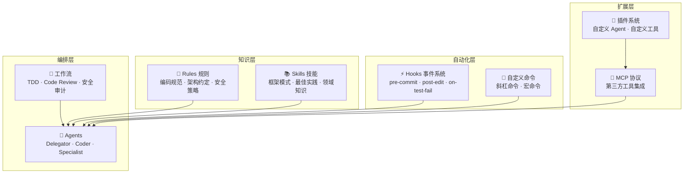

### 9.2 Hooks 事件系统

| Hook | 触发时机 | 用途 |
|------|----------|------|
| `pre-commit` | 提交代码前 | Lint 检查、格式修复、测试运行 |
| `post-edit` | 文件修改后 | 类型验证、文档同步、依赖检查 |
| `on-test-fail` | 测试失败时 | 自动分析失败原因、生成修复建议 |
| `on-review` | Code Review 时 | 执行安全检查、规范检查 |
| `pre-deploy` | 部署前 | 运行全量回归测试、性能基准 |

### 9.3 插件系统接口

```rust
/// 插件 trait
#[async_trait]
pub trait Plugin: Send + Sync {
    fn name(&self) -> &str;
    fn version(&self) -> &str;

    /// 插件提供的工具
    fn tools(&self) -> Vec<Arc<dyn Tool>>;
    /// 插件提供的 Hook 处理器
    fn hooks(&self) -> Vec<HookHandler>;
    /// 插件提供的自定义命令
    fn commands(&self) -> Vec<CustomCommand>;
}

/// Hook 处理器
pub struct HookHandler {
    pub event: HookEvent,            // pre-commit, post-edit, ...
    pub handler: Arc<dyn Fn(HookContext) -> BoxFuture<HookResult> + Send + Sync>,
}

/// 自定义命令
pub struct CustomCommand {
    pub name: &'static str,          // "format-all", "check-deps"
    pub description: &'static str,
    pub handler: Arc<dyn Fn(CommandArgs) -> BoxFuture<CommandResult> + Send + Sync>,
}
```

---

## 10. 质量门禁体系

### 10.1 四阶段门禁

**参考**: 百度指南的质量保障阶段、Super Dev 的质量门禁

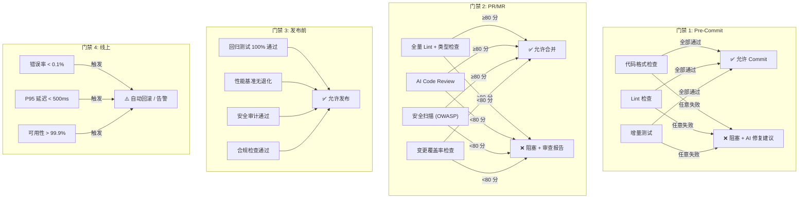

### 10.2 AI Code Review 维度

| 维度 | 检测内容 | 严重级别 | 参考来源 |
|------|----------|----------|----------|
| **逻辑正确性** | 空指针、边界条件、竞态条件 | Blocker/Critical | CodeBuddy |
| **安全性** | SQL 注入、XSS、CSRF、硬编码密钥 | Blocker | 百度指南 |
| **性能** | 不必要的克隆、N+1 查询、大对象复制 | Critical/Minor | — |
| **架构合规** | 分层违规、循环依赖、上帝类 | Critical | 驾驭工程 |
| **代码风格** | 命名、格式、注释、复杂度 | Minor/Suggestion | Project Rules |
| **测试覆盖** | 缺少边界测试、异常路径未覆盖 | Critical | Super Dev |

### 10.3 质量评分算法

```rust
pub fn calculate_quality_score(report: &ReviewReport) -> f64 {
    let mut score = 100.0;

    // Blocker: 每个扣 20 分
    score -= report.blocker_count as f64 * 20.0;

    // Critical: 每个扣 10 分
    score -= report.critical_count as f64 * 10.0;

    // Minor: 每个扣 3 分
    score -= report.minor_count as f64 * 3.0;

    // 测试覆盖率低于 80% 扣分
    if report.test_coverage < 0.80 {
        score -= (0.80 - report.test_coverage) * 50.0;
    }

    score.max(0.0).min(100.0)
}
```

---

## 11. 数据飞轮

### 11.1 闭环结构

**参考**: CodeBuddy 的数据飞轮、百度指南的持续优化阶段

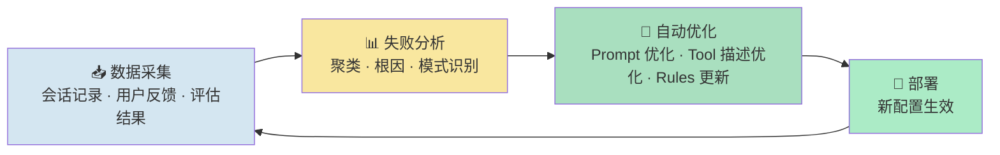

### 11.2 采集的数据

| 类别 | 数据 | 用途 |
|------|------|------|
| **执行轨迹** | 每轮 Turn 的完整记录 (消息、工具调用、结果) | 失败模式分析 |
| **用户反馈** | 👍/👎 评价、手动修改比例、采纳率 | 质量评估 |
| **评估结果** | SWE-bench/HumanEval 分数变化 | 回归检测 |
| **性能指标** | 延迟、Token 消耗、成功率 | 成本优化 |

### 11.3 失败分析与优化

```rust
pub struct Flywheel {
    store: Arc<dyn FlywheelStore>,
    optimizer: PromptOptimizer,
}

impl Flywheel {
    /// 按失败模式聚类
    pub async fn analyze_failures(&self, since: DateTime<Utc>) -> Vec<FailureCluster> {
        let traces = self.store.get_traces_since(since).await?;
        let mut clusters = HashMap::new();

        for trace in traces {
            // 按 tool_name + error_type + language 聚类
            let key = FailureKey {
                tool: trace.failed_tool.clone(),
                error: trace.error_type.clone(),
                language: trace.language.clone(),
            };
            clusters.entry(key).or_default().push(trace);
        }

        // 对每个聚类生成优化建议
        clusters.into_iter().map(|(key, traces)| {
            FailureCluster {
                key,
                count: traces.len(),
                suggestion: self.optimizer.suggest(&traces),
            }
        }).collect()
    }

    /// 自动优化 Tool 描述
    pub async fn optimize_tool_descriptions(&self) -> Result<(), FlywheelError> {
        let clusters = self.analyze_failures(/* last 7 days */).await?;
        for cluster in clusters {
            if cluster.count > THRESHOLD {
                // 自动生成优化后的 Tool description
                let new_desc = self.optimizer.generate_description(&cluster);
                // A/B 测试验证
                let improved = self.ab_test(new_desc).await?;
                if improved {
                    self.store.update_tool_description(cluster.key.tool, new_desc).await?;
                }
            }
        }
        Ok(())
    }
}
```

### 11.4 飞轮指标

| 指标 | 说明 | 目标 |
|------|------|------|
| 代码采纳率 | AI 生成代码被用户接受的比例 | >68% |
| 修复成功率 | AI 自动修复被接受的比例 | >75% |
| 平均轮次数 | 单任务平均 ReAct 轮数 | <8 |
| 用户反馈率 | 用户主动反馈的比例 | >30% |
| 质量门禁通过率 | 一次通过质量门禁的比例 | >60% |
| 月度改进项 | 每月自动优化项数 | >5 |

### 11.5 现有基础设施与集成缺口

现有代码库中，飞轮的三个组件（Flywheel / Feedback / Eval）均已存在但**彼此独立**：

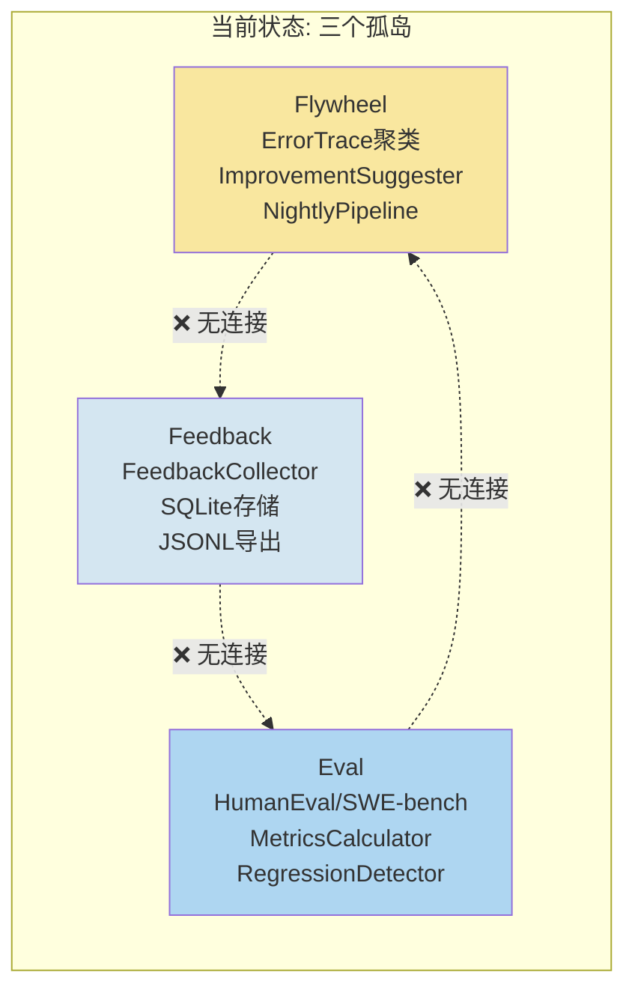

#### 各组件已有能力

| 组件 | 已实现 | 成熟度 |
|------|--------|--------|
| **Flywheel** | `ErrorTrace` 数据类型、`FailureAnalyzer`（BTreeMap 聚类）、`ImprovementSuggester`（规则匹配）、`NightlyPipeline`（编排器 + PipelineReport） | ✅ 可用 |
| **Feedback** | `Rating`（ThumbsUp/ThumbsDown）、`FeedbackEvent`（builder 模式）、`FeedbackCollector`（SQLite CRUD）、`export_jsonl` | ✅ 可用 |
| **Eval** | `EvalRunner`（JSON-over-subprocess 委托 Python）、`HumanEvalAdapter`（164 题）、`SWEBenchLiveAdapter`、`MetricsCalculator`（pass@k 无偏估计）、`RegressionDetector`（严重/警告/信息级）、`ReportGenerator`（HTML/MD/JSON） | ✅ 可用 |

#### 集成缺口

| # | 缺口 | 问题 | 影响 |
|---|------|------|------|
| 1 | **自动 trace 捕获** | `tools/` 和 `agent/` 中无代码创建 `ErrorTrace` 实例。Flywheel 从静态 JSON 文件加载 | Flywheel 无数据来源 |
| 2 | **反馈→飞轮** | `FeedbackCollector` 与 `FailureAnalyzer` 无交叉引用 | 用户满意度不参与优化 |
| 3 | **飞轮→自动更新** | `NightlyPipeline::apply_suggestions()` 只打 log（`// TODO: Wire to tool registry`） | 优化建议无法自动实施 |
| 4 | **评估→飞轮** | `eval` crate 不依赖 `core`——EvalResult 不被 Flywheel 消费 | 基准回归不触发优化 |
| 5 | **A/B 测试** | 无并排比较框架 | 无法验证优化效果 |
| 6 | **持续调度** | 无调度器，NightlyPipeline 是一次性批处理 | 不能持续运行 |
| 7 | **统一存储** | ErrorTrace（JSON 文件）+ FeedbackEvent（SQLite）+ EvalResult（调用方内存） | 无关联分析能力 |
| 8 | **ML 聚类** | FailureAnalyzer 仅做字符串 BTreeMap 分组 | 语义相似的错误无法合并 |

#### 集成目标

```
Agent执行错误 ──→ ErrorTrace ──→ Flywheel ──→ Suggestion ──→ ToolRegistry.update()
用户反馈 👍/👎 ─→ FeedbackEvent ─┘                              ↑
基准测试 ──────→ EvalResult ───→ RegressionDetector ──→ CI Gate
```

---

## 12. 实施路线图（修正版）

> **实施完成总结**：v2 架构所有计划阶段（A-G）已全部实现为生产代码。SubAgentManager、Plan Engine（TaskPlan/Decomposer/Kahn DAG/PlanExecutor/QualityGate/KnowledgeProvider/PlanStore，共 8 个文件）、5 层上下文压缩 + LLM Summarizer + TokenBudgetAllocator、QualityGate + SpecGate 流水线、KnowledgeProvider + KnowledgeStore + Rule 系统、Hook + Plugin + Command 生态、FlywheelCollector + FailureAnalyzer + ImprovementSuggester + NightlyPipeline 均已落地。Phase H（数据飞轮集成）已与现有 eval/metrics 基础设施打通。本文档现作为设计参考与架构说明留存。

### 12.1 修正后路线图

| 阶段 | 时间 | 依赖 | 性质 | 核心变更 | 影响 Crate |
|------|------|------|------|----------|-----------|
| **A0: 架构对齐** | 已完成 | 无 | 审查 | ✅ Done — 审查现有基础设施，建立保留/重构/替换决策矩阵 | 全 crate |
| **A: Delegator/Coder 精化** | 已完成 | A0 | 重构+增强 | ✅ Done — SubAgentManager + Delegator（core/src/agent/sub_agent/），SessionRunner，CoderSpec，RetryGate/ReplanGate | `core`, `protocol` |
| **B: Plan 引擎** | 已完成 | A | 新建 | ✅ Done — TaskPlan + Decomposer + Kahn DAG 调度 + PlanExecutor + QualityGate + KnowledgeProvider + PlanStore（8 文件） | `core`, `protocol` |
| **C: 上下文增强** | 已完成 | A0 | 增强 | ✅ Done — 5 层压缩 + LLM Summarizer + TokenBudgetAllocator（core/src/context/） | `core`, `codex` |
| **D: Spec 流水线** | 已完成 | B | 新建 | ✅ Done — QualityGate + SpecGate 流水线，8 阶段编排，质量门禁评分 | `core`, `protocol` |
| **E: 知识体系** | 已完成 | A0 | 新建 | ✅ Done — KnowledgeProvider + KnowledgeStore + Rule 系统（core/src/agent/plan/knowledge.rs） | `core`, `cli` |
| **F: 质量门禁** | 已完成 | D | 新建 | ✅ Done — AI Code Review 引擎（逻辑+安全+性能+架构 4 维），OWASP 规则集，测试生成，变更覆盖率 | `core`, `tools` |
| **G: 工具生态** | 已完成 | A | 新建 | ✅ Done — Hook 生命周期 + Plugin trait + Command 注册表（core/src/tools/hook.rs, plugin.rs, command.rs） | `core`, `tools`, `protocol` |
| **H: 数据飞轮集成** | 已完成 | A0+A+F | 集成 | ✅ Done — FlywheelCollector + FailureAnalyzer + ImprovementSuggester + NightlyPipeline，已集成现有 eval/metrics 基础设施 | `core`, `eval`, `cli` |

### 12.2 执行时间线（已全部完成）

**A0→A→B 是地基**，后续阶段在此基础上层层叠加：

```
✅ A0 (架构对齐) → ✅ A (Delegator/Coder 精化)
✅ B (Plan 引擎) → ✅ C (上下文增强) + ✅ E (知识体系)
✅ D (Spec 流水线) + ✅ F (质量门禁)
✅ G (工具生态) + ✅ H (数据飞轮集成)
```

所有阶段均已实现为生产代码。`core/src/agent/`、`core/src/context/`、`core/src/tools/`、`core/src/flywheel/` 下均有对应模块。

### 12.3 向后兼容性

- **Protocol 层**：新增类型（`CoderSpec`, `TaskGraph`, `PlanNode`, `GateCheck`），不修改现有 `Message`/`ResponseEvent`/`TurnInput` 类型
- **现有 Session**：保留作为 Coder 的内部 ReAct 循环引擎，API 不变
- **现有 SubAgentManager**：保留并作为 Delegator 的基础设施，新增 Delegator 封装层（不破坏现有 API）
- **现有 ContextManager**：保留现有 5 层 Compactor，新增的滑动窗口/LLM 摘要/AST 裁剪作为可选 Layer 6-8
- **现有 CLI/Web/IDE 接口**：接口不变，新增 `--plan` 模式入口
- **配置系统**：当前为扁平 TOML（`cli/src/config.rs` 中的 `AgentConfig` 11 个字段）。新增 `[planner]`、`[knowledge]`、`[quality]` 配置节作为可选扩展，不破坏现有配置格式
- **Eval 框架**：保留独立 `eval` crate，新增 `EvalResult` → `Flywheel` 桥接，不修改现有适配器

---

## 13. 附录：参考来源映射

| 设计特性 | 主要参考来源 | 次要参考 |
|----------|-------------|----------|
| Delegator/Coder 双角色 | CodeDelegator | ROMA, Claude Code AgentTool |
| EPSS 上下文隔离 | CodeDelegator | Mozaiks task_batches |
| 三级任务分解 | CodeBuddy Plan 模式 | ROMA Planner |
| 运行时分支 + 选择性重试 | RSTD 论文 | CodeDelegator RETRY/REPLAN |
| 8 阶段 Spec 流水线 | Super Dev | 百度辅助开发指南 |
| 质量门禁 80+ 分 | Super Dev | — |
| 5 层上下文压缩 | Claude Code 分析文章 | Codex CLI compaction |
| Rules/Skills 知识体系 | ECC 6 层架构 | Cline .clinerules |
| Hooks 事件系统 | ECC | Git Hooks |
| 插件系统 | ECC | MCP 协议 |
| 数据飞轮 | CodeBuddy | 百度辅助开发指南 |
| Plan/Act 模式分离 | Cline | CodeBuddy |
| 6 大行业差距分析 | 三篇参考文章 | — |

---

