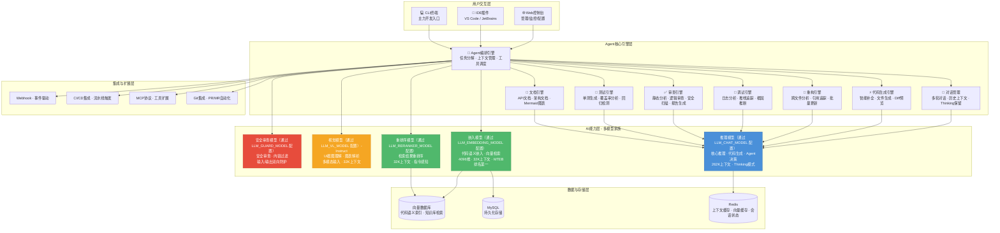
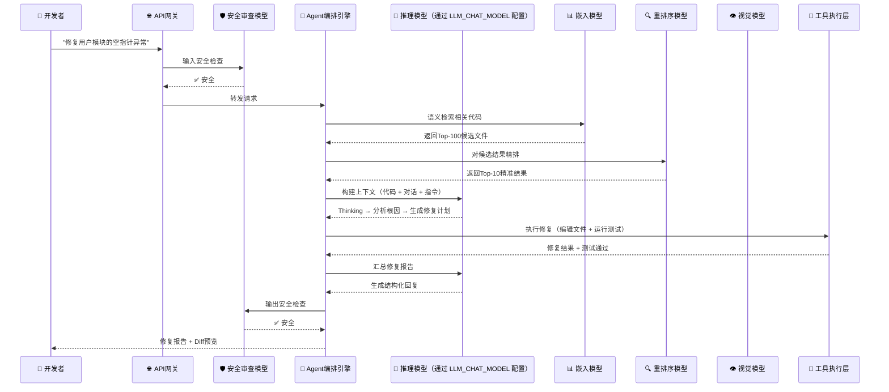
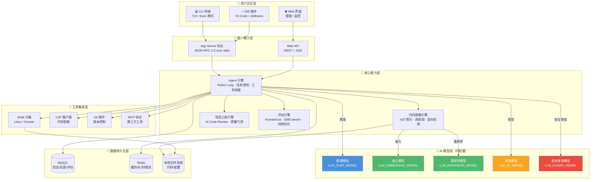
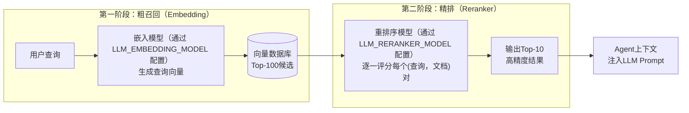
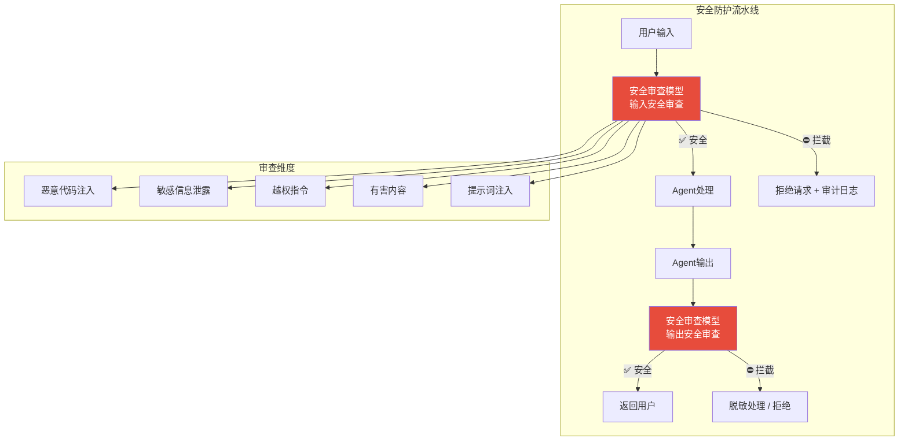
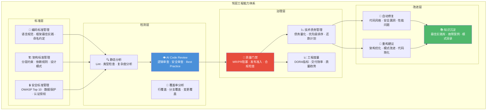
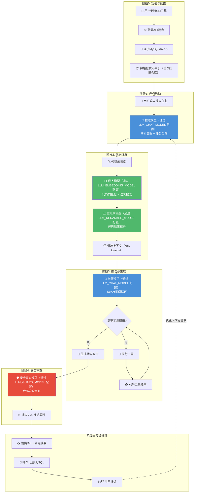
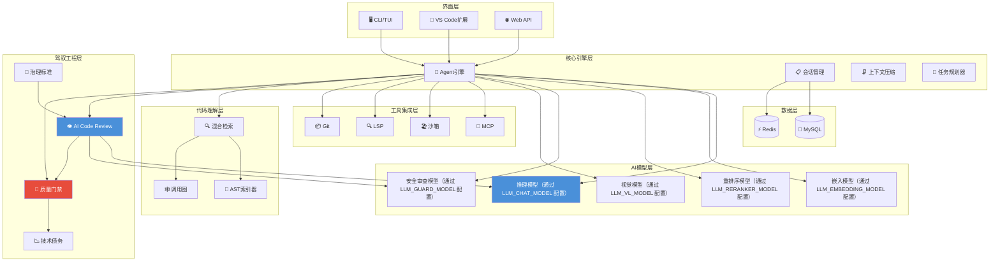
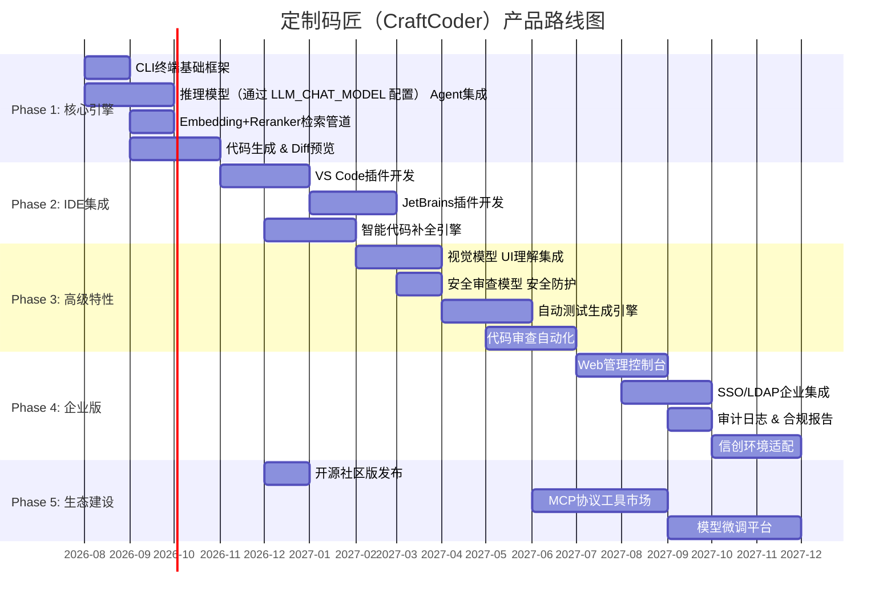

# 定制码匠（CraftCoder）产品设计文档

> **版本**: v1.0  
> **日期**: 2026-07-10  
> **状态**: 正式版  
> **核心模型栈**: 多模型协同 — 各模型通过环境变量 `LLM_*` 配置，支持任何 OpenAI 兼容 API

---

## 目录

1. [产品愿景与定位](#1-产品愿景与定位)
2. [用户画像与场景分析](#2-用户画像与场景分析)
3. [功能架构](#3-功能架构)
4. [AI能力设计——多模型家族协同](#4-ai能力设计qwen3模型家族协同)
5. [用户体验设计](#5-用户体验设计)
6. [驾驭工程体系](#6-驾驭工程体系)
7. [业务架构图](#7-业务架构图)
8. [用户交互边界定义](#8-用户交互边界定义)
9. [产品路线图](#9-产品路线图)

---

## 1. 产品愿景与定位

### 1.1 愿景

打造**面向中国开发者的下一代AI编程智能体**——基于开源模型家族，实现完全私有化部署、自主可控的智能研发工具。让每一行代码都有AI深度参与，让每一个研发团队都能拥有属于自己的AI编程伙伴。

### 1.2 核心定位

| 维度 | 定位描述 |
|------|----------|
| **目标市场** | 中国开发者、企业研发团队、信创环境（党政军、国企、金融） |
| **技术路线** | 基于开源模型家族，100%私有化部署，零数据外泄 |
| **产品形态** | CLI终端智能体 + IDE插件（VS Code / JetBrains）+ Web管理控制台 |
| **对标竞品** | Cursor、Claude Code、GitHub Copilot、OpenAI Codex |
| **核心差异化** | 完全本地化部署、自主可控、国产模型适配、信创合规 |

### 1.3 战略意义

1. **数据主权**：企业核心代码不离开内网，满足《数据安全法》《个人信息保护法》合规要求。
2. **供应链安全**：基于Apache 2.0开源的大语言模型，无闭源模型依赖风险。
3. **成本可控**：一次部署，按需扩容，无按Token计费的持续成本。
4. **定制化能力**：支持基于企业私有代码库进行模型微调，深度适配业务领域。

### 1.4 产品名称

- **中文名**：定制码匠（取"匠"之意，寓意代码领域的能工巧匠）
- **英文代号**：CraftCoder
- **备选名**：星码（StarCode）、码策（CodeStrategy）

---

## 2. 用户画像与场景分析

### 2.1 核心用户画像

#### 画像A：一线开发者（占比约60%）

| 属性 | 描述 |
|------|------|
| **角色** | 前端/后端/全栈/移动端开发工程师 |
| **技术栈** | Java/Spring Boot、Python/Django、Go/Gin、Vue/React、TypeScript |
| **核心痛点** | 重复性编码耗时、跨文件重构困难、遗留代码理解成本高 |
| **AI使用习惯** | 日常使用Copilot/Cursor辅助编码，期望更深度的自动化 |
| **决策权** | 低——工具选择通常由技术Leader或公司统一规定 |

#### 画像B：技术Leader / 架构师（占比约20%）

| 属性 | 描述 |
|------|------|
| **角色** | 技术总监、架构师、Tech Lead |
| **技术栈** | 多技术栈管理，关注架构设计、代码审查、技术债务 |
| **核心痛点** | 代码审查耗时、架构决策缺乏全局视角、技术债务量化困难 |
| **AI使用习惯** | 使用Claude Code处理复杂任务，关注代码质量多于生成速度 |
| **决策权** | 高——团队AI工具采购的最终决策者 |

#### 画像C：企业IT / 运维管理者（占比约15%）

| 属性 | 描述 |
|------|------|
| **角色** | CTO、IT总监、信息安全负责人 |
| **技术栈** | 关注基础设施、安全合规、成本控制 |
| **核心痛点** | 海外AI工具数据出境风险、模型API成本不可控、合规审计困难 |
| **AI使用习惯** | 限制团队使用海外AI工具，正在寻找本地化替代方案 |
| **决策权** | 最高——拥有采购审批权，是"可私有化部署"的核心决策推动者 |

#### 画像D：信创环境开发者（占比约5%，高增长）

| 属性 | 描述 |
|------|------|
| **角色** | 政府/军工/国企IT部门开发人员 |
| **技术栈** | 国产操作系统（统信UOS/麒麟）+ 国产数据库 + 国产中间件 |
| **核心痛点** | 封闭网络环境无法使用云端AI工具，合规要求极为严格 |
| **AI使用习惯** | 几乎无AI编程工具可用，处于空白地带 |
| **决策权** | 无——由上级单位统一采购，但需求极度刚性 |

### 2.2 典型使用场景

#### 场景1：智能代码生成（高频场景）

```
开发者: "帮我写一个JWT认证中间件，支持Redis缓存Token黑名单"
Agent: [分析项目结构] → [查找现有认证逻辑] → [生成中间件代码] → [自动生成单元测试]
结果: 生成符合项目规范的完整中间件代码，包含错误处理、日志、测试用例
```

#### 场景2：跨文件重构（中频高价值场景）

```
开发者: "把UserService中的缓存逻辑抽取为独立的CacheService，所有调用方同步更新"
Agent: [扫描所有引用] → [抽取逻辑] → [更新12个调用方] → [运行全量测试确保无回归]
结果: 自动完成跨文件重构，零遗漏、零回归
```

#### 场景3：Bug排查与修复（中频高价值场景）

```
开发者: "生产环境订单接口偶发500错误，日志显示NullPointerException"
Agent: [分析堆栈] → [追踪代码路径] → [定位空值来源] → [提出修复方案+测试] → [创建PR]
结果: 从日志到PR全流程自动化
```

#### 场景4：代码审查辅助（日常场景）

```
Agent: [监听Git PR] → [静态分析] → [逻辑审查] → [安全扫描] → [生成审查报告]
结果: 自动生成结构化的代码审查报告，标注风险等级和建议
```

#### 场景5：遗留系统文档生成（低频高价值场景）

```
开发者: "为整个payment模块生成架构文档和API文档"
Agent: [解析模块代码] → [推断架构模式] → [生成Mermaid架构图] → [生成API文档]
结果: 一次性生成完整的模块文档
```

#### 场景6：UI截图转代码（创新场景）

```
开发者: [上传设计稿截图]
Agent: [视觉模型理解UI布局] → [识别组件层级] → [生成前端代码] → [预览渲染效果]
结果: 从截图到可运行代码的端到端转换
```

---

## 3. 功能架构

### 3.1 整体功能架构图



### 3.2 Agent工作流（典型请求处理流程）



### 3.3 模块职责详述

| 模块 | 核心功能 | 依赖模型 |
|------|----------|----------|
| **Agent编排引擎** | 任务理解与分解、工具调用决策、子任务并行调度、上下文窗口管理 | 推理模型（通过 LLM_CHAT_MODEL 配置） |
| **对话管理** | 多轮对话状态维护、历史Reasoning Trace保留（Thinking Preservation）、Token预算管理 | 推理模型（通过 LLM_CHAT_MODEL 配置） |
| **代码生成引擎** | 智能代码补全、文件级代码生成、Diff预览与逐行确认 | 推理模型（通过 LLM_CHAT_MODEL 配置） |
| **重构引擎** | LSP协议集成、跨文件引用追踪、批量重构计划生成与安全执行 | 推理模型（通过 LLM_CHAT_MODEL 配置） |
| **调试引擎** | 运行时错误捕获、堆栈分析、日志模式匹配、根因推断与修复方案生成 | 推理模型（通过 LLM_CHAT_MODEL 配置） |
| **审查引擎** | ESLint/Sonar集成、代码规范检查、安全漏洞扫描、审查报告生成 | 推理模型（通过 LLM_CHAT_MODEL 配置） |
| **测试引擎** | 测试用例自动生成、覆盖率缺口分析、Mock数据生成 | 推理模型（通过 LLM_CHAT_MODEL 配置） |
| **文档引擎** | 代码注释生成、API文档生成、Mermaid架构图自动绘制 | 推理模型（通过 LLM_CHAT_MODEL 配置） |

---

## 4. 产品架构图

### 4.1 系统总览架构



### 4.2 产品模块依赖关系

| 模块 | 上游依赖 | 下游提供 | 关键模型依赖 |
|------|---------|---------|-------------|
| **CLI/TUI** | 用户输入 | App Server | 无 |
| **IDE 插件** | 用户操作 | App Server | 无 |
| **Web API** | HTTP 请求 | SSE 事件流 | 无 |
| **Agent 引擎** | 用户任务 | 工具调用 | 推理模型 |
| **代码理解** | 代码库路径 | 检索结果 | 嵌入模型 + 重排序模型 |
| **驾驭工程** | 代码变更 | 审查报告 | 推理模型 + 安全审查模型 |
| **评估引擎** | Agent 输出 | 评测指标 | 推理模型 |
| **工具集成层** | Agent 请求 | 执行结果 | 无（调用本地工具） |

### 4.3 三种交互模式架构对比

| 维度 | CLI 模式 | IDE 插件模式 | Web 服务模式 |
|------|---------|-------------|-------------|
| **进程数** | 1（cli） | 2（cli + app-server） | 2+（app-server + web）|
| **数据库** | 可选 SQLite | MySQL + Redis | MySQL + Redis |
| **启动速度** | <100ms | <500ms | <5s |
| **适用场景** | 日常编码、CI/CD | 深度集成开发 | 团队协作、远程 |
| **网络要求** | 直连 LLM API | 直连 LLM API | 向后端转发 LLM |

---

## 5. AI能力设计——多模型家族协同

### 4.1 推理模型（通过 LLM_CHAT_MODEL 配置） — 核心推理与代码生成引擎

**模型概况**：

- 参数量：270亿（Dense架构，非MoE，部署简单）
- 架构：Hybrid Gated DeltaNet（64层，16个重复块，每块3个线性注意力 + 1个全注意力层）
- 上下文窗口：262,144 Tokens（原生支持）
- 最大输出：32,768 Tokens（可扩展至81,920）
- 许可证：Apache 2.0（完全开源，可商用）
- 关键能力：Agentic Coding、Thinking模式、Thinking Preservation、Function Calling

**核心基准测试成绩**：

| 基准测试 | 推理模型（通过 LLM_CHAT_MODEL 配置） | Claude 4.5 Opus | 业界参考值 |
|----------|-------------|-----------------|-------------------|
| SWE-bench Verified | **77.2%** | 80.9% | 76.2% |
| SWE-bench Pro | **53.5%** | 57.1% | 50.9% |
| Terminal-Bench 2.0 | **59.3%** | 59.3% | 52.5% |
| LiveCodeBench v6 | **83.9%** | 84.8% | 80.7% |
| GPQA Diamond | **87.8%** | 87.0% | 85.5% |
| C-Eval（中文知识） | **91.4%** | 92.2% | 90.5% |

**关键设计要点**：

1. **Thinking模式（思维链推理）**：推理模型默认以Thinking模式运行，编码场景推荐参数：`temperature=0.6, top_p=0.95, top_k=20`（精确模式）。
2. **Thinking Preservation**：多轮Agent对话中保留历史推理Trace，维持跨轮次决策一致性，减少冗余推理。
3. **Agentic Coding专项能力**：原生支持Function Calling/Tool Use，兼容OpenClaw、Claude Code等主流框架。
4. **超长上下文处理**：262K Token上下文，支持YaRN（RoPE扩展）技术可进一步扩展。

### 4.2 嵌入模型（通过 LLM_EMBEDDING_MODEL 配置） — 代码语义检索

**模型概况**：

- 参数量：80亿
- 上下文长度：32K Tokens
- 嵌入维度：最高4,096维，支持MRL（可自定义输出维度32~4,096）
- MTEB多语言排行榜：**排名第一**（70.58分）
- MTEB Code基准：**80.89分**

在AI Coding Agent中的应用：代码库索引、查询向量化、语义相似度检索、增量索引更新。

### 4.3 重排序模型（通过 LLM_RERANKER_MODEL 配置） — 检索结果精排

**两阶段检索引擎架构**：



### 4.4 视觉模型（通过 LLM_VL_MODEL 配置）-Instruct — UI理解与多模态交互

| 场景 | 输入 | 输出 | 技术链路 |
|------|------|------|----------|
| **UI截图转代码** | 设计稿截图 | HTML + CSS + 组件代码 | 视觉模型理解布局 → LLM生成代码 |
| **错误截图诊断** | 浏览器报错截图 | 错误原因 + 修复建议 | 视觉模型识别错误信息 → LLM分析 |
| **架构图解析** | 手绘架构草图 | PlantUML/Mermaid代码 | 视觉模型识别组件 → 生成图表代码 |
| **遗留文档数字化** | 扫描的API文档PDF | 结构化API规范（OpenAPI） | 视觉模型 OCR → LLM结构化 |

### 4.5 安全审查模型（通过 LLM_GUARD_MODEL 配置） — 安全防护

**安全防护架构**：



### 4.6 五模型协同架构

| 阶段 | 推理模型（通过 LLM_CHAT_MODEL 配置） | 嵌入模型（通过 LLM_EMBEDDING_MODEL 配置） | 重排序模型（通过 LLM_RERANKER_MODEL 配置） | 安全审查模型（通过 LLM_GUARD_MODEL 配置） | 视觉模型（通过 LLM_VL_MODEL 配置） |
|------|:-----------:|:-------------------:|:-----------------:|:-----------------:|:-----------:|
| 意图解析 | **● 主责** | | | | |
| 代码搜索 | **● 生成查询** | **● 向量化+检索** | **● 精排top-K** | | |
| ReAct循环 | **● 主责** | | | | |
| 工具调用 | **● 决策** | | | | |
| 安全审查 | | | | **● 扫描** | |
| UI验证 | | | | | **● 截图分析** |

---

## 5. 用户体验设计

### 5.1 三种交互形态

| 形态 | 目标用户 | 核心定位 | 设计原则 |
|------|----------|----------|----------|
| **CLI终端** | 资深开发者、后端工程师 | 主力开发入口，高效、灵活 | 命令式交互、管道可组合、支持CI/CD集成 |
| **IDE插件** | 全栈开发者、前端工程师 | 日常编码伴侣，无缝、直观 | 内联补全、Diff预览、右键菜单、侧边栏对话 |
| **Web控制台** | 技术Leader、管理员 | 管理监控中心，全局、可控 | 仪表盘、配置管理、使用统计、审计日志 |

### 5.2 CLI终端设计（主力形态）

```bash
# 交互式对话模式
$ craftcoder chat

# 管道模式（非交互式）
$ craftcoder review --pr 42 --format markdown > review-report.md
$ craftcoder refactor --pattern "extract-method" --target UserService.java --dry-run
$ craftcoder test --coverage --target src/main/java/com/example/user/

# Agent模式（自主任务执行）
$ craftcoder agent "在user模块中实现基于Redis的接口限流功能"
```

**设计原则**：

- **上下文感知**：自动检测项目技术栈，加载项目级配置
- **渐进式披露**：默认简洁输出，通过`--verbose`查看详细推理过程
- **可组合性**：输出支持JSON/Markdown格式，可通过Unix管道组合
- **安全确认**：文件操作前展示Diff，危险命令执行前要求二次确认

### 5.3 IDE插件设计

| 功能 | 交互方式 | 触发条件 |
|------|----------|----------|
| **智能代码补全** | 内联幽灵文本，Tab接受 | 输入时自动触发 |
| **Agent对话** | 侧边栏面板 | 快捷键 / 右键菜单 |
| **内联编辑** | 选中代码 → 自然语言指令 → Diff预览 | 选中代码后Cmd+K |
| **代码审查** | 文件保存时自动触发 / 手动触发 | Git暂存区变更 |
| **Bug修复** | 选中错误 → "Explain & Fix" | 终端错误输出 |
| **文档生成** | 右键菜单 → "Generate Docs" | 光标在函数/类上 |
| **测试生成** | 右键菜单 → "Generate Tests" | 光标在函数上 |

### 5.4 Web控制台设计

核心页面：仪表盘（团队使用统计、模型性能监控）、项目管理（技术栈、编码规范配置）、审计日志（Agent操作记录、安全事件告警）、管理后台（用户/团队权限管理、API Key管理）。

### 5.5 操作风险分级与授权策略

| 风险等级 | 操作类型 | 授权策略 | 示例 |
|----------|----------|----------|------|
| **🟢 低风险** | 只读操作、代码分析 | 自动执行，无需确认 | 语义搜索、代码审查、测试运行 |
| **🟡 中风险** | 文件编辑、代码生成 | 展示Diff，用户一键确认 | 代码生成、重构、补全 |
| **🟠 高风险** | 批量文件操作、依赖变更 | 用户逐一审查确认 | 批量重命名、依赖升级 |
| **🔴 极高风险** | 系统级操作、数据修改 | 二次确认 + 审计记录 | 删除文件、执行Shell命令、Git Push |

---

## 6. 驾驭工程体系

### 6.1 驾驭工程概述

驾驭工程（Engineering Governance）是AI Coding Agent的核心能力之一，旨在通过AI驱动的方式帮助研发团队建立和维护工程标准、质量门禁、技术债务管理体系。核心价值：

- **从"发现问题"到"自动修复"**：AI不仅指出代码问题，还能生成修复方案并提交PR
- **从"人工审查"到"AI预审+人工确认"**：将Code Review效率提升5-10倍
- **从"被动合规"到"主动治理"**：编码阶段即嵌入规范和标准

### 6.2 驾驭工程能力架构



### 6.3 AI Code Review体系

| 维度 | 传统静态分析（ESLint/SonarQube） | AI Code Review（推理模型（通过 LLM_CHAT_MODEL 配置）） |
|------|----------------------------------|--------------------------------|
| **检测原理** | 预定义规则模式匹配 | 理解代码语义和业务意图 |
| **检测范围** | 语法级、模式级错误 | 逻辑错误、设计缺陷、语义问题 |
| **修复能力** | 无修复建议或模板化修复 | 上下文感知的精准修复方案 |
| **学习进化** | 需人工编写新规则 | 从Review反馈和代码库模式中持续学习 |

### 6.4 质量门禁体系

| 门禁阶段 | 检查项 | 阻断标准 | AI增强 |
|----------|--------|----------|---------|
| **Pre-commit** | 增量Lint、格式检查 | 任何语法错误 | AI自动修复格式问题 |
| **MR/PR门禁** | 全量检查 + AI Review + 安全扫描 | BLOCKER级别 > 0 | AI生成修复PR |
| **合并门禁** | 测试覆盖 > 80%、无新引入漏洞 | 覆盖率下降 > 5% | AI补充缺失测试 |
| **发布门禁** | 性能基准、安全审计、合规检查 | 性能回退 > 5% | AI生成发布说明 |

### 6.5 技术债务管理体系

| 阶段 | 能力 | AI实现方式 |
|------|------|-------------|
| **债务识别** | 自动发现代码中的设计债务、架构违规 | 推理模型（通过 LLM_CHAT_MODEL 配置）分析代码结构语义 |
| **债务量化** | 修复成本（人天）× 影响范围（依赖方数量） | AI评估调用链影响面 |
| **债务排序** | 优先级 = 风险系数 × 影响范围 × 修复成本 | AI多维评分 + 自动排期 |
| **债务修复** | 自动生成修复方案 + 提交修复PR | AI一键修复 + 人工确认 |

### 6.6 驾驭工程成熟度演进

| 等级 | 名称 | AI参与度 | 团队效能提升 |
|------|------|-----------|-------------|
| L1 | 初始级 — 人工审查为主 | 0% | 基准线 |
| L2 | 可重复级 — AI辅助检测 | 20% | Review效率 +50% |
| L3 | 已定义级 — AI + 人工协作 | 50% | Review效率 +200%，缺陷率 -30% |
| L4 | 可度量级 — AI主导治理 | 70% | 自动化修复率60%，债务积累放缓 |
| L5 | 优化级 — 全自动治理闭环 | 90% | 全流程自动化，团队专注架构和业务 |

---

## 7. 业务架构图

### 7.1 业务能力地图

6大能力域 × 5阶段成熟度：

| 能力域 | 核心模型 | 能力描述 | 当前成熟度 | 目标成熟度 |
|--------|----------|----------|------------|------------|
| **AI编码** | 推理模型（通过 LLM_CHAT_MODEL 配置） | ReAct智能体循环、代码生成、推理规划、多文件编辑 | L3 | L5 |
| **代码理解** | 嵌入模型（通过 LLM_EMBEDDING_MODEL 配置） + 重排序模型（通过 LLM_RERANKER_MODEL 配置） | AST解析、调用图构建、混合检索 | L2 | L4 |
| **工具集成** | 推理模型（通过 LLM_CHAT_MODEL 配置）（调度） | MCP协议、沙箱执行、LSP集成、Git操作 | L3 | L4 |
| **评估评测** | 推理模型（通过 LLM_CHAT_MODEL 配置）（分析） | SWE-bench-Live、HumanEval、持续评估流水线 | L2 | L3 |
| **安全管理** | 安全审查模型（通过 LLM_GUARD_MODEL 配置） | 提示注入防御、内容安全审查、权限控制 | L2 | L4 |
| **数据持久化** | N/A（MySQL + Redis） | 会话状态持久化、代码索引存储、评估结果归档 | L4 | L5 |
| **视觉理解** | 视觉模型（通过 LLM_VL_MODEL 配置） | UI截图分析、图表理解、PDF解析、视觉回归测试 | L1 | L2 |

### 7.2 用户旅程图



### 7.3 利益相关者地图

| 角色 | 核心关注点 | 价值主张 | 成功指标 |
|------|-----------|----------|----------|
| **开发者** | 编码速度、代码质量、学习曲线 | 将80%重复编码工作自动化 | 任务完成时间减少60%+ |
| **团队管理者** | 团队效能、代码一致性、最佳实践落地 | 统一编码标准，效能提升数据量化 | 团队Velocity提升40%+ |
| **企业采购者** | TCO、供应商独立性、安全合规 | 基于开源模型的私有化方案 | TCO较OpenAI API降低70%+ |
| **运维人员** | 系统稳定性、可观测性、灾难恢复 | 全链路OpenTelemetry追踪，高可用 | 系统可用性 ≥99.9% |

### 7.4 业务模块依赖关系



---

## 8. 用户交互边界定义

### 8.1 职责划分模型

```
┌─────────────────────────────────────────────────────┐
│                    用户职责域                          │
├─────────────────────────────────────────────────────┤
│ • 定义需求目标（What）                                 │
│ • 做出架构决策（技术选型、设计模式）                      │
│ • 审查AI产出（代码审查、测试验证）                        │
│ • 批准危险操作（删除文件、修改数据库、部署到生产）          │
│ • 维护项目知识库（编码规范、架构文档、最佳实践）            │
└────────────────────────┬────────────────────────────┘
                         │   协作交互区域
┌────────────────────────┴────────────────────────────┐
│                    Agent职责域                         │
├─────────────────────────────────────────────────────┤
│ • 理解需求并拆解任务（How）                              │
│ • 搜索和理解代码库上下文                                 │
│ • 生成代码、测试、文档                                   │
│ • 执行低风险操作（代码编辑、测试运行、代码分析）            │
│ • 提供多方案对比和建议                                   │
│ • 自动修复低风险问题（Lint错误、格式化、导入排序）          │
└─────────────────────────────────────────────────────┘
```

### 8.2 交互反模式（应避免的设计）

| 反模式 | 问题 | 正确设计 |
|--------|------|----------|
| **过度自动化** | Agent在用户不知情的情况下修改大量文件 | 所有编辑操作必须有Diff预览和确认步骤 |
| **黑盒决策** | Agent做出架构决策但不解释原因 | 强制Thinking模式输出推理过程 |
| **上下文污染** | Agent在多轮对话中混乱理解上下文 | 明确上下文边界和重置机制 |
| **权限越界** | Agent执行超出授权范围的操作 | 基于角色和风险等级的细粒度授权 |

---

## 9. 产品路线图



### 各阶段关键指标

| 阶段 | 模型依赖 | 核心指标 | 目标值 |
|------|----------|----------|--------|
| **Alpha** | 推理模型（通过 LLM_CHAT_MODEL 配置） | HumanEval pass@1 | >55% |
| **Alpha+** | + 嵌入模型 + Reranker | 代码搜索精度（MRR） | >0.75 |
| **Beta** | + 安全审查模型 | 安全审查准确率 | >95% |
| **Beta+** | + 视觉模型 | SWE-bench-Lite解决率 | >20% |
| **GA** | 全模型家族 + MySQL/Redis | SWE-bench-Live解决率 | >28% |
| **Enterprise** | 全模型私有化 | 系统可用性 | ≥99.9% |

---

*文档版本 v1.0 | 2026-07-10 | 基于多模型家族的智能编码代理产品设计*
