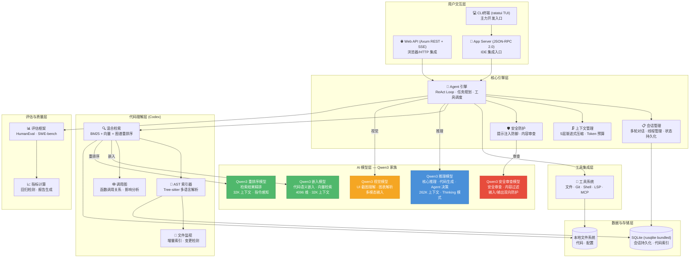
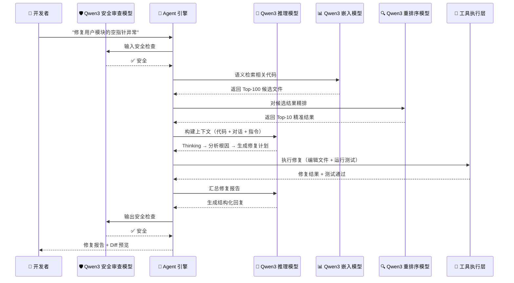
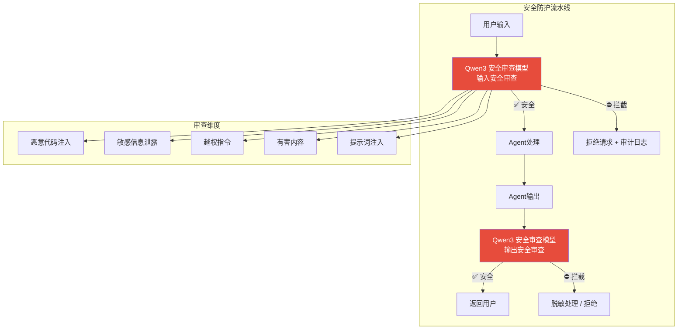
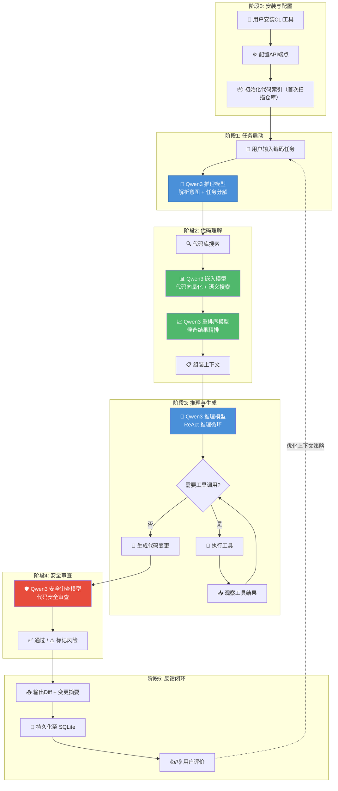
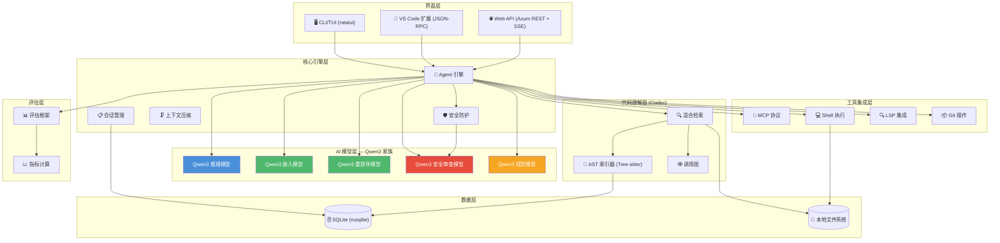

# 定制码匠（CraftCoder）产品设计文档


> **状态**: 正式版  
> **核心模型栈**: Qwen3 模型家族 — 通过 OpenAI 兼容 API 接入，支持聊天/推理、嵌入、重排序、视觉、安全审查五类模型

---

## 目录

1. [产品愿景与定位](#1-产品愿景与定位)
2. [用户画像与场景分析](#2-用户画像与场景分析)
3. [功能架构](#3-功能架构)
4. [AI能力设计——Qwen3 模型家族协同](#4-ai能力设计qwen3-模型家族协同)
5. [用户体验设计](#5-用户体验设计)
6. [业务架构图](#6-业务架构图)
7. [用户交互边界定义](#7-用户交互边界定义)
8. [产品路线图](#8-产品路线图)

---

## 1. 产品愿景与定位

### 1.1 愿景

打造**面向中国开发者的下一代AI编程智能体**——基于开源模型家族，实现完全私有化部署、自主可控的智能研发工具。让每一行代码都有AI深度参与，让每一个研发团队都能拥有属于自己的AI编程伙伴。

### 1.2 核心定位

| 维度 | 定位描述 |
|------|----------|
| **目标市场** | 中国开发者、企业研发团队、信创环境（党政军、国企、金融） |
| **技术路线** | 基于开源模型家族，100%私有化部署，零数据外泄 |
| **产品形态** | CLI终端（ratatui TUI）+ Web API（Axum REST + SSE）+ App Server（JSON-RPC 2.0 for IDE） |
| **对标竞品** | Cursor、Claude Code、GitHub Copilot、OpenAI Codex |
| **核心差异化** | 完全本地化部署、自主可控、国产模型适配、信创合规 |
| **产品演进** | 单 Agent ReAct Loop → 多模型协同 → 代码理解引擎（Codex）→ 评估与质量体系 |

### 1.3 战略意义

1. **数据主权**：企业核心代码不离开内网，满足《数据安全法》《个人信息保护法》合规要求。
2. **供应链安全**：基于Apache 2.0开源的大语言模型，无闭源模型依赖风险。
3. **成本可控**：一次部署，按需扩容，无按Token计费的持续成本。
4. **定制化能力**：支持基于企业私有代码库进行模型微调，深度适配业务领域。

### 1.4 产品名称

- **中文名**：定制码匠（取"匠"之意，寓意代码领域的能工巧匠）
- **英文代号**：CraftCoder
- **备选名**：星码（StarCode）、码策（CodeStrategy）

---

## 2. 用户画像与场景分析

### 2.1 核心用户画像

#### 画像A：一线开发者（占比约60%）

| 属性 | 描述 |
|------|------|
| **角色** | 前端/后端/全栈/移动端开发工程师 |
| **技术栈** | Java/Spring Boot、Python/Django、Go/Gin、Vue/React、TypeScript |
| **核心痛点** | 重复性编码耗时、跨文件重构困难、遗留代码理解成本高 |
| **AI使用习惯** | 日常使用Copilot/Cursor辅助编码，期望更深度的自动化 |
| **决策权** | 低——工具选择通常由技术Leader或公司统一规定 |

#### 画像B：技术Leader / 架构师（占比约20%）

| 属性 | 描述 |
|------|------|
| **角色** | 技术总监、架构师、Tech Lead |
| **技术栈** | 多技术栈管理，关注架构设计、代码审查、技术债务 |
| **核心痛点** | 代码审查耗时、架构决策缺乏全局视角、技术债务量化困难 |
| **AI使用习惯** | 使用Claude Code处理复杂任务，关注代码质量多于生成速度 |
| **决策权** | 高——团队AI工具采购的最终决策者 |

#### 画像C：企业IT / 运维管理者（占比约15%）

| 属性 | 描述 |
|------|------|
| **角色** | CTO、IT总监、信息安全负责人 |
| **技术栈** | 关注基础设施、安全合规、成本控制 |
| **核心痛点** | 海外AI工具数据出境风险、模型API成本不可控、合规审计困难 |
| **AI使用习惯** | 限制团队使用海外AI工具，正在寻找本地化替代方案 |
| **决策权** | 最高——拥有采购审批权，是"可私有化部署"的核心决策推动者 |

#### 画像D：信创环境开发者（占比约5%，高增长）

| 属性 | 描述 |
|------|------|
| **角色** | 政府/军工/国企IT部门开发人员 |
| **技术栈** | 国产操作系统（统信UOS/麒麟）+ 国产数据库 + 国产中间件 |
| **核心痛点** | 封闭网络环境无法使用云端AI工具，合规要求极为严格 |
| **AI使用习惯** | 几乎无AI编程工具可用，处于空白地带 |
| **决策权** | 无——由上级单位统一采购，但需求极度刚性 |

### 2.2 典型使用场景

#### 场景1：智能代码生成（高频场景）

```
开发者: "帮我写一个JWT认证中间件，支持Token黑名单缓存"
Agent: [分析项目结构] → [查找现有认证逻辑] → [生成中间件代码] → [自动生成单元测试]
结果: 生成符合项目规范的完整中间件代码，包含错误处理、日志、测试用例
```

#### 场景2：跨文件重构（中频高价值场景）

```
开发者: "把UserService中的缓存逻辑抽取为独立的CacheService，所有调用方同步更新"
Agent: [扫描所有引用] → [抽取逻辑] → [更新12个调用方] → [运行全量测试确保无回归]
结果: 自动完成跨文件重构，零遗漏、零回归
```

#### 场景3：Bug排查与修复（中频高价值场景）

```
开发者: "生产环境订单接口偶发500错误，日志显示NullPointerException"
Agent: [分析堆栈] → [追踪代码路径] → [定位空值来源] → [提出修复方案+测试] → [创建PR]
结果: 从日志到PR全流程自动化
```

#### 场景4：代码审查辅助（日常场景）

```
Agent: [监听Git PR] → [静态分析] → [逻辑审查] → [安全扫描] → [生成审查报告]
结果: 自动生成结构化的代码审查报告，标注风险等级和建议
```

#### 场景5：遗留系统文档生成（低频高价值场景）

```
开发者: "为整个payment模块生成架构文档和API文档"
Agent: [解析模块代码] → [推断架构模式] → [生成Mermaid架构图] → [生成API文档]
结果: 一次性生成完整的模块文档
```

#### 场景6：UI截图转代码（创新场景）

```
开发者: [上传设计稿截图]
Agent: [视觉模型理解UI布局] → [识别组件层级] → [生成前端代码] → [预览渲染效果]
结果: 从截图到可运行代码的端到端转换
```

---

## 3. 功能架构

### 3.1 整体功能架构图



### 3.2 Agent工作流（典型请求处理流程）



### 3.3 模块职责详述

| 模块 | 核心功能 | 依赖模型 |
|------|----------|----------|
| **Agent 引擎** | ReAct 推理循环、任务理解与分解、工具调用决策、会话生命周期管理 | Qwen3 推理模型 |
| **对话管理** | 多轮对话状态维护、历史 Reasoning Trace 保留（Thinking Preservation）、Token 预算管理 | Qwen3 推理模型 |
| **代码理解引擎 (Codex)** | Tree-sitter AST 解析、代码索引与搜索、调用图构建、混合检索（BM25 + 向量 + 图谱） | Qwen3 嵌入模型 + 重排序模型 |
| **工具系统** | 文件读写、Git 操作（git2）、Shell 执行、LSP 集成、MCP 协议扩展 | 无（调用本地工具） |
| **安全防护** | 提示注入检测、输入/输出内容安全审查、敏感信息过滤 | Qwen3 安全审查模型 |
| **评估框架** | HumanEval、SWE-bench 基准测试、回归检测、报告生成 | Qwen3 推理模型（分析） |
| **视觉理解** | UI 截图分析、图表理解、架构图解析 | Qwen3 视觉模型 |

---

## 4. AI能力设计——Qwen3 模型家族协同

### 4.1 为什么需要多模型协同？

AI 编程助手不是"一个模型解决所有问题"那么简单。不同的任务对模型能力有完全不同的要求：

- **推理与代码生成**需要强大的语义理解和长上下文能力，但这类模型参数量大、推理成本高
- **代码搜索**需要把代码片段转换成向量做相似度匹配，这需要专门的嵌入模型
- **安全审查**需要快速、确定性地拦截有害内容，不能依赖主模型的"自觉"

所以 CraftCoder 采用五模型协同架构：每个模型做自己最擅长的事，通过编排引擎组合成完整的能力链。

### 4.2 Qwen3 推理模型 — 核心推理与代码生成引擎

**模型概况**：

- 参数量：270亿（Dense架构，非MoE，部署简单）
- 架构：Hybrid Gated DeltaNet（64层，16个重复块，每块3个线性注意力 + 1个全注意力层）
- 上下文窗口：262,144 Tokens（原生支持）
- 最大输出：32,768 Tokens（可扩展至81,920）
- 许可证：Apache 2.0（完全开源，可商用）
- 关键能力：Agentic Coding、Thinking模式、Thinking Preservation、Function Calling

**核心基准测试成绩**：

| 基准测试 | Qwen3 推理模型 | Claude 4.5 Opus | 业界参考值 |
|----------|-------------|-----------------|-------------------|
| SWE-bench Verified | **77.2%** | 80.9% | 76.2% |
| SWE-bench Pro | **53.5%** | 57.1% | 50.9% |
| Terminal-Bench 2.0 | **59.3%** | 59.3% | 52.5% |
| LiveCodeBench v6 | **83.9%** | 84.8% | 80.7% |
| GPQA Diamond | **87.8%** | 87.0% | 85.5% |
| C-Eval（中文知识） | **91.4%** | 92.2% | 90.5% |

**关键设计要点**：

1. **Thinking模式（思维链推理）**：推理模型默认以Thinking模式运行，编码场景推荐参数：`temperature=0.6, top_p=0.95, top_k=20`（精确模式）。这就像让模型"先想清楚再写代码"，而不是直接猜答案。
2. **Thinking Preservation**：多轮Agent对话中保留历史推理Trace，维持跨轮次决策一致性，减少冗余推理。每次对话的思考过程会被保留，避免模型在下一轮"重新想一遍"。
3. **Agentic Coding专项能力**：原生支持Function Calling/Tool Use，兼容OpenAI API格式，CraftCoder 通过统一的 `ModelClient` trait 接入。
4. **超长上下文处理**：262K Token上下文，可以一次性理解整个中型项目的代码库。

**设计原理**：为什么选 270亿 参数而不是更大的模型？因为 Agent 场景需要频繁调用（每次工具调用都要推理），推理延迟直接影响用户体验。270亿 参数在编码能力上接近更大模型，但推理速度快得多，部署成本也更低。

### 4.3 Qwen3 嵌入模型 — 代码语义检索

**模型概况**：

- 参数量：80亿
- 上下文长度：32K Tokens
- 嵌入维度：最高4,096维，支持MRL（可自定义输出维度32~4,096）
- MTEB多语言排行榜：**排名第一**（70.58分）
- MTEB Code基准：**80.89分**

**设计原理**：嵌入模型解决的是"找到相关代码"的问题。当用户说"修复用户模块的空指针异常"，Agent 需要知道哪些文件涉及"用户模块"、哪些函数可能抛出空指针。嵌入模型把代码片段转换成向量，通过向量相似度找到语义上最相关的文件。这比简单的关键词搜索准确得多——它能理解"空指针异常"和"NullPointerException"是同一个概念。

在 CraftCoder 中的应用：代码库索引、查询向量化、语义相似度检索、增量索引更新。

### 4.4 Qwen3 重排序模型 — 检索结果精排

**两阶段检索引擎架构**：

```mermaid
flowchart LR
    subgraph "第一阶段：粗召回（Embedding）"
        Q["用户查询"] --> E["Qwen3 嵌入模型<br/>生成查询向量"]
        E --> V[("SQLite 索引<br/>Top-100 候选")]
    end
    subgraph "第二阶段：精排（Reranker）"]
        V --> R["Qwen3 重排序模型<br/>逐一评分每个(查询，文档)对"]
        R --> TOP["输出 Top-10<br/>高精度结果"]
    end
    TOP --> AGENT["Agent 上下文<br/>注入 LLM Prompt"]
```

**设计原理**：为什么需要两阶段？嵌入模型擅长"粗筛"——它能在海量代码中快速找到可能相关的文件，但精度不够。重排序模型则对每个候选结果做精细评分，把最相关的 Top-10 送到 Agent 的上下文中。这就像先用地毯式搜索找到所有可能的线索，再请专家逐一甄别。

### 4.5 Qwen3 视觉模型 — UI理解与多模态交互

| 场景 | 输入 | 输出 | 技术链路 |
|------|------|------|----------|
| **UI截图转代码** | 设计稿截图 | HTML + CSS + 组件代码 | 视觉模型理解布局 → LLM生成代码 |
| **错误截图诊断** | 浏览器报错截图 | 错误原因 + 修复建议 | 视觉模型识别错误信息 → LLM分析 |
| **架构图解析** | 手绘架构草图 | PlantUML/Mermaid代码 | 视觉模型识别组件 → 生成图表代码 |
| **遗留文档数字化** | 扫描的API文档PDF | 结构化API规范（OpenAPI） | 视觉模型 OCR → LLM结构化 |

### 4.6 Qwen3 安全审查模型 — 安全防护

**安全防护架构**：



**设计原理**：安全审查模型是"守门员"角色。它独立于主推理模型运行，在输入进入 Agent 之前和输出返回用户之前各做一次检查。这种"双向防护"设计确保即使主模型被诱导生成有害内容，安全审查模型也能拦截。审查维度覆盖了 AI 编程助手最常见的五种安全风险。

### 4.7 五模型协同架构

| 阶段 | Qwen3 推理模型 | Qwen3 嵌入模型 | Qwen3 重排序模型 | Qwen3 安全审查模型 | Qwen3 视觉模型 |
|------|:-----------:|:-------------------:|:-----------------:|:-----------------:|:-----------:|
| 意图解析 | **● 主责** | | | | |
| 代码搜索 | **● 生成查询** | **● 向量化+检索** | **● 精排top-K** | | |
| ReAct循环 | **● 主责** | | | | |
| 工具调用 | **● 决策** | | | | |
| 安全审查 | | | | **● 扫描** | |
| UI验证 | | | | | **● 截图分析** |

---

## 5. 用户体验设计

### 5.1 三种交互形态

| 形态 | 目标用户 | 核心定位 | 设计原则 |
|------|----------|----------|----------|
| **CLI终端 (ratatui TUI)** | 资深开发者、后端工程师 | 主力开发入口，高效、灵活 | 命令式交互、管道可组合、支持CI/CD集成 |
| **App Server (JSON-RPC 2.0)** | IDE 插件开发者 | IDE 集成标准协议接口 | 事件驱动、流式推送、线程管理 |
| **Web API (Axum REST + SSE)** | Web 前端、HTTP 客户端 | 浏览器端交互入口 | RESTful、SSE 事件流、CORS 支持 |
| **Web UI 管理面板 (React + Vite)** | 团队管理者、运维人员 | 浏览器端可视化 Agent 管理 | 线程管理、实时对话、Token 用量监控 |

### 5.2 CLI终端设计（主力形态）

```bash
# 交互式对话模式
$ craftcoder chat

# 管道模式（非交互式）
$ craftcoder review --pr 42 --format markdown > review-report.md
$ craftcoder refactor --pattern "extract-method" --target UserService.java --dry-run
$ craftcoder test --coverage --target src/main/java/com/example/user/

# Agent模式（自主任务执行）
$ craftcoder agent "在user模块中实现接口限流功能"
```

**设计原则**：

- **上下文感知**：自动检测项目技术栈，加载项目级配置
- **渐进式披露**：默认简洁输出，通过`--verbose`查看详细推理过程
- **可组合性**：输出支持JSON/Markdown格式，可通过Unix管道组合
- **安全确认**：文件操作前展示Diff，危险命令执行前要求二次确认

### 5.3 IDE插件设计（VS Code 扩展）

VS Code 扩展通过 JSON-RPC 2.0 协议连接 `code-agent-app-server`，在编辑器内提供 AI 编码辅助功能。

| 功能 | 交互方式 | 触发条件 |
|------|----------|----------|
| **Agent对话** | 侧边栏面板 | 快捷键 / 右键菜单 |
| **内联编辑** | 选中代码 → 自然语言指令 → Diff预览 | 选中代码后Cmd+K |
| **代码审查** | 文件保存时自动触发 / 手动触发 | Git暂存区变更 |
| **Bug修复** | 选中错误 → "Explain & Fix" | 终端错误输出 |
| **文档生成** | 右键菜单 → "Generate Docs" | 光标在函数/类上 |
| **测试生成** | 右键菜单 → "Generate Tests" | 光标在函数上 |

### 5.4 操作风险分级与授权策略

| 风险等级 | 操作类型 | 授权策略 | 示例 |
|----------|----------|----------|------|
| **🟢 低风险** | 只读操作、代码分析 | 自动执行，无需确认 | 语义搜索、代码审查、测试运行 |
| **🟡 中风险** | 文件编辑、代码生成 | 展示Diff，用户一键确认 | 代码生成、重构、补全 |
| **🟠 高风险** | 批量文件操作、依赖变更 | 用户逐一审查确认 | 批量重命名、依赖升级 |
| **🔴 极高风险** | 系统级操作、数据修改 | 二次确认 + 审计记录 | 删除文件、执行Shell命令、Git Push |

---

## 6. 业务架构图

### 6.1 业务能力地图

6大能力域 × 5阶段成熟度：

| 能力域 | 核心模型 | 能力描述 | 当前成熟度 | 目标成熟度 |
|--------|----------|----------|------------|------------|
| **AI编码** | Qwen3 推理模型 | ReAct智能体循环、代码生成、推理规划、多文件编辑 | L3 | L5 |
| **Web UI管理面板** | React + TypeScript + Vite | 浏览器端线程管理、实时对话展示、Token用量监控 | ✅ 已实现 | L3 |
| **多用户会话管理** | API Key → UserId 映射 | 轻量级多用户隔离，API Key从配置文件加载 | ✅ 已实现 | L3 |
| **代码理解** | Qwen3 嵌入模型 + 重排序模型 | AST解析、调用图构建、混合检索 | L2 | L4 |
| **工具集成** | Qwen3 推理模型（调度） | MCP协议、Shell执行、LSP集成、Git操作 | L3 | L4 |
| **评估评测** | Qwen3 推理模型（分析） | SWE-bench、HumanEval、持续评估流水线 | L2 | L3 |
| **安全管理** | Qwen3 安全审查模型 | 提示注入防御、内容安全审查、权限控制 | L2 | L4 |
| **数据持久化** | N/A（SQLite） | 会话状态持久化、代码索引存储、评估结果归档 | L4 | L5 |
| **视觉理解** | Qwen3 视觉模型 | UI截图分析、图表理解、架构图解析 | L1 | L2 |

### 6.2 用户旅程图



### 6.3 利益相关者地图

| 角色 | 核心关注点 | 价值主张 | 成功指标 |
|------|-----------|----------|----------|
| **开发者** | 编码速度、代码质量、学习曲线 | 将80%重复编码工作自动化 | 任务完成时间减少60%+ |
| **团队管理者** | 团队效能、代码一致性、最佳实践落地 | 统一编码标准，效能提升数据量化 | 团队Velocity提升40%+ |
| **企业采购者** | TCO、供应商独立性、安全合规 | 基于开源模型的私有化方案 | TCO较OpenAI API降低70%+ |
| **运维人员** | 系统稳定性、可观测性、灾难恢复 | 全链路OpenTelemetry追踪，高可用 | 系统可用性 ≥99.9% |

### 6.4 业务模块依赖关系



---

## 7. 用户交互边界定义

### 7.1 职责划分模型

```
┌─────────────────────────────────────────────────────┐
│                    用户职责域                          │
├─────────────────────────────────────────────────────┤
│ • 定义需求目标（What）                                 │
│ • 做出架构决策（技术选型、设计模式）                      │
│ • 审查AI产出（代码审查、测试验证）                        │
│ • 批准危险操作（删除文件、修改数据库、部署到生产）          │
│ • 维护项目知识库（编码规范、架构文档、最佳实践）            │
└────────────────────────┬────────────────────────────┘
                         │   协作交互区域
┌────────────────────────┴────────────────────────────┐
│                    Agent职责域                         │
├─────────────────────────────────────────────────────┤
│ • 理解需求并拆解任务（How）                              │
│ • 搜索和理解代码库上下文                                 │
│ • 生成代码、测试、文档                                   │
│ • 执行低风险操作（代码编辑、测试运行、代码分析）            │
│ • 提供多方案对比和建议                                   │
│ • 自动修复低风险问题（Lint错误、格式化、导入排序）          │
└─────────────────────────────────────────────────────┘
```

### 7.2 交互反模式（应避免的设计）

| 反模式 | 问题 | 正确设计 |
|--------|------|----------|
| **过度自动化** | Agent在用户不知情的情况下修改大量文件 | 所有编辑操作必须有Diff预览和确认步骤 |
| **黑盒决策** | Agent做出架构决策但不解释原因 | 强制Thinking模式输出推理过程 |
| **上下文污染** | Agent在多轮对话中混乱理解上下文 | 明确上下文边界和重置机制 |
| **权限越界** | Agent执行超出授权范围的操作 | 基于角色和风险等级的细粒度授权 |

---

## 8. 产品路线图

### 实际开发进度

### 开发状态

| 阶段 | 状态 | 核心交付 |
|------|------|----------|
| **基础框架** | ✅ 已完成 | Rust Cargo Workspace、Protocol 数据模型、Core LLM Provider、Tools 工具集、CLI TUI、Codex 代码理解引擎、Eval 评估框架、CI/CD 流水线 |
| **交互完善** | ✅ 已完成 | Web API 服务（Axum REST + SSE）、VS Code 扩展（JSON-RPC 2.0）、MCP 协议支持、LSP 集成、配置管理、TUI 接入真实 Agent 引擎 |
| **生产就绪** | ✅ 已完成 | OpenTelemetry 可观测性（✅ 已实现，可选 `otlp` feature）、Docker 容器化部署（✅ docker-compose.yml + Dockerfile）、多用户会话管理（✅ API Key → UserId 映射，线程隔离）、权限与安全审计（✅ 内容安全双层审查 + 沙箱门控 + 路径验证 + 命令注入防护）、性能优化与缓存（✅ release profile 优化） |
| **生态扩展** | 🔄 进行中 | 插件系统（✅ Plugin trait + PluginManager + MCP connector 已实现）、自定义工具 SDK、更多 LLM Provider（Anthropic/Gemini ✅ 已实现）、Web UI 管理面板（✅ React 19 SPA + SSE 实时流 + Markdown 渲染）、团队协作功能 |
| **v2 架构** | ✅ 已完成 | Phase A-G 全部实现：Delegator/Coder 双角色、Plan 引擎（TaskPlan DAG + Kahn 排序）、5 层上下文压缩、Spec 驱动流水线 + 质量门禁、知识体系（Rules/Skills）、工具生态（Hook/Plugin/Command）、数据飞轮闭环 |

### 各阶段关键指标

| 阶段 | 模型依赖 | 核心指标 | 目标值 |
|------|----------|----------|--------|
| **Alpha** | Qwen3 推理模型 | HumanEval pass@1 | >55% |
| **Alpha+** | + Qwen3 嵌入模型 + 重排序模型 | 代码搜索精度（MRR） | >0.75 |
| **Beta** | + Qwen3 安全审查模型 | 安全审查准确率 | >95% |
| **Beta+** | + Qwen3 视觉模型 | SWE-bench-Lite 解决率 | >20% |
| **GA** | 全模型家族 | SWE-bench-Live 解决率 | >28% |
| **Enterprise** | 全模型私有化 | 系统可用性 | ≥99.9% |

---


