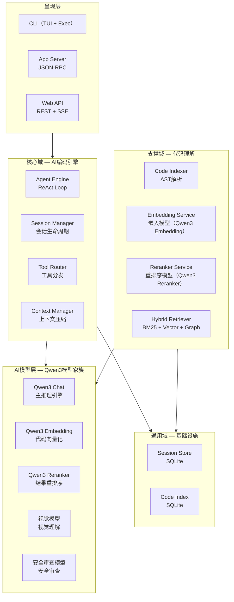
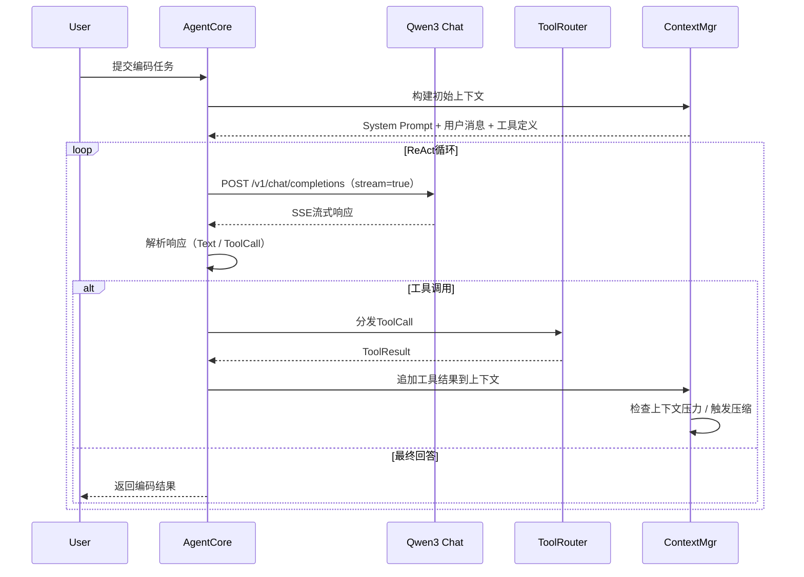
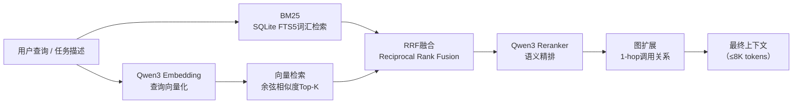
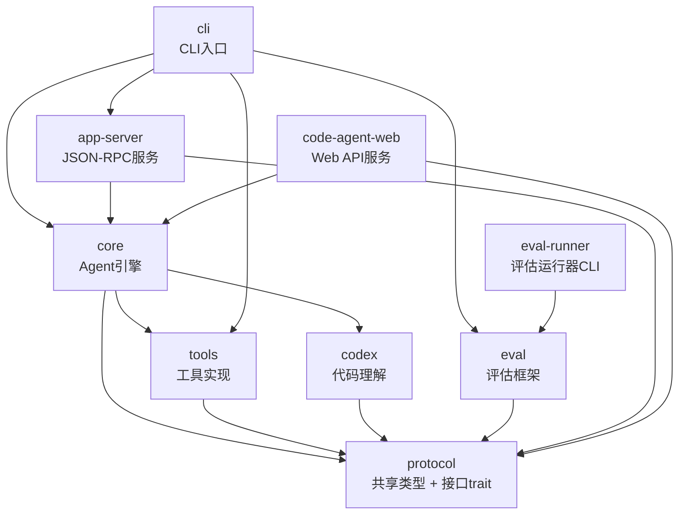
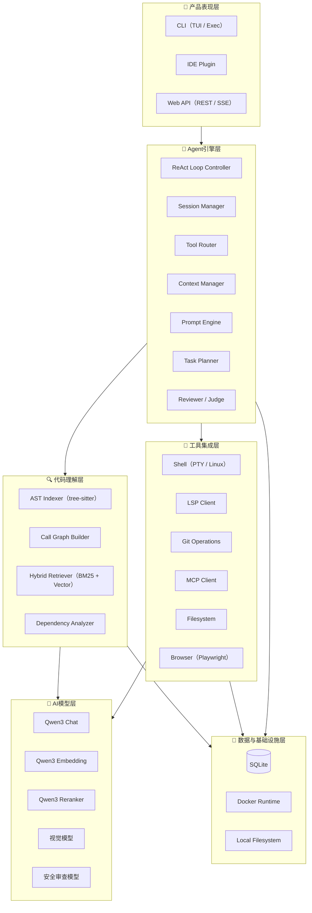
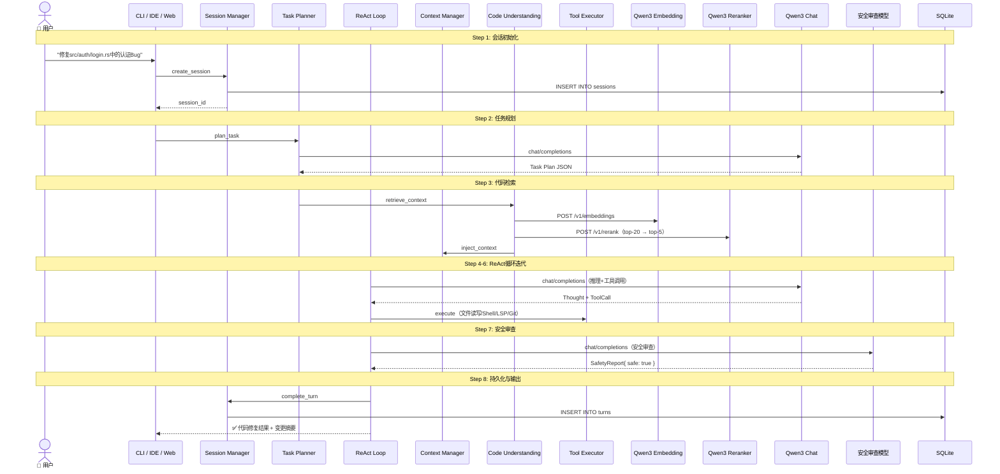
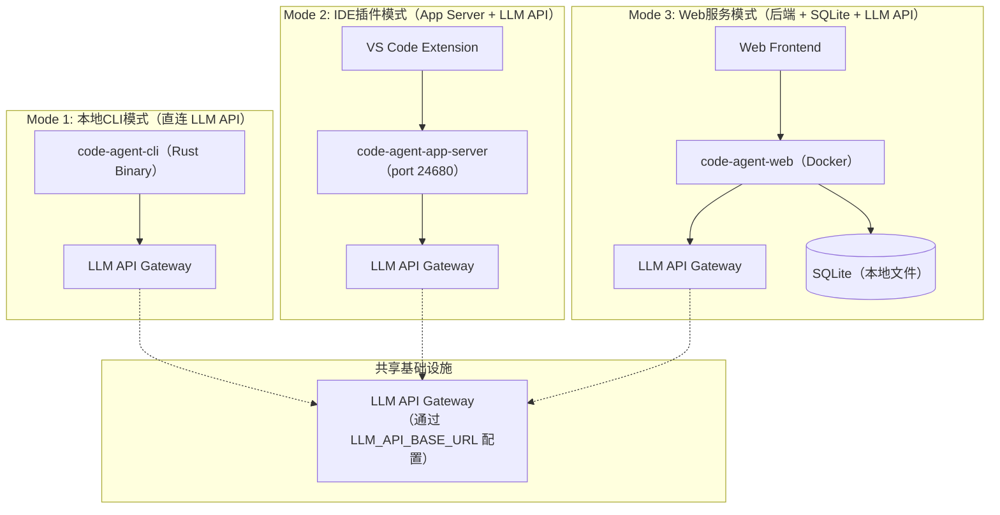
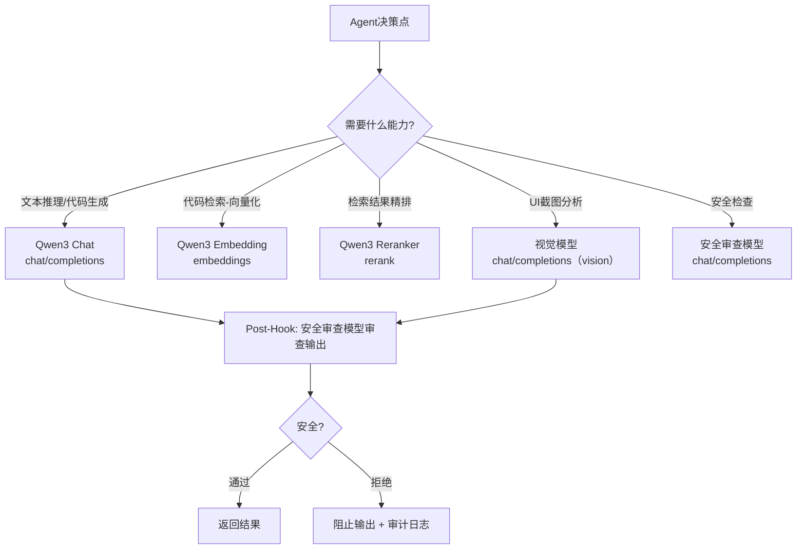
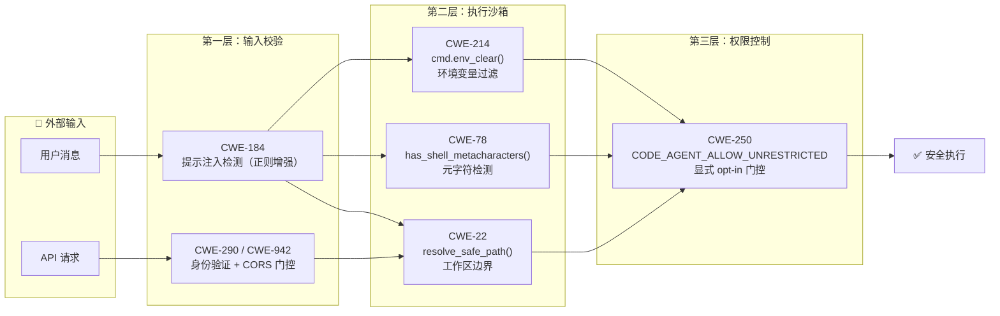

# 定制码匠（CraftCoder）技术设计文档


> **核心模型**: Qwen3（通义千问3）模型家族 — 通过 OpenAI 兼容 API 统一接入  
> **持久化**: SQLite（嵌入式，bundled 模式）  
> **Agent运行时**: Rust 9-Crate 工作区 + React 前端（protocol/core/tools/codex/eval/eval-runner/cli/app-server/code-agent-web + ui/）  

---

## 目录

1. [设计目标与约束](#1-设计目标与约束)
2. [系统边界与上下文（DDD领域划分）](#2-系统边界与上下文ddd领域划分)
3. [Loop Engineering（循环工程）体系](#3-loop-engineering循环工程体系)
4. [Rust层架构设计](#4-rust层架构设计)
5. [系统架构图](#5-系统架构图)
6. [AI模型集成层设计](#6-ai模型集成层设计)
7. [数据设计](#7-数据设计)
8. [关键接口设计](#8-关键接口设计)
9. [技术可行性分析](#9-技术可行性分析)
10. [设计决策记录（ADR）](#10-设计决策记录adr)
11. [技术栈全景](#11-技术栈全景)

---

## 1. 设计目标与约束

### 1.1 核心设计目标

| 目标 | 描述 | 度量标准 |
|------|------|----------|
| **开源模型原生集成** | 所有AI能力均由多模型家族提供 | 零外部模型API依赖 |
| **私有化部署** | 代码与数据完全驻留在自有基础设施 | 无外网依赖可运行 |
| **高性能Agent循环** | Rust异步运行时驱动ReAct循环 | 单轮延迟 <3s（P95） |
| **轻量级数据管理** | SQLite嵌入式持久化 | 零运维，单文件存储 |
| **多端统一体验** | CLI / IDE / Web共享同一Agent核心 | JSON-RPC协议统一 |

### 1.2 环境约束

所有 AI 模型通过环境变量配置，支持任何 OpenAI 兼容 API 提供商：

| 配置项 | 环境变量 | 说明 | 是否必填 |
|--------|---------|------|---------|
| API地址 | `LLM_API_BASE_URL` | API 网关地址 | 是 |
| API密钥 | `LLM_API_KEY` | 认证密钥 | 是 |
| 对话模型 | `LLM_CHAT_MODEL` | 核心推理模型名称（如 qwen3.6-27b） | 是 |
| 嵌入模型 | `LLM_EMBEDDING_MODEL` | 代码向量化模型 | 否 |
| 重排序模型 | `LLM_RERANKER_MODEL` | 检索精排模型 | 否 |
| 安全模型 | `LLM_GUARD_MODEL` | 内容安全审查 | 否 |
| 视觉模型 | `LLM_VL_MODEL` | 多模态理解 | 否 |

```
数据库:      SQLite（嵌入式，bundled 模式，无需安装）
认证:        统一 API Key（Authorization: Bearer <LLM_API_KEY>）
运行时:      Rust 9-Crate Workspace
```

### 1.3 范围约束

**在范围内**：Rust核心Agent引擎（ReAct循环、会话管理、工具路由）、多模型家族全链路集成、SQLite持久化数据层、CLI（TUI+Headless）/App Server/Web API三端、Web UI React SPA管理面板、轻量级多用户会话管理（API Key认证+线程隔离）、代码理解引擎（AST索引+混合检索）、工具集成（Shell/LSP/Git/MCP）、评估框架。

**不在范围内**：自有模型训练或微调、纯云端部署模式、企业SSO/统一身份认证、移动端客户端、替代版本控制。

---

## 2. 系统边界与上下文（DDD领域划分）

### 2.1 领域划分



### 2.2 限界上下文详细职责

#### 核心域：AI编码引擎（agent-core）

**核心实体**：
- `Session`：一次完整的编码会话，包含多轮Turn
- `Turn`：一次推理-执行-观察循环
- `Message`：User/Assistant/ToolCall/ToolResult四种消息类型
- `ToolCall`：工具调用请求（id, name, arguments）
- `ToolResult`：工具执行结果（tool_call_id, output/error）

**ReAct循环流程**：



#### 支撑域：代码理解（agent-codex）

检索流水线：



---

## 3. Loop Engineering（循环工程）体系

### 3.1 概述

Loop Engineering（循环工程）专注于**ReAct推理循环的工程化治理**。核心原则：循环是一等公民、可观测性是循环的基础设施、循环安全是第一道防线。

### 3.2 循环模式库

| 模式 | 适用场景 | 复杂度 | 成功率 | 典型配置 |
|------|---------|--------|--------|---------|
| **ReAct**（推理+行动） | 通用编码任务 | ★☆☆ | 基准 | Max 15 turns |
| **Plan-Execute**（先计划后执行） | 复杂多步骤任务 | ★★☆ | +15% vs ReAct | Plan 1 turn, Execute N turns |
| **MCTS**（蒙特卡洛树搜索） | 高不确定性的架构决策 | ★★★ | +10% vs best-of-N | 50-200 simulations |
| **Tree-of-Thought**（思维树） | 不可逆操作（生产环境变更） | ★★☆ | +8% vs CoT | 3-5 candidates |
| **Sub-Agent**（子代理并行） | 可并行的独立子任务 | ★★☆ | +67% token节省 | Max 6 agents, EPSS context isolation |

### 3.3 循环可观测性设计

每条循环步骤记录观测数据：

| 字段 | 说明 |
|------|------|
| `turn_number` | 当前Turn编号 |
| `step_type` | Thought/ToolCall/ToolResult/FinalAnswer/Error/Compaction |
| `model` | 模型名称（Qwen3 Chat） |
| `input_tokens` / `output_tokens` | Token消耗 |
| `latency_ms` | 延迟（毫秒） |
| `tool_name` | 工具名称（如适用） |
| `tool_success` | 工具执行成功标记 |
| `context_utilization_pct` | 当前上下文使用率 |
| `compaction_count` | 压缩触发次数 |

### 3.4 循环安全层

```
┌─────────────────────────────────────────────────┐
│                   Loop Guard                     │
│  Max Turns Guard:  Default 20, 超限→停止         │
│  Token Budget Guard: Default 64K, 超限→强制压缩  │
│  Timeout Guard:     Default 120s, 超限→回滚      │
│  Anomaly Detector:  重复工具调用>3次、Token突增>5x │
│                     相同报错>2次、上下文膨胀>90%    │
└─────────────────────────────────────────────────┘
```

### 3.5 循环测试策略

| 测试层级 | 覆盖内容 | 工具 | 目标 |
|----------|---------|------|------|
| **L1 — 单元测试** | 单步逻辑、消息路由、工具分发 | MockModelClient, MockTool | 单步正确性 |
| **L2 — 轨迹测试** | N步循环序列、工具调用链 | 预定义轨迹 + 断言 | 循环路径正确性 |
| **L3 — 集成测试** | 完整编码任务、真实模型（可选） | Docker沙箱 + LLM API | 端到端功能 |
| **L4 — 压力测试** | 长序列（50-100 turns）、大上下文 | 批量生成工具调用 | 循环稳定性 |
| **L5 — 回归测试** | 每次变更的基准轨迹比对 | insta快照 + 性能门禁 | 无回归退化 |

---

## 4. Rust层架构设计

### 4.1 Crate依赖关系



### 4.2 各Crate职责

| Crate | 包名 | 职责 | 关键依赖 |
|-------|------|------|----------|
| **protocol** | `code-agent-protocol` | 共享数据类型（AgentMessage, ToolDefinition, SessionState, TurnRecord, CodeContext, EvaluationReport） | serde, serde_json |
| **core** | `code-agent-core` | Agent核心引擎（ReActLoop, SessionManager, ContextManager, ToolRouter）<br/>**新增模块**：<br/>• `agent::plan` — Plan 引擎（Phase B：TaskPlan, PlanNode DAG, Kahn 拓扑排序, PlanExecutor, QualityGate, KnowledgeProvider, PlanStore，8 文件）<br/>• `context` — 5 层压缩管道（Phase C：BudgetReduction → Snip → Microcompact → ContextCollapse → AutoCompact）+ LLM 摘要器 + TokenBudgetAllocator<br/>• `tools::hook` — 工具生命周期钩子（Phase F：ToolHook, HookRegistry, 8 种事件类型）<br/>• `tools::plugin` — 插件系统（Phase F：Plugin, PluginManager, McpConnector）<br/>• `tools::command` — 命令系统（Phase F：CommandRegistry, /help, /status）<br/>• `flywheel` — 数据飞轮（Phase G：FlywheelCollector, FailureAnalyzer, ImprovementSuggester, NightlyPipeline） | protocol, tools, codex |
| **tools** | `code-agent-tools` | 工具实现（LSPClient, ShellExecutor, GitOperations, FilesystemOps, MCPAdapter） | protocol |
| **codex** | `code-agent-codex` | 代码理解（ASTParser, CallGraphBuilder, HybridRetriever, DependencyAnalyzer, SymbolResolver） | protocol, tree-sitter |
| **cli** | `code-agent-cli` | CLI二进制（TUI Application, Exec Mode, Configuration Loader） | core, protocol |
| **app-server** | `code-agent-app-server` | IDE后端服务（JSON-RPC Server, WebSocket Server, Event Bus） | core, protocol |
| **eval** | `code-agent-eval` | 评估框架（BenchmarkRunner, MetricCollector, SWEAdapter, HumanEvalAdapter） | core, codex, protocol |
| **code-agent-web** | `code-agent-web` | Web API 服务（Axum REST + SSE）+ React SPA 管理面板前端 | core, protocol |
| **eval-runner** | `eval-runner` | 评估运行器 CLI（CI 流水线基准测试执行） | eval |

### 4.3 ReAct循环核心实现

ReAct（Reasoning + Acting）循环是 Agent 的核心引擎。它的工作方式很简单：

1. 接收用户消息
2. 构建提示词（系统指令 + 对话历史 + 工具定义）
3. 调用模型（流式）
4. 如果模型返回文本 → 返回给用户
5. 如果模型返回工具调用 → 执行工具 → 把结果给模型 → 回到步骤3
6. 重复直到获得最终答案或超过最大轮次

下面是实际代码中的核心结构：

```rust
// 来自 core/src/agent/session.rs
pub struct Session {
    config: SessionConfig,
    model_client: Arc<dyn ModelClient>,
    tool_registry: Arc<dyn ToolRegistry>,
    context_manager: ContextManager,
    state: SessionState,
    interrupted: Arc<AtomicBool>,
    turn_counter: u64,
    flywheel: FlywheelCollector,
    session_store: Mutex<Option<SessionStore>>,
    safety_layer: Option<Arc<ContentSafetyLayer>>,
}
```

`run_turn` 方法是整个 Agent 的核心入口。它使用 **Step Chain 模式**（责任链模式的一种变体），将一次 Turn 的执行拆分为 7 个独立步骤：

```rust
// 来自 core/src/agent/session.rs — run_turn 方法
pub async fn run_turn(&mut self, input: TurnInput) -> Vec<ResponseEvent> {
    // Step 1: Safety check — 安全检查（提示注入防御）
    // Step 2: Model invocation — 调用模型
    // Step 3: Response collection — 收集流式响应
    // Step 4: Tool execution — 执行工具调用
    // Step 5: Final answer — 构建最终回答
    // Step 6: Flywheel analysis — 飞轮分析（错误聚类）
    // Step 7: Persistence — 持久化到 SQLite
}
```

每个步骤实现 `SessionStep` trait：

```rust
#[async_trait]
trait SessionStep {
    async fn execute(&self, session: &mut Session, ctx: &mut StepContext<'_>) -> StepOutcome;
}
```

步骤通过 `StepOutcome` 枚举控制流程：

```rust
enum StepOutcome {
    Continue,                    // 继续下一步
    Break(Vec<ResponseEvent>),   // 停止执行，返回事件
    Error(String),               // 停止执行，返回错误
}
```

这种设计的好处是：每个步骤可以独立测试、独立替换、独立演进。比如你想替换安全检查逻辑，只需要改 `SafetyCheckStep` 一个结构体。

### 4.3a 7步Step Chain详解

**Step 1 — SafetyCheckStep（安全检查）**：在用户消息进入 ReAct 循环之前，通过 `ContentSafetyLayer` 检查是否存在提示注入攻击。如果检测到危险内容，直接阻止执行。

```rust
struct SafetyCheckStep<'a> {
    messages: &'a [Message],
}

#[async_trait]
impl SessionStep for SafetyCheckStep<'_> {
    async fn execute(&self, session: &mut Session, ctx: &mut StepContext<'_>) -> StepOutcome {
        if let Some(ref safety) = session.safety_layer {
            for msg in self.messages {
                if let Message::UserMessage { content } = msg {
                    match safety.check_input(content).await {
                        Ok(verdict) => {
                            if !verdict.allowed {
                                return StepOutcome::Break(std::mem::take(ctx.events));
                            }
                        }
                        Err(e) => tracing::warn!(error = %e, "Safety check failed, allowing input"),
                    }
                }
            }
        }
        StepOutcome::Continue
    }
}
```

**Step 2 — ModelInvocationStep（模型调用）**：从 ContextManager 构建消息列表，从 ToolRegistry 获取工具定义，然后调用 `ModelClient::complete_stream` 获取 SSE 流。

```rust
struct ModelInvocationStep;

#[async_trait]
impl SessionStep for ModelInvocationStep {
    async fn execute(&self, session: &mut Session, ctx: &mut StepContext<'_>) -> StepOutcome {
        let messages = session.context_manager.build_messages();
        let tool_defs = session.build_tool_definitions();
        match session.model_client.complete_stream(&messages, &tool_defs).await {
            Ok(s) => { ctx.stream_output = Some(s); StepOutcome::Continue }
            Err(e) => StepOutcome::Error(format!("Model error: {e}")),
        }
    }
}
```

**Step 3 — ResponseCollectionStep（响应收集）**：消费 SSE 流，收集文本增量（`AgentMessageDelta`）和工具调用（`ToolCallBegin`），同时记录 Token 用量。

**Step 4 — ToolExecutionStep（工具执行）**：遍历收集到的工具调用，通过 `ToolRegistry` 查找并执行每个工具。执行结果经过安全层消毒后追加到对话历史。

**Step 5 — FinalAnswerStep（最终回答）**：将模型返回的文本构建为 `AssistantMessage`，追加到对话历史，发射 `TurnComplete` 事件。

**Step 6 — FlywheelAnalysisStep（飞轮分析）**：对本次 Turn 中发生的工具错误进行聚类分析，生成改进建议。

**Step 7 — PersistenceStep（持久化）**：将 Turn 快照和 Session 快照保存到 SQLite。


---

## 5. 系统架构图

### 5.0 总览：Crate依赖与分层映射

```mermaid
graph TB
    subgraph User["👤 用户界面"]
        CLI["cli crate<br/>CLI / TUI / Exec"]
        VSCODE["code-agent-vscode<br/>VS Code 扩展"]
        WEB["code-agent-web<br/>Web API"]
    end

    subgraph Protocol["📦 共享协议层"]
        PROTOCOL["protocol crate<br/>SessionId / Message / ResponseEvent<br/>ToolCall / CapabilityLevel"]
    end

    subgraph Agent["🧠 Agent引擎层（核心域）"]
        CORE_AGENT["core/agent<br/>Session · ReAct Loop · ThreadManager<br/>SubAgent · ContextManager"]
        CORE_PLAN["core/agent/plan<br/>TaskPlan · PlanExecutor · QualityGate"]
        CORE_MODEL["core/model<br/>ModelClient trait · Qwen3Client<br/>EmbeddingClient · RerankerClient"]
        CORE_TOOLS["core/tools<br/>Tool trait · ToolRegistry · ToolRouter<br/>PermissionEnforcer"]
        CORE_HOOK["core/tools/hook<br/>HookRegistry · ToolHook"]
        CORE_PLUGIN["core/tools/plugin<br/>Plugin · PluginManager"]
        CORE_SAFETY["core/safety<br/>ContentSafetyLayer · Qwen3GuardClient"]
        CORE_FLYWHEEL["core/flywheel<br/>FailureAnalyzer · ImprovementSuggester"]
        CORE_FEEDBACK["core/feedback<br/>FeedbackCollector · Rating"]
        CORE_PERSIST["core/persistence<br/>SessionStore · Resume"]
        CORE_OBSERVE["core/observability<br/>Tracer · OTel Export"]
    end

    subgraph CodeX["🔍 代码理解层（支撑域）"]
        CODEX_INDEX["codex/indexer<br/>CodeIndexer · AST Parser<br/>SymbolStorage"]
        CODEX_GRAPH["codex/graph<br/>CallGraph · DependencyGraph<br/>GraphBuilder"]
        CODEX_RETRI["codex/retrieval<br/>Retriever · BM25 · Vector · Fusion"]
        CODEX_CTX["codex/context<br/>CodeContextBuilder · Cache"]
        CODEX_WATCH["codex/watcher<br/>FileWatcher · IndexSync"]
    end

    subgraph Tools["🔧 工具层（支撑域）"]
        TOOLS_SHELL["tools/shell<br/>SandboxManager · bubblewrap · Docker"]
        TOOLS_LSP["tools/lsp<br/>LspClient · LspServerManager"]
        TOOLS_GIT["tools/git<br/>GitClient · GhClient · SafetyPolicy"]
        TOOLS_MCP["tools/mcp<br/>McpClientManager · McpServer"]
    end

    subgraph Eval["📊 评估层（支撑域）"]
        EVAL_RUNNER["eval<br/>EvalRunner · DockerSandbox"]
        EVAL_ADAPT["eval/adapters<br/>HumanEvalAdapter · SWEBenchAdapter"]
        EVAL_METRIC["eval/metrics<br/>MetricsCalculator · ReportGenerator"]
    end

    subgraph Server["🔗 接入层"]
        APP_SRV["app-server<br/>AppServer · JSON-RPC Handler"]
    end

    subgraph AI["🤖 AI模型层（外部依赖）"]
        LLM["Qwen3 Chat API"]
        EMBED["Qwen3 Embedding API"]
        RERANK["Qwen3 Reranker API"]
    end

    CLI --> APP_SRV
    VSCODE --> APP_SRV
    WEB -->|"REST/SSE"| APP_SRV

    APP_SRV --> CORE_AGENT

    CORE_AGENT --> PROTOCOL
    CORE_MODEL --> PROTOCOL
    CORE_TOOLS --> PROTOCOL
    CORE_SAFETY --> PROTOCOL

    CORE_AGENT --> CORE_MODEL
    CORE_AGENT --> CORE_TOOLS
    CORE_AGENT --> CORE_SAFETY
    CORE_AGENT --> CODEX_CTX
    CORE_AGENT --> CORE_FLYWHEEL
    CORE_AGENT --> CORE_FEEDBACK
    CORE_AGENT --> CORE_PERSIST
    CORE_AGENT --> CORE_OBSERVE
    CORE_AGENT --> CORE_PLAN
    CORE_AGENT --> CORE_HOOK
    CORE_AGENT --> CORE_PLUGIN

    CODEX_CTX --> CODEX_RETRI
    CODEX_RETRI --> CODEX_INDEX
    CODEX_RETRI --> CODEX_GRAPH
    CODEX_RETRI --> CODEX_WATCH

    CORE_TOOLS --> TOOLS_SHELL
    CORE_TOOLS --> TOOLS_LSP
    CORE_TOOLS --> TOOLS_GIT
    CORE_TOOLS --> TOOLS_MCP

    CORE_AGENT --> EVAL_RUNNER
    EVAL_RUNNER --> EVAL_ADAPT
    EVAL_RUNNER --> EVAL_METRIC

    CORE_MODEL -->|"OpenAI-compatible HTTP"| LLM
    CORE_MODEL -->|"OpenAI-compatible HTTP"| EMBED
    CORE_MODEL -->|"OpenAI-compatible HTTP"| RERANK

    style CLI fill:#d4e6f1,stroke:#2980b9
    style VSCODE fill:#d4e6f1,stroke:#2980b9
    style WEB fill:#d4e6f1,stroke:#2980b9
    style PROTOCOL fill:#f9e79f,stroke:#f1c40f
    style APP_SRV fill:#d5f5e3,stroke:#27ae60
```



### 5.0.1 限界上下文与Crate映射

| DDD 领域类型 | Crate | 核心聚合根 | 领域服务 |
|-------------|-------|-----------|---------|
| **核心域** | `core` | Session | ReAct Loop, ToolRouter, ContextManager |
| **支撑域：代码理解** | `codex` | CodeIndexer, Retriever | GraphBuilder, CodeContextBuilder |
| **支撑域：工具集成** | `tools` | SandboxManager, LspClient | GitClient, McpClientManager |
| **支撑域：评估** | `eval` | EvalRunner | HumanEvalAdapter, MetricsCalculator |
| **通用域：共享协议** | `protocol` | — | —（纯值对象） |
| **通用域：接入层** | `app-server` | AppServer | JSON-RPC 请求处理 |
| **展现层** | `cli` / `code-agent-vscode` / `code-agent-web` | — | 用户交互处理 |
| **外部依赖：AI模型** | — | — | Qwen3 Chat/Embedding/Reranker API 客户端 |

### 5.1 六层分层架构



### 5.2 层间通信协议

| 交互方向 | 协议 | 说明 |
|----------|------|------|
| L1 → L2 | JSON-RPC 2.0 | CLI/IDE/Web通过统一协议与Agent Engine通信 |
| L2 → L3 | Internal Function Calls | Rust同步/异步函数调用（零序列化开销） |
| L2 → L4 | MCP（Model Context Protocol） | 工具调用与结果返回 |
| L3 → L5 | OpenAI-compatible HTTP API | Embedding & Reranker请求 |
| L4 → L5 | OpenAI-compatible HTTP API | LLM / Vision / Guard请求 |
| L2/L3/L4 → L6 | Native FS / TCP | SQLite文件操作 + Docker Socket |

### 5.3 完整8步数据流



### 5.4 部署架构

三种部署模式：



| 维度 | Mode 1: CLI | Mode 2: IDE Plugin | Mode 3: Web Service |
|------|-------------|-------------------|---------------------|
| **目标用户** | 个人开发者 | IDE用户 | 团队 / SaaS |
| **二进制数** | 1（cli） | 2（cli + app-server） | 1（code-agent-web） |
| **端口占用** | 无 | localhost:24680 | 0.0.0.0:8080 |
| **数据库** | SQLite（可选） | SQLite | SQLite |
| **部署复杂度** | 最小 | 中等 | 中等（Docker） |
| **冷启动时间** | <100ms | <500ms | <5s（Docker） |

---

## 6. AI模型集成层设计

### 6.1 多模型家族角色矩阵

| 模型 | 端点 | 角色 | 调用时机 |
|------|------|------|----------|
| **Qwen3 Chat** | `/v1/chat/completions` | 主推理引擎 | 每一轮Agent推理 |
| **Qwen3 Embedding** | `/v1/embeddings` | 代码向量化 | 代码库索引、检索查询 |
| **Qwen3 Reranker** | `/v1/rerank` | 检索结果精排 | RRF融合后的Top-K重排序 |
| **视觉模型** | `/v1/chat/completions` | UI截图分析 | 按需触发 |
| **安全审查模型** | `/v1/chat/completions` | 安全审查 | 每次Turn |

### 6.2 模型路由策略



### 6.3 API调用矩阵

| 端点 | 方法 | 模型参数 | 用途 | 超时 |
|------|------|----------|------|------|
| `/v1/chat/completions` | POST | `LLM_CHAT_MODEL` 环境变量 | ReAct推理、代码生成、规划 | 120s |
| `/v1/chat/completions` | POST | `LLM_VL_MODEL` 环境变量 | 截图分析、UI验证 | 60s |
| `/v1/chat/completions` | POST | `LLM_GUARD_MODEL` 环境变量 | 生成代码安全审查 | 30s |
| `/v1/embeddings` | POST | `LLM_EMBEDDING_MODEL` 环境变量 | 代码向量化检索 | 30s |
| `/v1/rerank` | POST | `LLM_RERANKER_MODEL` 环境变量 | 检索结果重排序 | 15s |

### 6.4 ModelClient trait — 模型抽象层的核心

`ModelClient` trait 是整个系统的核心抽象。它定义了所有模型供应商必须实现的接口，使 Agent 核心可以做到供应商无关。

```rust
// 来自 core/src/model/mod.rs
#[async_trait]
pub trait ModelClient: Send + Sync {
    /// 模型名称（如 "qwen3.6-27b"）
    fn model_name(&self) -> &str;

    /// 流式聊天补全 — 返回 SSE 事件流
    async fn complete_stream(
        &self,
        messages: &[Message],
        tools: &[ToolDefinition],
    ) -> ModelResult<Box<dyn Stream<Item = ResponseEvent> + Send + Unpin>>;

    /// 非流式补全（默认实现收集所有流增量）
    async fn complete(
        &self,
        messages: &[Message],
        tools: &[ToolDefinition],
    ) -> ModelResult<String> {
        let mut stream = self.complete_stream(messages, tools).await?;
        let mut result = String::new();
        while let Some(event) = stream.next().await {
            if let ResponseEvent::AgentMessageDelta { content } = event {
                result.push_str(&content);
            }
        }
        Ok(result)
    }

    /// 获取最近一次调用的 token 使用统计
    fn last_token_usage(&self) -> Option<TokenUsage>;
}
```

**设计要点**：
- `complete_stream` 是主要 API，返回 `Stream<Item = ResponseEvent>` 的 SSE 流
- `complete` 有默认实现（收集流增量），供应商可以覆盖以提高效率
- `ModelResult<T>` 是 `Result<T, ModelError>` 的别名，覆盖网络错误、API错误、速率限制等场景

### 6.5 Provider 注册中心

系统支持多个模型供应商，通过 `ProviderRegistry` 统一管理：

```rust
// 来自 core/src/model/mod.rs
pub struct ProviderRegistry {
    providers: HashMap<ProviderKind, Box<dyn ModelProvider>>,
}

impl ProviderRegistry {
    pub fn builtin() -> Self {
        let mut registry = Self::new();
        registry.register(Box::new(qwen3::Qwen3Provider)).expect("...");
        registry.register(Box::new(anthropic::AnthropicProvider)).expect("...");
        registry.register(Box::new(gemini::GeminiProvider)).expect("...");
        registry
    }
}
```

供应商自动检测逻辑：

```rust
impl ProviderKind {
    pub fn from_model_name(model: &str) -> Self {
        let lower = model.to_lowercase();
        if lower.starts_with("claude-") || lower.starts_with("anthropic.") {
            ProviderKind::Anthropic
        } else if lower.starts_with("gemini-") {
            ProviderKind::Gemini
        } else {
            ProviderKind::Qwen3  // 默认：OpenAI 兼容
        }
    }
}
```

### 6.6 Qwen3 模型客户端实现

Qwen3 客户端通过 OpenAI 兼容 API 与模型服务通信。核心功能包括：

1. **SSE 流式解析**：逐行解析 `data: {...}` 格式的 SSE 事件
2. **工具调用累积**：工具调用可能跨多个 SSE chunk，需要按 `index` 字段合并
3. **自动重试**：对 429/5xx 错误进行指数退避重试（3次，1s基数，2x倍数，最大10s）
4. **速率限制**：基于 `Semaphore` 的 RPM/RPD 并发控制
5. **Token 追踪**：从最终 SSE chunk 提取 token 用量

```rust
// 来自 core/src/model/qwen3.rs — 流状态机
struct StreamState {
    byte_stream: ByteStream,                    // reqwest 字节流
    line_buffer: String,                        // 不完整行缓冲区
    content_buffer: String,                     // 累积的文本内容
    partial_tool_calls: BTreeMap<u32, PartialToolCall>,  // 跨 chunk 累积工具调用
    pending_events: VecDeque<ResponseEvent>,    // 待发射事件队列
    last_usage: Option<TokenUsage>,             // 最终 token 用量
    usage_slot: Arc<Mutex<Option<TokenUsage>>>, // 共享 token 用量槽
    finished: bool,                             // 是否收到 [DONE]
}
```

### 6.7 安全审查流程

安全层在以下节点进行审查：
1. **工具调用前**：审查工具调用参数是否包含危险操作
2. **工具执行后**：审查工具返回结果是否包含提示注入
3. **最终输出前**：审查Agent最终回答是否包含违规内容

安全层采用两阶段架构：

```text
┌──────────────────────────────────────────┐
│         ContentSafetyLayer               │
│  ┌──────────────────┐  ┌──────────────┐  │
│  │  Regex Pre-filter │→│ Qwen3Guard   │  │
│  │  (fast, local)    │  │ (LLM, API)   │  │
│  └──────────────────┘  └──────────────┘  │
│                    ↓                      │
│              SafetyVerdict                │
└──────────────────────────────────────────┘
```

配置模式：`off`（跳过所有审查）、`warn`（审查但仅日志告警）、`block`（审查并阻止不安全操作，生产默认）。

---

## 7. 数据设计

### 7.1 SQLite 表结构

项目使用 SQLite 作为持久化存储，通过 `rusqlite` crate 的 `bundled` 特性编译 SQLite 到二进制中，无需用户安装任何数据库。

#### 会话表（sessions）

```sql
CREATE TABLE sessions (
    id              VARCHAR(64) PRIMARY KEY,
    title           VARCHAR(512) NOT NULL DEFAULT '',
    model           VARCHAR(128) NOT NULL,
    status          TEXT NOT NULL DEFAULT 'active',
    permission_mode TEXT NOT NULL DEFAULT 'permit',
    capability_level TEXT NOT NULL DEFAULT 'edit',
    total_turns     INTEGER NOT NULL DEFAULT 0,
    total_tokens    INTEGER NOT NULL DEFAULT 0,
    cwd             TEXT NOT NULL DEFAULT '',
    metadata        TEXT,
    created_at      TEXT NOT NULL DEFAULT (datetime('now')),
    updated_at      TEXT NOT NULL DEFAULT (datetime('now'))
);
```

#### 消息表（messages）

```sql
CREATE TABLE messages (
    id              INTEGER PRIMARY KEY AUTOINCREMENT,
    session_id      VARCHAR(64) NOT NULL,
    turn_id         INTEGER NOT NULL,
    role            TEXT NOT NULL,
    content         TEXT,
    tool_call_id    VARCHAR(64),
    tool_name       VARCHAR(128),
    tool_arguments  TEXT,
    token_count     INTEGER NOT NULL DEFAULT 0,
    created_at      TEXT NOT NULL DEFAULT (datetime('now')),
    FOREIGN KEY (session_id) REFERENCES sessions(id) ON DELETE CASCADE
);
```

#### 工具调用记录表（tool_calls）

```sql
CREATE TABLE tool_calls (
    id              VARCHAR(64) PRIMARY KEY,
    session_id      VARCHAR(64) NOT NULL,
    turn_id         INTEGER NOT NULL,
    tool_name       VARCHAR(128) NOT NULL,
    arguments       TEXT NOT NULL,
    output          TEXT,
    error           VARCHAR(2048),
    duration_ms     INTEGER NOT NULL DEFAULT 0,
    success         INTEGER NOT NULL DEFAULT 1,
    created_at      TEXT NOT NULL DEFAULT (datetime('now')),
    FOREIGN KEY (session_id) REFERENCES sessions(id) ON DELETE CASCADE
);
```

### 7.2 持久化层架构

持久化层位于 `core/src/persistence/`，提供 SQLite 支持的会话存储：

```rust
// 来自 core/src/persistence/mod.rs
pub mod schema;
pub mod session_store;
pub mod snapshot;

pub use session_store::SessionStore;
pub use snapshot::{SessionSnapshot, ToolCallSnapshot, TurnSnapshot};
```

核心流程：

```text
Session     SessionSnapshot (serializable)     SessionStore (SQLite)
                                                       
      run_turn()     TurnSnapshot                        save_turn()
                                                       
      new(config)     SessionSnapshot                                            resume()
```

使用方式：

```rust
// 打开/创建数据库
let store = SessionStore::open("sessions.db")?;

// 保存会话
let snap = SessionSnapshot::new(id, "You are a coder.".into(), 20, mode);
store.save_session(&snap)?;

// 每轮 Turn 后保存
store.save_turn(&session_id, &turn_snapshot, true)?;

// 恢复会话
if let Some(snap) = store.resume(&session_id)? {
    let session = Session::from_snapshot(snap, model_client, tool_registry).await;
}

// 自动清理旧会话
store.archive_old_sessions(30)?;
```

### 7.3 向量存储方案

采用 SQLite 存储向量 + Rust 应用层 SIMD 加速余弦相似度计算。检索流程：FTS5 BM25粗筛 → 向量Top-K → Reranker精排。代码符号量级在10K-500K时 SQLite 可承载。

```rust
// SIMD加速余弦相似度
fn cosine_similarity_simd(a: &[f32], b: &[f32]) -> f32 {
    let chunks = n / 8;
    for i in 0..chunks {
        let va = f32x8::from_slice(&a[i * 8..]);
        let vb = f32x8::from_slice(&b[i * 8..]);
        dot += (va * vb).reduce_sum();
        norm_a += (va * va).reduce_sum();
        norm_b += (vb * vb).reduce_sum();
    }
    dot / (norm_a.sqrt() * norm_b.sqrt() + 1e-8)
}
```

### 7.8 安全架构

CraftCoder 在工具执行层面实施纵深防御策略，针对常见安全漏洞（CWE）逐项加固：

#### 7.8.1 安全加固详情

| CWE 编号 | 漏洞类别 | 加固措施 | 实现位置 |
|----------|----------|----------|----------|
| **CWE-22** | 路径穿越（Path Traversal） | 工作区边界强制执行：所有文件操作路径必须通过 `resolve_safe_path()` 解析，确保最终路径位于工作区范围内。对 `..`、符号链接、绝对路径逃逸进行多层检测。 | `core/agent/` — workspace guard |
| **CWE-78** | OS命令注入（Command Injection） | Shell 元字符检测：`has_shell_metacharacters()` 函数在执行前扫描命令参数，检测 `|`、`;`、`&`、`$()`、`` ` `` 等 Shell 特殊字符。高风险模式触发直接拒绝或审核。 | `core/tools/` — shell executor |
| **CWE-250** | 不必要的权限执行 | 沙箱显式 opt-in：生产环境默认以受限模式运行，高风险工具（Shell、文件写入）需通过 `CODE_AGENT_ALLOW_UNRESTRICTED` 环境变量显式授权方可启用已授权的自动执行模式。 | `core/agent/` — permission enforcer |
| **CWE-290** | 身份欺骗绕过（Authentication Bypass by Spoofing） | Git 身份强制验证：提交前检查 git config 是否配置真实 `user.name` 和 `user.email`。未配置或使用默认占位值时返回 `IdentityNotConfigured` 错误，阻止提交。 | `core/tools/` — git operations |
| **CWE-942** | CORS 配置不当（Cross-Origin Resource Sharing） | CORS 限制 + 匿名认证门控：Web API 层通过 tower-http 严格限制跨域来源。未认证的匿名请求仅能访问健康检查端点，所有功能性 API 需有效 API Key。 | `code-agent-web/` — Axum middleware |
| **CWE-184** | 不完整输入过滤（Incomplete Denylist） | 安全正则增强：在 BASE64 注入检测、Unicode 同形字（homoglyph）混淆检测、工具调用注入模式匹配等场景使用增强型正则表达式，防止绕过。 | `core/safety/` — ContentSafetyLayer |
| **CWE-214** | 通过环境变量泄露信息 | 环境变量过滤：子进程（Shell/LSP/MCP Server）启动时通过 `cmd.env_clear()` 清除继承的环境变量，仅透传白名单变量。生产模式下 `CODE_AGENT_ALLOW_UNRESTRICTED` 控制完整环境透传。 | `core/tools/` — process spawner |

#### 7.8.2 安全分层总览



#### 7.8.3 安全配置最佳实践

**生产环境（推荐）**：

```bash
# 严格模式：所有高风险操作需用户确认
export CODE_AGENT_ALLOW_UNRESTRICTED=false

# 白名单式工具开放
export CODE_AGENT_TOOL_ALLOWLIST="read_file,search_code,grep,lsp_diagnostics"

# Git 身份强制
git config --global user.name "Real Name"
git config --global user.email "real@example.com"
```

**开发/测试环境**：

```bash
# 宽松模式：自动执行所有工具（仅内网可信环境）
export CODE_AGENT_ALLOW_UNRESTRICTED=true

# 或按需开放
export CODE_AGENT_TOOL_ALLOWLIST="read_file,write_file,bash,git_commit"
```

---

## 8. 关键接口设计

### 8.1 Agent ↔ LLM API

**Chat Completions请求**：

```json
POST /v1/chat/completions
Authorization: Bearer ${LLM_API_KEY}

{
    "model": "${LLM_CHAT_MODEL}",
    "messages": [
        {"role": "system", "content": "<系统提示词>"},
        {"role": "user", "content": "<用户任务>"}
    ],
    "tools": [
        {
            "type": "function",
            "function": {
                "name": "read_file",
                "description": "读取指定文件内容",
                "parameters": {
                    "type": "object",
                    "properties": {
                        "file_path": {"type": "string", "description": "文件路径"},
                        "offset": {"type": "integer"},
                        "limit": {"type": "integer"}
                    },
                    "required": ["file_path"]
                }
            }
        }
    ],
    "stream": true,
    "temperature": 0.7,
    "max_tokens": 4096
}
```

### 8.2 App Server JSON-RPC接口

```
传输层: stdio（默认）/ TCP（可选）
协议: JSON-RPC 2.0

方法列表:
  threads/create      → 创建新会话线程
  threads/submitTurn  → 提交用户消息，开始新轮次
  threads/fork        → 从检查点分叉新线程
  threads/list        → 列出所有线程
  threads/archive     → 归档线程
  threads/get         → 获取线程详情
  initialize          → 握手初始化
```

**请求/响应示例**：

```json
// → 请求
{"jsonrpc":"2.0","id":1,"method":"threads/submitTurn","params":{"thread_id":"ses_abc123","messages":[{"role":"user","content":"修复登录Bug"}]}}

// ← 响应（事件流）
{"jsonrpc":"2.0","method":"event","params":{"type":"turn_started","turn_id":3}}
{"jsonrpc":"2.0","method":"event","params":{"type":"agent_message_delta","content":"我来分析..."}}
{"jsonrpc":"2.0","method":"event","params":{"type":"tool_call_begin","tool":"read_file","args":{...}}}
{"jsonrpc":"2.0","method":"event","params":{"type":"turn_complete","turn_id":3,"final_message":"..."}}
```

### 8.3 Tool Protocol接口

```rust
/// 工具定义（用于发送给模型）
#[derive(Debug, Clone, Serialize, Deserialize)]
pub struct ToolDefinition {
    pub name: String,
    pub description: String,
    pub input_schema: serde_json::Value,
}

/// 工具执行接口 — 所有工具必须实现的领域契约
#[async_trait]
pub trait Tool: Send + Sync {
    fn name(&self) -> &str;
    fn description(&self) -> &str;
    fn input_schema(&self) -> serde_json::Value;
    fn capability(&self) -> CapabilityLevel;
    async fn execute(&self, params: serde_json::Value) -> Result<ToolResultMessage, ToolError>;
}

/// 工具注册表 trait
pub trait ToolRegistry: Send + Sync {
    fn register(&mut self, tool: Arc<dyn Tool>) -> Result<(), ToolError>;
    fn get(&self, name: &str) -> Option<Arc<dyn Tool>>;
    fn list(&self) -> Vec<ToolDefinition>;
    fn unregister(&mut self, name: &str);
    fn len(&self) -> usize;
    fn is_empty(&self) -> bool;
}
```

### 8.4 Web API 接口（code-agent-web）

基于 Axum 的 REST + SSE 服务：

| 方法 | 路径 | 说明 | 认证 |
|------|------|------|------|
| POST | `/threads` | 创建新线程（可选 `Authorization: Bearer <API Key>` 标头） | 可选 |
| GET | `/threads` | 列出当前用户的所有线程 | 可选 |
| GET | `/threads/:id` | 获取线程详情和事件流 | 可选 |
| DELETE | `/threads/:id` | 删除线程 | 可选 |
| POST | `/threads/:id/turns` | 提交用户消息，返回 SSE 事件流 | 可选 |
| GET | `/threads/:id/events` | 获取线程事件流（SSE） | 可选 |
| GET | `/health` | 健康检查端点 | 无 |
| GET | `/` | 静态文件服务（React SPA 管理面板） | 无 |

SSE 事件格式：

```
event: message_delta
data: {"content": "正在分析代码..."}

event: tool_call
data: {"name": "read_file", "arguments": {"path": "src/main.rs"}}

event: turn_complete
data: {"final_message": "分析完成。"}
```

---

## 9. 技术可行性分析

### 9.1 Qwen3 编程Agent推理能力评估

| 基准测试 | Qwen3 | Claude 4.5 Opus | GPT-5-mini |
|:---|:---:|:---:|:---:|
| **SWE-bench Verified** | **77.2** | 80.9 | 72.0 |
| **SWE-bench Pro** | **53.5** | 57.1 | — |
| **Terminal-Bench 2.0** | **59.3** | 59.3 | 31.9 |
| **LiveCodeBench v6** | **83.9** | 84.8 | 80.5 |
| **BFCL-V4（函数调用）** | **68.5** | — | 55.5 |

结论：Qwen3 在 SWE-bench Verified 达到 77.2%，Terminal-Bench 2.0 持平 Opus，完全具备作为编程 Agent 核心引擎的能力。

### 9.2 模型推理延迟估算（NVFP4量化，单GPU）

| 硬件 | Median tok/s | 上下文 | 场景 |
|------|:---:|:---:|------|
| DGX Spark（GB10） | ~38 tok/s | 128K | 编码Agent |
| RTX PRO 6000 | ~92 tok/s | 128K | 生产级推理 |
| RTX 5090 | ~111 tok/s | 128K | 高端消费级 |

单次ReAct循环延迟构成（DGX Spark基准）：LLM推理~13s + 嵌入生成~0.3s + 重排序~0.2s + Guard审核~0.5s + 工具执行0.1-5s = **14-19s/轮**。

### 9.3 部署硬件需求

**方案A：API代理模式（推荐）**
- 所有模型通过统一 API 端点（`LLM_API_BASE_URL` 环境变量）调用
- 本地仅需Agent Runtime（Rust二进制），无需GPU
- 延迟增加网络往返（估计50-200ms）

**方案B：生产级多卡部署**
- GPU 1（RTX PRO 6000 / A100 80GB）：Qwen3 Chat（主推理）
- GPU 2（A10 / RTX 4090 24GB）：Qwen3 Embedding + Qwen3 Reranker
- GPU 3（A10 / RTX 4090 24GB）：视觉模型 + 安全审查模型

### 9.4 存储容量估算

| 数据类别 | 单条大小 | 月存储 |
|:---|:---|:---|
| 会话记录（含消息） | ~50KB | ~150MB |
| 代码索引嵌入 | ~16KB/chunk | ~240MB |
| 用户反馈 | ~1KB | ~600KB |
| **SQLite总计** | — | **~400MB/月** |

---

## 10. 设计决策记录（ADR）

### ADR-1: 为什么选择 Qwen3 而非闭源模型

**决策**：采用 Qwen3 开源大语言模型作为核心推理引擎。

**理由**：①私有化部署，代码数据不外传；②不依赖 OpenAI/Anthropic 等外部 API；③自托管推理，无按 Token 计费的外部 API 费用；④27B 参数具备强大的代码理解和生成能力；⑤Apache 2.0 完全开源。

**后果**：需自行维护模型部署和推理服务；需安全审查模型补充安全审查。

### ADR-2: OpenAI兼容API适配策略

**决策**：使用 `reqwest` 直接实现 OpenAI-compatible 客户端，不使用 `async-openai` 等第三方 SDK。

**理由**：①多端点需求（chat/completions + embeddings + rerank），第三方 SDK 不支持 rerank；②完全控制重试、超时、连接池参数；③减少依赖；④`reqwest` + `serde_json` + `tokio` 已足够。

### ADR-3: "Uncensored"模型安全管控（安全审查模型）

**决策**：使用安全审查模型作为独立安全审查层。

**理由**：①关注点分离——推理模型专注编码，安全模型独立审查；②安全审查模型专为审查设计；③Guard 不可用时降级为规则引擎；④所有审查决策记录到 SQLite。

### ADR-4: SQLite 主存储

**决策**：SQLite 嵌入式持久化，不使用 MySQL/Redis。

**理由**：①零运维——无需安装配置数据库服务；②单文件存储，备份迁移简单；③`rusqlite` bundled 模式编译到二进制中；④FTS5 全文检索支持 BM25 粗筛；⑤代码符号规模可控（10K-500K），SQLite 完全可承载。

### ADR-5: Rust作为Agent运行时

**决策**：采用 Rust（9-Crate Workspace）。

**理由**：①性能——Agent 循环 CPU 密集型（JSON 解析、上下文处理、向量计算），Rust 零成本抽象+SIMD；②内存安全——长时间运行无 GC；③单二进制部署，无运行时依赖；④`tokio` 异步运行时原生支持高并发；⑤跨平台编译。

### ADR-6: Embedding + Reranker双阶段检索

**决策**：三阶段混合检索：BM25 粗筛 → Qwen3 Embedding 向量检索 → Qwen3 Reranker 语义精排 → 图扩展。

| 阶段 | Token预算 | 说明 |
|------|:---:|------|
| BM25粗筛 | 0 | SQLite FTS5 索引查询 |
| 向量Top-50 | 0 | 应用层余弦相似度 |
| Reranker Top-20 | ~500 | 仅发送 query + 20个候选 |
| 最终上下文 | ≤8K | 优先级截断 |

### ADR-7: JSON-RPC App Server多端统一

**决策**：JSON-RPC 2.0 App Server 作为统一后端协议。

**理由**：①CLI/VS Code/Web 通过同一套 JSON-RPC 交互；②stdio（本地）+ TCP（远程）双传输；③服务端可主动推送事件；④MCP 兼容。

### ADR-8: 数据飞轮与反馈回路

**决策**：在"不微调模型"约束下实现提示层优化飞轮。

执行追踪收集 → 失败聚类分析 → 提示/工具描述优化 → 部署 → 更多追踪。通过 SQLite 记录每轮 Turn 数据，按 `tool_name` + `error_type` + `language` 聚类失败模式，A/B 测试工具描述优化效果。

### ADR-9: 向量存储选型 — SQLite vs 专用向量数据库

**决策**：SQLite 存储向量 + Rust 应用层 SIMD 余弦相似度。

**理由**：代码符号规模可控（10K-500K）；不引入额外组件；BM25 缩小检索范围；SIMD 加速。

### ADR-10: 子Agent编排策略

**决策**：SubAgentManager 提供 EPSS 隔离、max_parallel=6、channel 通信（实现在 `core/src/agent/sub_agent.rs` + `sub_agent_manager.rs`）。

**理由**：行业验证（Claude Code/Codex CLI）；Token 效率（约 67% 降低 Token 消耗）；失败隔离；Git Worktree 隔离。

---

## 11. 技术栈全景

### 11.1 分层技术栈

| 层级 | 组件 | 技术选型 | 补充说明 |
|------|------|----------|-----------|
| **产品表现层** | CLI | Ratatui（Rust TUI） | 0.28+ |
| | IDE Plugin | TypeScript + VS Code Extension API | VS Code 1.95+ |
| | Web前端 | React 19 + TypeScript + Vite<br/>`code-agent-web/ui/` | React SPA 管理面板（`ui/` → 构建到 `static/`）<br/>• Markdown 渲染（react-markdown）<br/>• 代码语法高亮（Prism.js / Shiki）<br/>• SSE 流式传输（实时对话）<br/>• 暗色/亮色主题切换 |
| | 通信协议 | JSON-RPC 2.0 / WebSocket / SSE | — |
| **Agent引擎层** | 运行时 | Rust（tokio async runtime） | Rust 1.80+, tokio 1.x |
| | 控制循环 | Self-built ReAct Loop | max 30 turns |
| | 任务规划 | Chain-of-Thought + Plan-and-Execute | Qwen3 Chat 驱动 |
| | 上下文管理 | 5-layer compaction | 70%/85%/95%阈值 |
| **代码理解层** | AST解析 | tree-sitter（WASM Runtime） | 100+语言语法 |
| | 调用图 | Static Call Graph | SQLite存储 |
| | 向量检索 | Hybrid Retriever（BM25 + Dense Vector） | RRF fusion |
| **工具集成层** | Shell | PTY-based executor | Linux/WSL/macOS |
| | LSP | agent-lsp inspired MCP bridge | 30+语言支持 |
| | Git | libgit2 binding（git2 crate） | 原子操作 |
| | MCP Client | Custom Rust MCP client | MCP 2024-11-05 |
| **AI模型层** | LLM Core | Qwen3 Chat | 通过 `LLM_API_BASE_URL` 配置 |
| | Embedding | Qwen3 Embedding | 通过 `LLM_API_BASE_URL` 配置 |
| | Reranker | Qwen3 Reranker | top-20→top-5 |
| | Vision | 视觉模型 | 通过 `LLM_API_BASE_URL` 配置 |
| | Safety Guard | 安全审查模型 | risk_score 0-1 |
| **数据层** | 数据库 | SQLite（rusqlite bundled） | 嵌入式，零运维 |
| | 索引缓存 | SQLite（WAL mode） | 本地嵌入式 |

### 11.2 关键性能指标

| 指标 | 目标值 | 测量方法 |
|------|--------|----------|
| Agent单轮延迟（P95） | <3s | OpenTelemetry Span |
| 上下文压缩时间 | <1s | Compaction Span |
| 代码检索（P95） | <500ms | HybridRetriever Span |
| Session启动时间 | <200ms | Session::new()计时 |
| Session恢复时间 | <100ms | SessionStore::resume()计时 |
| API调用成功率 | >99.5% | 重试后成功率 |
| 安全审查模型审查延迟 | <500ms | Guard Span |

### 11.3 外部依赖与基础设施

| 组件 | 地址 | 协议 | 用途 |
|------|------|------|------|
| LLM API Gateway | 通过 `LLM_API_BASE_URL` 环境变量配置 | HTTPS / OpenAI-compatible | 所有AI推理请求 |
| SQLite | `<workspace>/.code-agent/sessions.db` | 本地文件 | 会话持久化 |
| SQLite | `<workspace>/.code-agent/index.db` | 本地文件 | 代码索引缓存 |
| Language Servers | 系统PATH | stdio / TCP via MCP | LSP代码智能 |
| Docker | 系统daemon | Unix Socket / TCP | 容器化部署与隔离 |

---

## 附录A：技术详解

### A.1 Rust 2021 Edition

**是什么**：Rust 是一种系统级编程语言，以内存安全、零成本抽象和并发安全著称。2021 Edition 是 Rust 的第三个大版本，于 2021 年 10 月发布。

**为什么选它**：
- **内存安全**：Rust 的所有权系统和借用检查器在编译期就消除了空指针、悬垂指针、数据竞争等内存安全问题，无需 GC
- **零成本抽象**：高级抽象（迭代器、闭包、泛型）在编译后与手写底层代码性能相同
- **单二进制部署**：编译为静态链接的单个可执行文件，无运行时依赖
- **跨平台**：支持 Windows/Linux/macOS 三平台交叉编译

**工作原理**：Rust 通过所有权（Ownership）系统管理内存。每个值有且只有一个所有者，当所有者离开作用域时值被自动释放。借用（Borrowing）允许在不转移所有权的情况下引用值，编译期检查确保引用不会超过被引用值的生命周期。

**使用方式**：项目使用 Rust 2021 Edition，通过 Cargo Workspace 管理 9 个 crate。每个 crate 独立编译、独立测试。

```toml
# 来自 code-agent-rs/Cargo.toml
[workspace]
members = [
    "core", "tools", "codex", "eval", "cli",
    "app-server", "protocol", "eval-runner", "code-agent-web",
]
resolver = "2"

[workspace.package]
version = "0.1.0"
edition = "2021"
license = "MIT"
rust-version = "1.80"
```

### A.2 Tokio 异步运行时

**是什么**：Tokio 是 Rust 生态中最流行的异步运行时，提供事件驱动（I/O 事件循环）、非阻塞 I/O、任务调度等功能。

**为什么选它**：
- **高性能**：基于 epoll（Linux）/ IOCP（Windows）/ kqueue（macOS）的事件驱动模型，单线程可处理数万并发连接
- **工作窃取调度器**：多线程任务调度器自动平衡负载，避免线程饥饿
- **生态成熟**：tokio 是 Rust 异步生态的事实标准，reqwest、axum、tonic 等主流库都基于它

**工作原理**：Tokio 维护一个事件循环（Event Loop），当任务执行 `await` 时，如果 I/O 尚未完成，Tokio 将任务挂起并注册到事件驱动器中。当 I/O 完成时，事件驱动器唤醒任务继续执行。这种协作式调度避免了线程上下文切换的开销。

**使用方式**：项目几乎所有 crate 都依赖 tokio。核心用法是 `#[tokio::main]` 宏启动运行时，`async fn` 定义异步函数，`.await` 等待异步操作完成。

```toml
# 来自 core/Cargo.toml
tokio = { version = "1", features = ["rt", "sync", "macros", "time"] }
```

```rust
// Session::run_turn 是异步方法
pub async fn run_turn(&mut self, input: TurnInput) -> Vec<ResponseEvent> {
    // 内部使用 tokio::sync::Semaphore 控制并发
    // 使用 tokio::time::timeout 控制超时
}
```

### A.3 Serde / Serde_json

**是什么**：Serde 是 Rust 最强大的序列化框架，serde_json 是其 JSON 格式的实现。Serde 是 "Serialize" 和 "Deserialize" 的缩写。

**为什么选它**：
- **零开销抽象**：Serde 的序列化/反序列化在编译期生成，运行时无反射开销
- **派生宏**：`#[derive(Serialize, Deserialize)]` 一行代码即可为结构体添加序列化支持
- **格式无关**：Serde 是框架，serde_json/serde_yaml/serde_toml 是具体格式，切换格式只需换 crate

**工作原理**：Serde 通过过程宏（proc macro）在编译期分析结构体字段，生成对应的序列化/反序列化代码。`#[derive(Serialize)]` 会为结构体实现 `Serialize` trait，该 trait 只有一个方法 `serialize(&self, serializer: S)`。

**使用方式**：项目中所有跨 crate 通信的数据类型都使用 Serde。

```rust
// 来自 core/src/tools/mod.rs
#[derive(Debug, Clone, Serialize, Deserialize, PartialEq, Eq)]
pub struct ToolDefinition {
    pub name: String,
    pub description: String,
    pub input_schema: serde_json::Value,
}
```

```rust
// 序列化示例
let def = ToolDefinition { name: "read_file".into(), ... };
let json = serde_json::to_string(&def)?;

// 反序列化示例
let def: ToolDefinition = serde_json::from_str(&json)?;
```

### A.4 Reqwest（HTTP 客户端）

**是什么**：Reqwest 是 Rust 最流行的 HTTP 客户端库，基于 tokio 异步运行时，提供类型安全的 HTTP 请求 API。

**为什么选它**：
- **异步原生**：基于 tokio，支持高并发 HTTP 请求
- **流式响应**：支持 SSE（Server-Sent Events）流式读取
- **连接池**：内置连接池，复用 TCP 连接减少延迟
- **TLS 支持**：支持 native-tls 和 rustls 两种 TLS 实现

**工作原理**：Reqwest 底层使用 `hyper` HTTP 库，通过 tokio 异步 I/O 发送请求和接收响应。连接池维护空闲连接，避免每次请求都建立新的 TCP 连接。

**使用方式**：项目使用 reqwest 与 LLM API 通信，核心场景是 SSE 流式读取。

```toml
# 来自 core/Cargo.toml
reqwest = { version = "0.12", default-features = false, features = ["json", "stream", "native-tls"] }
```

```rust
// 构建 HTTP 客户端（来自 core/src/model/mod.rs）
pub(crate) fn build_http_client() -> reqwest::Client {
    reqwest::Client::builder()
        .timeout(std::time::Duration::from_secs(120))
        .pool_max_idle_per_host(5)
        .build()
        .expect("reqwest Client should always build with default config")
}
```

### A.5 Rusqlite（SQLite 绑定）

**是什么**：Rusqlite 是 Rust 对 SQLite 的绑定库。SQLite 是一个嵌入式关系数据库，以单个文件存储整个数据库。

**为什么选它**：
- **零运维**：SQLite 无需安装、配置、启动数据库服务
- **Bundled 模式**：`features = ["bundled"]` 将 SQLite C 源码编译到 Rust 二进制中，用户无需安装 SQLite
- **ACID 事务**：SQLite 支持完整的 ACID 事务，保证数据一致性
- **FTS5 全文检索**：内置全文搜索引擎，支持 BM25 算法

**工作原理**：SQLite 将整个数据库存储在一个文件中。读写时通过页缓存（Page Cache）在内存和磁盘之间交换数据。WAL（Write-Ahead Logging）模式允许并发读取。

**使用方式**：项目使用 rusqlite 的 bundled 模式，在 `core/src/persistence/` 中实现会话存储。

```toml
# 来自 core/Cargo.toml
rusqlite = { version = "0.32", features = ["bundled"] }
```

```rust
// 来自 core/src/persistence/mod.rs
// 打开/创建 SQLite 数据库
let store = SessionStore::open("sessions.db")?;

// 保存会话快照
store.save_session(&session_snapshot)?;

// 保存 Turn 快照
store.save_turn(&session_id, &turn_snapshot, true)?;

// 恢复会话
if let Some(snap) = store.resume(&session_id)? {
    let session = Session::from_snapshot(snap, model_client, tool_registry).await;
}
```

### A.6 Async-trait

**是什么**：Async-trait 是一个 Rust 过程宏 crate，允许在 trait 中定义异步方法。Rust 原生不支持 trait 中的 `async fn`，async-trait 通过宏展开解决这个问题。

**为什么选它**：
- **解决 Rust 限制**：Rust 的 trait 不支持 `async fn`，因为 async fn 返回的 Future 有未命名类型
- **零成本抽象**：编译期展开，无运行时开销
- **生态标准**：Rust 异步生态的事实标准

**工作原理**：`#[async_trait]` 宏将 `async fn foo()` 展开为 `fn foo() -> Pin<Box<dyn Future<Output = T> + Send>>`，将返回的 Future 装箱到堆上。

**使用方式**：项目中所有核心 trait（ModelClient、Tool、SessionStep）都使用 async-trait。

```rust
// 来自 core/src/model/mod.rs
#[async_trait]
pub trait ModelClient: Send + Sync {
    fn model_name(&self) -> &str;

    async fn complete_stream(
        &self,
        messages: &[Message],
        tools: &[ToolDefinition],
    ) -> ModelResult<Box<dyn Stream<Item = ResponseEvent> + Send + Unpin>>;

    fn last_token_usage(&self) -> Option<TokenUsage>;
}
```

### A.7 Futures（流处理）

**是什么**：Futures crate 是 Rust 异步编程的核心库，提供 `Stream` trait 和各种流组合子。

**为什么选它**：
- **Stream trait**：定义异步迭代器接口，是 SSE 流处理的基础
- **组合子丰富**：`StreamExt` 提供 `next()`、`map()`、`filter()`、`collect()` 等操作
- **与 tokio 互补**：futures 提供抽象，tokio 提供运行时

**工作原理**：`Stream` trait 类似于同步的 `Iterator`，但 `next()` 方法是异步的。每次调用 `stream.next().await` 可能产生一个值，也可能等待 I/O 事件。

**使用方式**：项目在 SSE 流处理中大量使用 futures。

```rust
// 来自 core/src/agent/session.rs — ResponseCollectionStep
while let Some(event) = stream.next().await {
    match event {
        ResponseEvent::AgentMessageDelta { content } => {
            text_buffer.push_str(&content);
            ctx.events.push(ResponseEvent::AgentMessageDelta {
                content: content.clone(),
            });
        }
        ResponseEvent::ToolCallBegin { tool_call } => {
            tool_calls.push(tool_call.clone());
            ctx.events.push(ResponseEvent::ToolCallBegin {
                tool_call: tool_call.clone(),
            });
        }
        // ...
    }
}
```

### A.8 Tracing（结构化日志）

**是什么**：Tracing 是 Rust 的结构化日志和诊断库，支持 span（跨度）、event（事件）、结构化字段。

**为什么选它**：
- **结构化日志**：支持 JSON 格式输出，适合生产环境日志分析
- **Span 追踪**：支持嵌套 span，可以追踪请求的完整调用链
- **EnvFilter**：通过环境变量动态控制日志级别，无需重新编译
- **OpenTelemetry 集成**：可选导出到 Jaeger/Grafana

**工作原理**：Tracing 使用 subscriber 模式。应用程序通过 `tracing::info!()`、`tracing::debug!()` 等宏发出事件，subscriber 负责处理这些事件（输出到控制台、文件、或导出到 OTLP）。

**使用方式**：项目默认启用 tracing-subscriber，可选启用 OpenTelemetry。

```toml
# 来自 core/Cargo.toml
tracing = "0.1"
tracing-subscriber = { version = "0.3", features = ["env-filter", "json"], optional = true }
tracing-appender = { version = "0.2", optional = true }
```

```rust
// 日志示例
tracing::info!(
    turn = %ctx.turn_id,
    suggestions = session.state.suggestions.len(),
    "flywheel: incremental analysis complete"
);

tracing::warn!(
    error = %e,
    tool = %tc.name,
    "Safety layer sanitize failed, using original output"
);
```

### A.9 Thiserror

**是什么**：Thiserror 是一个过程宏 crate，用于简化自定义错误类型的实现。

**为什么选它**：
- **减少样板代码**：`#[derive(Error)]` 自动实现 `std::error::Error` trait
- **格式化错误消息**：`#[error("...")]` 属性定义错误显示格式
- **自动转换**：`#[from]` 属性自动生成 `From` 实现

**工作原理**：`#[derive(Error)]` 在编译期分析枚举变体，为每个变体生成 `Display` 和 `Error` 实现。

**使用方式**：项目中所有错误类型都使用 thiserror。

```rust
// 来自 core/src/model/mod.rs
#[derive(Debug, thiserror::Error)]
pub enum ModelError {
    #[error("HTTP error: {0}")]
    Http(#[from] reqwest::Error),

    #[error("Serialization error: {0}")]
    Serde(#[from] serde_json::Error),

    #[error("API error {status}: {message}")]
    Api { status: u16, message: String },

    #[error("Rate limited: {0}")]
    RateLimited(String),

    #[error("Configuration error: {0}")]
    Config(String),

    #[error("IO error: {0}")]
    Io(#[from] std::io::Error),

    #[error("Stream ended unexpectedly")]
    StreamEnded,

    #[error("{0}")]
    Other(String),
}
```

### A.10 Chrono（日期时间）

**是什么**：Chrono 是 Rust 的日期和时间库，提供类型安全的日期时间操作。

**为什么选它**：
- **类型安全**：`NaiveDateTime`、`DateTime<Utc>`、`DateTime<Local>` 等类型在编译期区分时区
- **Serde 支持**：`features = ["serde"]` 支持 JSON 序列化
- **格式化**：支持 `strftime` 风格的格式化

**使用方式**：项目使用 chrono 记录时间戳。

```toml
chrono = { version = "0.4", features = ["serde"] }
```

```rust
// 记录 Turn 创建时间
use chrono::Utc;

let turn_snap = TurnSnapshot {
    turn_id: ctx.turn_id.clone(),
    // ...
    created_at: Utc::now(),
};
```

### A.11 UUID

**是什么**：UUID crate 用于生成通用唯一标识符（Universally Unique Identifier）。

**为什么选它**：
- **无中心化 ID 生成**：UUID v4 基于随机数，无需数据库或 ID 服务器
- **低碰撞概率**：128 位随机数，碰撞概率极低
- **标准格式**：`xxxxxxxx-xxxx-xxxx-xxxx-xxxxxxxxxxxx`

**使用方式**：项目使用 UUID v4 生成会话 ID 和线程 ID。

```toml
uuid = { version = "1", features = ["v4"] }
```

### A.12 Regex

**是什么**：Regex 是 Rust 的正则表达式库，编译期优化正则匹配性能。

**为什么选它**：
- **编译期优化**：正则表达式在编译时被编译为自动机，运行时匹配极快
- **内存安全**：Rust 的所有权系统保证正则匹配不会导致缓冲区溢出
- **纯 Rust 实现**：无 C 依赖，跨平台编译简单

**使用方式**：项目在安全层中使用正则进行快速预过滤。

```toml
regex = "1"
```

### A.13 Clap（CLI 框架）

**是什么**：Clap 是 Rust 最流行的命令行参数解析库，全称是 "Command Line Argument Parser"。

**为什么选它**：
- **派生宏**：`#[derive(Parser)]` 一行代码定义 CLI 参数
- **自动生成帮助**：自动生成 `--help` 输出
- **子命令支持**：原生支持 `cli tui`、`cli chat` 等子命令
- **环境变量支持**：`#[arg(env = "LLM_API_KEY")]` 支持从环境变量读取

**工作原理**：`#[derive(Parser)]` 在编译期分析结构体字段，生成参数解析代码。运行时解析 `std::env::args()` 并填充到结构体中。

**使用方式**：CLI 入口使用 clap 定义子命令。

```toml
clap = { version = "4", features = ["derive"] }
```

### A.14 Ratatui + Crossterm（TUI）

**是什么**：Ratatui 是 Rust 的终端 UI 库（TUI 框架），Crossterm 是跨平台终端操作库。Ratatui 是 `tui-rs` 的活跃维护分支。

**为什么选它**：
- **即时渲染**：基于缓冲区的差分渲染，只更新变化部分
- **声明式布局**：使用 `Layout`、`Constraint` 等声明式 API 定义 UI 布局
- **跨平台**：Crossterm 支持 Windows/Linux/macOS
- **无运行时依赖**：纯 Rust 实现，无需 GTK/Qt 等 GUI 框架

**工作原理**：Ratatui 使用双缓冲技术。应用程序在后台缓冲区绘制 UI，然后通过 Crossterm 将差异部分输出到终端。终端通过 ANSI 转义码控制光标位置和颜色。

**使用方式**：CLI 的 TUI 模式使用 ratatui + crossterm。

```toml
ratatui = "0.28"
crossterm = "0.28"
```

### A.15 Axum + Tower + Tokio-stream（Web）

**是什么**：Axum 是 Rust 的 Web 框架，基于 tokio、tower 和 hyper 构建。Tower 是中间件抽象层，tokio-stream 提供流式传输支持。

**为什么选它**：
- **类型安全**：Axum 利用 Rust 的类型系统，在编译期检查请求/响应类型
- **提取器模式**：`Path<String>`、`Query<T>`、`Json<T>` 等提取器自动解析请求
- **Tower 中间件**：复用 tower 生态的中间件（CORS、压缩、限流等）
- **SSE 原生支持**：通过 tokio-stream 实现 Server-Sent Events

**工作原理**：Axum 使用提取器（Extractor）模式。每个处理函数参数声明需要提取的数据，Axum 在运行时自动从 HTTP 请求中提取。响应通过 IntoResponse trait 自动转换。

**使用方式**：`code-agent-web` crate 使用 Axum 提供 REST + SSE API。

```toml
# 来自 code-agent-web/Cargo.toml
axum = { version = "0.7", features = ["macros"] }
tower = { version = "0.4", features = ["util"] }
tower-http = { version = "0.5", features = ["cors", "fs"] }
tokio-stream = "0.1"
```

### A.16 Tree-sitter（AST 解析）

**是什么**：Tree-sitter 是一个增量解析库，可以为 100+ 种编程语言生成具体的语法树（CST，Concrete Syntax Tree）。

**为什么选它**：
- **增量解析**：文件修改后只需重新解析变更部分，而非整个文件
- **100+ 语言**：社区维护了 100+ 语言的语法定义
- **错误容忍**：即使代码有语法错误，也能生成部分语法树
- **Rust 绑定**：通过 C ABI 提供 Rust 绑定

**工作原理**：Tree-sitter 使用 GLR 解析算法（Generalized LR），可以处理歧义语法。解析结果是一棵具体的语法树，每个节点对应源代码中的一个语法元素（函数定义、变量声明等）。

**使用方式**：`codex` crate 使用 tree-sitter 解析代码。

```toml
# 来自 codex/Cargo.toml
tree-sitter = "0.24"
tree-sitter-python = "0.23"
tree-sitter-typescript = "0.23"
tree-sitter-rust = "0.23"
tree-sitter-go = "0.23"
tree-sitter-java = "0.23"
```

### A.17 Git2（Git 绑定）

**是什么**：Git2 是 libgit2 的 Rust 绑定。libgit2 是一个可嵌入的 Git 实现库，纯 C 编写，无 Git CLI 依赖。

**为什么选它**：
- **无 CLI 依赖**：直接调用 libgit2 API，无需安装 Git 命令行工具
- **原子操作**：支持 Git 操作的精细控制（提交、分支、diff 等）
- **跨平台**：libgit2 支持所有主流平台

**工作原理**：Git2 通过 FFI（Foreign Function Interface）调用 libgit2 的 C API。libgit2 实现了 Git 的核心功能：对象存储、引用管理、差异计算、合并等。

**使用方式**：`tools` crate 使用 git2 实现 Git 操作。

```toml
# 来自 tools/Cargo.toml
git2 = "0.19"
```

### A.18 Similar（Diff 显示）

**是什么**：Similar 是 Rust 的文本差异计算库，支持行级和字符级 diff。

**为什么选它**：
- **多种算法**：支持 Myers、Patience 等 diff 算法
- **行级和字符级**：支持行级 diff 和字符级 diff
- **纯 Rust 实现**：无 C 依赖

**使用方式**：CLI 使用 similar 渲染代码差异。

```toml
# 来自 cli/Cargo.toml
similar = "2"
```

### A.19 Toml（配置解析）

**是什么**：Toml crate 用于解析 TOML 格式的配置文件。

**为什么选它**：
- **与 Serde 集成**：通过 `#[derive(Deserialize)]` 直接反序列化 TOML 到结构体
- **人类可读**：TOML 格式比 JSON 更适合配置文件

**使用方式**：CLI 使用 toml 解析配置文件。

```toml
# 来自 cli/Cargo.toml
toml = "0.8"
```

```toml
# 配置文件示例
model = "qwen3.6-27b"
api_key = "sk-..."
api_base_url = "https://api.openai.com/v1"
timeout_secs = 300
max_iterations = 50
permission_mode = "auto"
work_dir = "."
```

---

## 附录B：核心数据流详解

### B.1 一次完整的 Turn 执行流程

```text
用户输入 "修复 src/main.rs 中的编译错误"
    │
    ▼
Step 1: SafetyCheckStep
    │  ContentSafetyLayer::check_input("修复 src/main.rs 中的编译错误")
    │  → 通过（无提示注入）
    ▼
Step 2: ModelInvocationStep
    │  ContextManager::build_messages() → [系统指令, 用户消息]
    │  ToolRegistry::list() → [read_file, write_file, bash, ...]
    │  ModelClient::complete_stream(messages, tools)
    │  → 返回 SSE 流
    ▼
Step 3: ResponseCollectionStep
    │  while let Some(event) = stream.next().await
    │  → AgentMessageDelta("让我先读取文件...")
    │  → ToolCallBegin { name: "read_file", args: {"path": "src/main.rs"} }
    ▼
Step 4: ToolExecutionStep
    │  ToolRegistry::get("read_file") → ReadFileTool
    │  ReadFileTool::execute({"path": "src/main.rs"})
    │  → ToolResultMessage { output: "fn main() { ... }" }
    │  ContentSafetyLayer::sanitize("read_file", output)
    │  → 通过
    │  ContextManager::add_message(ToolResult)
    │  → 回到 Step 2（模型继续推理）
    ▼
Step 2 (再次): ModelInvocationStep
    │  现在上下文包含: [系统指令, 用户消息, 工具调用, 工具结果]
    │  ModelClient::complete_stream(...)
    ▼
Step 3 (再次): ResponseCollectionStep
    │  → AgentMessageDelta("我发现第42行缺少分号...")
    │  → ToolCallBegin { name: "edit_file", args: {...} }
    ▼
Step 4 (再次): ToolExecutionStep
    │  EditFileTool::execute(...) → 成功
    ▼
Step 2 (第三次): ModelInvocationStep
    ▼
Step 3 (第三次): ResponseCollectionStep
    │  → AgentMessageDelta("已修复编译错误。")
    │  → 无工具调用（纯文本回答）
    ▼
Step 5: FinalAnswerStep
    │  ContextManager::add_message(AssistantMessage)
    │  → TurnComplete { final_message: "已修复编译错误。" }
    ▼
Step 6: FlywheelAnalysisStep
    │  FlywheelCollector::analyze_incremental()
    │  → 无错误，无建议
    ▼
Step 7: PersistenceStep
    │  SessionStore::save_turn(&turn_snapshot)
    │  SessionStore::save_session(&session_snapshot)
    │  → SQLite 写入完成
    ▼
返回 events 给调用方
```

### B.2 事件流类型

`ResponseEvent` 枚举定义了 Agent 执行过程中所有可能的事件类型：

```rust
pub enum ResponseEvent {
    TurnStarted { turn_id: TurnId },
    AgentMessageDelta { content: String },
    ToolCallBegin { tool_call: ToolCall },
    ToolCallEnd { tool_call_id: String, result: ToolResultMessage },
    TokenUsage { prompt_tokens: u32, completion_tokens: u32 },
    TurnComplete { turn_id: TurnId, final_message: Message },
    Error { message: String },
}
```

这些事件通过 SSE 流从 core 层传递到 UI 层：
- **core** 层产生事件流（来自 ModelClient 的 SSE 流）
- **app-server** 层将事件转换为 JSON-RPC 通知推送给 IDE
- **code-agent-web** 层将事件转换为 SSE 事件推送给 Web 客户端
- **cli** 层消费事件并实时更新 TUI 界面

---


