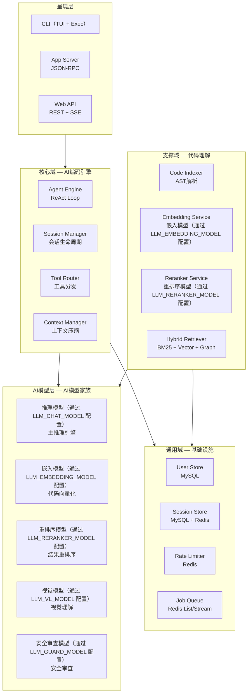
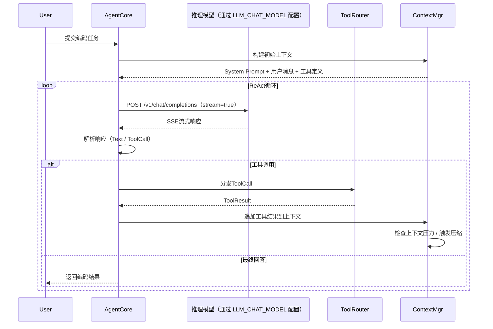
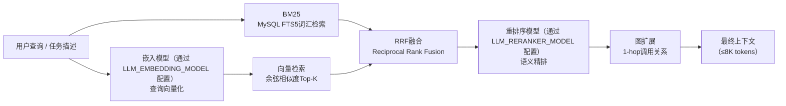
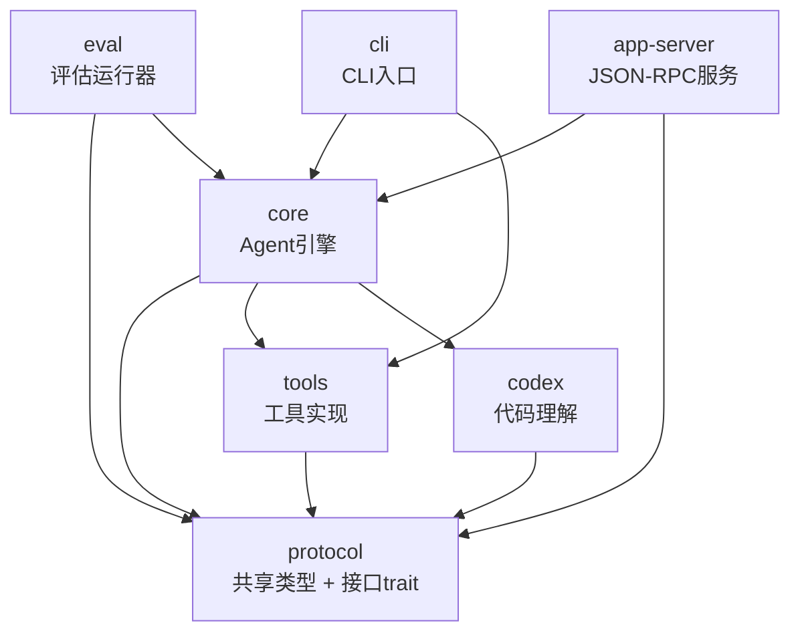
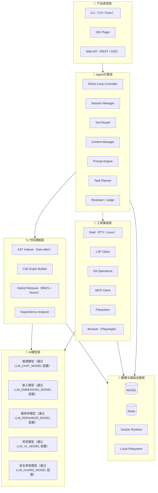
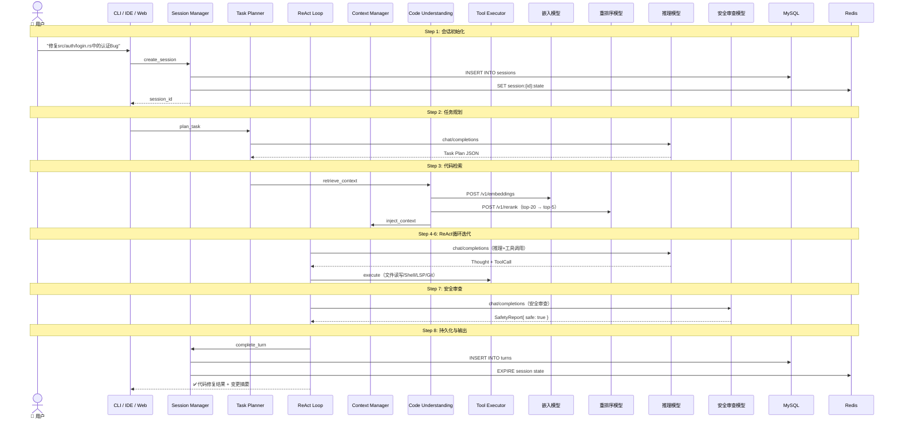
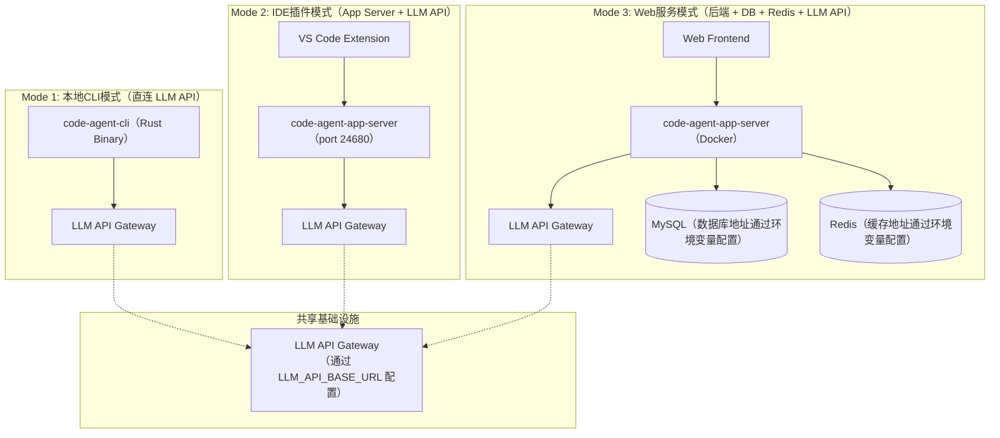
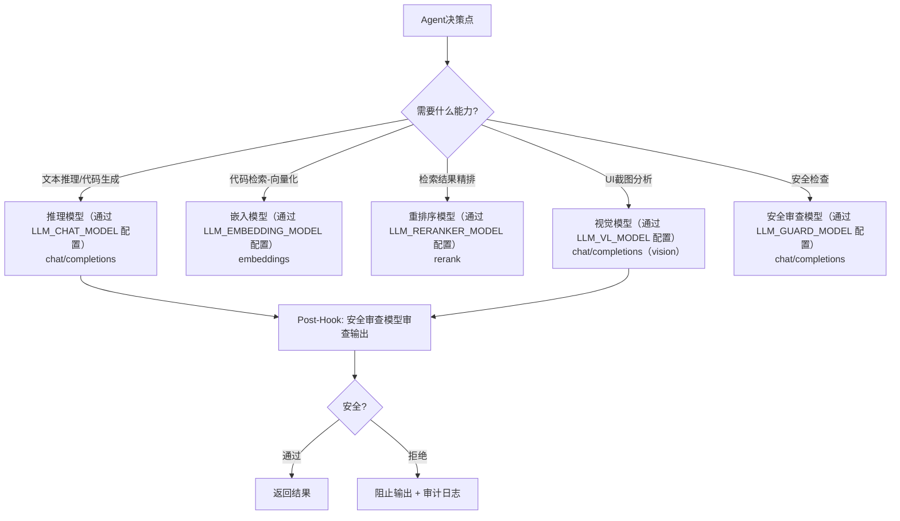

# 定制码匠（CraftCoder）技术设计文档

> **版本**: v1.0  
> **日期**: 2026-07-10  
> **核心模型**: 多模型协同（推理 / 嵌入 / 重排序 / 视觉 / 安全审查）— 各模型通过环境变量 `LLM_*` 配置，支持任何 OpenAI 兼容 API  
> **基础设施**: MySQL + Redis  
> **Agent运行时**: Rust 7-Crate工作区

---

## 目录

1. [设计目标与约束](#1-设计目标与约束)
2. [系统边界与上下文（DDD领域划分）](#2-系统边界与上下文ddd领域划分)
3. [Loop Engineering（循环工程）体系](#3-loop-engineering循环工程体系)
4. [Rust层架构设计](#4-rust层架构设计)
5. [系统架构图](#5-系统架构图)
6. [AI模型集成层设计](#6-ai模型集成层设计)
7. [数据设计](#7-数据设计)
8. [关键接口设计](#8-关键接口设计)
9. [技术可行性分析](#9-技术可行性分析)
10. [设计决策记录（ADR）](#10-设计决策记录adr)
11. [技术栈全景](#11-技术栈全景)

---

## 1. 设计目标与约束

### 1.1 核心设计目标

| 目标 | 描述 | 度量标准 |
|------|------|----------|
| **开源模型原生集成** | 所有AI能力均由多模型家族提供 | 零外部模型API依赖 |
| **私有化部署** | 代码与数据完全驻留在自有基础设施 | 无外网依赖可运行 |
| **高性能Agent循环** | Rust异步运行时驱动ReAct循环 | 单轮延迟 <3s（P95） |
| **企业级数据管理** | MySQL持久化 + Redis缓存 | 1000并发Session支持 |
| **多端统一体验** | CLI / IDE / Web共享同一Agent核心 | JSON-RPC协议统一 |

### 1.2 环境约束

所有 AI 模型通过环境变量配置，支持任何 OpenAI 兼容 API 提供商：

| 配置项 | 环境变量 | 说明 | 是否必填 |
|--------|---------|------|---------|
| API地址 | `LLM_API_BASE_URL` | API 网关地址 | 是 |
| API密钥 | `LLM_API_KEY` | 认证密钥 | 是 |
| 对话模型 | `LLM_CHAT_MODEL` | 核心推理模型名称 | 是 |
| 嵌入模型 | `LLM_EMBEDDING_MODEL` | 代码向量化模型 | 否 |
| 重排序模型 | `LLM_RERANKER_MODEL` | 检索精排模型 | 否 |
| 安全模型 | `LLM_GUARD_MODEL` | 内容安全审查 | 否 |
| 视觉模型 | `LLM_VL_MODEL` | 多模态理解 | 否 |

```
数据库:      MySQL（通过 MYSQL_HOST / MYSQL_PORT / MYSQL_USER / MYSQL_PASSWORD / MYSQL_DATABASE 配置）
缓存:        Redis（通过 REDIS_HOST / REDIS_PORT / REDIS_PASSWORD 配置）
认证:        统一 API Key（Authorization: Bearer <LLM_API_KEY>）
运行时:      Rust 7-Crate Workspace
```

> **注意**: 数据库和缓存地址通过环境变量或配置文件设置，不在此文档中硬编码。

### 1.3 范围约束

**在范围内**：Rust核心Agent引擎（ReAct循环、会话管理、工具路由）、多模型家族全链路集成、MySQL持久化+Redis缓存数据层、CLI（TUI+Headless）/App Server/Web API三端、代码理解引擎（AST索引+混合检索）、工具集成（Shell/LSP/Git/MCP）、评估框架、驾驭工程子系统。

**不在范围内**：自有模型训练或微调、纯云端部署模式、企业SSO/用户管理、移动端客户端、替代版本控制。

---

## 2. 系统边界与上下文（DDD领域划分）

### 2.1 领域划分



### 2.2 限界上下文详细职责

#### 核心域：AI编码引擎（agent-core）

**核心实体**：
- `Session`：一次完整的编码会话，包含多轮Turn
- `Turn`：一次推理-执行-观察循环
- `Message`：User/Assistant/ToolCall/ToolResult四种消息类型
- `ToolCall`：工具调用请求（id, name, arguments）
- `ToolResult`：工具执行结果（tool_call_id, output/error）

**ReAct循环流程**：



#### 支撑域：代码理解（agent-codex）

检索流水线：



---

## 3. Loop Engineering（循环工程）体系

### 3.1 概述

Loop Engineering（循环工程）专注于**ReAct推理循环的工程化治理**。核心原则：循环是一等公民、可观测性是循环的基础设施、循环安全是第一道防线。

### 3.2 循环模式库

| 模式 | 适用场景 | 复杂度 | 成功率 | 典型配置 |
|------|---------|--------|--------|---------|
| **ReAct**（推理+行动） | 通用编码任务 | ★☆☆ | 基准 | Max 15 turns |
| **Plan-Execute**（先计划后执行） | 复杂多步骤任务 | ★★☆ | +15% vs ReAct | Plan 1 turn, Execute N turns |
| **MCTS**（蒙特卡洛树搜索） | 高不确定性的架构决策 | ★★★ | +10% vs best-of-N | 50-200 simulations |
| **Tree-of-Thought**（思维树） | 不可逆操作（生产环境变更） | ★★☆ | +8% vs CoT | 3-5 candidates |
| **Sub-Agent**（子代理并行） | 可并行的独立子任务 | ★★☆ | +67% token节省 | Max 6 agents |

### 3.3 循环可观测性设计

每条循环步骤记录观测数据：

| 字段 | 说明 |
|------|------|
| `turn_number` | 当前Turn编号 |
| `step_type` | Thought/ToolCall/ToolResult/FinalAnswer/Error/Compaction |
| `model` | 模型名称（推理模型（通过 LLM_CHAT_MODEL 配置）） |
| `input_tokens` / `output_tokens` | Token消耗 |
| `latency_ms` | 延迟（毫秒） |
| `tool_name` | 工具名称（如适用） |
| `tool_success` | 工具执行成功标记 |
| `context_utilization_pct` | 当前上下文使用率 |
| `compaction_count` | 压缩触发次数 |

### 3.4 循环安全层

```
┌─────────────────────────────────────────────────┐
│                   Loop Guard                     │
│  Max Turns Guard:  Default 20, 超限→停止         │
│  Token Budget Guard: Default 64K, 超限→强制压缩  │
│  Timeout Guard:     Default 120s, 超限→回滚      │
│  Anomaly Detector:  重复工具调用>3次、Token突增>5x │
│                     相同报错>2次、上下文膨胀>90%    │
└─────────────────────────────────────────────────┘
```

### 3.5 循环测试策略

| 测试层级 | 覆盖内容 | 工具 | 目标 |
|----------|---------|------|------|
| **L1 — 单元测试** | 单步逻辑、消息路由、工具分发 | MockModelClient, MockTool | 单步正确性 |
| **L2 — 轨迹测试** | N步循环序列、工具调用链 | 预定义轨迹 + 断言 | 循环路径正确性 |
| **L3 — 集成测试** | 完整编码任务、真实模型（可选） | Docker沙箱 + LLM API | 端到端功能 |
| **L4 — 压力测试** | 长序列（50-100 turns）、大上下文 | 批量生成工具调用 | 循环稳定性 |
| **L5 — 回归测试** | 每次变更的基准轨迹比对 | insta快照 + 性能门禁 | 无回归退化 |

### 3.6 Loop Engineering与驾驭工程的协同

```
驾驭工程（代码质量治理）          Loop Engineering（循环质量治理）
┌──────────────────────┐        ┌──────────────────────────┐
│ 编码规范 → 代码审查   │  协同  │ 循环设计 → 循环测试       │
│ 质量门禁 → 技术债务   │←─────→│ 循环可观测 → 循环安全     │
│ DORA指标 → 合规审计   │        │ 循环性能 → 循环进化       │
└──────────────────────┘        └──────────────────────────┘
```

---

## 4. Rust层架构设计

### 4.1 Crate依赖关系



### 4.2 各Crate职责

| Crate | 包名 | 职责 | 关键依赖 |
|-------|------|------|----------|
| **protocol** | `code-agent-protocol` | 共享数据类型（AgentMessage, ToolDefinition, SessionState, TurnRecord, CodeContext, EvaluationReport） | serde, serde_json |
| **core** | `code-agent-core` | Agent核心引擎（ReActLoop, SessionManager, ContextManager, ToolRouter, PlannerNode, ReviewerNode） | protocol, tools, codex |
| **tools** | `code-agent-tools` | 工具实现（LSPClient, ShellExecutor, GitOperations, FilesystemOps, MCPAdapter） | protocol |
| **codex** | `code-agent-codex` | 代码理解（ASTParser, CallGraphBuilder, HybridRetriever, DependencyAnalyzer, SymbolResolver） | protocol, tree-sitter |
| **cli** | `code-agent-cli` | CLI二进制（TUI Application, Exec Mode, Configuration Loader） | core, protocol |
| **app-server** | `code-agent-app-server` | IDE后端服务（JSON-RPC Server, WebSocket Server, Event Bus） | core, protocol |
| **eval** | `code-agent-eval` | 评估框架（BenchmarkRunner, MetricCollector, SWEAdapter, HumanEvalAdapter） | core, codex, protocol |

### 4.3 ReAct循环核心实现

```rust
pub struct ReactLoop {
    model: Arc<dyn ModelClient>,
    tools: Arc<ToolRegistry>,
    context: Arc<ContextManager>,
    safety: Arc<SafetyLayer>,
    max_turns: usize,
}

impl ReactLoop {
    pub async fn run(
        &self,
        session: &mut Session,
        user_message: String,
    ) -> Result<Vec<ResponseEvent>, AgentError> {
        let mut turn_count = 0;
        session.add_message(Message::User { content: user_message });

        loop {
            turn_count += 1;
            if turn_count > self.max_turns {
                return Err(AgentError::MaxTurnsExceeded);
            }

            self.context.maybe_compact(session).await?;
            let messages = session.active_messages();
            let tool_defs = self.tools.definitions();

            let response = self.model.stream_chat(&messages, &tool_defs).await?;

            match response {
                ModelResponse::ToolCalls(tool_calls) => {
                    self.safety.review_tool_calls(&tool_calls).await?;
                    let results = self.execute_tools_parallel(tool_calls).await?;
                    session.add_tool_results(&results);
                }
                ModelResponse::FinalAnswer(answer) => {
                    session.add_message(Message::Assistant { content: Some(answer) });
                    break;
                }
            }
        }
        Ok(events)
    }
}
```

### 4.4 驾驭工程子系统

AI Code Review引擎：

```rust
pub struct CodeReviewEngine {
    llm_client: Arc<dyn ModelClient>,       // 核心推理模型（核心审查）
    guard_client: Arc<dyn ModelClient>,       // 安全审查模型（安全审查）
    static_analyzers: Vec<Box<dyn StaticAnalyzer>>,
    team_rules: Vec<CustomRule>,
}

impl CodeReviewEngine {
    pub async fn review(&self, diff: &DiffInput) -> ReviewReport {
        let static_results = self.run_static_analysis(diff).await;
        let ai_reviews = self.run_ai_review(diff, &static_results).await;
        let security_issues = self.run_security_review(diff).await;
        ReviewReport::combine(static_results, ai_reviews, security_issues)
    }
}
```

Review等级定义：

| 等级 | 含义 |
|------|------|
| **Blocker** | 必须修复 — 阻塞合并 |
| **Critical** | 强烈建议修复 — 否则积累技术债务 |
| **Minor** | 值得关注 — 低优先级 |
| **Suggestion** | 优化建议 — 最佳实践 |

---

## 5. 系统架构图

### 5.0 总览：Crate依赖与分层映射

```mermaid
graph TB
    subgraph User["👤 用户界面"]
        CLI["cli crate<br/>CLI / TUI / Exec"]
        VSCODE["code-agent-vscode<br/>VS Code 扩展"]
        WEB["code-agent-web<br/>Web API"]
    end

    subgraph Protocol["📦 共享协议层"]
        PROTOCOL["protocol crate<br/>SessionId / Message / ResponseEvent<br/>ToolCall / CapabilityLevel"]
    end

    subgraph Agent["🧠 Agent引擎层（核心域）"]
        CORE_AGENT["core/agent<br/>Session · ReAct Loop · ThreadManager<br/>SubAgent · ContextManager"]
        CORE_MODEL["core/model<br/>ModelClient trait · Qwen3Client<br/>EmbeddingClient · RerankerClient"]
        CORE_TOOLS["core/tools<br/>Tool trait · ToolRegistry · ToolRouter<br/>PermissionEnforcer"]
        CORE_SAFETY["core/safety<br/>ContentSafetyLayer · Qwen3GuardClient"]
        CORE_FLYWHEEL["core/flywheel<br/>FailureAnalyzer · ImprovementSuggester"]
        CORE_FEEDBACK["core/feedback<br/>FeedbackCollector · Rating"]
        CORE_PERSIST["core/persistence<br/>SessionStore · Resume"]
        CORE_OBSERVE["core/observability<br/>Tracer · OTel Export"]
    end

    subgraph CodeX["🔍 代码理解层（支撑域）"]
        CODEX_INDEX["codex/indexer<br/>CodeIndexer · AST Parser<br/>SymbolStorage"]
        CODEX_GRAPH["codex/graph<br/>CallGraph · DependencyGraph<br/>GraphBuilder"]
        CODEX_RETRI["codex/retrieval<br/>Retriever · BM25 · Vector · Fusion"]
        CODEX_CTX["codex/context<br/>CodeContextBuilder · Cache"]
        CODEX_WATCH["codex/watcher<br/>FileWatcher · IndexSync"]
    end

    subgraph Tools["🔧 工具层（支撑域）"]
        TOOLS_SHELL["tools/shell<br/>SandboxManager · bubblewrap · Docker"]
        TOOLS_LSP["tools/lsp<br/>LspClient · LspServerManager"]
        TOOLS_GIT["tools/git<br/>GitClient · GhClient · SafetyPolicy"]
        TOOLS_MCP["tools/mcp<br/>McpClientManager · McpServer"]
    end

    subgraph Eval["📊 评估层（支撑域）"]
        EVAL_RUNNER["eval<br/>EvalRunner · DockerSandbox"]
        EVAL_ADAPT["eval/adapters<br/>HumanEvalAdapter · SWEBenchAdapter"]
        EVAL_METRIC["eval/metrics<br/>MetricsCalculator · ReportGenerator"]
    end

    subgraph Server["🔗 接入层"]
        APP_SRV["app-server<br/>AppServer · JSON-RPC Handler"]
    end

    subgraph AI["🤖 AI模型层（外部依赖）"]
        LLM["推理模型 API"]
        EMBED["嵌入模型 API"]
        RERANK["重排序模型 API"]
    end

    CLI --> APP_SRV
    VSCODE --> APP_SRV
    WEB -->|"REST/SSE"| APP_SRV

    APP_SRV --> CORE_AGENT

    CORE_AGENT --> PROTOCOL
    CORE_MODEL --> PROTOCOL
    CORE_TOOLS --> PROTOCOL
    CORE_SAFETY --> PROTOCOL

    CORE_AGENT --> CORE_MODEL
    CORE_AGENT --> CORE_TOOLS
    CORE_AGENT --> CORE_SAFETY
    CORE_AGENT --> CODEX_CTX
    CORE_AGENT --> CORE_FLYWHEEL
    CORE_AGENT --> CORE_FEEDBACK
    CORE_AGENT --> CORE_PERSIST
    CORE_AGENT --> CORE_OBSERVE

    CODEX_CTX --> CODEX_RETRI
    CODEX_RETRI --> CODEX_INDEX
    CODEX_RETRI --> CODEX_GRAPH
    CODEX_RETRI --> CODEX_WATCH

    CORE_TOOLS --> TOOLS_SHELL
    CORE_TOOLS --> TOOLS_LSP
    CORE_TOOLS --> TOOLS_GIT
    CORE_TOOLS --> TOOLS_MCP

    CORE_AGENT --> EVAL_RUNNER
    EVAL_RUNNER --> EVAL_ADAPT
    EVAL_RUNNER --> EVAL_METRIC

    CORE_MODEL -->|"OpenAI-compatible HTTP"| LLM
    CORE_MODEL -->|"OpenAI-compatible HTTP"| EMBED
    CORE_MODEL -->|"OpenAI-compatible HTTP"| RERANK

    style CLI fill:#d4e6f1,stroke:#2980b9
    style VSCODE fill:#d4e6f1,stroke:#2980b9
    style WEB fill:#d4e6f1,stroke:#2980b9
    style PROTOCOL fill:#f9e79f,stroke:#f1c40f
    style APP_SRV fill:#d5f5e3,stroke:#27ae60
```



### 5.0.1 限界上下文与Crate映射

| DDD 领域类型 | Crate | 核心聚合根 | 领域服务 |
|-------------|-------|-----------|---------|
| **核心域** | `core` | Session | ReAct Loop, ToolRouter, ContextManager |
| **支撑域：代码理解** | `codex` | CodeIndexer, Retriever | GraphBuilder, CodeContextBuilder |
| **支撑域：工具集成** | `tools` | SandboxManager, LspClient | GitClient, McpClientManager |
| **支撑域：评估** | `eval` | EvalRunner | HumanEvalAdapter, MetricsCalculator |
| **通用域：共享协议** | `protocol` | — | —（纯值对象） |
| **通用域：接入层** | `app-server` | AppServer | JSON-RPC 请求处理 |
| **展现层** | `cli` / `code-agent-vscode` / `code-agent-web` | — | 用户交互处理 |
| **外部依赖：AI模型** | — | — | 推理/嵌入/重排序 API 客户端 |

### 5.1 六层分层架构



### 5.2 层间通信协议

| 交互方向 | 协议 | 说明 |
|----------|------|------|
| L1 → L2 | JSON-RPC 2.0 | CLI/IDE/Web通过统一协议与Agent Engine通信 |
| L2 → L3 | Internal Function Calls | Rust同步/异步函数调用（零序列化开销） |
| L2 → L4 | MCP（Model Context Protocol） | 工具调用与结果返回 |
| L3 → L5 | OpenAI-compatible HTTP API | Embedding & Reranker请求 |
| L4 → L5 | OpenAI-compatible HTTP API | LLM / Vision / Guard请求 |
| L2/L3/L4 → L6 | TCP / Native FS | 数据库连接（sqlx）+ Redis（fred）+ 文件系统（tokio::fs） |

### 5.3 完整8步数据流



### 5.4 部署架构

三种部署模式：



| 维度 | Mode 1: CLI | Mode 2: IDE Plugin | Mode 3: Web Service |
|------|-------------|-------------------|---------------------|
| **目标用户** | 个人开发者 | IDE用户 | 团队 / SaaS |
| **二进制数** | 1（cli） | 2（cli + app-server） | 2（app-server + 可选cli） |
| **端口占用** | 无 | localhost:24680 | 0.0.0.0:8080 |
| **数据库** | 无（可选SQLite） | MySQL + Redis | MySQL + Redis |
| **部署复杂度** | 最小 | 中等 | 最高（Docker Compose） |
| **冷启动时间** | <100ms | <500ms | <5s（Docker） |

---

## 6. AI模型集成层设计

### 6.1 多模型家族角色矩阵

| 模型 | 端点 | 角色 | 调用时机 |
|------|------|------|----------|
| **推理模型（通过 LLM_CHAT_MODEL 配置）** | `/v1/chat/completions` | 主推理引擎 | 每一轮Agent推理 |
| **嵌入模型（通过 LLM_EMBEDDING_MODEL 配置）** | `/v1/embeddings` | 代码向量化 | 代码库索引、检索查询 |
| **重排序模型（通过 LLM_RERANKER_MODEL 配置）** | `/v1/rerank` | 检索结果精排 | RRF融合后的Top-K重排序 |
| **视觉模型（通过 LLM_VL_MODEL 配置）** | `/v1/chat/completions` | UI截图分析 | 按需触发 |
| **安全审查模型（通过 LLM_GUARD_MODEL 配置）** | `/v1/chat/completions` | 安全审查 | 每次Turn |

### 6.2 模型路由策略



### 6.3 API调用矩阵

| 端点 | 方法 | 模型参数 | 用途 | 超时 |
|------|------|----------|------|------|
| `/v1/chat/completions` | POST | `LLM_CHAT_MODEL` 环境变量 | ReAct推理、代码生成、规划 | 120s |
| `/v1/chat/completions` | POST | `LLM_VL_MODEL` 环境变量 | 截图分析、UI验证 | 60s |
| `/v1/chat/completions` | POST | `LLM_GUARD_MODEL` 环境变量 | 生成代码安全审查 | 30s |
| `/v1/embeddings` | POST | `LLM_EMBEDDING_MODEL` 环境变量 | 代码向量化检索 | 30s |
| `/v1/rerank` | POST | `LLM_RERANKER_MODEL` 环境变量 | 检索结果重排序 | 15s |

### 6.4 LLM API客户端实现

```rust
pub struct ModelApiClient {
    client: Client,
    base_url: String,       // 从 LLM_API_BASE_URL 环境变量读取
    api_key: String,        // 从 LLM_API_KEY 环境变量读取
    chat_model: String,     // 从 LLM_CHAT_MODEL 环境变量读取
    embed_model: String,    // 从 LLM_EMBEDDING_MODEL 环境变量读取
    rerank_model: String,   // 从 LLM_RERANKER_MODEL 环境变量读取
    vision_model: String,   // 从 LLM_VL_MODEL 环境变量读取
    guard_model: String,    // 从 LLM_GUARD_MODEL 环境变量读取
}

impl ModelApiClient {
    pub fn from_env() -> Self {
        let client = Client::builder()
            .timeout(Duration::from_secs(120))
            .pool_max_idle_per_host(20)
            .build()
            .expect("Failed to create HTTP client");
        Self {
            client,
            base_url: std::env::var("LLM_API_BASE_URL").expect("LLM_API_BASE_URL not set"),
            api_key: std::env::var("LLM_API_KEY").expect("LLM_API_KEY not set"),
            chat_model: std::env::var("LLM_CHAT_MODEL").expect("LLM_CHAT_MODEL not set"),
            embed_model: std::env::var("LLM_EMBEDDING_MODEL").unwrap_or_default(),
            rerank_model: std::env::var("LLM_RERANKER_MODEL").unwrap_or_default(),
            vision_model: std::env::var("LLM_VL_MODEL").unwrap_or_default(),
            guard_model: std::env::var("LLM_GUARD_MODEL").unwrap_or_default(),
        }
    }
}
```

### 6.5 安全审查模型安全审查流程

Guard模型在以下节点进行审查：
1. **工具调用前**：审查工具调用参数是否包含危险操作
2. **工具执行后**：审查工具返回结果是否包含提示注入
3. **最终输出前**：审查Agent最终回答是否包含违规内容

配置模式：`off`（跳过所有审查）、`warn`（审查但仅日志告警）、`block`（审查并阻止不安全操作，生产默认）。

---

## 7. 数据设计

### 7.1 MySQL表结构

#### 会话表（sessions）

```sql
CREATE TABLE sessions (
    id              VARCHAR(64) PRIMARY KEY,
    title           VARCHAR(512) NOT NULL DEFAULT '',
    model           VARCHAR(128) NOT NULL,
    status          ENUM('active', 'completed', 'archived', 'error') NOT NULL DEFAULT 'active',
    permission_mode ENUM('auto', 'permit', 'block') NOT NULL DEFAULT 'permit',
    capability_level ENUM('read', 'edit', 'exec') NOT NULL DEFAULT 'edit',
    total_turns     INT UNSIGNED NOT NULL DEFAULT 0,
    total_tokens    BIGINT UNSIGNED NOT NULL DEFAULT 0,
    cwd             VARCHAR(1024) NOT NULL DEFAULT '',
    metadata        JSON,
    created_at      DATETIME(3) NOT NULL DEFAULT CURRENT_TIMESTAMP(3),
    updated_at      DATETIME(3) NOT NULL DEFAULT CURRENT_TIMESTAMP(3) ON UPDATE CURRENT_TIMESTAMP(3),
    INDEX idx_status (status),
    INDEX idx_created_at (created_at)
) ENGINE=InnoDB DEFAULT CHARSET=utf8mb4 COLLATE=utf8mb4_unicode_ci;
```

#### 消息表（messages）

```sql
CREATE TABLE messages (
    id              BIGINT UNSIGNED AUTO_INCREMENT PRIMARY KEY,
    session_id      VARCHAR(64) NOT NULL,
    turn_id         INT UNSIGNED NOT NULL,
    role            ENUM('user', 'assistant', 'tool') NOT NULL,
    content         MEDIUMTEXT,
    tool_call_id    VARCHAR(64),
    tool_name       VARCHAR(128),
    tool_arguments  JSON,
    token_count     INT UNSIGNED NOT NULL DEFAULT 0,
    created_at      DATETIME(3) NOT NULL DEFAULT CURRENT_TIMESTAMP(3),
    INDEX idx_session_turn (session_id, turn_id),
    CONSTRAINT fk_message_session FOREIGN KEY (session_id) REFERENCES sessions(id) ON DELETE CASCADE
) ENGINE=InnoDB DEFAULT CHARSET=utf8mb4 COLLATE=utf8mb4_unicode_ci;
```

#### 工具调用记录表（tool_calls）

```sql
CREATE TABLE tool_calls (
    id              VARCHAR(64) PRIMARY KEY,
    session_id      VARCHAR(64) NOT NULL,
    turn_id         INT UNSIGNED NOT NULL,
    tool_name       VARCHAR(128) NOT NULL,
    arguments       JSON NOT NULL,
    output          MEDIUMTEXT,
    error           VARCHAR(2048),
    duration_ms     INT UNSIGNED NOT NULL DEFAULT 0,
    success         BOOLEAN NOT NULL DEFAULT TRUE,
    created_at      DATETIME(3) NOT NULL DEFAULT CURRENT_TIMESTAMP(3),
    INDEX idx_session (session_id),
    FOREIGN KEY (session_id) REFERENCES sessions(id) ON DELETE CASCADE
) ENGINE=InnoDB DEFAULT CHARSET=utf8mb4 COLLATE=utf8mb4_unicode_ci;
```

#### 驾驭工程表（gov_code_reviews, gov_tech_debt, gov_metrics）

```sql
CREATE TABLE gov_code_reviews (
    id              BIGINT AUTO_INCREMENT PRIMARY KEY,
    repo            VARCHAR(255) NOT NULL,
    pr_number       INT,
    commit_sha      VARCHAR(64),
    total_comments  INT DEFAULT 0,
    blocker_count   INT DEFAULT 0,
    critical_count  INT DEFAULT 0,
    auto_fix_applied INT DEFAULT 0,
    review_duration_ms INT,
    report          JSON,
    created_at      TIMESTAMP DEFAULT CURRENT_TIMESTAMP
);

CREATE TABLE gov_tech_debt (
    id              BIGINT AUTO_INCREMENT PRIMARY KEY,
    repo            VARCHAR(255) NOT NULL,
    file_path       VARCHAR(500),
    debt_type       ENUM('architecture','code_smell','test_gap','doc_gap','security','performance','dependency'),
    title           VARCHAR(500) NOT NULL,
    risk_score      DECIMAL(3,2),
    estimated_hours DECIMAL(8,2),
    priority        DECIMAL(5,2),
    status          ENUM('open','in_progress','fixed','accepted','wont_fix') DEFAULT 'open',
    auto_fix_pr     VARCHAR(500),
    INDEX idx_priority (priority DESC)
);
```

### 7.2 Redis数据结构

| Key Pattern | 类型 | 用途 | TTL |
|-------------|------|------|-----|
| `session:{id}:cache` | Hash | 活跃Session热缓存 | 30min |
| `session:{id}:messages` | List | 最近N轮消息（JSON） | 30min |
| `session:{id}:lock` | String（NX） | Session互斥锁 | 10s |
| `rate_limit:{user_id}` | Sorted Set | 用户API调用速率限制 | 1min |
| `job:queue:eval` | List | 评估任务队列 | — |
| `embedding:cache:{hash}` | String | 文本嵌入向量缓存 | 24h |
| `search:cache:{query_hash}` | String | 检索结果缓存 | 5min |

### 7.3 向量存储方案

采用MySQL JSON列存储向量 + Rust应用层SIMD加速余弦相似度计算。检索流程：FTS5 BM25粗筛 → 向量Top-K → Reranker精排。代码符号量级在10K-500K时MySQL可承载，超过100万可迁移至专用向量数据库（Milvus/Qdrant）。

```rust
// SIMD加速余弦相似度
fn cosine_similarity_simd(a: &[f32], b: &[f32]) -> f32 {
    // 8路并行f32x8 SIMD计算
    let chunks = n / 8;
    for i in 0..chunks {
        let va = f32x8::from_slice(&a[i * 8..]);
        let vb = f32x8::from_slice(&b[i * 8..]);
        dot += (va * vb).reduce_sum();
        norm_a += (va * va).reduce_sum();
        norm_b += (vb * vb).reduce_sum();
    }
    dot / (norm_a.sqrt() * norm_b.sqrt() + 1e-8)
}
```

---

## 8. 关键接口设计

### 8.1 Agent ↔ LLM API

**Chat Completions请求**：

```json
POST /v1/chat/completions
Authorization: Bearer ${LLM_API_KEY}

{
    "model": "${LLM_CHAT_MODEL}",
    "messages": [
        {"role": "system", "content": "<系统提示词>"},
        {"role": "user", "content": "<用户任务>"}
    ],
    "tools": [
        {
            "type": "function",
            "function": {
                "name": "read_file",
                "description": "读取指定文件内容",
                "parameters": {
                    "type": "object",
                    "properties": {
                        "file_path": {"type": "string", "description": "文件路径"},
                        "offset": {"type": "integer"},
                        "limit": {"type": "integer"}
                    },
                    "required": ["file_path"]
                }
            }
        }
    ],
    "stream": true,
    "temperature": 0.7,
    "max_tokens": 4096
}
```

### 8.2 App Server JSON-RPC接口

```
传输层: stdio（默认）/ TCP（可选）
协议: JSON-RPC 2.0

方法列表:
  thread.start    → 创建新会话线程
  thread.resume   → 恢复已有会话
  thread.fork     → 从检查点分叉新线程
  thread.list     → 列出所有线程
  thread.archive  → 归档线程
  turn.submit     → 提交用户消息，开始新轮次
  turn.interrupt  → 中断当前轮次
  event.subscribe → 订阅线程事件流（SSE）
  tool.list       → 列出可用工具
  config.get      → 获取配置
  config.set      → 更新配置
```

**请求/响应示例**：

```json
// → 请求
{"jsonrpc":"2.0","id":1,"method":"turn.submit","params":{"thread_id":"ses_abc123","message":"修复登录Bug"}}

// ← 响应（事件流）
{"jsonrpc":"2.0","method":"event","params":{"type":"TurnStarted","turn_id":3}}
{"jsonrpc":"2.0","method":"event","params":{"type":"AgentMessageDelta","content":"我来分析..."}}
{"jsonrpc":"2.0","method":"event","params":{"type":"ToolCallBegin","tool":"read_file","args":{...}}}
{"jsonrpc":"2.0","method":"event","params":{"type":"TurnCompleted","turn_id":3,"answer":"..."}}
```

### 8.3 Tool Protocol接口

```rust
/// 工具定义（用于发送给模型）
impl Tool {
    fn to_function_definition(&self) -> serde_json::Value { ... }
    async fn execute(&self, arguments: serde_json::Value) -> ToolResult;
}

/// 工具注册表
struct ToolRegistry {
    tools: HashMap<String, Arc<dyn Tool>>,
}
impl ToolRegistry {
    fn register(&mut self, tool: Arc<dyn Tool>);
    fn get(&self, name: &str) -> Option<Arc<dyn Tool>>;
    fn definitions(&self) -> Vec<serde_json::Value>;
}
```

---

## 9. 技术可行性分析

### 9.1 推理模型（通过 LLM_CHAT_MODEL 配置）编程Agent推理能力评估

| 基准测试 | 推理模型（通过 LLM_CHAT_MODEL 配置） | Claude 4.5 Opus | GPT-5-mini |
|:---|:---:|:---:|:---:|
| **SWE-bench Verified** | **77.2** | 80.9 | 72.0 |
| **SWE-bench Pro** | **53.5** | 57.1 | — |
| **Terminal-Bench 2.0** | **59.3** | 59.3 | 31.9 |
| **LiveCodeBench v6** | **83.9** | 84.8 | 80.5 |
| **BFCL-V4（函数调用）** | **68.5** | — | 55.5 |

结论：推理模型（通过 LLM_CHAT_MODEL 配置）在SWE-bench Verified达到77.2%，Terminal-Bench 2.0持平Opus，完全具备作为编程Agent核心引擎的能力。

### 9.2 模型推理延迟估算（NVFP4量化，单GPU）

| 硬件 | Median tok/s | 上下文 | 场景 |
|------|:---:|:---:|------|
| DGX Spark（GB10） | ~38 tok/s | 128K | 编码Agent |
| RTX PRO 6000 | ~92 tok/s | 128K | 生产级推理 |
| RTX 5090 | ~111 tok/s | 128K | 高端消费级 |

单次ReAct循环延迟构成（DGX Spark基准）：LLM推理~13s + 嵌入生成~0.3s + 重排序~0.2s + Guard审核~0.5s + 工具执行0.1-5s = **14-19s/轮**。

### 9.3 部署硬件需求

**方案A：API代理模式（推荐）**
- 所有模型通过统一 API 端点（`LLM_API_BASE_URL` 环境变量）调用
- 本地仅需Agent Runtime（Rust二进制），无需GPU
- 延迟增加网络往返（估计50-200ms）

**方案B：生产级多卡部署**
- GPU 1（RTX PRO 6000 / A100 80GB）：推理模型（通过 LLM_CHAT_MODEL 配置）（主推理）
- GPU 2（A10 / RTX 4090 24GB）：嵌入模型（通过 LLM_EMBEDDING_MODEL 配置） + 重排序模型（通过 LLM_RERANKER_MODEL 配置）
- GPU 3（A10 / RTX 4090 24GB）：视觉模型（通过 LLM_VL_MODEL 配置） + 安全审查模型（通过 LLM_GUARD_MODEL 配置）

### 9.4 存储容量估算

| 数据类别 | 单条大小 | 月存储 |
|:---|:---|:---|
| 会话记录（含消息） | ~50KB | ~150MB |
| 代码索引嵌入 | ~16KB/chunk | ~240MB |
| 用户反馈 | ~1KB | ~600KB |
| **MySQL总计** | — | **~400MB/月** |
| Redis缓存 | — | ~2GB常驻 |

---

## 10. 设计决策记录（ADR）

### ADR-1: 为什么选择推理模型（通过 LLM_CHAT_MODEL 配置）而非闭源模型

**决策**：采用开源大语言模型作为核心推理引擎。

**理由**：①私有化部署，代码数据不外传；②不依赖OpenAI/Anthropic等外部API；③自托管推理，无按Token计费的外部API费用；④27B参数具备强大的代码理解和生成能力；⑤Apache 2.0完全开源。

**后果**：需自行维护模型部署和推理服务；需安全审查模型补充安全审查。

### ADR-2: OpenAI兼容API适配策略

**决策**：使用`reqwest`直接实现OpenAI-compatible客户端，不使用`async-openai`等第三方SDK。

**理由**：①多端点需求（chat/completions + embeddings + rerank），第三方SDK不支持rerank；②完全控制重试、超时、连接池参数；③减少依赖；④`reqwest` + `serde_json` + `tokio`已足够。

### ADR-3: "Uncensored"模型安全管控（安全审查模型）

**决策**：使用安全审查模型（通过 LLM_GUARD_MODEL 配置）作为独立安全审查层。

**理由**：①关注点分离——推理模型专注编码，安全模型独立审查；②安全审查模型专为审查设计；③Guard不可用时降级为规则引擎；④所有审查决策记录到MySQL。

### ADR-4: MySQL主存储 + Redis缓存

**决策**：MySQL持久化主存储，Redis热缓存和队列。

**理由**：①已有基础设施；②ACID事务保证Session状态一致性；③MySQL 8.0+ JSON原生支持；④FTS5全文检索支持BM25粗筛。

### ADR-5: Rust作为Agent运行时

**决策**：采用Rust（7-Crate Workspace）。

**理由**：①性能——Agent循环CPU密集型（JSON解析、上下文处理、向量计算），Rust零成本抽象+SIMD；②内存安全——长时间运行无GC；③单二进制部署，无运行时依赖；④`tokio`异步运行时原生支持高并发；⑤跨平台编译。

### ADR-6: Embedding + Reranker双阶段检索

**决策**：三阶段混合检索：BM25粗筛 → 嵌入模型（通过 LLM_EMBEDDING_MODEL 配置）向量检索 → 重排序模型（通过 LLM_RERANKER_MODEL 配置）语义精排 → 图扩展。

| 阶段 | Token预算 | 说明 |
|------|:---:|------|
| BM25粗筛 | 0 | MySQL索引查询 |
| 向量Top-50 | 0 | 应用层余弦相似度 |
| Reranker Top-20 | ~500 | 仅发送query + 20个候选 |
| 最终上下文 | ≤8K | 优先级截断 |

### ADR-7: JSON-RPC App Server多端统一

**决策**：JSON-RPC 2.0 App Server作为统一后端协议。

**理由**：①CLI/VS Code/Web通过同一套JSON-RPC交互；②stdio（本地）+ TCP（远程）双传输；③服务端可主动推送事件；④MCP兼容。

### ADR-8: 数据飞轮与反馈回路

**决策**：在"不微调模型"约束下实现提示层优化飞轮。

执行追踪收集 → 失败聚类分析 → 提示/工具描述优化 → 部署 → 更多追踪。通过MySQL记录每轮Turn数据，按tool_name + error_type + language聚类失败模式，A/B测试工具描述优化效果。

### ADR-9: 向量存储选型 — MySQL JSON vs 专用向量数据库

**决策**：MySQL JSON列存储向量 + Rust应用层SIMD余弦相似度。

**理由**：代码符号规模可控（10K-500K）；不引入额外组件；BM25缩小检索范围；SIMD加速。

### ADR-10: 子Agent编排策略

**决策**：Coordinator-Worker模式，限制深度2层，最多6并发Worker。

**理由**：行业验证（Claude Code/Codex CLI）；Token效率（约67%降低Token消耗）；失败隔离；Git Worktree隔离。

---

## 11. 技术栈全景

### 11.1 分层技术栈

| 层级 | 组件 | 技术选型 | 版本/配置 |
|------|------|----------|-----------|
| **产品表现层** | CLI | Ratatui（Rust TUI） | 0.28+ |
| | IDE Plugin | TypeScript + VS Code Extension API | VS Code 1.95+ |
| | Web前端 | React 19 + Next.js 15 | Node.js 22 |
| | 通信协议 | JSON-RPC 2.0 / WebSocket / SSE | — |
| **Agent引擎层** | 运行时 | Rust（tokio async runtime） | Rust 1.80+, tokio 1.x |
| | 控制循环 | Self-built ReAct Loop | max 30 turns |
| | 任务规划 | Chain-of-Thought + Plan-and-Execute | 推理模型（通过 LLM_CHAT_MODEL 配置）驱动 |
| | 上下文管理 | 5-layer compaction | 70%/85%/95%阈值 |
| **代码理解层** | AST解析 | tree-sitter（WASM Runtime） | 100+语言语法 |
| | 调用图 | Static Call Graph | SQLite存储 |
| | 向量检索 | Hybrid Retriever（BM25 + Dense Vector） | RRF fusion |
| **工具集成层** | Shell | PTY-based executor | Linux/WSL/macOS |
| | LSP | agent-lsp inspired MCP bridge | 30+语言支持 |
| | Git | libgit2 binding（git2 crate） | 原子操作 |
| | MCP Client | Custom Rust MCP client | MCP 2024-11-05 |
| **AI模型层** | LLM Core | 推理模型（通过 LLM_CHAT_MODEL 配置） | 通过 `LLM_API_BASE_URL` 配置 |
| | Embedding | 嵌入模型（通过 LLM_EMBEDDING_MODEL 配置） | 通过 `LLM_API_BASE_URL` 配置 |
| | Reranker | 重排序模型（通过 LLM_RERANKER_MODEL 配置） | top-20→top-5 |
| | Vision | 视觉模型（通过 LLM_VL_MODEL 配置） | 通过 `LLM_API_BASE_URL` 配置 |
| | Safety Guard | 安全审查模型（通过 LLM_GUARD_MODEL 配置） | risk_score 0-1 |
| **数据层** | 数据库 | MySQL 8.0 | 通过 `MYSQL_HOST` 等环境变量配置 |
| | 缓存 | Redis 7.x | 通过 `REDIS_HOST` 等环境变量配置 |
| | 索引缓存 | SQLite 3.x（WAL mode） | 本地嵌入式 |

### 11.2 关键性能指标

| 指标 | 目标值 | 测量方法 |
|------|--------|----------|
| Agent单轮延迟（P95） | <3s | OpenTelemetry Span |
| 上下文压缩时间 | <1s | Compaction Span |
| 代码检索（P95） | <500ms | HybridRetriever Span |
| Session启动时间 | <200ms | Session::new()计时 |
| Session恢复时间 | <100ms | SessionStore::resume()计时 |
| API调用成功率 | >99.5% | 重试后成功率 |
| 安全审查模型审查延迟 | <500ms | Guard Span |

### 11.3 外部依赖与基础设施

| 组件 | 地址 | 协议 | 用途 |
|------|------|------|------|
| LLM API Gateway | 通过 `LLM_API_BASE_URL` 环境变量配置 | HTTPS / OpenAI-compatible | 所有AI推理请求 |
| MySQL | 通过 `MYSQL_HOST:MYSQL_PORT` 环境变量配置 | TCP / MySQL Protocol | 会话持久化、评估数据 |
| Redis | 通过 `REDIS_HOST:REDIS_PORT` 环境变量配置 | TCP / Redis Protocol | 会话状态缓存、限流 |
| SQLite | `<workspace>/.code-agent/index.db` | 本地文件 | 代码索引缓存 |
| Language Servers | 系统PATH | stdio / TCP via MCP | LSP代码智能 |
| Docker | 系统daemon | Unix Socket / TCP | 容器化部署与隔离 |

---

*文档版本 v1.0 | 2026-07-10 | 基于多模型家族 + Rust 7-Crate工作区 + MySQL/Redis基础设施*
