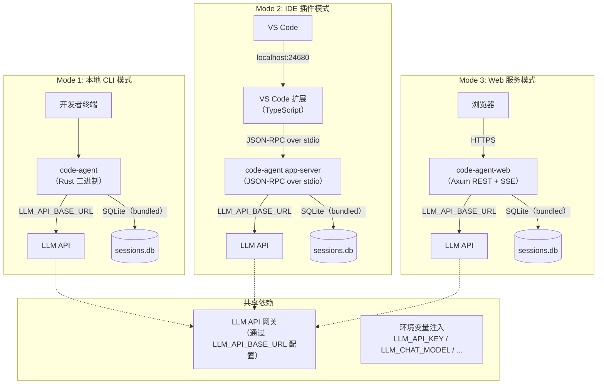
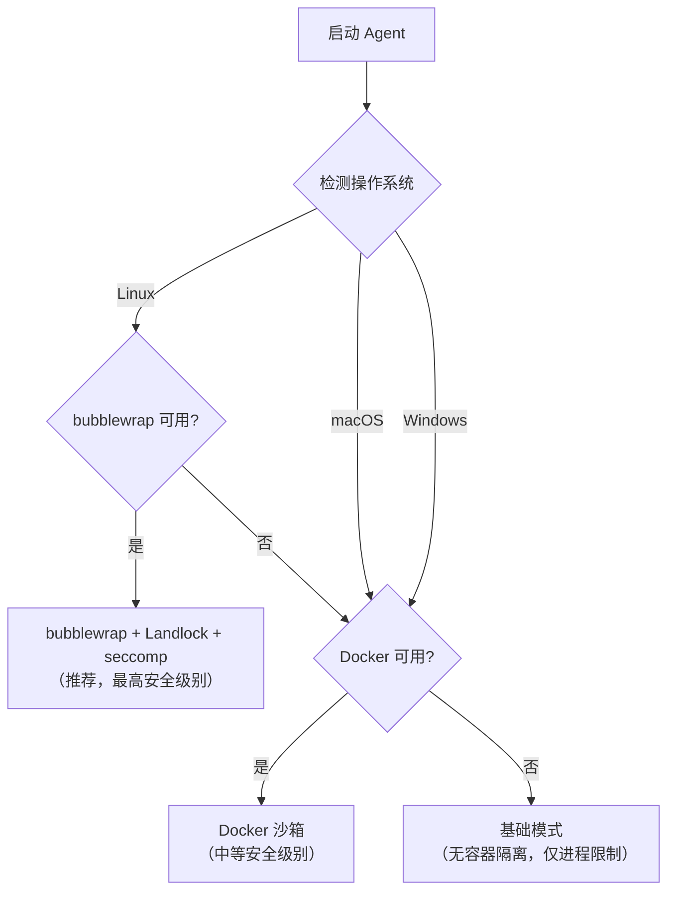

# 定制码匠（CraftCoder）部署手册


---

## 目录

1. [系统要求](#1-系统要求)
2. [环境参数配置](#2-环境参数配置)
3. [编译与安装](#3-编译与安装)
4. [配置文件说明](#4-配置文件说明)
5. [部署架构图](#5-部署架构图)
6. [沙箱配置](#6-沙箱配置)
7. [升级与回滚](#7-升级与回滚)
8. [故障排除](#8-故障排除)

---

## 1. 系统要求

### 1.1 硬件要求

| 部署模式 | CPU | 内存 | 磁盘 | GPU（可选） |
|----------|-----|------|------|-------------|
| **CLI模式（最小）** | 2核 | 4GB | 1GB | 不需要 |
| **App Server模式** | 4核 | 8GB | 10GB | 不需要 |
| **Web服务模式** | 8核 | 16GB | 50GB SSD | 不需要 |

> 当前环境使用 API 代理模式（无需本地 GPU），所有模型通过 `https://<your-api-host>/v1/` 远程调用。如果你有本地 GPU，也可以用 vLLM、Ollama 或 llama.cpp 部署本地推理服务。

### 1.2 操作系统支持

| 操作系统 | 架构 | 最低版本 | 备注 |
|----------|------|----------|------|
| **Linux** | x86_64, aarch64 | Ubuntu 20.04+ / CentOS 8+ / Debian 11+ | 推荐平台，支持 bubblewrap 沙箱 |
| **macOS** | x86_64, arm64（Apple Silicon） | macOS 13 Ventura+ | Docker fallback 沙箱 |
| **Windows** | x86_64 | Windows 10 21H2+ / Windows Server 2022+ | Docker fallback 沙箱，WSL2 推荐 |

### 1.3 依赖软件

| 组件 | 最低版本 | 用途 | 安装方式 |
|------|----------|------|----------|
| **Rust Toolchain** | 1.80+ | 编译 Agent 核心 | `curl --proto '=https' --tlsv1.2 -sSf https://sh.rustup.rs \| sh` |
| **Git** | 2.40+ | 版本控制集成 | 操作系统包管理器 |
| **Docker**（可选） | 24.0+ | 沙箱执行 | 操作系统包管理器或 Docker Desktop |

**不需要安装的组件**（因为 CraftCoder 使用内嵌方式）：

- **不需要安装 SQLite** — Rust 的 `rusqlite` crate 使用 bundled 模式，SQLite 的 C 代码直接编译进二进制文件。你不需要在系统上安装任何 SQLite 库。
- **不需要安装 MySQL** — 项目使用 SQLite 作为唯一数据库，没有 MySQL 依赖。
- **不需要安装 Redis** — 项目没有缓存服务器依赖，所有状态直接存储在 SQLite 中。
- **不需要安装 Node.js / Python** — 除非你要开发 VS Code 扩展或运行评估套件。

### 1.4 网络要求

| 目标地址 | 端口 | 协议 | 用途 |
|----------|------|------|------|
| `<your-api-host>` | 443 | HTTPS | LLM 模型 API 调用（必需） |

只需要一个 LLM API 地址。没有数据库服务器需要连接，没有缓存服务器需要连接。

---

## 2. 环境参数配置

### 2.1 LLM API 配置

CraftCoder 通过环境变量配置 LLM 连接。所有环境变量都是可选的，但 `LLM_API_KEY` 和 `LLM_CHAT_MODEL` 是运行所必需的（除非你在配置文件中指定了它们）。

API 端点格式：`https://<your-api-host>/v1/`

| 环境变量 | 默认值 | 必需？ | 说明 |
|----------|--------|--------|------|
| `LLM_API_BASE_URL` | `https://api.openai.com/v1` | 否 | API 基础 URL。指向任何兼容 OpenAI Chat Completions 格式的服务 |
| `LLM_API_KEY` | — | **是** | API 密钥。所有模型共用同一个密钥 |
| `LLM_CHAT_MODEL` | — | **是** | 核心对话模型名称，例如 `gpt-4o`、`qwen3.6-27b`、`claude-sonnet-4-20250514` |
| `LLM_EMBEDDING_MODEL` | — | 否 | 嵌入模型名称，用于代码搜索的向量化 |
| `LLM_RERANKER_MODEL` | — | 否 | 重排序模型名称，用于搜索结果重排 |
| `LLM_VL_MODEL` | — | 否 | 视觉模型名称，用于图片理解 |
| `LLM_GUARD_MODEL` | — | 否 | 安全守卫模型名称，用于内容安全审查 |

**为什么只需要一个 API 地址？** CraftCoder 使用统一的 Provider 抽象层。所有模型（对话、嵌入、重排序、视觉、安全）都通过同一个 API 端点访问，只是使用不同的模型名称。这意味着你只需要配置一个 API 服务，就可以使用它的全部模型能力。

**支持的 API 服务**：任何兼容 OpenAI Chat Completions API 的服务都可以使用，包括：

- OpenAI / Azure OpenAI
- Anthropic（通过兼容层）
- 本地部署的 vLLM、Ollama、llama.cpp
- 各类开源模型推理服务

### 2.2 API 速率限制配置

| 环境变量 | 默认值 | 说明 |
|----------|--------|------|
| `LLM_RATE_LIMIT_CHAT_RPM` | 60 | Chat 接口每分钟最大请求数 |
| `LLM_RATE_LIMIT_EMBED_RPM` | 200 | Embedding 接口每分钟最大请求数 |
| `LLM_RATE_LIMIT_RERANK_RPM` | 300 | Reranker 接口每分钟最大请求数 |

### 2.3 请求认证格式

```
POST /v1/chat/completions HTTP/1.1
Host: <your-api-host>
Authorization: Bearer <LLM_API_KEY>
Content-Type: application/json
```

所有 LLM 模型 API 调用使用统一的 `Authorization: Bearer` 认证头。

---

## 3. 编译与安装

### 3.1 从源码编译（推荐）

```bash
# 1. 克隆仓库
git clone <repository-url> code-agent-rs
cd code-agent-rs

# 2. 编译 Release 版本
cargo build --release

# 3. 安装到系统 PATH
# Linux / macOS
sudo cp target/release/code-agent /usr/local/bin/

# Windows（PowerShell 管理员）
Copy-Item target\release\code-agent.exe C:\Windows\System32\
```

### 3.2 Rust 编译原理（为什么第一次慢，后面快）

如果你是第一次接触 Rust 编译，这里解释一下发生了什么：

**为什么第一次编译很慢（5-15 分钟）？**

1. **依赖下载和编译**：Cargo.toml 中声明的所有依赖（比如 `ratatui`、`clap`、`rusqlite`、`tree-sitter` 等）都需要从 crates.io 下载并编译。CraftCoder 有 9 个 crate 和几十个第三方依赖，加起来需要编译大量代码。
2. **LLVM 优化**：`--release` 模式会启用最高级别的优化（`opt-level = 3`），LLVM 后端需要花时间分析代码并生成高效的机器码。这就像写文章时的"精修"阶段，比"草稿"阶段慢得多。
3. **链接时优化（LTO）**：项目配置了 `lto = "fat"`，这意味着链接器会跨 crate 边界做全局优化。这能显著减小二进制体积并提升运行时性能，但代价是链接时间变长。

**为什么后续编译很快（几秒到几十秒）？**

1. **增量编译**：Rust 编译器只重新编译你修改过的文件及其依赖。如果你只改了一个 `.rs` 文件，编译器只需要重新编译那一个文件，然后重新链接。
2. **依赖缓存**：第三方依赖编译一次后就被缓存了。除非你更新了 `Cargo.lock` 或清理了 `target/` 目录，否则依赖不会重新编译。
3. **LLVM 缓存**：LLVM 的优化结果也会被缓存，增量修改不需要重新做全局优化。

**编译产物是什么？**

编译完成后，`target/release/` 目录下会生成三个可执行文件：

| 文件 | 用途 |
|------|------|
| `code-agent.exe`（Windows）或 `code-agent`（Linux/macOS） | CLI/TUI 主程序，也包含 App Server 子命令 |
| `code-agent-web.exe` | Web API 服务（独立二进制） |

这些是**单文件静态链接二进制**，没有外部运行时依赖。你可以直接把二进制文件复制到另一台机器上运行，不需要安装 Rust 或任何库。

### 3.3 Release 编译优化

项目的 `.cargo/config.toml` 包含以下 Release 优化配置：

```toml
[profile.release]
opt-level = 3       # 最高优化级别
lto = "fat"         # 全链接时优化
codegen-units = 1   # 单代码生成单元（更好的优化）
strip = true        # 去除符号表（减小二进制体积）
```

这些配置意味着：编译时间更长，但运行速度更快、二进制体积更小。

### 3.4 平台特定说明

#### Linux

```bash
# 安装编译依赖
sudo apt-get install build-essential pkg-config libssl-dev

# 编译
cargo build --release

# 验证
./target/release/code-agent --version
```

#### macOS

```bash
# Xcode 命令行工具（如未安装）
xcode-select --install

# 编译
cargo build --release

# Apple Silicon（M1/M2/M3）原生二进制
file target/release/code-agent
# 输出: Mach-O 64-bit executable arm64

# 验证
./target/release/code-agent --version
```

#### Windows

```powershell
# 安装 Visual Studio Build Tools（含 C++ 工具链）
# 或使用 winget
winget install Microsoft.VisualStudio.2022.BuildTools

# 编译
cargo build --release

# 验证
.\target\release\code-agent.exe --version
```

### 3.5 验证安装

```bash
# 检查版本
code-agent --version
# 输出: code-agent 0.1.0

# 运行环境诊断
code-agent doctor
# 输出:
# === Code Agent Doctor ===
#
# [config]
#   global config: ~/.config/code-agent/config.toml
#   project config: .code-agent/config.toml (not found)
#   resolved model: qwen3.6-27b
#   timeout: 300s
#
# [api]
#   API key from env: sk-ab...1234
#
# [rust]
#   rustc: rustc 1.80.0
#   cargo: cargo 1.80.0
#
# [tools]
#   git: ok
#   docker: NOT FOUND
#   python: NOT FOUND
#
# [network]
#   api_base_url: https://api.openai.com/v1
#
# === Summary ===
# All checks passed.
```

---

## 4. 配置文件说明

### 4.1 配置层级（优先级从高到低）

```
命令行参数 > 项目级配置（.code-agent/config.toml） > 用户级配置（~/.config/code-agent/config.toml） > 内置默认值
```

**为什么需要多层配置？** 用户级配置保存你的个人偏好（比如默认模型、API 密钥），项目级配置保存团队约定（比如工具白名单、系统指令）。命令行参数用于临时覆盖，比如调试时换个模型。

### 4.2 配置文件结构

**位置**：`~/.config/code-agent/config.toml`（用户级）或 `.code-agent/config.toml`（项目级）

```toml
# ============================================================
# 定制码匠（CraftCoder）配置文件
# ============================================================

# --- 核心配置 ---
model = "qwen3.6-27b"              # 对话模型名称
api_key = "sk-..."                 # API 密钥（也可通过 LLM_API_KEY 环境变量设置）
api_base_url = "https://api.openai.com/v1"  # API 基础 URL
timeout_secs = 300                 # 执行超时（秒）
max_iterations = 50                # 每轮最大 Agent 迭代次数
permission_mode = "auto"           # 权限模式：auto / ask / deny
output_format = "text"             # 输出格式：text / json / silent
work_dir = "."                     # 工作目录
cache_dir = ".code-agent/cache"    # 缓存目录
system_instructions = ""           # 系统指令（可选）
tool_allowlist = []                # 工具白名单（空 = 全部允许）
plan_enabled = false               # 是否启用 Plan 引擎

# --- 质量门禁配置（可选） ---
[quality]
gate_enabled = true
default_max_retries = 2
require_no_error = true
require_events = true
require_final_message = false
require_spec = false
auto_retry = true
retry_with_variant = false

# --- 知识模块配置（可选） ---
[knowledge]
rules_dir = ""
```

### 4.3 初始化配置文件

```bash
# 生成项目级默认配置
code-agent config init

# 生成全局用户级配置
code-agent config init --target global

# 查看当前生效配置
code-agent config show

# 查看单个配置项
code-agent config get model

# 设置配置项
code-agent config set model gpt-4o
code-agent config set timeout_secs 120

# 查看配置路径
code-agent config path
# 输出:
#   global  = ~/.config/code-agent/config.toml
#   project = .code-agent/config.toml
```

---

## 5. 部署架构图

### 5.1 三种部署模式拓扑



### 5.2 部署模式对比

| 维度 | CLI 模式 | IDE 插件模式 | Web 服务模式 |
|------|---------|-------------|-------------|
| **安装方式** | cargo build / 下载二进制 | 通过 VS Code 市场安装扩展 + 启动 app-server | cargo build 后直接运行 |
| **进程数** | 1 | 2（扩展 + App Server） | 1 |
| **端口** | 无 | stdio（无网络端口） | 8080（可配置）|
| **存储** | SQLite（bundled，无需安装） | SQLite（bundled） | SQLite（bundled） |
| **LLM 依赖** | 必填 | 必填 | 必填 |
| **启动时间** | <100ms | <500ms | <100ms |
| **离线能力** | 无（需 LLM API） | 无 | 无 |

**SQLite bundled 模式是什么意思？**

SQLite 通常需要你在系统上安装一个数据库服务器（像 MySQL 那样），或者至少安装 SQLite 的共享库。但 CraftCoder 使用了 `rusqlite` crate 的 bundled 特性：SQLite 的完整 C 源代码被直接编译进 Rust 二进制文件中。

这意味着：
- 你不需要安装任何数据库软件
- 不需要启动数据库服务
- 不需要配置数据库连接
- 数据文件（`sessions.db`）就是一个普通文件，可以随意复制、备份、删除
- 整个数据库就是一个文件，没有网络端口，没有守护进程

---

## 6. 沙箱配置

### 6.1 沙箱引擎选择

系统自动检测并选择最优沙箱引擎：



### 6.2 Linux bubblewrap 配置（推荐）

```bash
# 安装 bubblewrap
sudo apt-get install bubblewrap

# 验证安装
bwrap --version

# Agent 配置（config.toml）
[sandbox]
engine = "bubblewrap"
allow_network = false          # 禁止网络访问
allow_write_paths = [          # 允许写入的路径（白名单）
    "/tmp/code-agent",
    "./workspace"
]
timeout_seconds = 60
memory_limit_mb = 512
```

### 6.3 Docker 沙箱配置（macOS/Windows fallback）

```toml
# config.toml
[sandbox]
engine = "docker"
docker_image = "craftcoder/sandbox:latest"
allow_network = false
timeout_seconds = 60
memory_limit_mb = 512
```

### 6.4 沙箱安全等级

| 安全等级 | 引擎 | 网络隔离 | 文件系统隔离 | 进程隔离 | 适用环境 |
|----------|------|:---:|:---:|:---:|------|
| **高** | bubblewrap + Landlock + seccomp | ✅ | ✅ | ✅ | Linux 生产环境 |
| **中** | Docker 容器 | ✅ | ✅ | ✅ | macOS/Windows 开发环境 |
| **低** | 基础模式 | ❌ | ❌ | ⚠️ | 本地调试（仅限可信代码） |

---

## 7. 升级与回滚

### 7.1 升级流程

```bash
# 1. 备份当前版本
cp /usr/local/bin/code-agent /usr/local/bin/code-agent.bak.$(date +%Y%m%d)

# 2. 备份配置
cp -r ~/.config/code-agent ~/.config/code-agent.bak.$(date +%Y%m%d)

# 3. 拉取最新代码并编译
cd code-agent-rs
git pull origin main
cargo build --release

# 4. 替换二进制
sudo cp target/release/code-agent /usr/local/bin/

# 5. 验证新版本
code-agent --version
code-agent doctor
```

### 7.2 回滚流程

```bash
# 回滚到之前的备份版本
sudo cp /usr/local/bin/code-agent.bak.20260723 /usr/local/bin/code-agent

# 恢复配置文件
cp -r ~/.config/code-agent.bak.20260723/* ~/.config/code-agent/

# 验证
code-agent --version
```

### 7.3 数据库迁移

SQLite 数据库表结构变更由 Agent 启动时自动检测并执行。迁移只做新增列和表，不会删除数据。因为 SQLite 是文件级数据库，备份时只需要复制 `sessions.db` 文件即可。

```bash
# 备份数据库
cp sessions.db sessions.db.bak.$(date +%Y%m%d)
```

---

## 8. 故障排除

### 8.1 常见问题

#### Q: `code-agent doctor` 报告 "LLM API: unreachable"

```bash
# 检查网络连通性
curl -I https://<your-api-host>/v1/models

# 检查 API 密钥
echo $LLM_API_KEY

# 检查配置文件中的 API Key
code-agent config show | grep api_key

# 验证认证
curl https://<your-api-host>/v1/models \
  -H "Authorization: Bearer $LLM_API_KEY"
```

#### Q: 编译失败 — OpenSSL 错误

```bash
# Linux
sudo apt-get install libssl-dev pkg-config

# macOS
brew install openssl
export OPENSSL_DIR=$(brew --prefix openssl)

# Windows
# 确保安装了 Visual Studio Build Tools with C++ workload
```

#### Q: 编译失败 — git2 相关错误

```bash
# 安装 cmake（git2 需要 cmake 编译 libgit2）
# Linux
sudo apt-get install cmake

# macOS
brew install cmake

# Windows
# 确保安装了 CMake 并添加到 PATH
```

#### Q: Docker 沙箱不可用

```bash
# 检查 Docker 是否运行
docker info

# macOS/Windows：确保 Docker Desktop 已启动
# Linux：确保 docker daemon 运行
sudo systemctl status docker
```

#### Q: 如何备份和恢复数据？

```bash
# 备份（SQLite 数据库就是一个文件）
cp sessions.db sessions.db.bak

# 恢复
cp sessions.db.bak sessions.db

# 查看数据库内容（需要 sqlite3 命令行工具）
sqlite3 sessions.db .tables
sqlite3 sessions.db "SELECT * FROM sessions;"
```

### 8.2 日志调试

```bash
# 调整日志级别为 debug
RUST_LOG=debug code-agent tui

# 查看 App Server 日志
RUST_LOG=debug code-agent app-server

# 启用 JSON 格式日志
RUST_LOG=info RUST_LOG_FORMAT=json code-agent tui
```

### 8.3 获取帮助

```bash
# 查看所有 CLI 命令
code-agent --help

# 查看子命令帮助
code-agent tui --help
code-agent exec --help
code-agent config --help
code-agent app-server --help

# 生成诊断报告
code-agent doctor
```

---


