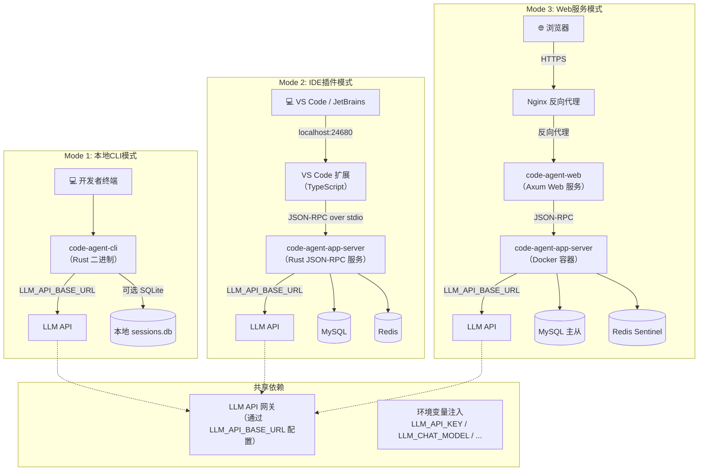
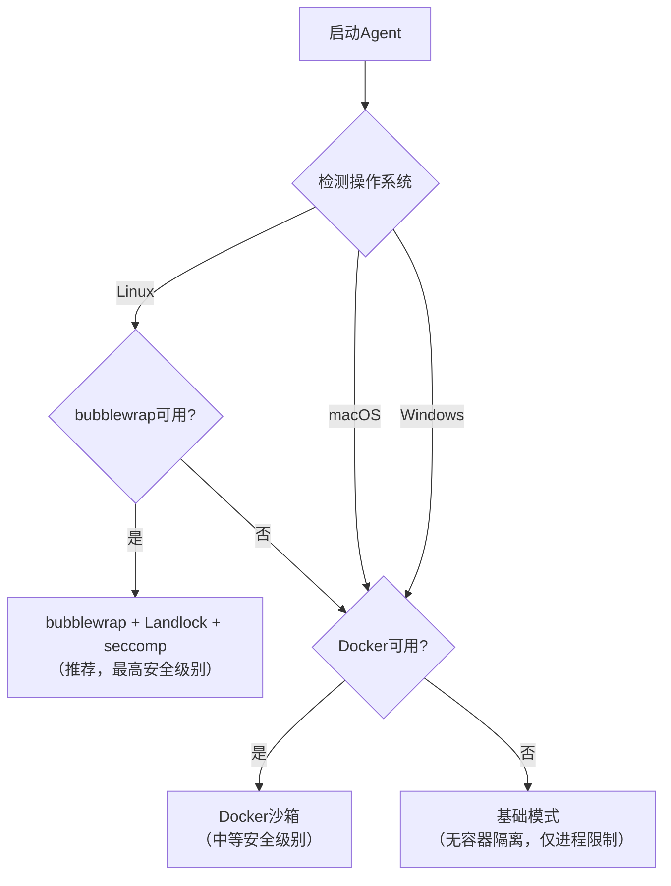

# 定制码匠（CraftCoder）部署手册

> **版本**: v1.0  
> **日期**: 2026-07-10  
> **适用版本**: code-agent-rs 1.0+

---

## 目录

1. [系统要求](#1-系统要求)
2. [环境参数配置](#2-环境参数配置)
3. [编译与安装](#3-编译与安装)
4. [配置文件说明](#4-配置文件说明)
5. [部署架构图](#5-部署架构图)
6. [Docker部署方案](#6-docker部署方案)
7. [MySQL + Redis初始化](#7-mysql--redis初始化)
8. [沙箱配置](#8-沙箱配置)
9. [升级与回滚](#9-升级与回滚)
10. [故障排除](#10-故障排除)

---

## 1. 系统要求

### 1.1 硬件要求

| 部署模式 | CPU | 内存 | 磁盘 | GPU（可选） |
|----------|-----|------|------|-------------|
| **CLI模式（最小）** | 2核 | 4GB | 1GB | 不需要 |
| **App Server模式** | 4核 | 8GB | 10GB | 不需要 |
| **Web服务模式** | 8核 | 16GB | 50GB SSD | 不需要 |
| **本地GPU推理模式** | 8核+ | 32GB+ | 100GB+ | RTX 4090 / A100 / DGX Spark |

> **推荐**：当前环境使用API代理模式（无需本地GPU），所有模型通过`https://<your-api-host>/v1/`远程调用。

### 1.2 操作系统支持

| 操作系统 | 架构 | 最低版本 | 备注 |
|----------|------|----------|------|
| **Linux** | x86_64, aarch64 | Ubuntu 20.04+ / CentOS 8+ / Debian 11+ | 推荐平台，支持bubblewrap沙箱 |
| **macOS** | x86_64, arm64（Apple Silicon） | macOS 13 Ventura+ | Docker fallback沙箱 |
| **Windows** | x86_64 | Windows 10 21H2+ / Windows Server 2022+ | Docker fallback沙箱，WSL2推荐 |

### 1.3 依赖软件

| 组件 | 最低版本 | 用途 | 安装方式 |
|------|----------|------|----------|
| **Rust Toolchain** | 1.80+ | 编译Agent核心 | `curl --proto '=https' --tlsv1.2 -sSf https://sh.rustup.rs \| sh` |
| **Docker** | 24.0+ | 沙箱执行、容器化部署 | 操作系统包管理器或Docker Desktop |
| **Git** | 2.40+ | 版本控制集成 | 操作系统包管理器 |
| **MySQL Client** | 8.0+ | 数据库连接（CLI模式可选） | 操作系统包管理器 |
| **Redis Client** | 7.0+ | 缓存连接（CLI模式可选） | 操作系统包管理器 |

### 1.4 网络要求

| 目标地址 | 端口 | 协议 | 用途 |
|----------|------|------|------|
| `<your-api-host>` | 443 | HTTPS | LLM模型API调用（必需） |
| `<your-mysql-host>` | 3306 | TCP/MySQL | 数据库连接（App Server/Web模式） |
| `<your-redis-host>` | 6379 | TCP/Redis | 缓存连接（App Server/Web模式） |

---

## 2. 环境参数配置

### 2.1 LLM API配置

API端点：`https://<your-api-host>/v1/`

| 环境变量 | 默认值 | 说明 |
|----------|--------|------|
| `LLM_API_BASE_URL` | `https://<your-api-host>/v1` | API基础URL |
| `LLM_API_KEY` | （必需） | 统一API密钥（所有模型共用） |
| `LLM_CHAT_MODEL` | （必需） | 核心推理模型名称 |
| `LLM_EMBEDDING_MODEL` | （可选） | 嵌入模型名称 |
| `LLM_RERANKER_MODEL` | （可选） | 重排序模型名称 |
| `LLM_VL_MODEL` | （可选） | 视觉模型名称 |
| `LLM_GUARD_MODEL` | （可选） | 安全守卫模型名称 |

### 2.2 API速率限制配置

| 环境变量 | 默认值 | 说明 |
|----------|--------|------|
| `LLM_RATE_LIMIT_CHAT_RPM` | 60 | Chat接口每分钟最大请求数 |
| `LLM_RATE_LIMIT_EMBED_RPM` | 200 | Embedding接口每分钟最大请求数 |
| `LLM_RATE_LIMIT_RERANK_RPM` | 300 | Reranker接口每分钟最大请求数 |

### 2.3 数据库连接配置

| 环境变量 | 默认值 | 说明 |
|----------|--------|------|
| `MYSQL_HOST` | `<your-mysql-host>` | MySQL主机地址 |
| `MYSQL_PORT` | `3306` | MySQL端口 |
| `MYSQL_USER` | `root` | MySQL用户名 |
| `MYSQL_PASSWORD` | （必需） | MySQL密码 |
| `MYSQL_DATABASE` | `code_agent` | 数据库名称 |
| `MYSQL_MAX_CONNECTIONS` | `20` | 连接池最大连接数 |
| `REDIS_HOST` | `<your-redis-host>` | Redis主机地址 |
| `REDIS_PORT` | `6379` | Redis端口 |
| `REDIS_PASSWORD` | （可选） | Redis密码 |

### 2.4 请求认证格式

```
POST /v1/chat/completions HTTP/1.1
Host: <your-api-host>
Authorization: Bearer <LLM_API_KEY>
Content-Type: application/json
```

所有LLM模型API调用使用统一的`Authorization: Bearer`认证头。

---

## 3. 编译与安装

### 3.1 从源码编译（推荐）

```bash
# 1. 克隆仓库
git clone <repository-url> code-agent-rs
cd code-agent-rs

# 2. 编译Release版本
cargo build --release

# 3. 安装到系统PATH
# Linux / macOS
sudo cp target/release/code-agent /usr/local/bin/

# Windows（PowerShell管理员）
Copy-Item target\release\code-agent.exe C:\Windows\System32\
```

### 3.2 Release编译优化

项目的`.cargo/config.toml`包含以下Release优化配置：

```toml
[profile.release]
opt-level = 3       # 最高优化级别
lto = "fat"         # 全链接时优化
codegen-units = 1   # 单代码生成单元（更好的优化）
strip = true        # 去除符号表（减小二进制体积）
```

编译产物：单文件二进制，无外部运行时依赖（Rust静态链接）。

### 3.3 平台特定说明

#### Linux

```bash
# 安装编译依赖
sudo apt-get install build-essential pkg-config libssl-dev

# 编译
cargo build --release

# 验证
./target/release/code-agent --version
```

#### macOS

```bash
# Xcode命令行工具（如未安装）
xcode-select --install

# 编译
cargo build --release

# Apple Silicon（M1/M2/M3）原生二进制
file target/release/code-agent
# 输出: Mach-O 64-bit executable arm64

# 验证
./target/release/code-agent --version
```

#### Windows

```powershell
# 安装Visual Studio Build Tools（含C++工具链）
# 或使用winget
winget install Microsoft.VisualStudio.2022.BuildTools

# 编译
cargo build --release

# 验证
.\target\release\code-agent.exe --version
```

### 3.4 验证安装

```bash
# 检查版本
code-agent --version
# 输出: code-agent 1.0.0

# 运行健康检查
code-agent doctor
# 输出: 
#   ✅ Rust toolchain: stable
#   ✅ Config: ~/.config/code-agent/config.toml
#   ✅ LLM API: reachable (<your-api-host>)
#   ✅ MySQL: connected (<your-mysql-host>:3306)
#   ✅ Redis: connected (<your-redis-host>:6379)
#   ✅ Git: 2.40+
#   ⚠️ Docker: not installed (sandbox fallback to basic mode)
```

---

## 4. 配置文件说明

### 4.1 配置层级（优先级从高到低）

```
命令行参数 > 项目级配置（.code-agent/config.toml） > 用户级配置（~/.config/code-agent/config.toml） > 内置默认值
```

### 4.2 配置文件结构

**位置**：`~/.config/code-agent/config.toml`（用户级）或`.code-agent/config.toml`（项目级）

```toml
# ============================================================
# 定制码匠（CraftCoder）配置文件
# ============================================================

# --- AI模型配置 ---
[models]
# LLM API端点
api_base_url = "https://<your-api-host>/v1"
api_key = "${LLM_API_KEY}"          # 从环境变量读取

# 各模型部署名称（通过环境变量配置，此处为占位符示例）
chat_model = "${LLM_CHAT_MODEL}"
embed_model = "${LLM_EMBEDDING_MODEL}"
rerank_model = "${LLM_RERANKER_MODEL}"
vision_model = "${LLM_VL_MODEL}"
guard_model = "${LLM_GUARD_MODEL}"

# 推理参数
[models.inference]
temperature = 0.7
max_tokens = 4096
stream = true
enable_thinking = true

# 速率限制
[models.rate_limit]
chat_rpm = 60
embed_rpm = 200
rerank_rpm = 300

# --- 数据库配置 ---
[database.mysql]
host = "<your-mysql-host>"
port = 3306
user = "root"
password = "${MYSQL_PASSWORD}"
database = "code_agent"
max_connections = 20

[database.redis]
host = "<your-redis-host>"
port = 6379
password = ""
session_ttl_seconds = 1800       # 30分钟

# --- Agent配置 ---
[agent]
max_turns = 30                   # 最大循环迭代次数
turn_timeout_seconds = 120       # 单轮超时
max_parallel_tools = 6           # 单轮最大并行工具调用
context_max_tokens = 128000      # 上下文窗口大小

# --- 安全配置 ---
[safety]
mode = "block"                   # off / warn / block
guard_enabled = true
content_filter_level = "strict"  # strict / moderate / relaxed
permission_mode = "permit"       # auto / permit / block

# --- 沙箱配置 ---
[sandbox]
engine = "auto"                  # bubblewrap / docker / basic
allow_network = false
allow_write_paths = []
timeout_seconds = 60
memory_limit_mb = 512

# --- 日志配置 ---
[logging]
level = "info"                   # trace / debug / info / warn / error
format = "json"                  # json / text
output = "stderr"

# --- 驾驭工程配置 ---
[governance]
review_on_pr = true
review_on_commit = true
quality_gate_strictness = "standard"  # relaxed / standard / strict
auto_fix_enabled = true
tech_debt_tracking = true
```

### 4.3 初始化配置文件

```bash
# 生成默认用户级配置
code-agent config init

# 生成项目级配置
code-agent config init --project

# 查看当前生效配置
code-agent config show

# 设置单个配置项
code-agent config set agent.max_turns 50

# 查看配置路径
code-agent config path
# 输出: ~/.config/code-agent/config.toml
```

---

## 5. 部署架构图

### 5.1 三种部署模式拓扑



### 5.2 部署模式对比

| 维度 | CLI 模式 | IDE 插件模式 | Web 服务模式 |
|------|---------|-------------|-------------|
| **安装方式** | cargo install / 下载二进制 | 通过 VS Code 市场安装 | Docker Compose |
| **进程数** | 1 | 2（扩展 + App Server） | 3+（Nginx + Web + App）|
| **端口** | 无 | localhost:24680 | 443 + 8080 |
| **存储** | SQLite 可选 | MySQL + Redis | MySQL 主从 + Redis Sentinel |
| **LLM 依赖** | 必填（LLM_API_BASE_URL） | 必填 | 必填 |
| **启动时间** | <100ms | <500ms | <5s |
| **离线能力** | 无（需 LLM API） | 无 | 无 |

---

## 6. Docker部署方案

### 6.1 Docker Compose（Web服务模式）

```yaml
# docker-compose.yml
version: "3.9"

services:
  code-agent-app:
    image: craftcoder/app-server:latest
    container_name: code-agent-app
    ports:
      - "8080:8080"             # Web API
      - "24680:24680"           # App Server（IDE连接）
    environment:
      # LLM API配置
      LLM_API_BASE_URL: "https://<your-api-host>/v1"
      LLM_API_KEY: "${LLM_API_KEY}"
      # 数据库连接
      MYSQL_HOST: "<your-mysql-host>"
      MYSQL_PORT: "3306"
      MYSQL_USER: "root"
      MYSQL_PASSWORD: "${MYSQL_PASSWORD}"
      MYSQL_DATABASE: "code_agent"
      REDIS_HOST: "<your-redis-host>"
      REDIS_PORT: "6379"
      # Agent配置
      RUST_LOG: "info"
    volumes:
      - ./workspace:/workspace
      - ./config:/root/.config/code-agent
    restart: unless-stopped
    healthcheck:
      test: ["CMD", "curl", "-f", "http://localhost:8080/health"]
      interval: 30s
      timeout: 10s
      retries: 3

  # 可选：本地MySQL（如果不用远程数据库）
  # mysql:
  #   image: mysql:8.0
  #   environment:
  #     MYSQL_ROOT_PASSWORD: "${MYSQL_PASSWORD}"
  #     MYSQL_DATABASE: "code_agent"
  #   ports:
  #     - "3306:3306"
  #   volumes:
  #     - mysql_data:/var/lib/mysql

  # 可选：本地Redis（如果不用远程Redis）
  # redis:
  #   image: redis:7-alpine
  #   ports:
  #     - "6379:6379"

# volumes:
#   mysql_data:
```

### 6.2 启动服务

```bash
# 设置环境变量
export LLM_API_KEY="your-api-key"
export MYSQL_PASSWORD="your-password"

# 启动
docker compose up -d

# 查看日志
docker compose logs -f code-agent-app

# 健康检查
curl http://localhost:8080/health

# 停止
docker compose down
```

### 6.3 构建Docker镜像

```dockerfile
# Dockerfile
FROM rust:1.80-slim-bookworm AS builder
WORKDIR /app
COPY . .
RUN cargo build --release

FROM debian:bookworm-slim
RUN apt-get update && apt-get install -y \
    ca-certificates curl git \
    && rm -rf /var/lib/apt/lists/*
COPY --from=builder /app/target/release/code-agent /usr/local/bin/
ENTRYPOINT ["code-agent"]
CMD ["app-server", "--host", "0.0.0.0", "--port", "8080"]
```

```bash
docker build -t craftcoder/app-server:latest .
```

---

## 7. MySQL + Redis初始化

### 7.1 MySQL初始化脚本

```sql
-- 创建数据库
CREATE DATABASE IF NOT EXISTS code_agent
  CHARACTER SET utf8mb4
  COLLATE utf8mb4_unicode_ci;

USE code_agent;

-- 会话表
CREATE TABLE IF NOT EXISTS sessions (
    id              VARCHAR(64) PRIMARY KEY,
    title           VARCHAR(512) NOT NULL DEFAULT '',
    model           VARCHAR(128) NOT NULL,
    status          ENUM('active', 'completed', 'archived', 'error') NOT NULL DEFAULT 'active',
    permission_mode ENUM('auto', 'permit', 'block') NOT NULL DEFAULT 'permit',
    capability_level ENUM('read', 'edit', 'exec') NOT NULL DEFAULT 'edit',
    total_turns     INT UNSIGNED NOT NULL DEFAULT 0,
    total_tokens    BIGINT UNSIGNED NOT NULL DEFAULT 0,
    cwd             VARCHAR(1024) NOT NULL DEFAULT '',
    metadata        JSON,
    created_at      DATETIME(3) NOT NULL DEFAULT CURRENT_TIMESTAMP(3),
    updated_at      DATETIME(3) NOT NULL DEFAULT CURRENT_TIMESTAMP(3) ON UPDATE CURRENT_TIMESTAMP(3),
    INDEX idx_status (status),
    INDEX idx_created_at (created_at)
) ENGINE=InnoDB DEFAULT CHARSET=utf8mb4 COLLATE=utf8mb4_unicode_ci;

-- 消息表
CREATE TABLE IF NOT EXISTS messages (
    id              BIGINT UNSIGNED AUTO_INCREMENT PRIMARY KEY,
    session_id      VARCHAR(64) NOT NULL,
    turn_id         INT UNSIGNED NOT NULL,
    role            ENUM('user', 'assistant', 'tool') NOT NULL,
    content         MEDIUMTEXT,
    tool_call_id    VARCHAR(64),
    tool_name       VARCHAR(128),
    tool_arguments  JSON,
    token_count     INT UNSIGNED NOT NULL DEFAULT 0,
    created_at      DATETIME(3) NOT NULL DEFAULT CURRENT_TIMESTAMP(3),
    INDEX idx_session_turn (session_id, turn_id),
    FOREIGN KEY (session_id) REFERENCES sessions(id) ON DELETE CASCADE
) ENGINE=InnoDB DEFAULT CHARSET=utf8mb4 COLLATE=utf8mb4_unicode_ci;

-- 工具调用记录表
CREATE TABLE IF NOT EXISTS tool_calls (
    id              VARCHAR(64) PRIMARY KEY,
    session_id      VARCHAR(64) NOT NULL,
    turn_id         INT UNSIGNED NOT NULL,
    tool_name       VARCHAR(128) NOT NULL,
    arguments       JSON NOT NULL,
    output          MEDIUMTEXT,
    error           VARCHAR(2048),
    duration_ms     INT UNSIGNED NOT NULL DEFAULT 0,
    success         BOOLEAN NOT NULL DEFAULT TRUE,
    created_at      DATETIME(3) NOT NULL DEFAULT CURRENT_TIMESTAMP(3),
    INDEX idx_session (session_id),
    FOREIGN KEY (session_id) REFERENCES sessions(id) ON DELETE CASCADE
) ENGINE=InnoDB DEFAULT CHARSET=utf8mb4 COLLATE=utf8mb4_unicode_ci;

-- 用户反馈表
CREATE TABLE IF NOT EXISTS feedback (
    id              BIGINT UNSIGNED AUTO_INCREMENT PRIMARY KEY,
    session_id      VARCHAR(64) NOT NULL,
    turn_id         INT UNSIGNED NOT NULL,
    rating          ENUM('thumbs_up', 'thumbs_down') NOT NULL,
    comment         TEXT,
    tags            JSON,
    context_snapshot JSON,
    created_at      DATETIME(3) NOT NULL DEFAULT CURRENT_TIMESTAMP(3),
    INDEX idx_session (session_id),
    FOREIGN KEY (session_id) REFERENCES sessions(id) ON DELETE CASCADE
) ENGINE=InnoDB DEFAULT CHARSET=utf8mb4 COLLATE=utf8mb4_unicode_ci;

-- 驾驭工程：Code Review记录
CREATE TABLE IF NOT EXISTS gov_code_reviews (
    id              BIGINT AUTO_INCREMENT PRIMARY KEY,
    repo            VARCHAR(255) NOT NULL,
    pr_number       INT,
    commit_sha      VARCHAR(64),
    total_comments  INT DEFAULT 0,
    blocker_count   INT DEFAULT 0,
    critical_count  INT DEFAULT 0,
    auto_fix_applied INT DEFAULT 0,
    review_duration_ms INT,
    report          JSON,
    created_at      TIMESTAMP DEFAULT CURRENT_TIMESTAMP,
    INDEX idx_repo_pr (repo, pr_number)
) ENGINE=InnoDB DEFAULT CHARSET=utf8mb4 COLLATE=utf8mb4_unicode_ci;

-- 驾驭工程：技术债务
CREATE TABLE IF NOT EXISTS gov_tech_debt (
    id              BIGINT AUTO_INCREMENT PRIMARY KEY,
    repo            VARCHAR(255) NOT NULL,
    file_path       VARCHAR(500),
    debt_type       ENUM('architecture','code_smell','test_gap','doc_gap','security','performance','dependency'),
    title           VARCHAR(500) NOT NULL,
    risk_score      DECIMAL(3,2),
    estimated_hours DECIMAL(8,2),
    priority        DECIMAL(5,2),
    status          ENUM('open','in_progress','fixed','accepted','wont_fix') DEFAULT 'open',
    auto_fix_pr     VARCHAR(500),
    created_at      TIMESTAMP DEFAULT CURRENT_TIMESTAMP,
    INDEX idx_priority (priority DESC)
) ENGINE=InnoDB DEFAULT CHARSET=utf8mb4 COLLATE=utf8mb4_unicode_ci;
```

### 7.2 执行初始化

```bash
# 连接远程MySQL执行初始化
mysql -h <your-mysql-host> -u root -p < init.sql

# 或通过Docker执行
docker exec -i mysql mysql -u root -p"${MYSQL_PASSWORD}" < init.sql
```

### 7.3 Redis配置验证

```bash
# 连接验证
redis-cli -h <your-redis-host> -p 6379 PING
# 应返回: PONG

# 检查内存使用
redis-cli -h <your-redis-host> -p 6379 INFO memory | grep used_memory_human

# 已配置的Key模式（无需手动创建，Agent运行自动管理）
# - session:{id}:cache（Hash，30min TTL）
# - rate_limit:{user_id}（Sorted Set，1min滑动窗口）
# - embedding:cache:{hash}（String，24h TTL）
# - search:cache:{query_hash}（String，5min TTL）
```

---

## 8. 沙箱配置

### 8.1 沙箱引擎选择

系统自动检测并选择最优沙箱引擎：



### 8.2 Linux bubblewrap配置（推荐）

```bash
# 安装bubblewrap
sudo apt-get install bubblewrap

# 验证安装
bwrap --version

# Agent配置（config.toml）
[sandbox]
engine = "bubblewrap"
allow_network = false          # 禁止网络访问
allow_write_paths = [          # 允许写入的路径（白名单）
    "/tmp/code-agent",
    "./workspace"
]
timeout_seconds = 60
memory_limit_mb = 512
```

### 8.3 Docker沙箱配置（macOS/Windows fallback）

```toml
# config.toml
[sandbox]
engine = "docker"
docker_image = "craftcoder/sandbox:latest"
allow_network = false
timeout_seconds = 60
memory_limit_mb = 512
```

### 8.4 沙箱安全等级

| 安全等级 | 引擎 | 网络隔离 | 文件系统隔离 | 进程隔离 | 适用环境 |
|----------|------|:---:|:---:|:---:|------|
| **高** | bubblewrap + Landlock + seccomp | ✅ | ✅ | ✅ | Linux生产环境 |
| **中** | Docker容器 | ✅ | ✅ | ✅ | macOS/Windows开发环境 |
| **低** | 基础模式 | ❌ | ❌ | ⚠️ | 本地调试（仅限可信代码） |

---

## 9. 升级与回滚

### 9.1 升级流程

```bash
# 1. 备份当前版本
cp /usr/local/bin/code-agent /usr/local/bin/code-agent.bak.$(date +%Y%m%d)

# 2. 备份配置
cp -r ~/.config/code-agent ~/.config/code-agent.bak.$(date +%Y%m%d)

# 3. 拉取最新代码并编译
cd code-agent-rs
git pull origin main
cargo build --release

# 4. 替换二进制
sudo cp target/release/code-agent /usr/local/bin/

# 5. 验证新版本
code-agent --version
code-agent doctor

# 6. 重启服务（如使用App Server模式）
# Docker Compose
docker compose down
docker compose up -d
```

### 9.2 回滚流程

```bash
# 回滚到之前的备份版本
sudo cp /usr/local/bin/code-agent.bak.20260710 /usr/local/bin/code-agent

# 恢复配置文件
cp -r ~/.config/code-agent.bak.20260710/* ~/.config/code-agent/

# 重启服务
code-agent --version
```

### 9.3 数据库迁移

数据库表结构变更通过MySQL迁移脚本管理。Agent启动时会自动检测表结构并执行必要迁移（仅新增列和表，不删除数据）。

```bash
# 查看待执行的迁移
code-agent config show --migrations

# 手动执行迁移
code-agent config migrate
```

### 9.4 版本兼容性

| Agent版本 | 模型要求 | MySQL | Redis | 配置文件格式 |
|-----------|----------|-------|-------|-------------|
| 1.0.x | 通过 LLM_CHAT_MODEL 配置 | 8.0+ | 7.0+ | TOML v1 |
| 0.x（Alpha） | 通过 LLM_CHAT_MODEL 配置 | 8.0+ | 7.0+ | TOML v1 |

---

## 10. 故障排除

### 10.1 常见问题

#### Q: `code-agent doctor`报告"LLM API: unreachable"

```bash
# 检查网络连通性
curl -I https://<your-api-host>/v1/models

# 检查API密钥
echo $LLM_API_KEY

# 检查配置文件中的API Key
code-agent config show | grep api_key

# 验证认证
curl https://<your-api-host>/v1/models \
  -H "Authorization: Bearer $LLM_API_KEY"
```

#### Q: MySQL连接失败

```bash
# 测试MySQL连通性
mysql -h <your-mysql-host> -u root -p -e "SELECT 1"

# 检查防火墙
telnet <your-mysql-host> 3306

# 验证数据库是否存在
mysql -h <your-mysql-host> -u root -p -e "SHOW DATABASES" | grep code_agent
```

#### Q: Redis连接失败

```bash
# 测试Redis连通性
redis-cli -h <your-redis-host> -p 6379 PING

# 检查防火墙
telnet <your-redis-host> 6379
```

#### Q: 编译失败 — OpenSSL错误

```bash
# Linux
sudo apt-get install libssl-dev pkg-config

# macOS
brew install openssl
export OPENSSL_DIR=$(brew --prefix openssl)

# Windows
# 确保安装了Visual Studio Build Tools with C++ workload
```

#### Q: Docker沙箱不可用

```bash
# 检查Docker是否运行
docker info

# macOS/Windows：确保Docker Desktop已启动
# Linux：确保docker daemon运行
sudo systemctl status docker
```

### 10.2 日志调试

```bash
# 调整日志级别为debug
code-agent --log-level debug tui

# 查看App Server日志（Docker）
docker compose logs -f code-agent-app

# 启用OpenTelemetry追踪
export OTEL_EXPORTER_OTLP_ENDPOINT="http://localhost:4317"
code-agent --trace tui
```

### 10.3 性能问题排查

```bash
# 检查Agent延迟
code-agent doctor --bench

# 输出示例
# Agent单轮延迟（P95）: 2.1s ✅ <3s
# 上下文压缩: 0.6s ✅ <1s
# 代码检索: 380ms ✅ <500ms
# API调用成功率: 99.8% ✅ >99.5%
```

### 10.4 获取帮助

```bash
# 查看所有CLI命令
code-agent --help

# 查看子命令帮助
code-agent tui --help
code-agent exec --help
code-agent config --help

# 生成诊断报告
code-agent doctor --report > diagnosis.txt
```

---

*文档版本 v1.0 | 2026-07-10 | 定制码匠（CraftCoder）部署与运维手册*
